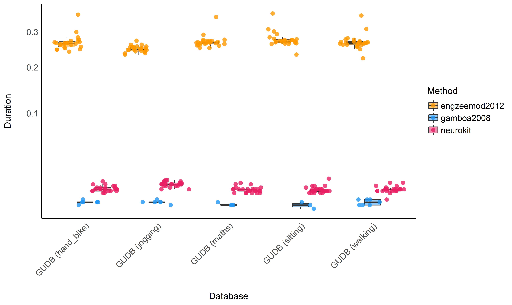

# Benchmarking of ECG Preprocessing Methods

This work is a replication and extension of the work by Porr & Howell
(2019), that compared the performance of different popular R-peak
detectors.

## Databases

### Glasgow University Database

The GUDB Database (Howell & Porr, 2018) contains ECGs from 25 subjects.
Each subject was recorded performing 5 different tasks for two minutes
(sitting, doing a maths test on a tablet, walking on a treadmill,
running on a treadmill, using a hand bike). The sampling rate is 250Hz
for all the conditions.

The script to download and format the database using the
[**ECG-GUDB**](https://github.com/berndporr/ECG-GUDB) Python package by
Bernd Porr can be found [**here**]().

### MIT-BIH Arrhythmia Database

The MIT-BIH Arrhythmia Database (Moody & Mark, 2001) contains 48 +0 min
excerpts of two-channel ambulatory ECG recordings sampled at 360Hz.

<!-- ### MIT-BIH Noise Stress Test Database -->

<!-- The MIT-BIH Noise Stress Test Database (NSTDB) [Moody et al., 1984] features a 30-minute recording of noise typical of electrode motion artefacts and uses a script to add this on top of clean recordings from the MITDB.  -->

### Concanate them together

``` python
import pandas as pd

# Load ECGs
ecgs_gudb = pd.read_csv("../../data/gudb/ECGs.csv")
ecgs_mitdb = pd.read_csv("../../data/mitdb/ECGs.csv")

# Load True R-peaks location
rpeaks_gudb = pd.read_csv("../../data/gudb/Rpeaks.csv")
rpeaks_mitd = pd.read_csv("../../data/mitdb/Rpeaks.csv")

# Concatenate
ecgs = pd.concat([ecgs_gudb, ecgs_mitdb], ignore_index=True)
rpeaks = pd.concat([rpeaks_gudb, rpeaks_mitd], ignore_index=True)
```

## Comparing Different R-Peaks Detection Algorithms

### Setup Functions

``` python
import neurokit2 as nk

def neurokit(ecg, sampling_rate):
    signal, info = nk.ecg_peaks(ecg, sampling_rate=sampling_rate, method="neurokit")
    return info["ECG_R_Peaks"]

def pantompkins1985(ecg, sampling_rate):
    signal, info = nk.ecg_peaks(ecg, sampling_rate=sampling_rate, method="pantompkins1985")
    return info["ECG_R_Peaks"]
    
def hamilton2002(ecg, sampling_rate):
    signal, info = nk.ecg_peaks(ecg, sampling_rate=sampling_rate, method="hamilton2002")
    return info["ECG_R_Peaks"]
    
def martinez2003(ecg, sampling_rate):
    signal, info = nk.ecg_peaks(ecg, sampling_rate=sampling_rate, method="martinez2003")
    return info["ECG_R_Peaks"]
    
def christov2004(ecg, sampling_rate):
    signal, info = nk.ecg_peaks(ecg, sampling_rate=sampling_rate, method="christov2004")
    return info["ECG_R_Peaks"]
    
def gamboa2008(ecg, sampling_rate):
    signal, info = nk.ecg_peaks(ecg, sampling_rate=sampling_rate, method="gamboa2008")
    return info["ECG_R_Peaks"]

def elgendi2010(ecg, sampling_rate):
    signal, info = nk.ecg_peaks(ecg, sampling_rate=sampling_rate, method="elgendi2010")
    return info["ECG_R_Peaks"]
    
def engzeemod2012(ecg, sampling_rate):
    signal, info = nk.ecg_peaks(ecg, sampling_rate=sampling_rate, method="engzeemod2012")
    return info["ECG_R_Peaks"]
    
def kalidas2017(ecg, sampling_rate):
    signal, info = nk.ecg_peaks(ecg, sampling_rate=sampling_rate, method="kalidas2017")
    return info["ECG_R_Peaks"]
    
def rodrigues2020(ecg, sampling_rate):
    signal, info = nk.ecg_peaks(ecg, sampling_rate=sampling_rate, method="rodrigues2020")
    return info["ECG_R_Peaks"]
```

### Run the Benchmark

*Note: This takes a long time (several hours).*

``` python
results = []
for method in [neurokit, pantompkins1985, hamilton2002, martinez2003, christov2004, 
               gamboa2008, elgendi2010, engzeemod2012, kalidas2017, rodrigues2020]:
    print(method.__name__)
    result = nk.benchmark_ecg_preprocessing(method, ecgs, rpeaks)
    result["Method"] = method.__name__
    results.append(result)
results = pd.concat(results).reset_index(drop=True)

results.to_csv("data.csv", index=False)
```

## Results

``` r
library(tidyverse)
library(easystats)
library(lme4)

data <- read.csv("data.csv", stringsAsFactors = FALSE) %>% 
  mutate(Database = ifelse(str_detect(Database, "GUDB"), paste0(str_replace(Database, "GUDB_", "GUDB ("), ")"), Database),
         Method = fct_relevel(Method, "neurokit", "pantompkins1985", "hamilton2002", "martinez2003", "christov2004", "gamboa2008", "elgendi2010", "engzeemod2012", "kalidas2017", "rodrigues2020"),
         Participant = paste0(Database, Participant))

colors <- c("neurokit"="#E91E63", "pantompkins1985"="#f44336", "hamilton2002"="#FF5722", "martinez2003"="#FF9800", "christov2004"="#FFC107", "gamboa2008"="#4CAF50", "elgendi2010"="#009688", "engzeemod2012"="#2196F3", "kalidas2017"="#3F51B5", "rodrigues2020"="#9C27B0") 
```

### Errors

``` r
data %>% 
  mutate(Error = case_when(
    Error == "index -1 is out of bounds for axis 0 with size 0" ~ "index -1 out of bounds",
    Error == "index 0 is out of bounds for axis 0 with size 0" ~ "index 0 out of bounds",
    TRUE ~ Error)) %>% 
  group_by(Database, Method) %>% 
  mutate(n = n()) %>% 
  group_by(Database, Method, Error) %>% 
  summarise(Percentage = n() / unique(n)) %>% 
  ungroup() %>% 
  mutate(Error = fct_relevel(Error, "None")) %>% 
  ggplot(aes(x=Error, y=Percentage, fill=Method)) +
    geom_bar(stat="identity", position = position_dodge2(preserve = "single")) +
    facet_grid(~Database) +
    theme_modern() +
    theme(axis.text.x = element_text(angle = 45, hjust = 1)) +
    scale_fill_manual(values=colors)
```

<!-- -->

``` r

data <- filter(data, Error == "None")
data <- filter(data, !is.na(Score))
```

**Conclusion:** It seems that `gamboa2008` and `martinez2003` are
particularly prone to errors, especially in the case of a noisy ECG
signal. Aside from that, the other algorithms are quite resistant and
bug-free.

### Time

#### Descriptive Statistics

``` r
data %>% 
  mutate(Duration = Duration / Recording_Length) %>% 
  ggplot(aes(x=Database, y=Duration)) +
    geom_boxplot(aes(fill=Method), outlier.alpha = 0, alpha=1) +
    geom_jitter2(aes(color=Method, group=Method), size=3, alpha=0.2, position=position_jitterdodge()) +
    geom_hline(yintercept=0, linetype="dotted") +
    theme_modern() +
    theme(axis.text.x = element_text(angle = 45, hjust = 1)) +
    scale_color_manual(values=colors) +
    scale_fill_manual(values=colors) +
    scale_y_sqrt() +
    ylab("Duration (seconds per minute of recording)")
```

<!-- -->

<!-- ```{r, warning=FALSE, message=FALSE} -->

<!-- # Interaction time and recording length -->

<!-- data %>%  -->

<!--   ggplot(aes(x=Recording_Length, y=Duration, color=Method)) + -->

<!--     geom_jitter(aes(shape=Database), size=3, alpha=0.7) + -->

<!--     geom_smooth(method="lm", se = FALSE) + -->

<!--     theme_modern() + -->

<!--     theme(axis.text.x = element_text(angle = 45, hjust = 1)) + -->

<!--     scale_color_manual(values=colors) + -->

<!--     scale_fill_manual(values=colors) + -->

<!--     scale_y_sqrt() -->

<!-- ``` -->

#### Statistical Modelling

``` r
model <- glm(Duration ~ Method, data=mutate(data, Duration = Duration / Recording_Length + 1e-150), family=Gamma)

means <- modelbased::estimate_means(model)

arrange(means, Mean)
##             Method    Mean       SE  CI_low CI_high
## 1       gamboa2008 0.00290 8.68e-05 0.00274 0.00308
## 2         neurokit 0.00584 1.24e-04 0.00560 0.00609
## 3     martinez2003 0.01122 2.69e-04 0.01071 0.01177
## 4      kalidas2017 0.02171 4.61e-04 0.02084 0.02265
## 5    rodrigues2020 0.03451 7.33e-04 0.03313 0.03601
## 6     hamilton2002 0.04308 9.15e-04 0.04135 0.04495
## 7    engzeemod2012 0.16186 3.45e-03 0.15537 0.16892
## 8  pantompkins1985 0.18502 3.93e-03 0.17762 0.19306
## 9      elgendi2010 0.27328 5.81e-03 0.26235 0.28515
## 10    christov2004 0.39891 8.48e-03 0.38296 0.41625

means %>% 
  ggplot(aes(x=Method, y=Mean, color=Method)) +
  geom_line(aes(group=1), size=1) +
  geom_pointrange(aes(ymin=CI_low, ymax=CI_high), size=1) +
  theme_modern() +
  theme(axis.text.x = element_text(angle = 45, hjust = 1)) +
  scale_color_manual(values=colors)
```

<!-- -->

**Conclusion:** It seems that `gamboa2008` and `neurokit` are the
fastest methods, followed by `martinez2003`, `kalidas2017`,
`rodrigues2020` and `hamilton2002`. The other methods are then
substantially slower.

### Score

**Note:** The accuracy is computed as the absolute distance from the
original “true” R-peaks location. As such, the closest to zero, the
better the accuracy.

#### Descriptive Statistics

``` r
data <- data %>% 
  mutate(Outlier = performance::check_outliers(Score, threshold = list(zscore = stats::qnorm(p = 1 - 0.000001)))) %>% 
  filter(Outlier == 0) %>% 
  mutate(Score = Score + 1e-150)  # To be positive-defined.

p <- data %>% 
  ggplot(aes(x=Database, y=Score)) +
    geom_boxplot(aes(fill=Method), outlier.alpha = 0, alpha=1) +
    geom_jitter2(aes(color=Method, group=Method), size=3, alpha=0.2, position=position_jitterdodge()) +
    geom_hline(yintercept=0, linetype="dotted") +
    theme_modern() +
    theme(axis.text.x = element_text(angle = 45, hjust = 1)) +
    scale_color_manual(values=colors) +
    scale_fill_manual(values=colors) +
    scale_y_sqrt() +
    ylab("Amount of Error") 
p
```

<!-- -->

#### Statistical Modelling

``` r
# model <- glmmTMB::glmmTMB(Score ~ Method + (1|Database) + (1|Participant), data=data, family=Gamma)
model <- lmer(Score ~ Method + (1|Database) + (1|Participant), data=data)

means <- modelbased::estimate_means(model)

arrange(means, abs(Mean))
##             Method   Mean      SE  CI_low CI_high
## 1         neurokit 0.0130 0.00466 0.00224  0.0238
## 2     christov2004 0.0138 0.00474 0.00294  0.0246
## 3      kalidas2017 0.0141 0.00466 0.00332  0.0249
## 4    engzeemod2012 0.0275 0.00478 0.01666  0.0384
## 5     martinez2003 0.0279 0.00517 0.01659  0.0392
## 6    rodrigues2020 0.0294 0.00467 0.01860  0.0402
## 7  pantompkins1985 0.0325 0.00467 0.02169  0.0433
## 8     hamilton2002 0.0353 0.00468 0.02450  0.0461
## 9      elgendi2010 0.0520 0.00478 0.04107  0.0628
## 10      gamboa2008 0.0754 0.00848 0.05855  0.0923

means %>% 
  ggplot(aes(x=Method, y=Mean, color=Method)) +
  geom_line(aes(group=1), size=1) +
  geom_pointrange(aes(ymin=CI_low, ymax=CI_high), size=1) +
  geom_hline(yintercept=0, linetype="dotted") +
  theme_modern() +
  theme(axis.text.x = element_text(angle = 45, hjust = 1)) +
  scale_color_manual(values=colors)
```

<!-- -->

**Conclusion:** It seems that `neurokit`, `kalidas2017` and
`christov2004` the most accurate algorithms to detect R-peaks. This
pattern of results differs a bit from Porr & Howell (2019) that outlines
`engzeemod2012`, `elgendi2010`, `kalidas2017` as the most accurate and
`christov2004`, `hamilton2002` and `pantompkins1985` as the worse.

# Conclusion

Based on the accuracy / execution time criterion, it seems like
`neurokit` is the best method, followed by `kalidas2017`.

# References

<div id="refs" class="references">

<div id="ref-howell2018high">

Howell, L., & Porr, B. (2018). *High precision ecg database with
annotated r peaks, recorded and filmed under realistic conditions*.

</div>

<div id="ref-moody2001impact">

Moody, G. B., & Mark, R. G. (2001). The impact of the mit-bih arrhythmia
database. *IEEE Engineering in Medicine and Biology Magazine*, *20*(3),
45–50.

</div>

<div id="ref-porr2019r">

Porr, B., & Howell, L. (2019). R-peak detector stress test with a new
noisy ecg database reveals significant performance differences amongst
popular detectors. *bioRxiv*, 722397.

</div>

</div>
