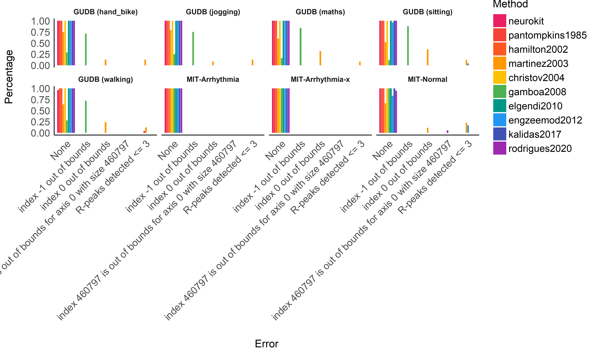

# Benchmarking of ECG Preprocessing Methods

## Databases

### GUDB (Howell & Porr, 2018)

The GUDB Database (Howell & Porr, 2018) contains ECGs from 25 subjects.
Each subject was recorded performing 5 different tasks for two minutes
(sitting, doing a maths test on a tablet, walking on a treadmill,
running on a treadmill, using a hand bike). The sampling rate is 250Hz
for all the conditions.

The script to download and format the database using the
[**ECG-GUDB**](https://github.com/berndporr/ECG-GUDB) Python package by
Bernd Porr can be found [**here**]().

### WFDB

**TODO.**

### Concanate them together

``` python
import pandas as pd

# Load ECGs
ecgs_gudb = pd.read_csv("../../data/gudb/ECGs.csv")
# ecgs_wfdb = TODO

# Load True R-peaks location
rpeaks_gudb = pd.read_csv("../../data/gudb/Rpeaks.csv")
# rpeaks_wfdb = TODO

# Concatenate
ecgs = ecgs_gudb
rpeaks = rpeaks_gudb
```

## Comparing Different R-Peaks Detection Algorithms

### Setup Functions

``` python
import neurokit2 as nk

def neurokit(ecg, sampling_rate):
    signal, info = nk.ecg_peaks(ecg, sampling_rate=sampling_rate, method="neurokit")
    return info["ECG_R_Peaks"]

def gamboa2008(ecg, sampling_rate):
    signal, info = nk.ecg_peaks(ecg, sampling_rate=sampling_rate, method="gamboa2008")
    return info["ECG_R_Peaks"]

def engzeemod2012(ecg, sampling_rate):
    signal, info = nk.ecg_peaks(ecg, sampling_rate=sampling_rate, method="engzeemod2012")
    return info["ECG_R_Peaks"]
```

### Run the Benchmark

``` python
results = []
for method in [neurokit, gamboa2008, engzeemod2012]:
    result = nk.benchmark_ecg_preprocessing(method, ecgs, rpeaks)
    result["Method"] = method.__name__
    results.append(result)
results = pd.concat(results).reset_index(drop=True)
```

## Results

``` r
library(tidyverse)
library(easystats)
## # Attaching packages (red = needs update)
## <U+2714> insight     0.8.4.1   <U+2714> bayestestR  0.6.0.1
## <U+2714> performance 0.4.6.1   <U+2714> parameters  0.7.0.1
## <U+26A0> see         0.4.1.1   <U+2714> effectsize  0.3.1.1
## <U+2714> correlation 0.2.1     <U+2714> modelbased  0.2.1  
## <U+2714> report      0.1.0     
## Warnings or errors in CRAN checks for package(s) 'insight', 'parameters', 'modelbased'.
## Restart the R-Session and update packages in red with 'easystats::easystats_update()'.

data <- py$results %>% 
  mutate(Database = ifelse(str_detect(Database, "GUDB"), paste0(str_replace(Database, "GUDB_", "GUDB ("), ")"), Database))
colors <- c("neurokit"="#E91E63", "gamboa2008"="#2196F3", "engzeemod2012"="#FF9800")
```

### Errors

``` r
data %>% 
  group_by(Database, Method) %>% 
  mutate(n = n()) %>% 
  group_by(Database, Method, Error) %>% 
  summarise(Percentage = n() / unique(n)) %>% 
  ungroup() %>% 
  mutate(Error = fct_relevel(Error, "None"),
         Method = fct_relevel(Method, "neurokit")) %>% 
  ggplot(aes(x=Error, y=Percentage, fill=Method)) +
    geom_bar(stat="identity", position = position_dodge2(preserve = "single")) +
    facet_grid(~Database) +
    theme_modern() +
    theme(axis.text.x = element_text(angle = 45, hjust = 1)) +
    scale_fill_manual(values=colors)
```

<!-- -->

``` r

data <- filter(data, Error == "None")
```

### Time

``` r
data %>% 
  ggplot(aes(x=Database, y=Duration)) +
    geom_boxplot(aes(fill=Method), outlier.alpha = 0, alpha=0.5) +
    geom_jitter2(aes(color=Method, group=Method), size=3, alpha=0.8, position=position_jitterdodge()) +
    theme_modern() +
    theme(axis.text.x = element_text(angle = 45, hjust = 1)) +
    scale_color_manual(values=colors) +
    scale_fill_manual(values=colors) +
    scale_y_sqrt()
```

<!-- -->

### Score

``` r
data %>% 
  ggplot(aes(x=Database, y=Score)) +
    geom_boxplot(aes(fill=Method), outlier.alpha = 0, alpha=0.5) +
    geom_jitter2(aes(color=Method, group=Method), size=3, alpha=0.8, position=position_jitterdodge()) +
    theme_modern() +
    theme(axis.text.x = element_text(angle = 45, hjust = 1)) +
    scale_color_manual(values=colors) +
    scale_fill_manual(values=colors) +
    scale_y_sqrt() +
    ylab("Amount of Error")
```

<!-- -->

# References

Howell, L., & Porr, B. (2018). High precision ECG Database with
annotated R peaks, recorded and filmed under realistic conditions.
