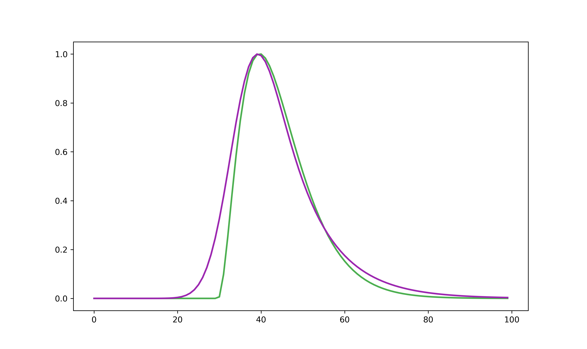
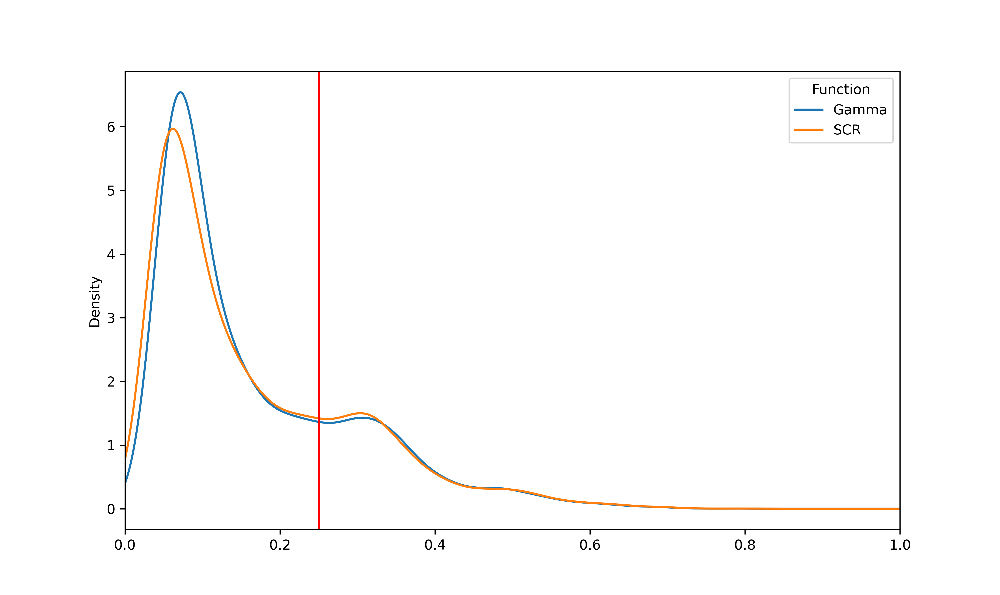

# Estimation of a Template for Blinks in Electrooculography (EOG)

*This study can be referenced by* [*citing the
package*](https://github.com/neuropsychology/NeuroKit#citation).

**We'd like to publish this study, but unfortunately we currently don't have the time. If you want to help to make it happen, please contact us!**

## Introduction

The goal of this study is to identify a template for blinks in vertical
EOG recordings. For this, we will optimize to candidate functions, a
*Gamma* distribution and the *SCR* function proposed by Bach, Flandin,
Friston, & Dolan (2010) to model skin conductance responses.

In the first study, we will obtain the optimized parameters for a large
numbers of “events” detected in the vEOG signal (for different subjects
under different tasks), assuming that blinks are the prevalent type of
detected events.

In the second study, we will see how these two blink templates (obtained
from the optimized parameters of study 1 for the two functions) perform
by computing their difference (RMSE) with each EOG event. The assumption
is that not all of the detected events are blinks, and so we will
observe a bi-modal distribution, with events closely matching the
template and other events differing from them.

In the third study, after identifying a reasonable RMSE threshold to
identify and keep only the “blink”-like events, we will then re-optimize
the functions parameters on this cleaner subset of events.

## Study 1: Initial Estimation

### Methods

#### Define Functions

``` python
# import neurokit2 as nk
import numpy as np
import pandas as pd
import matplotlib.pyplot as plt
import scipy.signal


def fit_gamma(x, loc, a, scale):
    x = nk.rescale(x, to=[0, 10])
    gamma = scipy.stats.gamma.pdf(x, a=a, loc=loc, scale=scale)
    y = gamma / np.max(gamma)
    return y


def fit_scr(x, time_peak, rise, decay1, decay2):
    x = nk.rescale(x, to=[0, 10])
    gt = np.exp(-((x - time_peak) ** 2) / (2 * rise ** 2))
    ht = np.exp(-x / decay1) + np.exp(-x / decay2)

    ft = np.convolve(gt, ht)
    ft = ft[0 : len(x)]
    y = ft / np.max(ft)
    return y
    
# Starting parameters
plt.plot(fit_gamma(np.arange(100), 3, 3, 0.5), linewidth=2, linestyle='-', color="#4CAF50", label='Gamma')
plt.plot(fit_scr(np.arange(100), 3.5, 0.5, 1, 1), linewidth=2, linestyle='-', color="#9C27B0", label='SCR')
```



#### Optimize Parameters

The `eogdb` dataset is placed in the `NeuroKit/data/eogdb/` folder.

### Results

Visualize the optimal templates for one task.

``` python
data = pd.read_csv("../../data/eogdb/eogdb_task3.csv")
cleaned = nk.eog_clean(data["vEOG"], sampling_rate=200, method='neurokit')
blinks = nk.signal_findpeaks(cleaned, relative_height_min=1.5)["Peaks"][:-1]
events = nk.epochs_create(cleaned, blinks, sampling_rate=200, epochs_start=-0.4, epochs_end=0.6)
events = nk.epochs_to_array(events)

for i in range(events.shape[1]):
    events[:, i] = nk.rescale(events[:, i], to=[0, 1])  # Reshape to 0-1 scale

x = np.linspace(0, 100, num=len(events))
template_gamma = fit_gamma(x, *np.nanmedian(params_gamma.iloc[:, [0, 1, 2]], axis=0))
template_scr = fit_scr(x, *np.nanmedian(params_scr.iloc[:, [0, 1, 2, 3]], axis=0))

plt.plot(events, linewidth=0.02, color="black")
## [<matplotlib.lines.Line2D object at 0x000000006B0C91C0>, <matplotlib.lines.Line2D object at 0x000000006B0C9790>, <matplotlib.lines.Line2D object at 0x000000006B0C9070>, <matplotlib.lines.Line2D object at 0x000000006B0C9AC0>, <matplotlib.lines.Line2D object at 0x000000006B2B8040>, <matplotlib.lines.Line2D object at 0x000000006B2B81C0>, <matplotlib.lines.Line2D object at 0x000000006B2B8190>, <matplotlib.lines.Line2D object at 0x000000006B2B81F0>, <matplotlib.lines.Line2D object at 0x000000006B2B8280>, <matplotlib.lines.Line2D object at 0x000000006B2B8460>, <matplotlib.lines.Line2D object at 0x000000006B2B8520>, <matplotlib.lines.Line2D object at 0x000000006B2B84C0>, <matplotlib.lines.Line2D object at 0x000000006B2B86A0>, <matplotlib.lines.Line2D object at 0x000000006B2B8760>, <matplotlib.lines.Line2D object at 0x000000006B2B8700>, <matplotlib.lines.Line2D object at 0x000000006B2B88E0>, <matplotlib.lines.Line2D object at 0x000000006B2B89A0>, <matplotlib.lines.Line2D object at 0x000000006B2B8940>, <matplotlib.lines.Line2D object at 0x000000006B2B8B20>, <matplotlib.lines.Line2D object at 0x000000006B2B8BE0>, <matplotlib.lines.Line2D object at 0x000000006B2B8E20>, <matplotlib.lines.Line2D object at 0x000000006B2B8CA0>, <matplotlib.lines.Line2D object at 0x000000006B2B8DC0>, <matplotlib.lines.Line2D object at 0x000000006B2B8DF0>, <matplotlib.lines.Line2D object at 0x000000006B2B8EE0>, <matplotlib.lines.Line2D object at 0x000000006B0B1BB0>, <matplotlib.lines.Line2D object at 0x000000006B0B1280>, <matplotlib.lines.Line2D object at 0x000000006B0B12E0>, <matplotlib.lines.Line2D object at 0x000000006B0B13A0>, <matplotlib.lines.Line2D object at 0x000000006B0B1F70>, <matplotlib.lines.Line2D object at 0x000000006B0B1B50>, <matplotlib.lines.Line2D object at 0x000000006B0B1820>, <matplotlib.lines.Line2D object at 0x000000006B0B1430>, <matplotlib.lines.Line2D object at 0x000000006B0B1310>, <matplotlib.lines.Line2D object at 0x000000006B0B13D0>, <matplotlib.lines.Line2D object at 0x000000006B0B1490>, <matplotlib.lines.Line2D object at 0x000000006B095A60>, <matplotlib.lines.Line2D object at 0x000000006B095EB0>, <matplotlib.lines.Line2D object at 0x000000006B095DC0>, <matplotlib.lines.Line2D object at 0x000000006B0954C0>, <matplotlib.lines.Line2D object at 0x000000006B0AADC0>, <matplotlib.lines.Line2D object at 0x000000006B0AA250>, <matplotlib.lines.Line2D object at 0x000000006B0AA160>, <matplotlib.lines.Line2D object at 0x000000006B0AA610>, <matplotlib.lines.Line2D object at 0x000000006B0AA8B0>, <matplotlib.lines.Line2D object at 0x000000006B0AA8E0>, <matplotlib.lines.Line2D object at 0x000000006B0AA280>, <matplotlib.lines.Line2D object at 0x000000006B0AAA30>, <matplotlib.lines.Line2D object at 0x000000006B0AAC70>, <matplotlib.lines.Line2D object at 0x000000006B0AABE0>, <matplotlib.lines.Line2D object at 0x000000006B0AAE50>, <matplotlib.lines.Line2D object at 0x000000006B0AAF40>, <matplotlib.lines.Line2D object at 0x000000006B0AAE80>, <matplotlib.lines.Line2D object at 0x000000006B0AA880>, <matplotlib.lines.Line2D object at 0x000000006B0E2250>, <matplotlib.lines.Line2D object at 0x000000006B0E29D0>, <matplotlib.lines.Line2D object at 0x000000006B0E2040>, <matplotlib.lines.Line2D object at 0x000000006B0E2400>, <matplotlib.lines.Line2D object at 0x000000006B0E25E0>, <matplotlib.lines.Line2D object at 0x000000006B2BC220>, <matplotlib.lines.Line2D object at 0x000000006B2BC070>, <matplotlib.lines.Line2D object at 0x000000006B2BC040>, <matplotlib.lines.Line2D object at 0x000000006B2BCB80>, <matplotlib.lines.Line2D object at 0x000000006B2BCD00>, <matplotlib.lines.Line2D object at 0x000000006B2402B0>, <matplotlib.lines.Line2D object at 0x000000006B240190>, <matplotlib.lines.Line2D object at 0x000000006B240790>, <matplotlib.lines.Line2D object at 0x000000006B240D60>, <matplotlib.lines.Line2D object at 0x000000006B240AC0>, <matplotlib.lines.Line2D object at 0x000000006B2401C0>, <matplotlib.lines.Line2D object at 0x000000006B240D00>, <matplotlib.lines.Line2D object at 0x000000006B2404F0>, <matplotlib.lines.Line2D object at 0x000000006B240C70>, <matplotlib.lines.Line2D object at 0x000000006B240100>, <matplotlib.lines.Line2D object at 0x000000006B240610>, <matplotlib.lines.Line2D object at 0x000000006B240EE0>, <matplotlib.lines.Line2D object at 0x000000006B240220>, <matplotlib.lines.Line2D object at 0x000000006B240820>, <matplotlib.lines.Line2D object at 0x000000006B2400A0>, <matplotlib.lines.Line2D object at 0x000000006B240A30>, <matplotlib.lines.Line2D object at 0x000000006B2B76D0>, <matplotlib.lines.Line2D object at 0x000000006B2B7130>, <matplotlib.lines.Line2D object at 0x000000006B2B70A0>, <matplotlib.lines.Line2D object at 0x000000006B2B7070>, <matplotlib.lines.Line2D object at 0x000000006B2B7250>, <matplotlib.lines.Line2D object at 0x000000006B2B73A0>, <matplotlib.lines.Line2D object at 0x000000006B2B7340>, <matplotlib.lines.Line2D object at 0x000000006B2B7490>, <matplotlib.lines.Line2D object at 0x000000006B2B75E0>, <matplotlib.lines.Line2D object at 0x000000006B2B77C0>, <matplotlib.lines.Line2D object at 0x000000006B2B77F0>, <matplotlib.lines.Line2D object at 0x000000006B2B7BB0>, <matplotlib.lines.Line2D object at 0x000000006B2B7CA0>, <matplotlib.lines.Line2D object at 0x000000006B2B7880>, <matplotlib.lines.Line2D object at 0x000000006B2C3AC0>, <matplotlib.lines.Line2D object at 0x000000006B2C33D0>, <matplotlib.lines.Line2D object at 0x000000006B2C3B80>, <matplotlib.lines.Line2D object at 0x000000006B2C3460>, <matplotlib.lines.Line2D object at 0x000000006B2C3D90>, <matplotlib.lines.Line2D object at 0x000000006B2C3DC0>, <matplotlib.lines.Line2D object at 0x000000006B2C3C70>, <matplotlib.lines.Line2D object at 0x000000006B2C3160>, <matplotlib.lines.Line2D object at 0x000000006B2C3C10>, <matplotlib.lines.Line2D object at 0x000000006B2C3BE0>, <matplotlib.lines.Line2D object at 0x000000006B245100>, <matplotlib.lines.Line2D object at 0x000000006B2451C0>, <matplotlib.lines.Line2D object at 0x000000006B245280>, <matplotlib.lines.Line2D object at 0x000000006B245340>, <matplotlib.lines.Line2D object at 0x000000006B245400>, <matplotlib.lines.Line2D object at 0x000000006B2454C0>, <matplotlib.lines.Line2D object at 0x000000006B245580>, <matplotlib.lines.Line2D object at 0x000000006B245640>, <matplotlib.lines.Line2D object at 0x000000006B245700>, <matplotlib.lines.Line2D object at 0x000000006B2457C0>, <matplotlib.lines.Line2D object at 0x000000006B245880>, <matplotlib.lines.Line2D object at 0x000000006B245940>, <matplotlib.lines.Line2D object at 0x000000006B245A00>, <matplotlib.lines.Line2D object at 0x000000006B245AC0>, <matplotlib.lines.Line2D object at 0x000000006B245B80>, <matplotlib.lines.Line2D object at 0x000000006B245C40>, <matplotlib.lines.Line2D object at 0x000000006B245D00>, <matplotlib.lines.Line2D object at 0x000000006B245DC0>, <matplotlib.lines.Line2D object at 0x000000006B245E80>, <matplotlib.lines.Line2D object at 0x000000006B245F40>, <matplotlib.lines.Line2D object at 0x000000006B245FA0>, <matplotlib.lines.Line2D object at 0x000000006B21E100>, <matplotlib.lines.Line2D object at 0x000000006B21E1C0>, <matplotlib.lines.Line2D object at 0x000000006B21E280>, <matplotlib.lines.Line2D object at 0x000000006B21E340>, <matplotlib.lines.Line2D object at 0x000000006B21E400>, <matplotlib.lines.Line2D object at 0x000000006B21E4C0>, <matplotlib.lines.Line2D object at 0x000000006B21E580>, <matplotlib.lines.Line2D object at 0x000000006B21E640>, <matplotlib.lines.Line2D object at 0x000000006B21E700>, <matplotlib.lines.Line2D object at 0x000000006B21E7C0>, <matplotlib.lines.Line2D object at 0x000000006B21E880>, <matplotlib.lines.Line2D object at 0x000000006B21E940>, <matplotlib.lines.Line2D object at 0x000000006B21EA00>, <matplotlib.lines.Line2D object at 0x000000006B21EAC0>, <matplotlib.lines.Line2D object at 0x000000006B21EB80>, <matplotlib.lines.Line2D object at 0x000000006B21EC40>, <matplotlib.lines.Line2D object at 0x000000006B21ED00>, <matplotlib.lines.Line2D object at 0x000000006B21EDC0>, <matplotlib.lines.Line2D object at 0x000000006B21EE80>, <matplotlib.lines.Line2D object at 0x000000006B21EF40>, <matplotlib.lines.Line2D object at 0x000000006B21EFA0>, <matplotlib.lines.Line2D object at 0x000000006B248100>, <matplotlib.lines.Line2D object at 0x000000006B2481C0>, <matplotlib.lines.Line2D object at 0x000000006B248280>, <matplotlib.lines.Line2D object at 0x000000006B248340>, <matplotlib.lines.Line2D object at 0x000000006B248400>, <matplotlib.lines.Line2D object at 0x000000006B2484C0>, <matplotlib.lines.Line2D object at 0x000000006B248580>, <matplotlib.lines.Line2D object at 0x000000006B248640>, <matplotlib.lines.Line2D object at 0x000000006B248700>, <matplotlib.lines.Line2D object at 0x000000006B2487C0>, <matplotlib.lines.Line2D object at 0x000000006B248880>, <matplotlib.lines.Line2D object at 0x000000006B248940>, <matplotlib.lines.Line2D object at 0x000000006B248A00>, <matplotlib.lines.Line2D object at 0x000000006B248AC0>, <matplotlib.lines.Line2D object at 0x000000006B248B80>, <matplotlib.lines.Line2D object at 0x000000006B248C40>, <matplotlib.lines.Line2D object at 0x000000006B248D00>, <matplotlib.lines.Line2D object at 0x000000006B248DC0>, <matplotlib.lines.Line2D object at 0x000000006B248E80>, <matplotlib.lines.Line2D object at 0x000000006B248F40>, <matplotlib.lines.Line2D object at 0x000000006B248FA0>, <matplotlib.lines.Line2D object at 0x0000000004831100>, <matplotlib.lines.Line2D object at 0x00000000048311C0>, <matplotlib.lines.Line2D object at 0x0000000004831280>, <matplotlib.lines.Line2D object at 0x0000000004831340>, <matplotlib.lines.Line2D object at 0x0000000004831400>, <matplotlib.lines.Line2D object at 0x00000000048314C0>, <matplotlib.lines.Line2D object at 0x0000000004831580>, <matplotlib.lines.Line2D object at 0x0000000004831640>, <matplotlib.lines.Line2D object at 0x0000000004831700>, <matplotlib.lines.Line2D object at 0x00000000048317C0>, <matplotlib.lines.Line2D object at 0x0000000004831880>, <matplotlib.lines.Line2D object at 0x0000000004831940>, <matplotlib.lines.Line2D object at 0x0000000004831A00>, <matplotlib.lines.Line2D object at 0x0000000004831AC0>, <matplotlib.lines.Line2D object at 0x0000000004831B80>, <matplotlib.lines.Line2D object at 0x0000000004831C40>, <matplotlib.lines.Line2D object at 0x0000000004831D00>, <matplotlib.lines.Line2D object at 0x0000000004831DC0>, <matplotlib.lines.Line2D object at 0x0000000004831E80>, <matplotlib.lines.Line2D object at 0x0000000004831F40>, <matplotlib.lines.Line2D object at 0x0000000004831FA0>, <matplotlib.lines.Line2D object at 0x000000000483A100>, <matplotlib.lines.Line2D object at 0x000000000483A1C0>, <matplotlib.lines.Line2D object at 0x000000000483A280>, <matplotlib.lines.Line2D object at 0x000000000483A340>, <matplotlib.lines.Line2D object at 0x000000000483A400>, <matplotlib.lines.Line2D object at 0x000000000483A4C0>, <matplotlib.lines.Line2D object at 0x000000000483A580>, <matplotlib.lines.Line2D object at 0x000000000483A640>, <matplotlib.lines.Line2D object at 0x000000000483A700>, <matplotlib.lines.Line2D object at 0x000000000483A7C0>, <matplotlib.lines.Line2D object at 0x000000000483A880>, <matplotlib.lines.Line2D object at 0x000000000483A940>, <matplotlib.lines.Line2D object at 0x000000000483AA00>, <matplotlib.lines.Line2D object at 0x000000000483AAC0>, <matplotlib.lines.Line2D object at 0x000000000483AB80>, <matplotlib.lines.Line2D object at 0x000000000483AC40>, <matplotlib.lines.Line2D object at 0x000000000483AD00>, <matplotlib.lines.Line2D object at 0x000000000483ADC0>, <matplotlib.lines.Line2D object at 0x000000000483AE80>, <matplotlib.lines.Line2D object at 0x000000000483AF40>, <matplotlib.lines.Line2D object at 0x000000000483AFA0>, <matplotlib.lines.Line2D object at 0x000000000484A100>, <matplotlib.lines.Line2D object at 0x000000000484A1C0>, <matplotlib.lines.Line2D object at 0x000000000484A280>, <matplotlib.lines.Line2D object at 0x000000000484A340>, <matplotlib.lines.Line2D object at 0x000000000484A400>, <matplotlib.lines.Line2D object at 0x000000000484A4C0>, <matplotlib.lines.Line2D object at 0x000000000484A580>, <matplotlib.lines.Line2D object at 0x000000000484A640>, <matplotlib.lines.Line2D object at 0x000000000484A700>, <matplotlib.lines.Line2D object at 0x000000000484A7C0>, <matplotlib.lines.Line2D object at 0x000000000484A880>, <matplotlib.lines.Line2D object at 0x000000000484A940>, <matplotlib.lines.Line2D object at 0x000000000484AA00>, <matplotlib.lines.Line2D object at 0x000000000484AAC0>, <matplotlib.lines.Line2D object at 0x000000000484AB80>, <matplotlib.lines.Line2D object at 0x000000000484AC40>, <matplotlib.lines.Line2D object at 0x000000000484AD00>, <matplotlib.lines.Line2D object at 0x000000000484ADC0>, <matplotlib.lines.Line2D object at 0x000000000484AE80>, <matplotlib.lines.Line2D object at 0x000000000484AF40>, <matplotlib.lines.Line2D object at 0x000000000484AFA0>, <matplotlib.lines.Line2D object at 0x0000000004846100>, <matplotlib.lines.Line2D object at 0x00000000048461C0>, <matplotlib.lines.Line2D object at 0x0000000004846280>, <matplotlib.lines.Line2D object at 0x0000000004846340>, <matplotlib.lines.Line2D object at 0x0000000004846400>, <matplotlib.lines.Line2D object at 0x00000000048464C0>, <matplotlib.lines.Line2D object at 0x0000000004846580>, <matplotlib.lines.Line2D object at 0x0000000004846640>, <matplotlib.lines.Line2D object at 0x0000000004846700>, <matplotlib.lines.Line2D object at 0x00000000048467C0>, <matplotlib.lines.Line2D object at 0x0000000004846880>, <matplotlib.lines.Line2D object at 0x0000000004846940>, <matplotlib.lines.Line2D object at 0x0000000004846A00>, <matplotlib.lines.Line2D object at 0x0000000004846AC0>, <matplotlib.lines.Line2D object at 0x0000000004846B80>, <matplotlib.lines.Line2D object at 0x0000000004846C40>, <matplotlib.lines.Line2D object at 0x0000000004846D00>, <matplotlib.lines.Line2D object at 0x0000000004846DC0>, <matplotlib.lines.Line2D object at 0x0000000004846E80>, <matplotlib.lines.Line2D object at 0x0000000004846F40>, <matplotlib.lines.Line2D object at 0x0000000004846FA0>, <matplotlib.lines.Line2D object at 0x0000000004840100>, <matplotlib.lines.Line2D object at 0x00000000048401C0>, <matplotlib.lines.Line2D object at 0x0000000004840280>, <matplotlib.lines.Line2D object at 0x0000000004840340>, <matplotlib.lines.Line2D object at 0x0000000004840400>, <matplotlib.lines.Line2D object at 0x00000000048404C0>, <matplotlib.lines.Line2D object at 0x0000000004840580>, <matplotlib.lines.Line2D object at 0x0000000004840640>, <matplotlib.lines.Line2D object at 0x0000000004840700>, <matplotlib.lines.Line2D object at 0x00000000048407C0>, <matplotlib.lines.Line2D object at 0x0000000004840880>, <matplotlib.lines.Line2D object at 0x0000000004840940>, <matplotlib.lines.Line2D object at 0x0000000004840A00>, <matplotlib.lines.Line2D object at 0x0000000004840AC0>, <matplotlib.lines.Line2D object at 0x0000000004840B80>, <matplotlib.lines.Line2D object at 0x0000000004840C40>, <matplotlib.lines.Line2D object at 0x0000000004840D00>, <matplotlib.lines.Line2D object at 0x0000000004840DC0>, <matplotlib.lines.Line2D object at 0x0000000004840E80>, <matplotlib.lines.Line2D object at 0x0000000004840F40>, <matplotlib.lines.Line2D object at 0x0000000004840FA0>, <matplotlib.lines.Line2D object at 0x000000000483B100>, <matplotlib.lines.Line2D object at 0x000000000483B1C0>, <matplotlib.lines.Line2D object at 0x000000000483B280>, <matplotlib.lines.Line2D object at 0x000000000483B340>, <matplotlib.lines.Line2D object at 0x000000000483B400>, <matplotlib.lines.Line2D object at 0x000000000483B4C0>, <matplotlib.lines.Line2D object at 0x000000000483B580>, <matplotlib.lines.Line2D object at 0x000000000483B640>, <matplotlib.lines.Line2D object at 0x000000000483B700>, <matplotlib.lines.Line2D object at 0x000000000483B7C0>, <matplotlib.lines.Line2D object at 0x000000000483B880>, <matplotlib.lines.Line2D object at 0x000000000483B940>, <matplotlib.lines.Line2D object at 0x000000000483BA00>, <matplotlib.lines.Line2D object at 0x000000000483BAC0>, <matplotlib.lines.Line2D object at 0x000000000483BB80>, <matplotlib.lines.Line2D object at 0x000000000483BC40>, <matplotlib.lines.Line2D object at 0x000000000483BD00>, <matplotlib.lines.Line2D object at 0x000000000483BDC0>, <matplotlib.lines.Line2D object at 0x000000000483BE80>, <matplotlib.lines.Line2D object at 0x000000000483BF40>, <matplotlib.lines.Line2D object at 0x000000000483BFA0>, <matplotlib.lines.Line2D object at 0x0000000004837100>, <matplotlib.lines.Line2D object at 0x00000000048371C0>, <matplotlib.lines.Line2D object at 0x0000000004837280>, <matplotlib.lines.Line2D object at 0x0000000004837340>, <matplotlib.lines.Line2D object at 0x0000000004837400>, <matplotlib.lines.Line2D object at 0x00000000048374C0>, <matplotlib.lines.Line2D object at 0x0000000004837580>, <matplotlib.lines.Line2D object at 0x0000000004837640>, <matplotlib.lines.Line2D object at 0x0000000004837700>, <matplotlib.lines.Line2D object at 0x00000000048377C0>, <matplotlib.lines.Line2D object at 0x0000000004837880>, <matplotlib.lines.Line2D object at 0x0000000004837940>, <matplotlib.lines.Line2D object at 0x0000000004837A00>, <matplotlib.lines.Line2D object at 0x0000000004837AC0>, <matplotlib.lines.Line2D object at 0x0000000004837BB0>, <matplotlib.lines.Line2D object at 0x0000000004837C70>, <matplotlib.lines.Line2D object at 0x0000000004837D30>, <matplotlib.lines.Line2D object at 0x0000000004837DF0>, <matplotlib.lines.Line2D object at 0x0000000004837EB0>, <matplotlib.lines.Line2D object at 0x0000000004837F70>, <matplotlib.lines.Line2D object at 0x0000000004835070>, <matplotlib.lines.Line2D object at 0x0000000004835130>, <matplotlib.lines.Line2D object at 0x00000000048351F0>, <matplotlib.lines.Line2D object at 0x00000000048352B0>, <matplotlib.lines.Line2D object at 0x0000000004835370>, <matplotlib.lines.Line2D object at 0x0000000004835430>, <matplotlib.lines.Line2D object at 0x00000000048354F0>, <matplotlib.lines.Line2D object at 0x00000000048355B0>, <matplotlib.lines.Line2D object at 0x0000000004835670>, <matplotlib.lines.Line2D object at 0x0000000004835730>, <matplotlib.lines.Line2D object at 0x00000000048357F0>, <matplotlib.lines.Line2D object at 0x00000000048358B0>, <matplotlib.lines.Line2D object at 0x0000000004835970>, <matplotlib.lines.Line2D object at 0x0000000004835A60>, <matplotlib.lines.Line2D object at 0x0000000004835B20>, <matplotlib.lines.Line2D object at 0x0000000004835BE0>, <matplotlib.lines.Line2D object at 0x0000000004835CA0>, <matplotlib.lines.Line2D object at 0x0000000004835D60>, <matplotlib.lines.Line2D object at 0x0000000004835E20>, <matplotlib.lines.Line2D object at 0x0000000004835EE0>, <matplotlib.lines.Line2D object at 0x0000000004835FA0>, <matplotlib.lines.Line2D object at 0x00000000048300A0>, <matplotlib.lines.Line2D object at 0x0000000004830160>, <matplotlib.lines.Line2D object at 0x0000000004830220>, <matplotlib.lines.Line2D object at 0x00000000048302E0>, <matplotlib.lines.Line2D object at 0x00000000048303A0>, <matplotlib.lines.Line2D object at 0x0000000004830460>, <matplotlib.lines.Line2D object at 0x0000000004830520>, <matplotlib.lines.Line2D object at 0x00000000048305E0>, <matplotlib.lines.Line2D object at 0x00000000048306A0>, <matplotlib.lines.Line2D object at 0x0000000004830790>, <matplotlib.lines.Line2D object at 0x0000000004830850>, <matplotlib.lines.Line2D object at 0x0000000004830910>, <matplotlib.lines.Line2D object at 0x00000000048309D0>, <matplotlib.lines.Line2D object at 0x0000000004830A90>, <matplotlib.lines.Line2D object at 0x0000000004830B50>, <matplotlib.lines.Line2D object at 0x0000000004830C10>, <matplotlib.lines.Line2D object at 0x0000000004830CD0>, <matplotlib.lines.Line2D object at 0x0000000004830D90>, <matplotlib.lines.Line2D object at 0x0000000004830E50>, <matplotlib.lines.Line2D object at 0x0000000004830F10>, <matplotlib.lines.Line2D object at 0x0000000004830FD0>, <matplotlib.lines.Line2D object at 0x000000000482A0D0>, <matplotlib.lines.Line2D object at 0x000000000482A190>, <matplotlib.lines.Line2D object at 0x000000000482A250>, <matplotlib.lines.Line2D object at 0x000000000482A310>, <matplotlib.lines.Line2D object at 0x000000000482A3D0>, <matplotlib.lines.Line2D object at 0x000000000482A490>, <matplotlib.lines.Line2D object at 0x000000000482A550>, <matplotlib.lines.Line2D object at 0x000000000482A610>, <matplotlib.lines.Line2D object at 0x000000000482A6D0>, <matplotlib.lines.Line2D object at 0x000000000482A790>, <matplotlib.lines.Line2D object at 0x000000000482A850>, <matplotlib.lines.Line2D object at 0x000000000482A910>, <matplotlib.lines.Line2D object at 0x000000000482A9D0>, <matplotlib.lines.Line2D object at 0x000000000482AA90>, <matplotlib.lines.Line2D object at 0x000000000482AB50>, <matplotlib.lines.Line2D object at 0x000000000482AC10>, <matplotlib.lines.Line2D object at 0x000000000482ACD0>, <matplotlib.lines.Line2D object at 0x000000000482AD90>, <matplotlib.lines.Line2D object at 0x000000000482AE50>, <matplotlib.lines.Line2D object at 0x000000000482AF10>, <matplotlib.lines.Line2D object at 0x000000000482AFD0>, <matplotlib.lines.Line2D object at 0x00000000048260D0>, <matplotlib.lines.Line2D object at 0x0000000004826190>, <matplotlib.lines.Line2D object at 0x0000000004826250>, <matplotlib.lines.Line2D object at 0x0000000004826310>, <matplotlib.lines.Line2D object at 0x00000000048263D0>, <matplotlib.lines.Line2D object at 0x0000000004826490>, <matplotlib.lines.Line2D object at 0x0000000004826550>, <matplotlib.lines.Line2D object at 0x0000000004826610>, <matplotlib.lines.Line2D object at 0x00000000048266D0>, <matplotlib.lines.Line2D object at 0x0000000004826790>, <matplotlib.lines.Line2D object at 0x0000000004826850>, <matplotlib.lines.Line2D object at 0x0000000004826910>, <matplotlib.lines.Line2D object at 0x00000000048269D0>, <matplotlib.lines.Line2D object at 0x0000000004826A90>, <matplotlib.lines.Line2D object at 0x0000000004826B50>, <matplotlib.lines.Line2D object at 0x0000000004826C10>, <matplotlib.lines.Line2D object at 0x0000000004826CD0>, <matplotlib.lines.Line2D object at 0x0000000004826D90>, <matplotlib.lines.Line2D object at 0x0000000004826E50>, <matplotlib.lines.Line2D object at 0x0000000004826F10>, <matplotlib.lines.Line2D object at 0x0000000004826FD0>, <matplotlib.lines.Line2D object at 0x00000000048170D0>, <matplotlib.lines.Line2D object at 0x0000000004817190>, <matplotlib.lines.Line2D object at 0x0000000004817250>, <matplotlib.lines.Line2D object at 0x0000000004817310>, <matplotlib.lines.Line2D object at 0x00000000048173D0>, <matplotlib.lines.Line2D object at 0x0000000004817490>, <matplotlib.lines.Line2D object at 0x0000000004817550>, <matplotlib.lines.Line2D object at 0x0000000004817610>, <matplotlib.lines.Line2D object at 0x00000000048176D0>, <matplotlib.lines.Line2D object at 0x0000000004817790>, <matplotlib.lines.Line2D object at 0x0000000004817850>, <matplotlib.lines.Line2D object at 0x0000000004817910>, <matplotlib.lines.Line2D object at 0x00000000048179D0>, <matplotlib.lines.Line2D object at 0x0000000004817A90>, <matplotlib.lines.Line2D object at 0x0000000004817B50>, <matplotlib.lines.Line2D object at 0x0000000004817C10>, <matplotlib.lines.Line2D object at 0x0000000004817CD0>, <matplotlib.lines.Line2D object at 0x0000000004817D90>, <matplotlib.lines.Line2D object at 0x0000000004817E50>, <matplotlib.lines.Line2D object at 0x0000000004817F10>, <matplotlib.lines.Line2D object at 0x0000000004817FD0>, <matplotlib.lines.Line2D object at 0x000000000481C0D0>, <matplotlib.lines.Line2D object at 0x000000000481C190>, <matplotlib.lines.Line2D object at 0x000000000481C250>, <matplotlib.lines.Line2D object at 0x000000000481C310>, <matplotlib.lines.Line2D object at 0x000000000481C3D0>, <matplotlib.lines.Line2D object at 0x000000000481C490>, <matplotlib.lines.Line2D object at 0x000000000481C550>, <matplotlib.lines.Line2D object at 0x000000000481C610>, <matplotlib.lines.Line2D object at 0x000000000481C6D0>, <matplotlib.lines.Line2D object at 0x000000000481C790>, <matplotlib.lines.Line2D object at 0x000000000481C850>, <matplotlib.lines.Line2D object at 0x000000000481C910>, <matplotlib.lines.Line2D object at 0x000000000481C9D0>, <matplotlib.lines.Line2D object at 0x000000000481CA90>, <matplotlib.lines.Line2D object at 0x000000000481CB50>, <matplotlib.lines.Line2D object at 0x000000000481CC10>, <matplotlib.lines.Line2D object at 0x000000000481CCD0>, <matplotlib.lines.Line2D object at 0x000000000481CD90>, <matplotlib.lines.Line2D object at 0x000000000481CE50>, <matplotlib.lines.Line2D object at 0x000000000481CF10>, <matplotlib.lines.Line2D object at 0x000000000481CFD0>, <matplotlib.lines.Line2D object at 0x00000000048160D0>, <matplotlib.lines.Line2D object at 0x0000000004816190>, <matplotlib.lines.Line2D object at 0x0000000004816280>, <matplotlib.lines.Line2D object at 0x0000000004816340>, <matplotlib.lines.Line2D object at 0x0000000004816400>, <matplotlib.lines.Line2D object at 0x00000000048164C0>, <matplotlib.lines.Line2D object at 0x0000000004816580>, <matplotlib.lines.Line2D object at 0x0000000004816640>, <matplotlib.lines.Line2D object at 0x0000000004816700>, <matplotlib.lines.Line2D object at 0x00000000048167C0>, <matplotlib.lines.Line2D object at 0x0000000004816880>, <matplotlib.lines.Line2D object at 0x0000000004816940>, <matplotlib.lines.Line2D object at 0x0000000004816A00>, <matplotlib.lines.Line2D object at 0x0000000004816AC0>, <matplotlib.lines.Line2D object at 0x0000000004816B80>, <matplotlib.lines.Line2D object at 0x0000000004816C40>, <matplotlib.lines.Line2D object at 0x0000000004816D00>, <matplotlib.lines.Line2D object at 0x0000000004816DC0>, <matplotlib.lines.Line2D object at 0x0000000004816E80>, <matplotlib.lines.Line2D object at 0x0000000004816F40>, <matplotlib.lines.Line2D object at 0x0000000004816FA0>, <matplotlib.lines.Line2D object at 0x0000000004811100>, <matplotlib.lines.Line2D object at 0x00000000048111C0>, <matplotlib.lines.Line2D object at 0x0000000004811280>, <matplotlib.lines.Line2D object at 0x0000000004811340>, <matplotlib.lines.Line2D object at 0x0000000004811400>, <matplotlib.lines.Line2D object at 0x00000000048114C0>, <matplotlib.lines.Line2D object at 0x0000000004811580>, <matplotlib.lines.Line2D object at 0x0000000004811640>, <matplotlib.lines.Line2D object at 0x0000000004811700>, <matplotlib.lines.Line2D object at 0x00000000048117C0>, <matplotlib.lines.Line2D object at 0x0000000004811880>, <matplotlib.lines.Line2D object at 0x0000000004811940>, <matplotlib.lines.Line2D object at 0x0000000004811A00>, <matplotlib.lines.Line2D object at 0x0000000004811AC0>, <matplotlib.lines.Line2D object at 0x0000000004811B80>, <matplotlib.lines.Line2D object at 0x0000000004811C40>, <matplotlib.lines.Line2D object at 0x0000000004811D00>, <matplotlib.lines.Line2D object at 0x0000000004811DC0>, <matplotlib.lines.Line2D object at 0x0000000004811E80>, <matplotlib.lines.Line2D object at 0x0000000004811F40>, <matplotlib.lines.Line2D object at 0x0000000004811FA0>, <matplotlib.lines.Line2D object at 0x0000000004808100>, <matplotlib.lines.Line2D object at 0x00000000048081C0>, <matplotlib.lines.Line2D object at 0x0000000004808280>, <matplotlib.lines.Line2D object at 0x0000000004808340>, <matplotlib.lines.Line2D object at 0x0000000004808400>, <matplotlib.lines.Line2D object at 0x00000000048084C0>, <matplotlib.lines.Line2D object at 0x0000000004808580>, <matplotlib.lines.Line2D object at 0x0000000004808640>, <matplotlib.lines.Line2D object at 0x0000000004808700>, <matplotlib.lines.Line2D object at 0x00000000048087C0>, <matplotlib.lines.Line2D object at 0x0000000004808880>, <matplotlib.lines.Line2D object at 0x0000000004808940>, <matplotlib.lines.Line2D object at 0x0000000004808A00>, <matplotlib.lines.Line2D object at 0x0000000004808AC0>, <matplotlib.lines.Line2D object at 0x0000000004808B80>, <matplotlib.lines.Line2D object at 0x0000000004808C40>, <matplotlib.lines.Line2D object at 0x0000000004808D00>, <matplotlib.lines.Line2D object at 0x0000000004808DC0>, <matplotlib.lines.Line2D object at 0x0000000004808E80>, <matplotlib.lines.Line2D object at 0x0000000004808F40>, <matplotlib.lines.Line2D object at 0x0000000004808FA0>, <matplotlib.lines.Line2D object at 0x0000000004803100>, <matplotlib.lines.Line2D object at 0x00000000048031C0>, <matplotlib.lines.Line2D object at 0x0000000004803280>, <matplotlib.lines.Line2D object at 0x0000000004803340>, <matplotlib.lines.Line2D object at 0x0000000004803400>, <matplotlib.lines.Line2D object at 0x00000000048034C0>, <matplotlib.lines.Line2D object at 0x0000000004803580>, <matplotlib.lines.Line2D object at 0x0000000004803640>, <matplotlib.lines.Line2D object at 0x0000000004803700>, <matplotlib.lines.Line2D object at 0x00000000048037C0>, <matplotlib.lines.Line2D object at 0x0000000004803880>, <matplotlib.lines.Line2D object at 0x0000000004803940>, <matplotlib.lines.Line2D object at 0x0000000004803A00>, <matplotlib.lines.Line2D object at 0x0000000004803AC0>, <matplotlib.lines.Line2D object at 0x0000000004803B80>, <matplotlib.lines.Line2D object at 0x0000000004803C40>, <matplotlib.lines.Line2D object at 0x0000000004803D00>, <matplotlib.lines.Line2D object at 0x0000000004803DC0>, <matplotlib.lines.Line2D object at 0x0000000004803E80>, <matplotlib.lines.Line2D object at 0x0000000004803F40>, <matplotlib.lines.Line2D object at 0x0000000004803FA0>, <matplotlib.lines.Line2D object at 0x0000000004806100>, <matplotlib.lines.Line2D object at 0x00000000048061C0>, <matplotlib.lines.Line2D object at 0x0000000004806280>, <matplotlib.lines.Line2D object at 0x0000000004806340>, <matplotlib.lines.Line2D object at 0x0000000004806400>, <matplotlib.lines.Line2D object at 0x00000000048064C0>, <matplotlib.lines.Line2D object at 0x0000000004806580>, <matplotlib.lines.Line2D object at 0x0000000004806640>, <matplotlib.lines.Line2D object at 0x0000000004806700>, <matplotlib.lines.Line2D object at 0x00000000048067C0>, <matplotlib.lines.Line2D object at 0x0000000004806880>, <matplotlib.lines.Line2D object at 0x0000000004806940>, <matplotlib.lines.Line2D object at 0x0000000004806A00>, <matplotlib.lines.Line2D object at 0x0000000004806AC0>, <matplotlib.lines.Line2D object at 0x0000000004806B80>, <matplotlib.lines.Line2D object at 0x0000000004806C40>, <matplotlib.lines.Line2D object at 0x0000000004806D00>, <matplotlib.lines.Line2D object at 0x0000000004806DC0>, <matplotlib.lines.Line2D object at 0x0000000004806E80>, <matplotlib.lines.Line2D object at 0x0000000004806F40>, <matplotlib.lines.Line2D object at 0x0000000004806FA0>, <matplotlib.lines.Line2D object at 0x0000000004805130>, <matplotlib.lines.Line2D object at 0x00000000048051F0>, <matplotlib.lines.Line2D object at 0x00000000048052B0>, <matplotlib.lines.Line2D object at 0x0000000004805370>, <matplotlib.lines.Line2D object at 0x0000000004805430>, <matplotlib.lines.Line2D object at 0x00000000048054F0>, <matplotlib.lines.Line2D object at 0x00000000048055B0>, <matplotlib.lines.Line2D object at 0x0000000004805670>, <matplotlib.lines.Line2D object at 0x0000000004805730>, <matplotlib.lines.Line2D object at 0x00000000048057F0>, <matplotlib.lines.Line2D object at 0x00000000048058B0>, <matplotlib.lines.Line2D object at 0x0000000004805970>, <matplotlib.lines.Line2D object at 0x0000000004805A30>, <matplotlib.lines.Line2D object at 0x0000000004805AF0>, <matplotlib.lines.Line2D object at 0x0000000004805BB0>, <matplotlib.lines.Line2D object at 0x0000000004805C70>, <matplotlib.lines.Line2D object at 0x0000000004805D30>, <matplotlib.lines.Line2D object at 0x0000000004805DF0>, <matplotlib.lines.Line2D object at 0x0000000004805EB0>, <matplotlib.lines.Line2D object at 0x0000000004805F70>, <matplotlib.lines.Line2D object at 0x00000000047F9070>, <matplotlib.lines.Line2D object at 0x00000000047F9130>, <matplotlib.lines.Line2D object at 0x00000000047F91F0>, <matplotlib.lines.Line2D object at 0x00000000047F92B0>, <matplotlib.lines.Line2D object at 0x00000000047F9370>, <matplotlib.lines.Line2D object at 0x00000000047F9430>, <matplotlib.lines.Line2D object at 0x00000000047F94F0>, <matplotlib.lines.Line2D object at 0x00000000047F95E0>, <matplotlib.lines.Line2D object at 0x00000000047F96A0>, <matplotlib.lines.Line2D object at 0x00000000047F9760>, <matplotlib.lines.Line2D object at 0x00000000047F9820>, <matplotlib.lines.Line2D object at 0x00000000047F98E0>, <matplotlib.lines.Line2D object at 0x00000000047F99A0>, <matplotlib.lines.Line2D object at 0x00000000047F9A60>, <matplotlib.lines.Line2D object at 0x00000000047F9B20>, <matplotlib.lines.Line2D object at 0x00000000047F9BE0>, <matplotlib.lines.Line2D object at 0x00000000047F9CA0>, <matplotlib.lines.Line2D object at 0x00000000047F9D60>, <matplotlib.lines.Line2D object at 0x00000000047F9E20>, <matplotlib.lines.Line2D object at 0x00000000047F9EE0>, <matplotlib.lines.Line2D object at 0x00000000047F9FA0>, <matplotlib.lines.Line2D object at 0x00000000047FD0A0>, <matplotlib.lines.Line2D object at 0x00000000047FD160>, <matplotlib.lines.Line2D object at 0x00000000047FD220>, <matplotlib.lines.Line2D object at 0x00000000047FD2E0>, <matplotlib.lines.Line2D object at 0x00000000047FD3A0>, <matplotlib.lines.Line2D object at 0x00000000047FD460>, <matplotlib.lines.Line2D object at 0x00000000047FD520>, <matplotlib.lines.Line2D object at 0x00000000047FD5E0>, <matplotlib.lines.Line2D object at 0x00000000047FD6A0>, <matplotlib.lines.Line2D object at 0x00000000047FD760>, <matplotlib.lines.Line2D object at 0x00000000047FD820>, <matplotlib.lines.Line2D object at 0x00000000047FD8E0>, <matplotlib.lines.Line2D object at 0x00000000047FD9A0>, <matplotlib.lines.Line2D object at 0x00000000047FDA60>, <matplotlib.lines.Line2D object at 0x00000000047FDB20>, <matplotlib.lines.Line2D object at 0x00000000047FDBE0>, <matplotlib.lines.Line2D object at 0x00000000047FDCA0>, <matplotlib.lines.Line2D object at 0x00000000047FDD60>, <matplotlib.lines.Line2D object at 0x00000000047FDE20>, <matplotlib.lines.Line2D object at 0x00000000047FDEE0>, <matplotlib.lines.Line2D object at 0x00000000047FDFA0>, <matplotlib.lines.Line2D object at 0x00000000047F80A0>, <matplotlib.lines.Line2D object at 0x00000000047F8160>, <matplotlib.lines.Line2D object at 0x00000000047F8220>, <matplotlib.lines.Line2D object at 0x00000000047F82E0>, <matplotlib.lines.Line2D object at 0x00000000047F83A0>, <matplotlib.lines.Line2D object at 0x00000000047F8460>, <matplotlib.lines.Line2D object at 0x00000000047F8520>, <matplotlib.lines.Line2D object at 0x00000000047F85E0>, <matplotlib.lines.Line2D object at 0x00000000047F86A0>, <matplotlib.lines.Line2D object at 0x00000000047F8760>, <matplotlib.lines.Line2D object at 0x00000000047F8820>, <matplotlib.lines.Line2D object at 0x00000000047F88E0>, <matplotlib.lines.Line2D object at 0x00000000047F89A0>, <matplotlib.lines.Line2D object at 0x00000000047F8A60>, <matplotlib.lines.Line2D object at 0x00000000047F8B20>, <matplotlib.lines.Line2D object at 0x00000000047F8BE0>, <matplotlib.lines.Line2D object at 0x00000000047F8CA0>, <matplotlib.lines.Line2D object at 0x00000000047F8D60>, <matplotlib.lines.Line2D object at 0x00000000047F8E20>, <matplotlib.lines.Line2D object at 0x00000000047F8EE0>, <matplotlib.lines.Line2D object at 0x00000000047F8FA0>, <matplotlib.lines.Line2D object at 0x00000000047F30A0>, <matplotlib.lines.Line2D object at 0x00000000047F3160>, <matplotlib.lines.Line2D object at 0x00000000047F3220>, <matplotlib.lines.Line2D object at 0x00000000047F32E0>, <matplotlib.lines.Line2D object at 0x00000000047F33A0>, <matplotlib.lines.Line2D object at 0x00000000047F3460>, <matplotlib.lines.Line2D object at 0x00000000047F3520>, <matplotlib.lines.Line2D object at 0x00000000047F35E0>, <matplotlib.lines.Line2D object at 0x00000000047F36A0>, <matplotlib.lines.Line2D object at 0x00000000047F3760>, <matplotlib.lines.Line2D object at 0x00000000047F3820>, <matplotlib.lines.Line2D object at 0x00000000047F38E0>, <matplotlib.lines.Line2D object at 0x00000000047F39A0>, <matplotlib.lines.Line2D object at 0x00000000047F3A60>, <matplotlib.lines.Line2D object at 0x00000000047F3B20>, <matplotlib.lines.Line2D object at 0x00000000047F3BE0>, <matplotlib.lines.Line2D object at 0x00000000047F3CA0>, <matplotlib.lines.Line2D object at 0x00000000047F3D60>, <matplotlib.lines.Line2D object at 0x00000000047F3E20>, <matplotlib.lines.Line2D object at 0x00000000047F3EE0>, <matplotlib.lines.Line2D object at 0x00000000047F3FA0>, <matplotlib.lines.Line2D object at 0x00000000047D80A0>, <matplotlib.lines.Line2D object at 0x00000000047D8160>, <matplotlib.lines.Line2D object at 0x00000000047D8220>, <matplotlib.lines.Line2D object at 0x00000000047D82E0>, <matplotlib.lines.Line2D object at 0x00000000047D83A0>, <matplotlib.lines.Line2D object at 0x00000000047D8460>, <matplotlib.lines.Line2D object at 0x00000000047D8520>, <matplotlib.lines.Line2D object at 0x00000000047D85E0>, <matplotlib.lines.Line2D object at 0x00000000047D86A0>, <matplotlib.lines.Line2D object at 0x00000000047D8760>, <matplotlib.lines.Line2D object at 0x00000000047D8820>, <matplotlib.lines.Line2D object at 0x00000000047D88E0>, <matplotlib.lines.Line2D object at 0x00000000047D89A0>, <matplotlib.lines.Line2D object at 0x00000000047D8A60>, <matplotlib.lines.Line2D object at 0x00000000047D8B20>, <matplotlib.lines.Line2D object at 0x00000000047D8BE0>, <matplotlib.lines.Line2D object at 0x00000000047D8CA0>, <matplotlib.lines.Line2D object at 0x00000000047D8D60>, <matplotlib.lines.Line2D object at 0x00000000047D8E20>, <matplotlib.lines.Line2D object at 0x00000000047D8EE0>, <matplotlib.lines.Line2D object at 0x00000000047D8FA0>, <matplotlib.lines.Line2D object at 0x00000000047E90A0>, <matplotlib.lines.Line2D object at 0x00000000047E9160>, <matplotlib.lines.Line2D object at 0x00000000047E9220>, <matplotlib.lines.Line2D object at 0x00000000047E92E0>, <matplotlib.lines.Line2D object at 0x00000000047E93A0>, <matplotlib.lines.Line2D object at 0x00000000047E9460>, <matplotlib.lines.Line2D object at 0x00000000047E9520>, <matplotlib.lines.Line2D object at 0x00000000047E95E0>, <matplotlib.lines.Line2D object at 0x00000000047E96A0>, <matplotlib.lines.Line2D object at 0x00000000047E9760>, <matplotlib.lines.Line2D object at 0x00000000047E9820>, <matplotlib.lines.Line2D object at 0x00000000047E98E0>, <matplotlib.lines.Line2D object at 0x00000000047E99A0>, <matplotlib.lines.Line2D object at 0x00000000047E9A60>, <matplotlib.lines.Line2D object at 0x00000000047E9B20>, <matplotlib.lines.Line2D object at 0x00000000047E9BE0>, <matplotlib.lines.Line2D object at 0x00000000047E9CA0>, <matplotlib.lines.Line2D object at 0x00000000047E9D60>, <matplotlib.lines.Line2D object at 0x00000000047E9E20>, <matplotlib.lines.Line2D object at 0x00000000047E9EE0>, <matplotlib.lines.Line2D object at 0x00000000047E9FA0>, <matplotlib.lines.Line2D object at 0x00000000047E40A0>, <matplotlib.lines.Line2D object at 0x00000000047E4160>, <matplotlib.lines.Line2D object at 0x00000000047E4220>, <matplotlib.lines.Line2D object at 0x00000000047E42E0>, <matplotlib.lines.Line2D object at 0x00000000047E43A0>, <matplotlib.lines.Line2D object at 0x00000000047E4460>, <matplotlib.lines.Line2D object at 0x00000000047E4520>, <matplotlib.lines.Line2D object at 0x00000000047E45E0>, <matplotlib.lines.Line2D object at 0x00000000047E46A0>, <matplotlib.lines.Line2D object at 0x00000000047E4760>, <matplotlib.lines.Line2D object at 0x00000000047E4820>, <matplotlib.lines.Line2D object at 0x00000000047E48E0>, <matplotlib.lines.Line2D object at 0x00000000047E49A0>, <matplotlib.lines.Line2D object at 0x00000000047E4A60>, <matplotlib.lines.Line2D object at 0x00000000047E4B20>, <matplotlib.lines.Line2D object at 0x00000000047E4BE0>, <matplotlib.lines.Line2D object at 0x00000000047E4CA0>, <matplotlib.lines.Line2D object at 0x00000000047E4D60>, <matplotlib.lines.Line2D object at 0x00000000047E4E20>, <matplotlib.lines.Line2D object at 0x00000000047E4EE0>, <matplotlib.lines.Line2D object at 0x00000000047E4FA0>, <matplotlib.lines.Line2D object at 0x00000000047DF0A0>, <matplotlib.lines.Line2D object at 0x00000000047DF160>, <matplotlib.lines.Line2D object at 0x00000000047DF220>, <matplotlib.lines.Line2D object at 0x00000000047DF2E0>, <matplotlib.lines.Line2D object at 0x00000000047DF3A0>, <matplotlib.lines.Line2D object at 0x00000000047DF460>, <matplotlib.lines.Line2D object at 0x00000000047DF520>, <matplotlib.lines.Line2D object at 0x00000000047DF5E0>, <matplotlib.lines.Line2D object at 0x00000000047DF6A0>, <matplotlib.lines.Line2D object at 0x00000000047DF760>, <matplotlib.lines.Line2D object at 0x00000000047DF820>, <matplotlib.lines.Line2D object at 0x00000000047DF8E0>, <matplotlib.lines.Line2D object at 0x00000000047DF9A0>, <matplotlib.lines.Line2D object at 0x00000000047DFA60>, <matplotlib.lines.Line2D object at 0x00000000047DFB20>, <matplotlib.lines.Line2D object at 0x00000000047DFBE0>, <matplotlib.lines.Line2D object at 0x00000000047DFCA0>, <matplotlib.lines.Line2D object at 0x00000000047DFD60>, <matplotlib.lines.Line2D object at 0x00000000047DFE20>, <matplotlib.lines.Line2D object at 0x00000000047DFEE0>, <matplotlib.lines.Line2D object at 0x00000000047DFFA0>, <matplotlib.lines.Line2D object at 0x00000000047D70A0>, <matplotlib.lines.Line2D object at 0x00000000047D7160>, <matplotlib.lines.Line2D object at 0x00000000047D7220>, <matplotlib.lines.Line2D object at 0x00000000047D72E0>, <matplotlib.lines.Line2D object at 0x00000000047D73A0>, <matplotlib.lines.Line2D object at 0x00000000047D7460>, <matplotlib.lines.Line2D object at 0x00000000047D7520>, <matplotlib.lines.Line2D object at 0x00000000047D75E0>, <matplotlib.lines.Line2D object at 0x00000000047D76A0>, <matplotlib.lines.Line2D object at 0x00000000047D7760>, <matplotlib.lines.Line2D object at 0x00000000047D7820>, <matplotlib.lines.Line2D object at 0x00000000047D78E0>, <matplotlib.lines.Line2D object at 0x00000000047D79A0>, <matplotlib.lines.Line2D object at 0x00000000047D7A60>, <matplotlib.lines.Line2D object at 0x00000000047D7B20>, <matplotlib.lines.Line2D object at 0x00000000047D7BE0>, <matplotlib.lines.Line2D object at 0x00000000047D7CA0>, <matplotlib.lines.Line2D object at 0x00000000047D7D60>, <matplotlib.lines.Line2D object at 0x00000000047D7E20>, <matplotlib.lines.Line2D object at 0x00000000047D7EE0>, <matplotlib.lines.Line2D object at 0x00000000047D7FA0>, <matplotlib.lines.Line2D object at 0x00000000047D20A0>, <matplotlib.lines.Line2D object at 0x00000000047D2160>, <matplotlib.lines.Line2D object at 0x00000000047D2220>, <matplotlib.lines.Line2D object at 0x00000000047D22E0>, <matplotlib.lines.Line2D object at 0x00000000047D23A0>, <matplotlib.lines.Line2D object at 0x00000000047D2460>, <matplotlib.lines.Line2D object at 0x00000000047D2520>, <matplotlib.lines.Line2D object at 0x00000000047D25E0>, <matplotlib.lines.Line2D object at 0x00000000047D26A0>, <matplotlib.lines.Line2D object at 0x00000000047D2760>, <matplotlib.lines.Line2D object at 0x00000000047D2820>, <matplotlib.lines.Line2D object at 0x00000000047D28E0>, <matplotlib.lines.Line2D object at 0x00000000047D29A0>, <matplotlib.lines.Line2D object at 0x00000000047D2A60>, <matplotlib.lines.Line2D object at 0x00000000047D2B20>, <matplotlib.lines.Line2D object at 0x00000000047D2BE0>, <matplotlib.lines.Line2D object at 0x00000000047D2CA0>, <matplotlib.lines.Line2D object at 0x00000000047D2D60>, <matplotlib.lines.Line2D object at 0x00000000047D2E20>, <matplotlib.lines.Line2D object at 0x00000000047D2EE0>, <matplotlib.lines.Line2D object at 0x00000000047D2FA0>, <matplotlib.lines.Line2D object at 0x00000000048E20A0>, <matplotlib.lines.Line2D object at 0x00000000048E2160>, <matplotlib.lines.Line2D object at 0x00000000048E2220>, <matplotlib.lines.Line2D object at 0x00000000048E22E0>, <matplotlib.lines.Line2D object at 0x00000000048E23A0>, <matplotlib.lines.Line2D object at 0x00000000048E2460>, <matplotlib.lines.Line2D object at 0x00000000048E2520>, <matplotlib.lines.Line2D object at 0x00000000048E25E0>, <matplotlib.lines.Line2D object at 0x00000000048E26A0>, <matplotlib.lines.Line2D object at 0x00000000048E2760>, <matplotlib.lines.Line2D object at 0x00000000048E2820>, <matplotlib.lines.Line2D object at 0x00000000048E28E0>, <matplotlib.lines.Line2D object at 0x00000000048E29A0>, <matplotlib.lines.Line2D object at 0x00000000048E2A60>, <matplotlib.lines.Line2D object at 0x00000000048E2B20>, <matplotlib.lines.Line2D object at 0x00000000048E2BE0>, <matplotlib.lines.Line2D object at 0x00000000048E2CA0>, <matplotlib.lines.Line2D object at 0x00000000048E2D60>, <matplotlib.lines.Line2D object at 0x00000000048E2E20>, <matplotlib.lines.Line2D object at 0x00000000048E2EE0>, <matplotlib.lines.Line2D object at 0x00000000048E2FA0>, <matplotlib.lines.Line2D object at 0x00000000049010A0>, <matplotlib.lines.Line2D object at 0x0000000004901160>, <matplotlib.lines.Line2D object at 0x0000000004901220>, <matplotlib.lines.Line2D object at 0x00000000049012E0>, <matplotlib.lines.Line2D object at 0x00000000049013A0>, <matplotlib.lines.Line2D object at 0x0000000004901460>, <matplotlib.lines.Line2D object at 0x0000000004901520>, <matplotlib.lines.Line2D object at 0x00000000049015E0>, <matplotlib.lines.Line2D object at 0x00000000049016A0>, <matplotlib.lines.Line2D object at 0x0000000004901760>, <matplotlib.lines.Line2D object at 0x0000000004901820>, <matplotlib.lines.Line2D object at 0x00000000049018E0>, <matplotlib.lines.Line2D object at 0x00000000049019A0>, <matplotlib.lines.Line2D object at 0x0000000004901A60>, <matplotlib.lines.Line2D object at 0x0000000004901B20>, <matplotlib.lines.Line2D object at 0x0000000004901BE0>, <matplotlib.lines.Line2D object at 0x0000000004901CA0>, <matplotlib.lines.Line2D object at 0x0000000004901D60>, <matplotlib.lines.Line2D object at 0x0000000004901E20>, <matplotlib.lines.Line2D object at 0x0000000004901EE0>, <matplotlib.lines.Line2D object at 0x0000000004901FA0>, <matplotlib.lines.Line2D object at 0x000000000490D0A0>, <matplotlib.lines.Line2D object at 0x000000000490D160>, <matplotlib.lines.Line2D object at 0x000000000490D220>, <matplotlib.lines.Line2D object at 0x000000000490D2E0>, <matplotlib.lines.Line2D object at 0x000000000490D3A0>, <matplotlib.lines.Line2D object at 0x000000000490D460>, <matplotlib.lines.Line2D object at 0x000000000490D520>, <matplotlib.lines.Line2D object at 0x000000000490D5E0>, <matplotlib.lines.Line2D object at 0x000000000490D6A0>, <matplotlib.lines.Line2D object at 0x000000000490D760>, <matplotlib.lines.Line2D object at 0x000000000490D820>, <matplotlib.lines.Line2D object at 0x000000000490D8E0>, <matplotlib.lines.Line2D object at 0x000000000490D9A0>, <matplotlib.lines.Line2D object at 0x000000000490DA60>, <matplotlib.lines.Line2D object at 0x000000000490DB20>, <matplotlib.lines.Line2D object at 0x000000000490DBE0>, <matplotlib.lines.Line2D object at 0x000000000490DCA0>, <matplotlib.lines.Line2D object at 0x000000000490DD60>, <matplotlib.lines.Line2D object at 0x000000000490DE20>, <matplotlib.lines.Line2D object at 0x000000000490DEE0>, <matplotlib.lines.Line2D object at 0x000000000490DFA0>, <matplotlib.lines.Line2D object at 0x00000000049090A0>, <matplotlib.lines.Line2D object at 0x0000000004909160>, <matplotlib.lines.Line2D object at 0x0000000004909220>, <matplotlib.lines.Line2D object at 0x00000000049092E0>, <matplotlib.lines.Line2D object at 0x00000000049093A0>, <matplotlib.lines.Line2D object at 0x0000000004909460>, <matplotlib.lines.Line2D object at 0x0000000004909520>, <matplotlib.lines.Line2D object at 0x00000000049095E0>, <matplotlib.lines.Line2D object at 0x00000000049096A0>, <matplotlib.lines.Line2D object at 0x0000000004909760>, <matplotlib.lines.Line2D object at 0x0000000004909820>, <matplotlib.lines.Line2D object at 0x00000000049098E0>, <matplotlib.lines.Line2D object at 0x00000000049099A0>, <matplotlib.lines.Line2D object at 0x0000000004909A60>, <matplotlib.lines.Line2D object at 0x0000000004909B20>, <matplotlib.lines.Line2D object at 0x0000000004909BE0>, <matplotlib.lines.Line2D object at 0x0000000004909CD0>, <matplotlib.lines.Line2D object at 0x0000000004909D90>, <matplotlib.lines.Line2D object at 0x0000000004909E50>, <matplotlib.lines.Line2D object at 0x0000000004909F10>, <matplotlib.lines.Line2D object at 0x0000000004909FD0>, <matplotlib.lines.Line2D object at 0x00000000049040D0>, <matplotlib.lines.Line2D object at 0x0000000004904190>, <matplotlib.lines.Line2D object at 0x0000000004904250>, <matplotlib.lines.Line2D object at 0x0000000004904310>, <matplotlib.lines.Line2D object at 0x00000000049043D0>, <matplotlib.lines.Line2D object at 0x0000000004904490>, <matplotlib.lines.Line2D object at 0x0000000004904550>, <matplotlib.lines.Line2D object at 0x0000000004904610>, <matplotlib.lines.Line2D object at 0x00000000049046D0>, <matplotlib.lines.Line2D object at 0x0000000004904790>, <matplotlib.lines.Line2D object at 0x0000000004904850>, <matplotlib.lines.Line2D object at 0x0000000004904910>, <matplotlib.lines.Line2D object at 0x00000000049049D0>, <matplotlib.lines.Line2D object at 0x0000000004904A90>, <matplotlib.lines.Line2D object at 0x0000000004904B50>, <matplotlib.lines.Line2D object at 0x0000000004904C10>, <matplotlib.lines.Line2D object at 0x0000000004904CD0>, <matplotlib.lines.Line2D object at 0x0000000004904D90>, <matplotlib.lines.Line2D object at 0x0000000004904E50>, <matplotlib.lines.Line2D object at 0x0000000004904F10>, <matplotlib.lines.Line2D object at 0x0000000004904FD0>, <matplotlib.lines.Line2D object at 0x00000000048EB0D0>, <matplotlib.lines.Line2D object at 0x00000000048EB190>, <matplotlib.lines.Line2D object at 0x00000000048EB250>, <matplotlib.lines.Line2D object at 0x00000000048EB310>, <matplotlib.lines.Line2D object at 0x00000000048EB3D0>, <matplotlib.lines.Line2D object at 0x00000000048EB490>, <matplotlib.lines.Line2D object at 0x00000000048EB550>, <matplotlib.lines.Line2D object at 0x00000000048EB610>, <matplotlib.lines.Line2D object at 0x00000000048EB6D0>, <matplotlib.lines.Line2D object at 0x00000000048EB790>, <matplotlib.lines.Line2D object at 0x00000000048EB850>, <matplotlib.lines.Line2D object at 0x00000000048EB910>, <matplotlib.lines.Line2D object at 0x00000000048EB9D0>, <matplotlib.lines.Line2D object at 0x00000000048EBA90>, <matplotlib.lines.Line2D object at 0x00000000048EBB50>, <matplotlib.lines.Line2D object at 0x00000000048EBC10>, <matplotlib.lines.Line2D object at 0x00000000048EBCD0>, <matplotlib.lines.Line2D object at 0x00000000048EBD90>, <matplotlib.lines.Line2D object at 0x00000000048EBE50>, <matplotlib.lines.Line2D object at 0x00000000048EBF10>, <matplotlib.lines.Line2D object at 0x00000000048EBFD0>, <matplotlib.lines.Line2D object at 0x00000000048FC0D0>, <matplotlib.lines.Line2D object at 0x00000000048FC190>, <matplotlib.lines.Line2D object at 0x00000000048FC250>, <matplotlib.lines.Line2D object at 0x00000000048FC310>, <matplotlib.lines.Line2D object at 0x00000000048FC3D0>, <matplotlib.lines.Line2D object at 0x00000000048FC490>, <matplotlib.lines.Line2D object at 0x00000000048FC550>, <matplotlib.lines.Line2D object at 0x00000000048FC610>, <matplotlib.lines.Line2D object at 0x00000000048FC6D0>, <matplotlib.lines.Line2D object at 0x00000000048FC790>, <matplotlib.lines.Line2D object at 0x00000000048FC850>, <matplotlib.lines.Line2D object at 0x00000000048FC910>, <matplotlib.lines.Line2D object at 0x00000000048FC9D0>, <matplotlib.lines.Line2D object at 0x00000000048FCA90>, <matplotlib.lines.Line2D object at 0x00000000048FCB50>, <matplotlib.lines.Line2D object at 0x00000000048FCC10>, <matplotlib.lines.Line2D object at 0x00000000048FCCD0>, <matplotlib.lines.Line2D object at 0x00000000048FCD90>, <matplotlib.lines.Line2D object at 0x00000000048FCE50>, <matplotlib.lines.Line2D object at 0x00000000048FCF10>, <matplotlib.lines.Line2D object at 0x00000000048FCFD0>, <matplotlib.lines.Line2D object at 0x00000000048F70D0>, <matplotlib.lines.Line2D object at 0x00000000048F7190>, <matplotlib.lines.Line2D object at 0x00000000048F7250>, <matplotlib.lines.Line2D object at 0x00000000048F7310>, <matplotlib.lines.Line2D object at 0x00000000048F73D0>, <matplotlib.lines.Line2D object at 0x00000000048F7490>, <matplotlib.lines.Line2D object at 0x00000000048F7550>, <matplotlib.lines.Line2D object at 0x00000000048F7610>, <matplotlib.lines.Line2D object at 0x00000000048F76D0>, <matplotlib.lines.Line2D object at 0x00000000048F7790>, <matplotlib.lines.Line2D object at 0x00000000048F7850>, <matplotlib.lines.Line2D object at 0x00000000048F7910>, <matplotlib.lines.Line2D object at 0x00000000048F79D0>, <matplotlib.lines.Line2D object at 0x00000000048F7A90>, <matplotlib.lines.Line2D object at 0x00000000048F7B50>, <matplotlib.lines.Line2D object at 0x00000000048F7C10>, <matplotlib.lines.Line2D object at 0x00000000048F7CD0>, <matplotlib.lines.Line2D object at 0x00000000048F7D90>, <matplotlib.lines.Line2D object at 0x00000000048F7E50>, <matplotlib.lines.Line2D object at 0x00000000048F7F10>, <matplotlib.lines.Line2D object at 0x00000000048F7FD0>, <matplotlib.lines.Line2D object at 0x00000000048F50D0>, <matplotlib.lines.Line2D object at 0x00000000048F5190>, <matplotlib.lines.Line2D object at 0x00000000048F5250>, <matplotlib.lines.Line2D object at 0x00000000048F5310>, <matplotlib.lines.Line2D object at 0x00000000048F53D0>, <matplotlib.lines.Line2D object at 0x00000000048F5490>, <matplotlib.lines.Line2D object at 0x00000000048F5550>, <matplotlib.lines.Line2D object at 0x00000000048F5610>, <matplotlib.lines.Line2D object at 0x00000000048F56D0>, <matplotlib.lines.Line2D object at 0x00000000048F5790>, <matplotlib.lines.Line2D object at 0x00000000048F5850>, <matplotlib.lines.Line2D object at 0x00000000048F5910>, <matplotlib.lines.Line2D object at 0x00000000048F59D0>, <matplotlib.lines.Line2D object at 0x00000000048F5A90>, <matplotlib.lines.Line2D object at 0x00000000048F5B50>, <matplotlib.lines.Line2D object at 0x00000000048F5C10>, <matplotlib.lines.Line2D object at 0x00000000048F5CD0>, <matplotlib.lines.Line2D object at 0x00000000048F5D90>, <matplotlib.lines.Line2D object at 0x00000000048F5E50>, <matplotlib.lines.Line2D object at 0x00000000048F5F10>, <matplotlib.lines.Line2D object at 0x00000000048F5FD0>, <matplotlib.lines.Line2D object at 0x00000000048F00D0>, <matplotlib.lines.Line2D object at 0x00000000048F0190>, <matplotlib.lines.Line2D object at 0x00000000048F0250>, <matplotlib.lines.Line2D object at 0x00000000048F0310>, <matplotlib.lines.Line2D object at 0x00000000048F03D0>, <matplotlib.lines.Line2D object at 0x00000000048F0490>, <matplotlib.lines.Line2D object at 0x00000000048F0550>, <matplotlib.lines.Line2D object at 0x00000000048F0610>, <matplotlib.lines.Line2D object at 0x00000000048F06D0>, <matplotlib.lines.Line2D object at 0x00000000048F0790>, <matplotlib.lines.Line2D object at 0x00000000048F0850>, <matplotlib.lines.Line2D object at 0x00000000048F0910>, <matplotlib.lines.Line2D object at 0x00000000048F09D0>, <matplotlib.lines.Line2D object at 0x00000000048F0A90>, <matplotlib.lines.Line2D object at 0x00000000048F0B50>, <matplotlib.lines.Line2D object at 0x00000000048F0C10>, <matplotlib.lines.Line2D object at 0x00000000048F0CD0>, <matplotlib.lines.Line2D object at 0x00000000048F0D90>, <matplotlib.lines.Line2D object at 0x00000000048F0E50>, <matplotlib.lines.Line2D object at 0x00000000048F0F10>, <matplotlib.lines.Line2D object at 0x00000000048F0FD0>, <matplotlib.lines.Line2D object at 0x00000000048EA0D0>, <matplotlib.lines.Line2D object at 0x00000000048EA190>, <matplotlib.lines.Line2D object at 0x00000000048EA250>, <matplotlib.lines.Line2D object at 0x00000000048EA310>, <matplotlib.lines.Line2D object at 0x00000000048EA3D0>, <matplotlib.lines.Line2D object at 0x00000000048EA490>, <matplotlib.lines.Line2D object at 0x00000000048EA550>, <matplotlib.lines.Line2D object at 0x00000000048EA610>, <matplotlib.lines.Line2D object at 0x00000000048EA6D0>, <matplotlib.lines.Line2D object at 0x00000000048EA790>, <matplotlib.lines.Line2D object at 0x00000000048EA850>, <matplotlib.lines.Line2D object at 0x00000000048EA910>, <matplotlib.lines.Line2D object at 0x00000000048EA9D0>, <matplotlib.lines.Line2D object at 0x00000000048EAA90>, <matplotlib.lines.Line2D object at 0x00000000048EAB50>, <matplotlib.lines.Line2D object at 0x00000000048EAC10>, <matplotlib.lines.Line2D object at 0x00000000048EACD0>, <matplotlib.lines.Line2D object at 0x00000000048EAD90>, <matplotlib.lines.Line2D object at 0x00000000048EAE50>, <matplotlib.lines.Line2D object at 0x00000000048EAF10>, <matplotlib.lines.Line2D object at 0x00000000048EAFD0>, <matplotlib.lines.Line2D object at 0x00000000048E60D0>, <matplotlib.lines.Line2D object at 0x00000000048E6190>, <matplotlib.lines.Line2D object at 0x00000000048E6250>, <matplotlib.lines.Line2D object at 0x00000000048E6310>, <matplotlib.lines.Line2D object at 0x00000000048E63D0>, <matplotlib.lines.Line2D object at 0x00000000048E6490>, <matplotlib.lines.Line2D object at 0x00000000048E6550>, <matplotlib.lines.Line2D object at 0x00000000048E6610>, <matplotlib.lines.Line2D object at 0x00000000048E66D0>, <matplotlib.lines.Line2D object at 0x00000000048E6790>, <matplotlib.lines.Line2D object at 0x00000000048E6850>, <matplotlib.lines.Line2D object at 0x00000000048E6910>, <matplotlib.lines.Line2D object at 0x00000000048E69D0>, <matplotlib.lines.Line2D object at 0x00000000048E6A90>, <matplotlib.lines.Line2D object at 0x00000000048E6B50>, <matplotlib.lines.Line2D object at 0x00000000048E6C10>, <matplotlib.lines.Line2D object at 0x00000000048E6CD0>, <matplotlib.lines.Line2D object at 0x00000000048E6D30>, <matplotlib.lines.Line2D object at 0x00000000048E6E80>, <matplotlib.lines.Line2D object at 0x00000000048E6F40>, <matplotlib.lines.Line2D object at 0x00000000048E6FA0>, <matplotlib.lines.Line2D object at 0x00000000048DA100>, <matplotlib.lines.Line2D object at 0x00000000048DA1C0>, <matplotlib.lines.Line2D object at 0x00000000048DA280>, <matplotlib.lines.Line2D object at 0x00000000048DA340>, <matplotlib.lines.Line2D object at 0x00000000048DA400>, <matplotlib.lines.Line2D object at 0x00000000048DA4C0>, <matplotlib.lines.Line2D object at 0x00000000048DA580>, <matplotlib.lines.Line2D object at 0x00000000048DA640>, <matplotlib.lines.Line2D object at 0x00000000048DA700>, <matplotlib.lines.Line2D object at 0x00000000048DA7C0>, <matplotlib.lines.Line2D object at 0x00000000048DA880>, <matplotlib.lines.Line2D object at 0x00000000048DA940>, <matplotlib.lines.Line2D object at 0x00000000048DAA00>, <matplotlib.lines.Line2D object at 0x00000000048DAAC0>, <matplotlib.lines.Line2D object at 0x00000000048DAB80>, <matplotlib.lines.Line2D object at 0x00000000048DAC40>, <matplotlib.lines.Line2D object at 0x00000000048DAD00>, <matplotlib.lines.Line2D object at 0x00000000048DADC0>, <matplotlib.lines.Line2D object at 0x00000000048DAE80>, <matplotlib.lines.Line2D object at 0x00000000048DAF40>, <matplotlib.lines.Line2D object at 0x00000000048DAFA0>, <matplotlib.lines.Line2D object at 0x00000000048DD100>, <matplotlib.lines.Line2D object at 0x00000000048DD1C0>, <matplotlib.lines.Line2D object at 0x00000000048DD280>, <matplotlib.lines.Line2D object at 0x00000000048DD340>, <matplotlib.lines.Line2D object at 0x00000000048DD400>, <matplotlib.lines.Line2D object at 0x00000000048DD4C0>, <matplotlib.lines.Line2D object at 0x00000000048DD580>, <matplotlib.lines.Line2D object at 0x00000000048DD640>, <matplotlib.lines.Line2D object at 0x00000000048DD700>, <matplotlib.lines.Line2D object at 0x00000000048DD7C0>, <matplotlib.lines.Line2D object at 0x00000000048DD880>, <matplotlib.lines.Line2D object at 0x00000000048DD940>, <matplotlib.lines.Line2D object at 0x00000000048DDA00>, <matplotlib.lines.Line2D object at 0x00000000048DDAC0>, <matplotlib.lines.Line2D object at 0x00000000048DDB80>, <matplotlib.lines.Line2D object at 0x00000000048DDC40>, <matplotlib.lines.Line2D object at 0x00000000048DDD00>, <matplotlib.lines.Line2D object at 0x00000000048DDDC0>, <matplotlib.lines.Line2D object at 0x00000000048DDE80>, <matplotlib.lines.Line2D object at 0x00000000048DDF40>, <matplotlib.lines.Line2D object at 0x00000000048DDFA0>, <matplotlib.lines.Line2D object at 0x00000000048D9100>, <matplotlib.lines.Line2D object at 0x00000000048D91C0>, <matplotlib.lines.Line2D object at 0x00000000048D9280>, <matplotlib.lines.Line2D object at 0x00000000048D9340>, <matplotlib.lines.Line2D object at 0x00000000048D9400>, <matplotlib.lines.Line2D object at 0x00000000048D94C0>, <matplotlib.lines.Line2D object at 0x00000000048D9580>, <matplotlib.lines.Line2D object at 0x00000000048D9640>, <matplotlib.lines.Line2D object at 0x00000000048D9700>, <matplotlib.lines.Line2D object at 0x00000000048D97C0>, <matplotlib.lines.Line2D object at 0x00000000048D9880>, <matplotlib.lines.Line2D object at 0x00000000048D9940>, <matplotlib.lines.Line2D object at 0x00000000048D9A00>, <matplotlib.lines.Line2D object at 0x00000000048D9AC0>, <matplotlib.lines.Line2D object at 0x00000000048D9B80>, <matplotlib.lines.Line2D object at 0x00000000048D9C40>, <matplotlib.lines.Line2D object at 0x00000000048D9D00>, <matplotlib.lines.Line2D object at 0x00000000048D9DC0>, <matplotlib.lines.Line2D object at 0x00000000048D9E80>, <matplotlib.lines.Line2D object at 0x00000000048D9F40>, <matplotlib.lines.Line2D object at 0x00000000048D9FA0>, <matplotlib.lines.Line2D object at 0x00000000048D3100>, <matplotlib.lines.Line2D object at 0x00000000048D31C0>, <matplotlib.lines.Line2D object at 0x00000000048D3280>, <matplotlib.lines.Line2D object at 0x00000000048D3340>, <matplotlib.lines.Line2D object at 0x00000000048D3400>, <matplotlib.lines.Line2D object at 0x00000000048D34C0>, <matplotlib.lines.Line2D object at 0x00000000048D3580>, <matplotlib.lines.Line2D object at 0x00000000048D3640>, <matplotlib.lines.Line2D object at 0x00000000048D3700>, <matplotlib.lines.Line2D object at 0x00000000048D37C0>, <matplotlib.lines.Line2D object at 0x00000000048D3880>, <matplotlib.lines.Line2D object at 0x00000000048D3940>, <matplotlib.lines.Line2D object at 0x00000000048D3A00>, <matplotlib.lines.Line2D object at 0x00000000048D3AC0>, <matplotlib.lines.Line2D object at 0x00000000048D3B80>, <matplotlib.lines.Line2D object at 0x00000000048D3C40>, <matplotlib.lines.Line2D object at 0x00000000048D3D00>, <matplotlib.lines.Line2D object at 0x00000000048D3DC0>, <matplotlib.lines.Line2D object at 0x00000000048D3E80>, <matplotlib.lines.Line2D object at 0x00000000048D3F40>, <matplotlib.lines.Line2D object at 0x00000000048D3FA0>, <matplotlib.lines.Line2D object at 0x00000000047B8100>, <matplotlib.lines.Line2D object at 0x00000000047B81C0>, <matplotlib.lines.Line2D object at 0x00000000047B8280>, <matplotlib.lines.Line2D object at 0x00000000047B8340>, <matplotlib.lines.Line2D object at 0x00000000047B8400>, <matplotlib.lines.Line2D object at 0x00000000047B84C0>, <matplotlib.lines.Line2D object at 0x00000000047B8580>, <matplotlib.lines.Line2D object at 0x00000000047B8640>, <matplotlib.lines.Line2D object at 0x00000000047B8700>, <matplotlib.lines.Line2D object at 0x00000000047B87C0>, <matplotlib.lines.Line2D object at 0x00000000047B8880>, <matplotlib.lines.Line2D object at 0x00000000047B8940>, <matplotlib.lines.Line2D object at 0x00000000047B8A00>, <matplotlib.lines.Line2D object at 0x00000000047B8AC0>, <matplotlib.lines.Line2D object at 0x00000000047B8B80>, <matplotlib.lines.Line2D object at 0x00000000047B8C40>, <matplotlib.lines.Line2D object at 0x00000000047B8D00>, <matplotlib.lines.Line2D object at 0x00000000047B8DC0>, <matplotlib.lines.Line2D object at 0x00000000047B8E80>, <matplotlib.lines.Line2D object at 0x00000000047B8F40>, <matplotlib.lines.Line2D object at 0x00000000047B8FA0>, <matplotlib.lines.Line2D object at 0x00000000047CD100>, <matplotlib.lines.Line2D object at 0x00000000047CD1C0>, <matplotlib.lines.Line2D object at 0x00000000047CD280>, <matplotlib.lines.Line2D object at 0x00000000047CD340>, <matplotlib.lines.Line2D object at 0x00000000047CD400>, <matplotlib.lines.Line2D object at 0x00000000047CD4C0>, <matplotlib.lines.Line2D object at 0x00000000047CD580>, <matplotlib.lines.Line2D object at 0x00000000047CD640>, <matplotlib.lines.Line2D object at 0x00000000047CD700>, <matplotlib.lines.Line2D object at 0x00000000047CD7C0>, <matplotlib.lines.Line2D object at 0x00000000047CD880>, <matplotlib.lines.Line2D object at 0x00000000047CD940>, <matplotlib.lines.Line2D object at 0x00000000047CDA00>, <matplotlib.lines.Line2D object at 0x00000000047CDAC0>, <matplotlib.lines.Line2D object at 0x00000000047CDB80>, <matplotlib.lines.Line2D object at 0x00000000047CDC40>, <matplotlib.lines.Line2D object at 0x00000000047CDD00>, <matplotlib.lines.Line2D object at 0x00000000047CDDC0>, <matplotlib.lines.Line2D object at 0x00000000047CDE80>, <matplotlib.lines.Line2D object at 0x00000000047CDF40>, <matplotlib.lines.Line2D object at 0x00000000047CDFA0>, <matplotlib.lines.Line2D object at 0x00000000047C6100>, <matplotlib.lines.Line2D object at 0x00000000047C61C0>, <matplotlib.lines.Line2D object at 0x00000000047C6280>, <matplotlib.lines.Line2D object at 0x00000000047C6340>, <matplotlib.lines.Line2D object at 0x00000000047C6400>, <matplotlib.lines.Line2D object at 0x00000000047C64C0>, <matplotlib.lines.Line2D object at 0x00000000047C6580>, <matplotlib.lines.Line2D object at 0x00000000047C6640>, <matplotlib.lines.Line2D object at 0x00000000047C6700>, <matplotlib.lines.Line2D object at 0x00000000047C67C0>, <matplotlib.lines.Line2D object at 0x00000000047C6880>, <matplotlib.lines.Line2D object at 0x00000000047C6940>, <matplotlib.lines.Line2D object at 0x00000000047C6A00>, <matplotlib.lines.Line2D object at 0x00000000047C6AC0>, <matplotlib.lines.Line2D object at 0x00000000047C6B80>, <matplotlib.lines.Line2D object at 0x00000000047C6C40>, <matplotlib.lines.Line2D object at 0x00000000047C6D00>, <matplotlib.lines.Line2D object at 0x00000000047C6DC0>, <matplotlib.lines.Line2D object at 0x00000000047C6E80>, <matplotlib.lines.Line2D object at 0x00000000047C6F40>, <matplotlib.lines.Line2D object at 0x00000000047C6FA0>, <matplotlib.lines.Line2D object at 0x00000000047C2100>, <matplotlib.lines.Line2D object at 0x00000000047C21C0>, <matplotlib.lines.Line2D object at 0x00000000047C2280>, <matplotlib.lines.Line2D object at 0x00000000047C2340>, <matplotlib.lines.Line2D object at 0x00000000047C2400>, <matplotlib.lines.Line2D object at 0x00000000047C24C0>, <matplotlib.lines.Line2D object at 0x00000000047C2580>, <matplotlib.lines.Line2D object at 0x00000000047C2640>, <matplotlib.lines.Line2D object at 0x00000000047C2700>, <matplotlib.lines.Line2D object at 0x00000000047C27C0>, <matplotlib.lines.Line2D object at 0x00000000047C2880>, <matplotlib.lines.Line2D object at 0x00000000047C2940>, <matplotlib.lines.Line2D object at 0x00000000047C2A00>, <matplotlib.lines.Line2D object at 0x00000000047C2AC0>, <matplotlib.lines.Line2D object at 0x00000000047C2B80>, <matplotlib.lines.Line2D object at 0x00000000047C2C40>, <matplotlib.lines.Line2D object at 0x00000000047C2D00>, <matplotlib.lines.Line2D object at 0x00000000047C2DC0>, <matplotlib.lines.Line2D object at 0x00000000047C2E80>, <matplotlib.lines.Line2D object at 0x00000000047C2F40>, <matplotlib.lines.Line2D object at 0x00000000047C2FA0>, <matplotlib.lines.Line2D object at 0x00000000047C1100>, <matplotlib.lines.Line2D object at 0x00000000047C11C0>, <matplotlib.lines.Line2D object at 0x00000000047C1280>, <matplotlib.lines.Line2D object at 0x00000000047C1340>, <matplotlib.lines.Line2D object at 0x00000000047C1400>, <matplotlib.lines.Line2D object at 0x00000000047C14C0>, <matplotlib.lines.Line2D object at 0x00000000047C1580>, <matplotlib.lines.Line2D object at 0x00000000047C1640>, <matplotlib.lines.Line2D object at 0x00000000047C1700>, <matplotlib.lines.Line2D object at 0x00000000047C17C0>, <matplotlib.lines.Line2D object at 0x00000000047C1880>, <matplotlib.lines.Line2D object at 0x00000000047C1940>, <matplotlib.lines.Line2D object at 0x00000000047C1A00>, <matplotlib.lines.Line2D object at 0x00000000047C1AC0>, <matplotlib.lines.Line2D object at 0x00000000047C1B80>, <matplotlib.lines.Line2D object at 0x00000000047C1C40>, <matplotlib.lines.Line2D object at 0x00000000047C1D00>, <matplotlib.lines.Line2D object at 0x00000000047C1DC0>, <matplotlib.lines.Line2D object at 0x00000000047C1E80>, <matplotlib.lines.Line2D object at 0x00000000047C1F40>, <matplotlib.lines.Line2D object at 0x00000000047C1FA0>, <matplotlib.lines.Line2D object at 0x00000000047BB100>, <matplotlib.lines.Line2D object at 0x00000000047BB1C0>, <matplotlib.lines.Line2D object at 0x00000000047BB280>, <matplotlib.lines.Line2D object at 0x00000000047BB340>, <matplotlib.lines.Line2D object at 0x00000000047BB400>, <matplotlib.lines.Line2D object at 0x00000000047BB4C0>, <matplotlib.lines.Line2D object at 0x00000000047BB580>, <matplotlib.lines.Line2D object at 0x00000000047BB640>, <matplotlib.lines.Line2D object at 0x00000000047BB700>, <matplotlib.lines.Line2D object at 0x00000000047BB7C0>, <matplotlib.lines.Line2D object at 0x00000000047BB880>, <matplotlib.lines.Line2D object at 0x00000000047BB940>, <matplotlib.lines.Line2D object at 0x00000000047BBA00>, <matplotlib.lines.Line2D object at 0x00000000047BBAC0>, <matplotlib.lines.Line2D object at 0x00000000047BBB80>, <matplotlib.lines.Line2D object at 0x00000000047BBC40>, <matplotlib.lines.Line2D object at 0x00000000047BBD00>, <matplotlib.lines.Line2D object at 0x00000000047BBDC0>, <matplotlib.lines.Line2D object at 0x00000000047BBE80>, <matplotlib.lines.Line2D object at 0x00000000047BBF40>, <matplotlib.lines.Line2D object at 0x00000000047BBFA0>, <matplotlib.lines.Line2D object at 0x00000000047B7100>, <matplotlib.lines.Line2D object at 0x00000000047B71C0>, <matplotlib.lines.Line2D object at 0x00000000047B7280>, <matplotlib.lines.Line2D object at 0x00000000047B7340>, <matplotlib.lines.Line2D object at 0x00000000047B7400>, <matplotlib.lines.Line2D object at 0x00000000047B74C0>, <matplotlib.lines.Line2D object at 0x00000000047B7580>, <matplotlib.lines.Line2D object at 0x00000000047B7640>, <matplotlib.lines.Line2D object at 0x00000000047B7700>, <matplotlib.lines.Line2D object at 0x00000000047B77C0>, <matplotlib.lines.Line2D object at 0x00000000047B7880>, <matplotlib.lines.Line2D object at 0x00000000047B7940>, <matplotlib.lines.Line2D object at 0x00000000047B7A00>, <matplotlib.lines.Line2D object at 0x00000000047B7AC0>, <matplotlib.lines.Line2D object at 0x00000000047B7B80>, <matplotlib.lines.Line2D object at 0x00000000047B7C40>, <matplotlib.lines.Line2D object at 0x00000000047B7D00>, <matplotlib.lines.Line2D object at 0x00000000047B7DC0>, <matplotlib.lines.Line2D object at 0x00000000047B7E80>, <matplotlib.lines.Line2D object at 0x00000000047B7F40>, <matplotlib.lines.Line2D object at 0x00000000047B7FA0>, <matplotlib.lines.Line2D object at 0x00000000047B4100>, <matplotlib.lines.Line2D object at 0x00000000047B41C0>, <matplotlib.lines.Line2D object at 0x00000000047B4280>, <matplotlib.lines.Line2D object at 0x00000000047B4340>, <matplotlib.lines.Line2D object at 0x00000000047B4400>, <matplotlib.lines.Line2D object at 0x00000000047B44C0>, <matplotlib.lines.Line2D object at 0x00000000047B4580>, <matplotlib.lines.Line2D object at 0x00000000047B4640>, <matplotlib.lines.Line2D object at 0x00000000047B4700>, <matplotlib.lines.Line2D object at 0x00000000047B47C0>, <matplotlib.lines.Line2D object at 0x00000000047B4880>, <matplotlib.lines.Line2D object at 0x00000000047B4940>, <matplotlib.lines.Line2D object at 0x00000000047B4A00>, <matplotlib.lines.Line2D object at 0x00000000047B4AC0>, <matplotlib.lines.Line2D object at 0x00000000047B4B80>, <matplotlib.lines.Line2D object at 0x00000000047B4C40>, <matplotlib.lines.Line2D object at 0x00000000047B4D00>, <matplotlib.lines.Line2D object at 0x00000000047B4DC0>, <matplotlib.lines.Line2D object at 0x00000000047B4E80>, <matplotlib.lines.Line2D object at 0x00000000047B4F40>, <matplotlib.lines.Line2D object at 0x00000000047B4FA0>, <matplotlib.lines.Line2D object at 0x00000000047B0100>, <matplotlib.lines.Line2D object at 0x00000000047B01C0>, <matplotlib.lines.Line2D object at 0x00000000047B0280>, <matplotlib.lines.Line2D object at 0x00000000047B0340>, <matplotlib.lines.Line2D object at 0x00000000047B0400>, <matplotlib.lines.Line2D object at 0x00000000047B04C0>, <matplotlib.lines.Line2D object at 0x00000000047B0580>, <matplotlib.lines.Line2D object at 0x00000000047B0640>, <matplotlib.lines.Line2D object at 0x00000000047B0700>, <matplotlib.lines.Line2D object at 0x00000000047B07C0>, <matplotlib.lines.Line2D object at 0x00000000047B0880>, <matplotlib.lines.Line2D object at 0x00000000047B0940>, <matplotlib.lines.Line2D object at 0x00000000047B0A00>, <matplotlib.lines.Line2D object at 0x00000000047B0AC0>, <matplotlib.lines.Line2D object at 0x00000000047B0B80>, <matplotlib.lines.Line2D object at 0x00000000047B0C40>, <matplotlib.lines.Line2D object at 0x00000000047B0D00>, <matplotlib.lines.Line2D object at 0x00000000047B0DC0>, <matplotlib.lines.Line2D object at 0x00000000047B0E80>, <matplotlib.lines.Line2D object at 0x00000000047B0F40>, <matplotlib.lines.Line2D object at 0x00000000047B0FA0>, <matplotlib.lines.Line2D object at 0x00000000047AC100>, <matplotlib.lines.Line2D object at 0x00000000047AC1C0>, <matplotlib.lines.Line2D object at 0x00000000047AC280>, <matplotlib.lines.Line2D object at 0x00000000047AC340>, <matplotlib.lines.Line2D object at 0x00000000047AC400>, <matplotlib.lines.Line2D object at 0x00000000047AC4C0>, <matplotlib.lines.Line2D object at 0x00000000047AC580>, <matplotlib.lines.Line2D object at 0x00000000047AC640>, <matplotlib.lines.Line2D object at 0x00000000047AC700>, <matplotlib.lines.Line2D object at 0x00000000047AC7C0>, <matplotlib.lines.Line2D object at 0x00000000047AC880>, <matplotlib.lines.Line2D object at 0x00000000047AC940>, <matplotlib.lines.Line2D object at 0x00000000047ACA00>, <matplotlib.lines.Line2D object at 0x00000000047ACAC0>, <matplotlib.lines.Line2D object at 0x00000000047ACB80>, <matplotlib.lines.Line2D object at 0x00000000047ACC40>, <matplotlib.lines.Line2D object at 0x00000000047ACD00>, <matplotlib.lines.Line2D object at 0x00000000047ACDC0>, <matplotlib.lines.Line2D object at 0x00000000047ACE80>, <matplotlib.lines.Line2D object at 0x00000000047ACF40>, <matplotlib.lines.Line2D object at 0x00000000047ACFA0>, <matplotlib.lines.Line2D object at 0x00000000047A8100>, <matplotlib.lines.Line2D object at 0x00000000047A81C0>, <matplotlib.lines.Line2D object at 0x00000000047A8280>, <matplotlib.lines.Line2D object at 0x00000000047A8340>, <matplotlib.lines.Line2D object at 0x00000000047A8400>, <matplotlib.lines.Line2D object at 0x00000000047A84C0>, <matplotlib.lines.Line2D object at 0x00000000047A8580>, <matplotlib.lines.Line2D object at 0x00000000047A8640>, <matplotlib.lines.Line2D object at 0x00000000047A8700>, <matplotlib.lines.Line2D object at 0x00000000047A87C0>, <matplotlib.lines.Line2D object at 0x00000000047A8880>, <matplotlib.lines.Line2D object at 0x00000000047A8940>, <matplotlib.lines.Line2D object at 0x00000000047A8A00>, <matplotlib.lines.Line2D object at 0x00000000047A8AC0>, <matplotlib.lines.Line2D object at 0x00000000047A8B80>, <matplotlib.lines.Line2D object at 0x00000000047A8C40>, <matplotlib.lines.Line2D object at 0x00000000047A8D00>, <matplotlib.lines.Line2D object at 0x00000000047A8DC0>, <matplotlib.lines.Line2D object at 0x00000000047A8E80>, <matplotlib.lines.Line2D object at 0x00000000047A8F40>, <matplotlib.lines.Line2D object at 0x00000000047A8FA0>, <matplotlib.lines.Line2D object at 0x00000000047A5100>, <matplotlib.lines.Line2D object at 0x00000000047A51C0>, <matplotlib.lines.Line2D object at 0x00000000047A5280>, <matplotlib.lines.Line2D object at 0x00000000047A5340>, <matplotlib.lines.Line2D object at 0x00000000047A5400>, <matplotlib.lines.Line2D object at 0x00000000047A54C0>, <matplotlib.lines.Line2D object at 0x00000000047A5580>, <matplotlib.lines.Line2D object at 0x00000000047A5640>, <matplotlib.lines.Line2D object at 0x00000000047A5700>, <matplotlib.lines.Line2D object at 0x00000000047A57C0>, <matplotlib.lines.Line2D object at 0x00000000047A5880>, <matplotlib.lines.Line2D object at 0x00000000047A5940>, <matplotlib.lines.Line2D object at 0x00000000047A5A00>, <matplotlib.lines.Line2D object at 0x00000000047A5AC0>, <matplotlib.lines.Line2D object at 0x00000000047A5B80>, <matplotlib.lines.Line2D object at 0x00000000047A5C40>, <matplotlib.lines.Line2D object at 0x00000000047A5D00>, <matplotlib.lines.Line2D object at 0x00000000047A5DC0>, <matplotlib.lines.Line2D object at 0x00000000047A5E80>, <matplotlib.lines.Line2D object at 0x00000000047A5F40>, <matplotlib.lines.Line2D object at 0x00000000047A5FA0>, <matplotlib.lines.Line2D object at 0x00000000047A1100>, <matplotlib.lines.Line2D object at 0x00000000047A11C0>, <matplotlib.lines.Line2D object at 0x00000000047A1280>, <matplotlib.lines.Line2D object at 0x00000000047A1340>, <matplotlib.lines.Line2D object at 0x00000000047A1400>, <matplotlib.lines.Line2D object at 0x00000000047A14C0>, <matplotlib.lines.Line2D object at 0x00000000047A1580>, <matplotlib.lines.Line2D object at 0x00000000047A1640>, <matplotlib.lines.Line2D object at 0x00000000047A1700>, <matplotlib.lines.Line2D object at 0x00000000047A17C0>, <matplotlib.lines.Line2D object at 0x00000000047A1880>, <matplotlib.lines.Line2D object at 0x00000000047A1940>, <matplotlib.lines.Line2D object at 0x00000000047A1A00>, <matplotlib.lines.Line2D object at 0x00000000047A1AC0>, <matplotlib.lines.Line2D object at 0x00000000047A1B80>, <matplotlib.lines.Line2D object at 0x00000000047A1C40>, <matplotlib.lines.Line2D object at 0x00000000047A1D00>, <matplotlib.lines.Line2D object at 0x00000000047A1DC0>, <matplotlib.lines.Line2D object at 0x00000000047A1E80>, <matplotlib.lines.Line2D object at 0x00000000047A1F40>, <matplotlib.lines.Line2D object at 0x00000000047A1FA0>, <matplotlib.lines.Line2D object at 0x0000000004791100>, <matplotlib.lines.Line2D object at 0x00000000047911C0>, <matplotlib.lines.Line2D object at 0x0000000004791280>, <matplotlib.lines.Line2D object at 0x0000000004791340>, <matplotlib.lines.Line2D object at 0x0000000004791400>, <matplotlib.lines.Line2D object at 0x00000000047914C0>, <matplotlib.lines.Line2D object at 0x0000000004791580>, <matplotlib.lines.Line2D object at 0x0000000004791640>, <matplotlib.lines.Line2D object at 0x0000000004791700>, <matplotlib.lines.Line2D object at 0x00000000047917C0>, <matplotlib.lines.Line2D object at 0x0000000004791880>, <matplotlib.lines.Line2D object at 0x0000000004791940>, <matplotlib.lines.Line2D object at 0x0000000004791A00>, <matplotlib.lines.Line2D object at 0x0000000004791AC0>, <matplotlib.lines.Line2D object at 0x0000000004791B80>, <matplotlib.lines.Line2D object at 0x0000000004791C40>, <matplotlib.lines.Line2D object at 0x0000000004791D00>, <matplotlib.lines.Line2D object at 0x0000000004791DC0>, <matplotlib.lines.Line2D object at 0x0000000004791E80>, <matplotlib.lines.Line2D object at 0x0000000004791F40>, <matplotlib.lines.Line2D object at 0x0000000004791FA0>, <matplotlib.lines.Line2D object at 0x000000000464F100>, <matplotlib.lines.Line2D object at 0x000000000464F1C0>, <matplotlib.lines.Line2D object at 0x000000000464F280>, <matplotlib.lines.Line2D object at 0x000000000464F340>, <matplotlib.lines.Line2D object at 0x000000000464F400>, <matplotlib.lines.Line2D object at 0x000000000464F4C0>, <matplotlib.lines.Line2D object at 0x000000000464F580>, <matplotlib.lines.Line2D object at 0x000000000464F640>, <matplotlib.lines.Line2D object at 0x000000000464F700>, <matplotlib.lines.Line2D object at 0x000000000464F7C0>, <matplotlib.lines.Line2D object at 0x000000000464F880>, <matplotlib.lines.Line2D object at 0x000000000464F940>, <matplotlib.lines.Line2D object at 0x000000000464FA00>, <matplotlib.lines.Line2D object at 0x000000000464FAC0>, <matplotlib.lines.Line2D object at 0x000000000464FB80>, <matplotlib.lines.Line2D object at 0x000000000464FC40>, <matplotlib.lines.Line2D object at 0x000000000464FD00>, <matplotlib.lines.Line2D object at 0x000000000464FDC0>, <matplotlib.lines.Line2D object at 0x000000000464FE80>, <matplotlib.lines.Line2D object at 0x000000000464FF40>, <matplotlib.lines.Line2D object at 0x000000000464FFA0>, <matplotlib.lines.Line2D object at 0x0000000004648100>, <matplotlib.lines.Line2D object at 0x00000000046481C0>, <matplotlib.lines.Line2D object at 0x0000000004648280>, <matplotlib.lines.Line2D object at 0x0000000004648340>, <matplotlib.lines.Line2D object at 0x0000000004648400>, <matplotlib.lines.Line2D object at 0x00000000046484C0>, <matplotlib.lines.Line2D object at 0x0000000004648580>, <matplotlib.lines.Line2D object at 0x0000000004648640>, <matplotlib.lines.Line2D object at 0x0000000004648700>, <matplotlib.lines.Line2D object at 0x00000000046487C0>, <matplotlib.lines.Line2D object at 0x0000000004648880>, <matplotlib.lines.Line2D object at 0x0000000004648940>, <matplotlib.lines.Line2D object at 0x0000000004648A00>, <matplotlib.lines.Line2D object at 0x0000000004648AC0>, <matplotlib.lines.Line2D object at 0x0000000004648B80>, <matplotlib.lines.Line2D object at 0x0000000004648C40>, <matplotlib.lines.Line2D object at 0x0000000004648D00>, <matplotlib.lines.Line2D object at 0x0000000004648DC0>, <matplotlib.lines.Line2D object at 0x0000000004648E80>, <matplotlib.lines.Line2D object at 0x0000000004648F40>, <matplotlib.lines.Line2D object at 0x0000000004648FA0>, <matplotlib.lines.Line2D object at 0x0000000004621100>, <matplotlib.lines.Line2D object at 0x00000000046211C0>, <matplotlib.lines.Line2D object at 0x0000000004621280>, <matplotlib.lines.Line2D object at 0x0000000004621340>, <matplotlib.lines.Line2D object at 0x0000000004621400>, <matplotlib.lines.Line2D object at 0x00000000046214C0>, <matplotlib.lines.Line2D object at 0x0000000004621580>, <matplotlib.lines.Line2D object at 0x0000000004621640>, <matplotlib.lines.Line2D object at 0x0000000004621700>, <matplotlib.lines.Line2D object at 0x00000000046217C0>, <matplotlib.lines.Line2D object at 0x0000000004621880>, <matplotlib.lines.Line2D object at 0x0000000004621940>, <matplotlib.lines.Line2D object at 0x0000000004621A00>, <matplotlib.lines.Line2D object at 0x0000000004621AC0>, <matplotlib.lines.Line2D object at 0x0000000004621B80>, <matplotlib.lines.Line2D object at 0x0000000004621C40>, <matplotlib.lines.Line2D object at 0x0000000004621D00>, <matplotlib.lines.Line2D object at 0x0000000004621DC0>, <matplotlib.lines.Line2D object at 0x0000000004621E80>, <matplotlib.lines.Line2D object at 0x0000000004621F40>, <matplotlib.lines.Line2D object at 0x0000000004621FA0>, <matplotlib.lines.Line2D object at 0x0000000004625100>, <matplotlib.lines.Line2D object at 0x00000000046251C0>, <matplotlib.lines.Line2D object at 0x0000000004625280>, <matplotlib.lines.Line2D object at 0x0000000004625340>, <matplotlib.lines.Line2D object at 0x0000000004625400>, <matplotlib.lines.Line2D object at 0x00000000046254C0>, <matplotlib.lines.Line2D object at 0x0000000004625580>, <matplotlib.lines.Line2D object at 0x0000000004625640>, <matplotlib.lines.Line2D object at 0x0000000004625700>, <matplotlib.lines.Line2D object at 0x00000000046257C0>, <matplotlib.lines.Line2D object at 0x0000000004625880>, <matplotlib.lines.Line2D object at 0x0000000004625940>, <matplotlib.lines.Line2D object at 0x0000000004625A00>, <matplotlib.lines.Line2D object at 0x0000000004625AC0>, <matplotlib.lines.Line2D object at 0x0000000004625B80>, <matplotlib.lines.Line2D object at 0x0000000004625C40>, <matplotlib.lines.Line2D object at 0x0000000004625D00>, <matplotlib.lines.Line2D object at 0x0000000004625DC0>, <matplotlib.lines.Line2D object at 0x0000000004625E80>, <matplotlib.lines.Line2D object at 0x0000000004625F40>, <matplotlib.lines.Line2D object at 0x0000000004625FA0>, <matplotlib.lines.Line2D object at 0x0000000004629100>, <matplotlib.lines.Line2D object at 0x00000000046291C0>, <matplotlib.lines.Line2D object at 0x0000000004629280>, <matplotlib.lines.Line2D object at 0x0000000004629340>, <matplotlib.lines.Line2D object at 0x0000000004629400>, <matplotlib.lines.Line2D object at 0x00000000046294C0>, <matplotlib.lines.Line2D object at 0x0000000004629580>, <matplotlib.lines.Line2D object at 0x0000000004629640>, <matplotlib.lines.Line2D object at 0x0000000004629700>, <matplotlib.lines.Line2D object at 0x00000000046297C0>, <matplotlib.lines.Line2D object at 0x0000000004629880>, <matplotlib.lines.Line2D object at 0x0000000004629940>, <matplotlib.lines.Line2D object at 0x0000000004629A00>, <matplotlib.lines.Line2D object at 0x0000000004629AC0>, <matplotlib.lines.Line2D object at 0x0000000004629B80>, <matplotlib.lines.Line2D object at 0x0000000004629C40>, <matplotlib.lines.Line2D object at 0x0000000004629D00>, <matplotlib.lines.Line2D object at 0x0000000004629DC0>, <matplotlib.lines.Line2D object at 0x0000000004629E80>, <matplotlib.lines.Line2D object at 0x0000000004629F40>, <matplotlib.lines.Line2D object at 0x0000000004629FA0>, <matplotlib.lines.Line2D object at 0x0000000004637100>, <matplotlib.lines.Line2D object at 0x00000000046371C0>, <matplotlib.lines.Line2D object at 0x0000000004637280>, <matplotlib.lines.Line2D object at 0x0000000004637340>, <matplotlib.lines.Line2D object at 0x0000000004637400>, <matplotlib.lines.Line2D object at 0x00000000046374C0>, <matplotlib.lines.Line2D object at 0x0000000004637580>, <matplotlib.lines.Line2D object at 0x0000000004637640>, <matplotlib.lines.Line2D object at 0x0000000004637700>, <matplotlib.lines.Line2D object at 0x00000000046377C0>, <matplotlib.lines.Line2D object at 0x0000000004637880>, <matplotlib.lines.Line2D object at 0x0000000004637940>, <matplotlib.lines.Line2D object at 0x0000000004637A00>, <matplotlib.lines.Line2D object at 0x0000000004637AC0>, <matplotlib.lines.Line2D object at 0x0000000004637B80>, <matplotlib.lines.Line2D object at 0x0000000004637C40>, <matplotlib.lines.Line2D object at 0x0000000004637D00>, <matplotlib.lines.Line2D object at 0x0000000004637DC0>, <matplotlib.lines.Line2D object at 0x0000000004637E80>, <matplotlib.lines.Line2D object at 0x0000000004637F40>, <matplotlib.lines.Line2D object at 0x0000000004637FA0>, <matplotlib.lines.Line2D object at 0x0000000004634100>, <matplotlib.lines.Line2D object at 0x00000000046341C0>, <matplotlib.lines.Line2D object at 0x0000000004634280>, <matplotlib.lines.Line2D object at 0x0000000004634340>, <matplotlib.lines.Line2D object at 0x0000000004634400>, <matplotlib.lines.Line2D object at 0x00000000046344C0>, <matplotlib.lines.Line2D object at 0x0000000004634580>, <matplotlib.lines.Line2D object at 0x0000000004634640>, <matplotlib.lines.Line2D object at 0x0000000004634700>, <matplotlib.lines.Line2D object at 0x00000000046347C0>, <matplotlib.lines.Line2D object at 0x0000000004634880>, <matplotlib.lines.Line2D object at 0x0000000004634940>, <matplotlib.lines.Line2D object at 0x0000000004634A00>, <matplotlib.lines.Line2D object at 0x0000000004634AC0>, <matplotlib.lines.Line2D object at 0x0000000004634B80>, <matplotlib.lines.Line2D object at 0x0000000004634C40>, <matplotlib.lines.Line2D object at 0x0000000004634D00>, <matplotlib.lines.Line2D object at 0x0000000004634DC0>, <matplotlib.lines.Line2D object at 0x0000000004634E80>, <matplotlib.lines.Line2D object at 0x0000000004634F40>, <matplotlib.lines.Line2D object at 0x0000000004634FA0>, <matplotlib.lines.Line2D object at 0x0000000004A0A100>, <matplotlib.lines.Line2D object at 0x0000000004A0A1C0>, <matplotlib.lines.Line2D object at 0x0000000004A0A280>, <matplotlib.lines.Line2D object at 0x0000000004A0A340>, <matplotlib.lines.Line2D object at 0x0000000004A0A400>, <matplotlib.lines.Line2D object at 0x0000000004A0A4C0>, <matplotlib.lines.Line2D object at 0x0000000004A0A580>, <matplotlib.lines.Line2D object at 0x0000000004A0A640>, <matplotlib.lines.Line2D object at 0x0000000004A0A700>, <matplotlib.lines.Line2D object at 0x0000000004A0A7C0>, <matplotlib.lines.Line2D object at 0x0000000004A0A880>, <matplotlib.lines.Line2D object at 0x0000000004A0A940>, <matplotlib.lines.Line2D object at 0x0000000004A0AA00>, <matplotlib.lines.Line2D object at 0x0000000004A0AAC0>, <matplotlib.lines.Line2D object at 0x0000000004A0AB80>, <matplotlib.lines.Line2D object at 0x0000000004A0AC40>, <matplotlib.lines.Line2D object at 0x0000000004A0AD00>, <matplotlib.lines.Line2D object at 0x0000000004A0ADC0>, <matplotlib.lines.Line2D object at 0x0000000004A0AE80>, <matplotlib.lines.Line2D object at 0x0000000004A0AF40>, <matplotlib.lines.Line2D object at 0x0000000004A0AFA0>, <matplotlib.lines.Line2D object at 0x00000000049F8100>, <matplotlib.lines.Line2D object at 0x00000000049F81C0>, <matplotlib.lines.Line2D object at 0x00000000049F8280>, <matplotlib.lines.Line2D object at 0x00000000049F8340>, <matplotlib.lines.Line2D object at 0x00000000049F8400>, <matplotlib.lines.Line2D object at 0x00000000049F84C0>, <matplotlib.lines.Line2D object at 0x00000000049F8580>, <matplotlib.lines.Line2D object at 0x00000000049F8640>, <matplotlib.lines.Line2D object at 0x00000000049F8700>, <matplotlib.lines.Line2D object at 0x00000000049F87C0>, <matplotlib.lines.Line2D object at 0x00000000049F8880>, <matplotlib.lines.Line2D object at 0x00000000049F8940>, <matplotlib.lines.Line2D object at 0x00000000049F8A00>, <matplotlib.lines.Line2D object at 0x00000000049F8AC0>, <matplotlib.lines.Line2D object at 0x00000000049F8B80>, <matplotlib.lines.Line2D object at 0x00000000049F8C40>, <matplotlib.lines.Line2D object at 0x00000000049F8D00>, <matplotlib.lines.Line2D object at 0x00000000049F8DC0>, <matplotlib.lines.Line2D object at 0x00000000049F8E80>, <matplotlib.lines.Line2D object at 0x00000000049F8F40>, <matplotlib.lines.Line2D object at 0x00000000049F8FA0>, <matplotlib.lines.Line2D object at 0x00000000049F7100>, <matplotlib.lines.Line2D object at 0x00000000049F71C0>, <matplotlib.lines.Line2D object at 0x00000000049F7280>, <matplotlib.lines.Line2D object at 0x00000000049F7340>, <matplotlib.lines.Line2D object at 0x00000000049F7400>, <matplotlib.lines.Line2D object at 0x00000000049F74C0>, <matplotlib.lines.Line2D object at 0x00000000049F7580>, <matplotlib.lines.Line2D object at 0x00000000049F7640>, <matplotlib.lines.Line2D object at 0x00000000049F7700>, <matplotlib.lines.Line2D object at 0x00000000049F77C0>, <matplotlib.lines.Line2D object at 0x00000000049F7880>, <matplotlib.lines.Line2D object at 0x00000000049F7940>, <matplotlib.lines.Line2D object at 0x00000000049F7A00>, <matplotlib.lines.Line2D object at 0x00000000049F7AC0>, <matplotlib.lines.Line2D object at 0x00000000049F7B80>, <matplotlib.lines.Line2D object at 0x00000000049F7C40>, <matplotlib.lines.Line2D object at 0x00000000049F7D00>, <matplotlib.lines.Line2D object at 0x00000000049F7DC0>, <matplotlib.lines.Line2D object at 0x00000000049F7E80>, <matplotlib.lines.Line2D object at 0x00000000049F7F40>, <matplotlib.lines.Line2D object at 0x00000000049F7FA0>, <matplotlib.lines.Line2D object at 0x00000000049EC100>, <matplotlib.lines.Line2D object at 0x00000000049EC1C0>, <matplotlib.lines.Line2D object at 0x00000000049EC280>, <matplotlib.lines.Line2D object at 0x00000000049EC340>, <matplotlib.lines.Line2D object at 0x00000000049EC400>, <matplotlib.lines.Line2D object at 0x00000000049EC4C0>, <matplotlib.lines.Line2D object at 0x00000000049EC580>, <matplotlib.lines.Line2D object at 0x00000000049EC640>, <matplotlib.lines.Line2D object at 0x00000000049EC700>, <matplotlib.lines.Line2D object at 0x00000000049EC7C0>, <matplotlib.lines.Line2D object at 0x00000000049EC880>, <matplotlib.lines.Line2D object at 0x00000000049EC940>, <matplotlib.lines.Line2D object at 0x00000000049ECA00>, <matplotlib.lines.Line2D object at 0x00000000049ECAC0>, <matplotlib.lines.Line2D object at 0x00000000049ECB80>, <matplotlib.lines.Line2D object at 0x00000000049ECC40>, <matplotlib.lines.Line2D object at 0x00000000049ECD00>, <matplotlib.lines.Line2D object at 0x00000000049ECDC0>, <matplotlib.lines.Line2D object at 0x00000000049ECE80>, <matplotlib.lines.Line2D object at 0x00000000049ECF40>, <matplotlib.lines.Line2D object at 0x00000000049ECFA0>, <matplotlib.lines.Line2D object at 0x00000000049E2100>, <matplotlib.lines.Line2D object at 0x00000000049E21C0>, <matplotlib.lines.Line2D object at 0x00000000049E2280>, <matplotlib.lines.Line2D object at 0x00000000049E2340>, <matplotlib.lines.Line2D object at 0x00000000049E2400>, <matplotlib.lines.Line2D object at 0x00000000049E24C0>, <matplotlib.lines.Line2D object at 0x00000000049E2580>, <matplotlib.lines.Line2D object at 0x00000000049E2640>, <matplotlib.lines.Line2D object at 0x00000000049E2700>, <matplotlib.lines.Line2D object at 0x00000000049E27C0>, <matplotlib.lines.Line2D object at 0x00000000049E2880>, <matplotlib.lines.Line2D object at 0x00000000049E2940>, <matplotlib.lines.Line2D object at 0x00000000049E2A00>, <matplotlib.lines.Line2D object at 0x00000000049E2AC0>, <matplotlib.lines.Line2D object at 0x00000000049E2B80>, <matplotlib.lines.Line2D object at 0x00000000049E2C40>, <matplotlib.lines.Line2D object at 0x00000000049E2D00>, <matplotlib.lines.Line2D object at 0x00000000049E2DC0>, <matplotlib.lines.Line2D object at 0x00000000049E2E80>, <matplotlib.lines.Line2D object at 0x00000000049E2F40>, <matplotlib.lines.Line2D object at 0x00000000049E2FA0>, <matplotlib.lines.Line2D object at 0x00000000049D5100>, <matplotlib.lines.Line2D object at 0x00000000049D51C0>, <matplotlib.lines.Line2D object at 0x00000000049D5280>, <matplotlib.lines.Line2D object at 0x00000000049D5340>, <matplotlib.lines.Line2D object at 0x00000000049D5400>, <matplotlib.lines.Line2D object at 0x00000000049D54C0>, <matplotlib.lines.Line2D object at 0x00000000049D5580>, <matplotlib.lines.Line2D object at 0x00000000049D5640>, <matplotlib.lines.Line2D object at 0x00000000049D5700>, <matplotlib.lines.Line2D object at 0x00000000049D57C0>, <matplotlib.lines.Line2D object at 0x00000000049D5880>, <matplotlib.lines.Line2D object at 0x00000000049D5940>, <matplotlib.lines.Line2D object at 0x00000000049D5A00>, <matplotlib.lines.Line2D object at 0x00000000049D5AC0>, <matplotlib.lines.Line2D object at 0x00000000049D5B80>, <matplotlib.lines.Line2D object at 0x00000000049D5C40>, <matplotlib.lines.Line2D object at 0x00000000049D5D00>, <matplotlib.lines.Line2D object at 0x00000000049D5DC0>, <matplotlib.lines.Line2D object at 0x00000000049D5E80>, <matplotlib.lines.Line2D object at 0x00000000049D5F40>, <matplotlib.lines.Line2D object at 0x00000000049D5FA0>, <matplotlib.lines.Line2D object at 0x000000000478A100>, <matplotlib.lines.Line2D object at 0x000000000478A1C0>, <matplotlib.lines.Line2D object at 0x000000000478A280>, <matplotlib.lines.Line2D object at 0x000000000478A340>, <matplotlib.lines.Line2D object at 0x000000000478A400>, <matplotlib.lines.Line2D object at 0x000000000478A4C0>, <matplotlib.lines.Line2D object at 0x000000000478A580>, <matplotlib.lines.Line2D object at 0x000000000478A640>, <matplotlib.lines.Line2D object at 0x000000000478A700>, <matplotlib.lines.Line2D object at 0x000000000478A7C0>, <matplotlib.lines.Line2D object at 0x000000000478A880>, <matplotlib.lines.Line2D object at 0x000000000478A940>, <matplotlib.lines.Line2D object at 0x000000000478AA00>, <matplotlib.lines.Line2D object at 0x000000000478AAC0>, <matplotlib.lines.Line2D object at 0x000000000478AB80>, <matplotlib.lines.Line2D object at 0x000000000478AC40>, <matplotlib.lines.Line2D object at 0x000000000478AD00>, <matplotlib.lines.Line2D object at 0x000000000478ADC0>, <matplotlib.lines.Line2D object at 0x000000000478AE80>, <matplotlib.lines.Line2D object at 0x000000000478AF40>, <matplotlib.lines.Line2D object at 0x000000000478AFA0>, <matplotlib.lines.Line2D object at 0x0000000004786100>, <matplotlib.lines.Line2D object at 0x00000000047861C0>, <matplotlib.lines.Line2D object at 0x0000000004786280>, <matplotlib.lines.Line2D object at 0x0000000004786340>, <matplotlib.lines.Line2D object at 0x0000000004786400>, <matplotlib.lines.Line2D object at 0x00000000047864C0>, <matplotlib.lines.Line2D object at 0x0000000004786580>, <matplotlib.lines.Line2D object at 0x0000000004786640>, <matplotlib.lines.Line2D object at 0x0000000004786700>, <matplotlib.lines.Line2D object at 0x00000000047867C0>, <matplotlib.lines.Line2D object at 0x0000000004786880>, <matplotlib.lines.Line2D object at 0x0000000004786940>, <matplotlib.lines.Line2D object at 0x0000000004786A00>, <matplotlib.lines.Line2D object at 0x0000000004786AC0>, <matplotlib.lines.Line2D object at 0x0000000004786B80>, <matplotlib.lines.Line2D object at 0x0000000004786C40>, <matplotlib.lines.Line2D object at 0x0000000004786D00>, <matplotlib.lines.Line2D object at 0x0000000004786DC0>, <matplotlib.lines.Line2D object at 0x0000000004786E80>, <matplotlib.lines.Line2D object at 0x0000000004786F40>, <matplotlib.lines.Line2D object at 0x0000000004786FA0>, <matplotlib.lines.Line2D object at 0x000000000477C100>, <matplotlib.lines.Line2D object at 0x000000000477C1C0>, <matplotlib.lines.Line2D object at 0x000000000477C280>, <matplotlib.lines.Line2D object at 0x000000000477C340>, <matplotlib.lines.Line2D object at 0x000000000477C400>, <matplotlib.lines.Line2D object at 0x000000000477C4C0>, <matplotlib.lines.Line2D object at 0x000000000477C580>, <matplotlib.lines.Line2D object at 0x000000000477C640>, <matplotlib.lines.Line2D object at 0x000000000477C700>, <matplotlib.lines.Line2D object at 0x000000000477C7C0>, <matplotlib.lines.Line2D object at 0x000000000477C880>, <matplotlib.lines.Line2D object at 0x000000000477C940>, <matplotlib.lines.Line2D object at 0x000000000477CA00>, <matplotlib.lines.Line2D object at 0x000000000477CAC0>, <matplotlib.lines.Line2D object at 0x000000000477CB80>, <matplotlib.lines.Line2D object at 0x000000000477CC40>, <matplotlib.lines.Line2D object at 0x000000000477CD00>, <matplotlib.lines.Line2D object at 0x000000000477CDC0>, <matplotlib.lines.Line2D object at 0x000000000477CE80>, <matplotlib.lines.Line2D object at 0x000000000477CF40>, <matplotlib.lines.Line2D object at 0x000000000477CFA0>, <matplotlib.lines.Line2D object at 0x0000000004774100>, <matplotlib.lines.Line2D object at 0x00000000047741C0>, <matplotlib.lines.Line2D object at 0x0000000004774280>, <matplotlib.lines.Line2D object at 0x0000000004774340>, <matplotlib.lines.Line2D object at 0x0000000004774400>, <matplotlib.lines.Line2D object at 0x00000000047744C0>, <matplotlib.lines.Line2D object at 0x0000000004774580>, <matplotlib.lines.Line2D object at 0x0000000004774640>, <matplotlib.lines.Line2D object at 0x0000000004774700>, <matplotlib.lines.Line2D object at 0x00000000047747C0>, <matplotlib.lines.Line2D object at 0x0000000004774880>, <matplotlib.lines.Line2D object at 0x0000000004774940>, <matplotlib.lines.Line2D object at 0x0000000004774A00>, <matplotlib.lines.Line2D object at 0x0000000004774AC0>, <matplotlib.lines.Line2D object at 0x0000000004774B80>, <matplotlib.lines.Line2D object at 0x0000000004774C40>, <matplotlib.lines.Line2D object at 0x0000000004774D00>, <matplotlib.lines.Line2D object at 0x0000000004774DC0>, <matplotlib.lines.Line2D object at 0x0000000004774E80>, <matplotlib.lines.Line2D object at 0x0000000004774F40>, <matplotlib.lines.Line2D object at 0x0000000004774FA0>, <matplotlib.lines.Line2D object at 0x0000000004769100>, <matplotlib.lines.Line2D object at 0x00000000047691C0>, <matplotlib.lines.Line2D object at 0x0000000004769280>, <matplotlib.lines.Line2D object at 0x0000000004769340>, <matplotlib.lines.Line2D object at 0x0000000004769400>, <matplotlib.lines.Line2D object at 0x00000000047694C0>, <matplotlib.lines.Line2D object at 0x0000000004769580>, <matplotlib.lines.Line2D object at 0x0000000004769640>, <matplotlib.lines.Line2D object at 0x0000000004769700>, <matplotlib.lines.Line2D object at 0x00000000047697C0>, <matplotlib.lines.Line2D object at 0x0000000004769880>, <matplotlib.lines.Line2D object at 0x0000000004769940>, <matplotlib.lines.Line2D object at 0x0000000004769A00>, <matplotlib.lines.Line2D object at 0x0000000004769AC0>, <matplotlib.lines.Line2D object at 0x0000000004769B80>, <matplotlib.lines.Line2D object at 0x0000000004769C40>, <matplotlib.lines.Line2D object at 0x0000000004769D00>, <matplotlib.lines.Line2D object at 0x0000000004769DC0>, <matplotlib.lines.Line2D object at 0x0000000004769E80>, <matplotlib.lines.Line2D object at 0x0000000004769F40>, <matplotlib.lines.Line2D object at 0x0000000004769FA0>, <matplotlib.lines.Line2D object at 0x000000000475E100>, <matplotlib.lines.Line2D object at 0x000000000475E1C0>, <matplotlib.lines.Line2D object at 0x000000000475E280>, <matplotlib.lines.Line2D object at 0x000000000475E340>, <matplotlib.lines.Line2D object at 0x000000000475E400>, <matplotlib.lines.Line2D object at 0x000000000475E4C0>, <matplotlib.lines.Line2D object at 0x000000000475E580>, <matplotlib.lines.Line2D object at 0x000000000475E640>, <matplotlib.lines.Line2D object at 0x000000000475E700>, <matplotlib.lines.Line2D object at 0x000000000475E7C0>, <matplotlib.lines.Line2D object at 0x000000000475E880>, <matplotlib.lines.Line2D object at 0x000000000475E940>, <matplotlib.lines.Line2D object at 0x000000000475EA00>, <matplotlib.lines.Line2D object at 0x000000000475EAC0>, <matplotlib.lines.Line2D object at 0x000000000475EB80>, <matplotlib.lines.Line2D object at 0x000000000475EC40>, <matplotlib.lines.Line2D object at 0x000000000475ED00>, <matplotlib.lines.Line2D object at 0x000000000475EDC0>, <matplotlib.lines.Line2D object at 0x000000000475EE80>, <matplotlib.lines.Line2D object at 0x000000000475EF40>, <matplotlib.lines.Line2D object at 0x000000000475EFA0>, <matplotlib.lines.Line2D object at 0x0000000004751100>, <matplotlib.lines.Line2D object at 0x00000000047511C0>, <matplotlib.lines.Line2D object at 0x0000000004751280>, <matplotlib.lines.Line2D object at 0x0000000004751340>, <matplotlib.lines.Line2D object at 0x0000000004751400>, <matplotlib.lines.Line2D object at 0x00000000047514C0>, <matplotlib.lines.Line2D object at 0x0000000004751580>, <matplotlib.lines.Line2D object at 0x0000000004751640>, <matplotlib.lines.Line2D object at 0x0000000004751700>, <matplotlib.lines.Line2D object at 0x00000000047517C0>, <matplotlib.lines.Line2D object at 0x0000000004751880>, <matplotlib.lines.Line2D object at 0x0000000004751940>, <matplotlib.lines.Line2D object at 0x0000000004751A00>, <matplotlib.lines.Line2D object at 0x0000000004751AC0>, <matplotlib.lines.Line2D object at 0x0000000004751B80>, <matplotlib.lines.Line2D object at 0x0000000004751C40>, <matplotlib.lines.Line2D object at 0x0000000004751D00>, <matplotlib.lines.Line2D object at 0x0000000004751DC0>, <matplotlib.lines.Line2D object at 0x0000000004751E80>, <matplotlib.lines.Line2D object at 0x0000000004751F40>, <matplotlib.lines.Line2D object at 0x0000000004751FA0>, <matplotlib.lines.Line2D object at 0x00000000049CC100>, <matplotlib.lines.Line2D object at 0x00000000049CC1C0>, <matplotlib.lines.Line2D object at 0x00000000049CC280>, <matplotlib.lines.Line2D object at 0x00000000049CC340>, <matplotlib.lines.Line2D object at 0x00000000049CC400>, <matplotlib.lines.Line2D object at 0x00000000049CC4C0>, <matplotlib.lines.Line2D object at 0x00000000049CC580>, <matplotlib.lines.Line2D object at 0x00000000049CC640>, <matplotlib.lines.Line2D object at 0x00000000049CC700>, <matplotlib.lines.Line2D object at 0x00000000049CC7C0>, <matplotlib.lines.Line2D object at 0x00000000049CC880>, <matplotlib.lines.Line2D object at 0x00000000049CC940>, <matplotlib.lines.Line2D object at 0x00000000049CCA00>, <matplotlib.lines.Line2D object at 0x00000000049CCAC0>, <matplotlib.lines.Line2D object at 0x00000000049CCB80>, <matplotlib.lines.Line2D object at 0x00000000049CCC40>, <matplotlib.lines.Line2D object at 0x00000000049CCD00>, <matplotlib.lines.Line2D object at 0x00000000049CCDC0>, <matplotlib.lines.Line2D object at 0x00000000049CCE80>, <matplotlib.lines.Line2D object at 0x00000000049CCF40>, <matplotlib.lines.Line2D object at 0x00000000049CCFA0>, <matplotlib.lines.Line2D object at 0x00000000049BF100>, <matplotlib.lines.Line2D object at 0x00000000049BF1C0>, <matplotlib.lines.Line2D object at 0x00000000049BF280>, <matplotlib.lines.Line2D object at 0x00000000049BF340>, <matplotlib.lines.Line2D object at 0x00000000049BF400>, <matplotlib.lines.Line2D object at 0x00000000049BF4C0>, <matplotlib.lines.Line2D object at 0x00000000049BF580>, <matplotlib.lines.Line2D object at 0x00000000049BF640>, <matplotlib.lines.Line2D object at 0x00000000049BF700>, <matplotlib.lines.Line2D object at 0x00000000049BF7C0>, <matplotlib.lines.Line2D object at 0x00000000049BF880>, <matplotlib.lines.Line2D object at 0x00000000049BF940>, <matplotlib.lines.Line2D object at 0x00000000049BFA00>, <matplotlib.lines.Line2D object at 0x00000000049BFAC0>, <matplotlib.lines.Line2D object at 0x00000000049BFB80>, <matplotlib.lines.Line2D object at 0x00000000049BFC40>, <matplotlib.lines.Line2D object at 0x00000000049BFD00>, <matplotlib.lines.Line2D object at 0x00000000049BFDC0>, <matplotlib.lines.Line2D object at 0x00000000049BFE80>, <matplotlib.lines.Line2D object at 0x00000000049BFF40>, <matplotlib.lines.Line2D object at 0x00000000049BFFA0>, <matplotlib.lines.Line2D object at 0x00000000049B8100>, <matplotlib.lines.Line2D object at 0x00000000049B81C0>, <matplotlib.lines.Line2D object at 0x00000000049B8280>, <matplotlib.lines.Line2D object at 0x00000000049B8340>, <matplotlib.lines.Line2D object at 0x00000000049B8400>, <matplotlib.lines.Line2D object at 0x00000000049B84C0>, <matplotlib.lines.Line2D object at 0x00000000049B8580>, <matplotlib.lines.Line2D object at 0x00000000049B8640>, <matplotlib.lines.Line2D object at 0x00000000049B8700>, <matplotlib.lines.Line2D object at 0x00000000049B87C0>, <matplotlib.lines.Line2D object at 0x00000000049B8880>, <matplotlib.lines.Line2D object at 0x00000000049B8940>, <matplotlib.lines.Line2D object at 0x00000000049B8A00>, <matplotlib.lines.Line2D object at 0x00000000049B8AC0>, <matplotlib.lines.Line2D object at 0x00000000049B8B80>, <matplotlib.lines.Line2D object at 0x00000000049B8C40>, <matplotlib.lines.Line2D object at 0x00000000049B8D00>, <matplotlib.lines.Line2D object at 0x00000000049B8DC0>, <matplotlib.lines.Line2D object at 0x00000000049B8E80>, <matplotlib.lines.Line2D object at 0x00000000049B8F40>, <matplotlib.lines.Line2D object at 0x00000000049B8FA0>, <matplotlib.lines.Line2D object at 0x00000000049A5100>, <matplotlib.lines.Line2D object at 0x00000000049A51C0>, <matplotlib.lines.Line2D object at 0x00000000049A5280>, <matplotlib.lines.Line2D object at 0x00000000049A5340>, <matplotlib.lines.Line2D object at 0x00000000049A5400>, <matplotlib.lines.Line2D object at 0x00000000049A54C0>, <matplotlib.lines.Line2D object at 0x00000000049A5580>, <matplotlib.lines.Line2D object at 0x00000000049A5640>, <matplotlib.lines.Line2D object at 0x00000000049A5700>, <matplotlib.lines.Line2D object at 0x00000000049A57C0>, <matplotlib.lines.Line2D object at 0x00000000049A5880>, <matplotlib.lines.Line2D object at 0x00000000049A5940>, <matplotlib.lines.Line2D object at 0x00000000049A5A00>, <matplotlib.lines.Line2D object at 0x00000000049A5AC0>, <matplotlib.lines.Line2D object at 0x00000000049A5B80>, <matplotlib.lines.Line2D object at 0x00000000049A5C40>, <matplotlib.lines.Line2D object at 0x00000000049A5D00>, <matplotlib.lines.Line2D object at 0x00000000049A5DC0>, <matplotlib.lines.Line2D object at 0x00000000049A5E80>, <matplotlib.lines.Line2D object at 0x00000000049A5F40>, <matplotlib.lines.Line2D object at 0x00000000049A5FA0>, <matplotlib.lines.Line2D object at 0x00000000049A3100>, <matplotlib.lines.Line2D object at 0x00000000049A31C0>, <matplotlib.lines.Line2D object at 0x00000000049A3280>, <matplotlib.lines.Line2D object at 0x00000000049A3340>, <matplotlib.lines.Line2D object at 0x00000000049A3400>, <matplotlib.lines.Line2D object at 0x00000000049A34C0>, <matplotlib.lines.Line2D object at 0x00000000049A3580>, <matplotlib.lines.Line2D object at 0x00000000049A3640>, <matplotlib.lines.Line2D object at 0x00000000049A3700>, <matplotlib.lines.Line2D object at 0x00000000049A37C0>, <matplotlib.lines.Line2D object at 0x00000000049A3880>, <matplotlib.lines.Line2D object at 0x00000000049A3940>, <matplotlib.lines.Line2D object at 0x00000000049A3A00>, <matplotlib.lines.Line2D object at 0x00000000049A3AC0>, <matplotlib.lines.Line2D object at 0x00000000049A3B80>, <matplotlib.lines.Line2D object at 0x00000000049A3C40>, <matplotlib.lines.Line2D object at 0x00000000049A3D00>, <matplotlib.lines.Line2D object at 0x00000000049A3DC0>, <matplotlib.lines.Line2D object at 0x00000000049A3E80>, <matplotlib.lines.Line2D object at 0x00000000049A3F40>, <matplotlib.lines.Line2D object at 0x00000000049A3FA0>, <matplotlib.lines.Line2D object at 0x0000000004998100>, <matplotlib.lines.Line2D object at 0x00000000049981C0>, <matplotlib.lines.Line2D object at 0x0000000004998280>, <matplotlib.lines.Line2D object at 0x0000000004998340>, <matplotlib.lines.Line2D object at 0x0000000004998400>, <matplotlib.lines.Line2D object at 0x00000000049984C0>, <matplotlib.lines.Line2D object at 0x0000000004998580>, <matplotlib.lines.Line2D object at 0x0000000004998640>, <matplotlib.lines.Line2D object at 0x0000000004998700>, <matplotlib.lines.Line2D object at 0x00000000049987C0>, <matplotlib.lines.Line2D object at 0x0000000004998880>, <matplotlib.lines.Line2D object at 0x0000000004998940>, <matplotlib.lines.Line2D object at 0x0000000004998A00>, <matplotlib.lines.Line2D object at 0x0000000004998AC0>, <matplotlib.lines.Line2D object at 0x0000000004998B80>, <matplotlib.lines.Line2D object at 0x0000000004998C40>, <matplotlib.lines.Line2D object at 0x0000000004998D00>, <matplotlib.lines.Line2D object at 0x0000000004998DC0>, <matplotlib.lines.Line2D object at 0x0000000004998E80>, <matplotlib.lines.Line2D object at 0x0000000004998F40>, <matplotlib.lines.Line2D object at 0x0000000004998FA0>, <matplotlib.lines.Line2D object at 0x0000000004982100>, <matplotlib.lines.Line2D object at 0x00000000049821C0>, <matplotlib.lines.Line2D object at 0x0000000004982280>, <matplotlib.lines.Line2D object at 0x0000000004982340>, <matplotlib.lines.Line2D object at 0x0000000004982400>, <matplotlib.lines.Line2D object at 0x00000000049824C0>, <matplotlib.lines.Line2D object at 0x0000000004982580>, <matplotlib.lines.Line2D object at 0x0000000004982640>, <matplotlib.lines.Line2D object at 0x0000000004982700>, <matplotlib.lines.Line2D object at 0x00000000049827C0>, <matplotlib.lines.Line2D object at 0x0000000004982880>, <matplotlib.lines.Line2D object at 0x0000000004982940>, <matplotlib.lines.Line2D object at 0x0000000004982A00>, <matplotlib.lines.Line2D object at 0x0000000004982AC0>, <matplotlib.lines.Line2D object at 0x0000000004982B80>, <matplotlib.lines.Line2D object at 0x0000000004982C40>, <matplotlib.lines.Line2D object at 0x0000000004982D00>, <matplotlib.lines.Line2D object at 0x0000000004982DC0>, <matplotlib.lines.Line2D object at 0x0000000004982E80>, <matplotlib.lines.Line2D object at 0x0000000004982F40>, <matplotlib.lines.Line2D object at 0x0000000004982FA0>, <matplotlib.lines.Line2D object at 0x0000000004986100>, <matplotlib.lines.Line2D object at 0x00000000049861C0>, <matplotlib.lines.Line2D object at 0x0000000004986280>, <matplotlib.lines.Line2D object at 0x0000000004986340>, <matplotlib.lines.Line2D object at 0x0000000004986400>, <matplotlib.lines.Line2D object at 0x00000000049864C0>, <matplotlib.lines.Line2D object at 0x0000000004986580>, <matplotlib.lines.Line2D object at 0x0000000004986640>, <matplotlib.lines.Line2D object at 0x0000000004986700>, <matplotlib.lines.Line2D object at 0x00000000049867C0>, <matplotlib.lines.Line2D object at 0x0000000004986880>, <matplotlib.lines.Line2D object at 0x0000000004986940>, <matplotlib.lines.Line2D object at 0x0000000004986A00>, <matplotlib.lines.Line2D object at 0x0000000004986AC0>, <matplotlib.lines.Line2D object at 0x0000000004986B80>, <matplotlib.lines.Line2D object at 0x0000000004986C40>, <matplotlib.lines.Line2D object at 0x0000000004986D00>, <matplotlib.lines.Line2D object at 0x0000000004986DC0>, <matplotlib.lines.Line2D object at 0x0000000004986E80>, <matplotlib.lines.Line2D object at 0x0000000004986F40>, <matplotlib.lines.Line2D object at 0x0000000004986FA0>, <matplotlib.lines.Line2D object at 0x000000000496D100>, <matplotlib.lines.Line2D object at 0x000000000496D1C0>, <matplotlib.lines.Line2D object at 0x000000000496D280>, <matplotlib.lines.Line2D object at 0x000000000496D340>, <matplotlib.lines.Line2D object at 0x000000000496D400>, <matplotlib.lines.Line2D object at 0x000000000496D4C0>, <matplotlib.lines.Line2D object at 0x000000000496D580>, <matplotlib.lines.Line2D object at 0x000000000496D640>, <matplotlib.lines.Line2D object at 0x000000000496D700>, <matplotlib.lines.Line2D object at 0x000000000496D7C0>, <matplotlib.lines.Line2D object at 0x000000000496D880>, <matplotlib.lines.Line2D object at 0x000000000496D940>, <matplotlib.lines.Line2D object at 0x000000000496DA00>, <matplotlib.lines.Line2D object at 0x000000000496DAC0>, <matplotlib.lines.Line2D object at 0x000000000496DB80>, <matplotlib.lines.Line2D object at 0x000000000496DC40>, <matplotlib.lines.Line2D object at 0x000000000496DD00>, <matplotlib.lines.Line2D object at 0x000000000496DDC0>, <matplotlib.lines.Line2D object at 0x000000000496DE80>, <matplotlib.lines.Line2D object at 0x000000000496DF40>, <matplotlib.lines.Line2D object at 0x000000000496DFA0>, <matplotlib.lines.Line2D object at 0x0000000004975100>, <matplotlib.lines.Line2D object at 0x00000000049751C0>, <matplotlib.lines.Line2D object at 0x0000000004975280>, <matplotlib.lines.Line2D object at 0x0000000004975340>, <matplotlib.lines.Line2D object at 0x0000000004975400>, <matplotlib.lines.Line2D object at 0x00000000049754C0>, <matplotlib.lines.Line2D object at 0x0000000004975580>, <matplotlib.lines.Line2D object at 0x0000000004975640>, <matplotlib.lines.Line2D object at 0x0000000004975700>, <matplotlib.lines.Line2D object at 0x00000000049757C0>, <matplotlib.lines.Line2D object at 0x0000000004975880>, <matplotlib.lines.Line2D object at 0x0000000004975940>, <matplotlib.lines.Line2D object at 0x0000000004975A00>, <matplotlib.lines.Line2D object at 0x0000000004975AC0>, <matplotlib.lines.Line2D object at 0x0000000004975B80>, <matplotlib.lines.Line2D object at 0x0000000004975C40>, <matplotlib.lines.Line2D object at 0x0000000004975D00>, <matplotlib.lines.Line2D object at 0x0000000004975DC0>, <matplotlib.lines.Line2D object at 0x0000000004975E80>, <matplotlib.lines.Line2D object at 0x0000000004975F40>, <matplotlib.lines.Line2D object at 0x0000000004975FA0>, <matplotlib.lines.Line2D object at 0x0000000004969100>, <matplotlib.lines.Line2D object at 0x00000000049691C0>, <matplotlib.lines.Line2D object at 0x0000000004969280>, <matplotlib.lines.Line2D object at 0x0000000004969340>, <matplotlib.lines.Line2D object at 0x0000000004969400>, <matplotlib.lines.Line2D object at 0x00000000049694C0>, <matplotlib.lines.Line2D object at 0x0000000004969580>, <matplotlib.lines.Line2D object at 0x0000000004969640>, <matplotlib.lines.Line2D object at 0x0000000004969700>, <matplotlib.lines.Line2D object at 0x00000000049697C0>, <matplotlib.lines.Line2D object at 0x0000000004969880>, <matplotlib.lines.Line2D object at 0x0000000004969940>, <matplotlib.lines.Line2D object at 0x0000000004969A00>, <matplotlib.lines.Line2D object at 0x0000000004969AC0>, <matplotlib.lines.Line2D object at 0x0000000004969B80>, <matplotlib.lines.Line2D object at 0x0000000004969C40>, <matplotlib.lines.Line2D object at 0x0000000004969D00>, <matplotlib.lines.Line2D object at 0x0000000004969DC0>, <matplotlib.lines.Line2D object at 0x0000000004969E80>, <matplotlib.lines.Line2D object at 0x0000000004969F40>, <matplotlib.lines.Line2D object at 0x0000000004969FA0>, <matplotlib.lines.Line2D object at 0x0000000004960100>, <matplotlib.lines.Line2D object at 0x00000000049601C0>, <matplotlib.lines.Line2D object at 0x0000000004960280>, <matplotlib.lines.Line2D object at 0x0000000004960340>, <matplotlib.lines.Line2D object at 0x0000000004960400>, <matplotlib.lines.Line2D object at 0x00000000049604C0>, <matplotlib.lines.Line2D object at 0x0000000004960580>, <matplotlib.lines.Line2D object at 0x0000000004960640>, <matplotlib.lines.Line2D object at 0x0000000004960700>, <matplotlib.lines.Line2D object at 0x00000000049607C0>, <matplotlib.lines.Line2D object at 0x0000000004960880>, <matplotlib.lines.Line2D object at 0x0000000004960940>, <matplotlib.lines.Line2D object at 0x0000000004960A00>, <matplotlib.lines.Line2D object at 0x0000000004960AC0>, <matplotlib.lines.Line2D object at 0x0000000004960B80>, <matplotlib.lines.Line2D object at 0x0000000004960C40>, <matplotlib.lines.Line2D object at 0x0000000004960D00>, <matplotlib.lines.Line2D object at 0x0000000004960DC0>, <matplotlib.lines.Line2D object at 0x0000000004960E80>, <matplotlib.lines.Line2D object at 0x0000000004960F40>, <matplotlib.lines.Line2D object at 0x0000000004960FA0>, <matplotlib.lines.Line2D object at 0x0000000004955100>, <matplotlib.lines.Line2D object at 0x00000000049551C0>, <matplotlib.lines.Line2D object at 0x0000000004955280>, <matplotlib.lines.Line2D object at 0x0000000004955340>, <matplotlib.lines.Line2D object at 0x0000000004955400>, <matplotlib.lines.Line2D object at 0x00000000049554C0>, <matplotlib.lines.Line2D object at 0x0000000004955580>, <matplotlib.lines.Line2D object at 0x0000000004955640>, <matplotlib.lines.Line2D object at 0x0000000004955700>, <matplotlib.lines.Line2D object at 0x00000000049557C0>, <matplotlib.lines.Line2D object at 0x0000000004955880>, <matplotlib.lines.Line2D object at 0x0000000004955940>, <matplotlib.lines.Line2D object at 0x0000000004955A00>, <matplotlib.lines.Line2D object at 0x0000000004955AC0>, <matplotlib.lines.Line2D object at 0x0000000004955B80>, <matplotlib.lines.Line2D object at 0x0000000004955C40>, <matplotlib.lines.Line2D object at 0x0000000004955D00>, <matplotlib.lines.Line2D object at 0x0000000004955DC0>, <matplotlib.lines.Line2D object at 0x0000000004955E80>, <matplotlib.lines.Line2D object at 0x0000000004955F40>, <matplotlib.lines.Line2D object at 0x0000000004955FA0>, <matplotlib.lines.Line2D object at 0x000000000494C100>, <matplotlib.lines.Line2D object at 0x000000000494C1C0>, <matplotlib.lines.Line2D object at 0x000000000494C280>, <matplotlib.lines.Line2D object at 0x000000000494C340>, <matplotlib.lines.Line2D object at 0x000000000494C400>, <matplotlib.lines.Line2D object at 0x000000000494C4C0>, <matplotlib.lines.Line2D object at 0x000000000494C580>, <matplotlib.lines.Line2D object at 0x000000000494C640>, <matplotlib.lines.Line2D object at 0x000000000494C700>, <matplotlib.lines.Line2D object at 0x000000000494C7C0>, <matplotlib.lines.Line2D object at 0x000000000494C880>, <matplotlib.lines.Line2D object at 0x000000000494C940>, <matplotlib.lines.Line2D object at 0x000000000494CA00>, <matplotlib.lines.Line2D object at 0x000000000494CAC0>, <matplotlib.lines.Line2D object at 0x000000000494CB80>, <matplotlib.lines.Line2D object at 0x000000000494CC40>, <matplotlib.lines.Line2D object at 0x000000000494CD00>, <matplotlib.lines.Line2D object at 0x000000000494CDC0>, <matplotlib.lines.Line2D object at 0x000000000494CE80>, <matplotlib.lines.Line2D object at 0x000000000494CF40>, <matplotlib.lines.Line2D object at 0x000000000494CFA0>, <matplotlib.lines.Line2D object at 0x0000000004944100>, <matplotlib.lines.Line2D object at 0x00000000049441C0>, <matplotlib.lines.Line2D object at 0x0000000004944280>, <matplotlib.lines.Line2D object at 0x0000000004944340>, <matplotlib.lines.Line2D object at 0x0000000004944400>, <matplotlib.lines.Line2D object at 0x00000000049444C0>, <matplotlib.lines.Line2D object at 0x0000000004944580>, <matplotlib.lines.Line2D object at 0x0000000004944640>, <matplotlib.lines.Line2D object at 0x0000000004944700>]
plt.plot(template_gamma, linewidth=2, linestyle='-', color="#4CAF50", label='Gamma')
## [<matplotlib.lines.Line2D object at 0x00000000054A5DC0>]
plt.plot(template_scr, linewidth=2, linestyle='-', color="#9C27B0", label='SCR')
## [<matplotlib.lines.Line2D object at 0x00000000054D7340>]
plt.legend(loc="upper right")
## <matplotlib.legend.Legend object at 0x00000000054BF340>
plt.show()
```


## Study 2: Difference between Template and EOG Events

### Methods

### Results

``` python
p = data_rmse.pivot(index='Index', columns='Function', values='RMSE').plot.kde()
p.set_xlim(0, 1)
## (0.0, 1.0)
p.axvline(x=0.25, color="red")
## <matplotlib.lines.Line2D object at 0x0000000005508340>
plt.show()
```



## Study 3: Optimize the Parameters

### Methods

``` python
data_rmse = pd.DataFrame(columns=["RMSE", "Index", "Participant", "Task", "Function"])
for i in range(4):
    data = pd.read_csv("../../data/eogdb/eogdb_task" + str(i + 1) + ".csv")

    for j, participant in enumerate(np.unique(data["Participant"])):
        segment = data[data["Participant"] == participant]
        signal = segment["vEOG"]

        cleaned = nk.eog_clean(signal, sampling_rate=200, method='neurokit')
        blinks = nk.signal_findpeaks(cleaned, relative_height_min=1.5)["Peaks"]

        events = nk.epochs_create(cleaned, blinks, sampling_rate=200, epochs_start=-0.4, epochs_end=0.6)
        events = nk.epochs_to_array(events)  # Convert to 2D array

        # Rescale
        for i in range(events.shape[1]):
            events[:, i] = nk.rescale(events[:, i], to=[0, 1])  # Reshape to 0-1 scale

        # RMSE - Gamma
        rmse = pd.DataFrame({"RMSE": [nk.fit_rmse(events[:, i], template_gamma) for i in range(events.shape[1])],
                             "Index": range(events.shape[1]),
                             "Participant": [participant]*events.shape[1],
                             "Task": [data["Task"][0]]*events.shape[1],
                             "Function": ["Gamma"] * events.shape[1]})
        rmse["Index"] = rmse["Participant"] + "_" + rmse["Task"] + "_" + rmse["Index"].astype(str)
        data_rmse = pd.concat([data_rmse, rmse], axis=0)

        # RMSE - SCR
        rmse = pd.DataFrame({"RMSE": [nk.fit_rmse(events[:, i], template_scr) for i in range(events.shape[1])],
                             "Index": range(events.shape[1]),
                             "Participant": [participant]*events.shape[1],
                             "Task": [data["Task"][0]]*events.shape[1],
                             "Function": ["SCR"] * events.shape[1]})
        rmse["Index"] = rmse["Participant"] + "_" + rmse["Task"] + "_" + rmse["Index"].astype(str)
        data_rmse = pd.concat([data_rmse, rmse], axis=0)

df = data_rmse.pivot(index='Index', columns='Function', values='RMSE')
print(df.median(axis=0))
## Function
## Gamma    0.112794
## SCR      0.114369
## dtype: float64
```

### Results

``` python
data = pd.read_csv("../../data/eogdb/eogdb_task3.csv")
cleaned = nk.eog_clean(data["vEOG"], sampling_rate=200, method='neurokit')
blinks = nk.signal_findpeaks(cleaned, relative_height_min=1.5)["Peaks"]
events = nk.epochs_create(cleaned, blinks, sampling_rate=200, epochs_start=-0.4, epochs_end=0.6)
events = nk.epochs_to_array(events)
for i in range(events.shape[1]):
        events[:, i] = nk.rescale(events[:, i], to=[0, 1])  # Reshape to 0-1 scale

x = np.linspace(0, 100, num=len(events))
template_gamma2 = fit_gamma(x, *np.nanmedian(params_gamma.iloc[:, [0, 1, 2]], axis=0))
template_scr2 = fit_scr(x, *np.nanmedian(params_scr.iloc[:, [0, 1, 2, 3]], axis=0))

plt.plot(events, linewidth=0.02, color="black")
## [<matplotlib.lines.Line2D object at 0x000000000593BAF0>, <matplotlib.lines.Line2D object at 0x000000000593BC70>, <matplotlib.lines.Line2D object at 0x000000000593BA90>, <matplotlib.lines.Line2D object at 0x000000000593B8B0>, <matplotlib.lines.Line2D object at 0x000000000593B760>, <matplotlib.lines.Line2D object at 0x000000000593B4F0>, <matplotlib.lines.Line2D object at 0x000000000593B520>, <matplotlib.lines.Line2D object at 0x000000000593B5B0>, <matplotlib.lines.Line2D object at 0x000000000593B700>, <matplotlib.lines.Line2D object at 0x000000000593BB80>, <matplotlib.lines.Line2D object at 0x000000000593B310>, <matplotlib.lines.Line2D object at 0x000000000593B070>, <matplotlib.lines.Line2D object at 0x0000000006CE1880>, <matplotlib.lines.Line2D object at 0x0000000006CE1EE0>, <matplotlib.lines.Line2D object at 0x0000000006CE1460>, <matplotlib.lines.Line2D object at 0x0000000006CE1790>, <matplotlib.lines.Line2D object at 0x0000000006CE1FD0>, <matplotlib.lines.Line2D object at 0x0000000006CE12B0>, <matplotlib.lines.Line2D object at 0x0000000006CE1B20>, <matplotlib.lines.Line2D object at 0x0000000006CE4F10>, <matplotlib.lines.Line2D object at 0x0000000006CE4700>, <matplotlib.lines.Line2D object at 0x0000000006CD50D0>, <matplotlib.lines.Line2D object at 0x0000000006CD54C0>, <matplotlib.lines.Line2D object at 0x0000000006CD55E0>, <matplotlib.lines.Line2D object at 0x0000000006CD5B80>, <matplotlib.lines.Line2D object at 0x0000000006CD56A0>, <matplotlib.lines.Line2D object at 0x0000000006CD5910>, <matplotlib.lines.Line2D object at 0x0000000006CD5070>, <matplotlib.lines.Line2D object at 0x0000000006CD5C70>, <matplotlib.lines.Line2D object at 0x0000000006CD5580>, <matplotlib.lines.Line2D object at 0x0000000006CD58B0>, <matplotlib.lines.Line2D object at 0x0000000006CD5160>, <matplotlib.lines.Line2D object at 0x0000000006CD5220>, <matplotlib.lines.Line2D object at 0x0000000006CD5730>, <matplotlib.lines.Line2D object at 0x0000000006CD5B50>, <matplotlib.lines.Line2D object at 0x000000006B2B7B20>, <matplotlib.lines.Line2D object at 0x000000006B2B7430>, <matplotlib.lines.Line2D object at 0x000000006B2B74F0>, <matplotlib.lines.Line2D object at 0x000000006B2B7160>, <matplotlib.lines.Line2D object at 0x000000006B2B7730>, <matplotlib.lines.Line2D object at 0x000000006B2B74C0>, <matplotlib.lines.Line2D object at 0x000000006B2B7310>, <matplotlib.lines.Line2D object at 0x000000006B2B7220>, <matplotlib.lines.Line2D object at 0x000000006B2B76D0>, <matplotlib.lines.Line2D object at 0x000000006B2B79D0>, <matplotlib.lines.Line2D object at 0x000000006B2B71C0>, <matplotlib.lines.Line2D object at 0x000000006B2B7130>, <matplotlib.lines.Line2D object at 0x000000006B2B7C10>, <matplotlib.lines.Line2D object at 0x000000006B2B7BB0>, <matplotlib.lines.Line2D object at 0x000000006B2B7B50>, <matplotlib.lines.Line2D object at 0x0000000004909880>, <matplotlib.lines.Line2D object at 0x0000000004909DC0>, <matplotlib.lines.Line2D object at 0x0000000004909DF0>, <matplotlib.lines.Line2D object at 0x0000000004909BB0>, <matplotlib.lines.Line2D object at 0x0000000004909C40>, <matplotlib.lines.Line2D object at 0x0000000004909F70>, <matplotlib.lines.Line2D object at 0x0000000004909790>, <matplotlib.lines.Line2D object at 0x0000000004909910>, <matplotlib.lines.Line2D object at 0x0000000004909610>, <matplotlib.lines.Line2D object at 0x00000000049099D0>, <matplotlib.lines.Line2D object at 0x0000000004909850>, <matplotlib.lines.Line2D object at 0x00000000049091C0>, <matplotlib.lines.Line2D object at 0x0000000004909340>, <matplotlib.lines.Line2D object at 0x0000000004909A60>, <matplotlib.lines.Line2D object at 0x0000000004909400>, <matplotlib.lines.Line2D object at 0x0000000004909280>, <matplotlib.lines.Line2D object at 0x00000000049099A0>, <matplotlib.lines.Line2D object at 0x00000000049093A0>, <matplotlib.lines.Line2D object at 0x0000000004909F10>, <matplotlib.lines.Line2D object at 0x0000000004909460>, <matplotlib.lines.Line2D object at 0x0000000004909B20>, <matplotlib.lines.Line2D object at 0x000000006B2B84C0>, <matplotlib.lines.Line2D object at 0x000000006B2B8700>, <matplotlib.lines.Line2D object at 0x000000006B2B8220>, <matplotlib.lines.Line2D object at 0x000000006B2B88E0>, <matplotlib.lines.Line2D object at 0x000000006B2B8DC0>, <matplotlib.lines.Line2D object at 0x000000006B2B8520>, <matplotlib.lines.Line2D object at 0x000000006B2B82E0>, <matplotlib.lines.Line2D object at 0x000000006B2B8F40>, <matplotlib.lines.Line2D object at 0x000000006B2B8EE0>, <matplotlib.lines.Line2D object at 0x000000006B2B8F10>, <matplotlib.lines.Line2D object at 0x000000006B2B8730>, <matplotlib.lines.Line2D object at 0x000000006B2B8FA0>, <matplotlib.lines.Line2D object at 0x000000006B2B85E0>, <matplotlib.lines.Line2D object at 0x000000006B2B8C40>, <matplotlib.lines.Line2D object at 0x000000006B2B8880>, <matplotlib.lines.Line2D object at 0x000000006B2B8D30>, <matplotlib.lines.Line2D object at 0x000000006B2B8970>, <matplotlib.lines.Line2D object at 0x000000006B2B80A0>, <matplotlib.lines.Line2D object at 0x000000006B2B8400>, <matplotlib.lines.Line2D object at 0x000000006B2B8580>, <matplotlib.lines.Line2D object at 0x0000000004835E80>, <matplotlib.lines.Line2D object at 0x00000000048356D0>, <matplotlib.lines.Line2D object at 0x00000000048352B0>, <matplotlib.lines.Line2D object at 0x0000000004835670>, <matplotlib.lines.Line2D object at 0x0000000004835070>, <matplotlib.lines.Line2D object at 0x00000000048357F0>, <matplotlib.lines.Line2D object at 0x0000000004835310>, <matplotlib.lines.Line2D object at 0x0000000004835400>, <matplotlib.lines.Line2D object at 0x00000000048353A0>, <matplotlib.lines.Line2D object at 0x0000000004835190>, <matplotlib.lines.Line2D object at 0x00000000048355E0>, <matplotlib.lines.Line2D object at 0x00000000048357C0>, <matplotlib.lines.Line2D object at 0x0000000004835B50>, <matplotlib.lines.Line2D object at 0x0000000004835AF0>, <matplotlib.lines.Line2D object at 0x0000000004835880>, <matplotlib.lines.Line2D object at 0x0000000004835BB0>, <matplotlib.lines.Line2D object at 0x0000000004835DF0>, <matplotlib.lines.Line2D object at 0x0000000004835C70>, <matplotlib.lines.Line2D object at 0x0000000004835D60>, <matplotlib.lines.Line2D object at 0x0000000004835FD0>, <matplotlib.lines.Line2D object at 0x0000000004835B80>, <matplotlib.lines.Line2D object at 0x0000000005DE2D00>, <matplotlib.lines.Line2D object at 0x0000000005DE2640>, <matplotlib.lines.Line2D object at 0x0000000005DE24C0>, <matplotlib.lines.Line2D object at 0x0000000005DE22B0>, <matplotlib.lines.Line2D object at 0x0000000005DE2610>, <matplotlib.lines.Line2D object at 0x0000000005DE2460>, <matplotlib.lines.Line2D object at 0x0000000005DE2790>, <matplotlib.lines.Line2D object at 0x0000000005DE2760>, <matplotlib.lines.Line2D object at 0x0000000005DE2490>, <matplotlib.lines.Line2D object at 0x0000000005DE2D90>, <matplotlib.lines.Line2D object at 0x0000000005DE2BE0>, <matplotlib.lines.Line2D object at 0x0000000005DE28E0>, <matplotlib.lines.Line2D object at 0x0000000005DE2A90>, <matplotlib.lines.Line2D object at 0x0000000005DE2C10>, <matplotlib.lines.Line2D object at 0x0000000005DE2FD0>, <matplotlib.lines.Line2D object at 0x0000000006CF8F70>, <matplotlib.lines.Line2D object at 0x0000000006CF8A00>, <matplotlib.lines.Line2D object at 0x0000000006CF8A90>, <matplotlib.lines.Line2D object at 0x0000000006CF8910>, <matplotlib.lines.Line2D object at 0x0000000004837C70>, <matplotlib.lines.Line2D object at 0x00000000048371C0>, <matplotlib.lines.Line2D object at 0x0000000004837DC0>, <matplotlib.lines.Line2D object at 0x0000000004837F70>, <matplotlib.lines.Line2D object at 0x0000000004837100>, <matplotlib.lines.Line2D object at 0x00000000048377C0>, <matplotlib.lines.Line2D object at 0x0000000004837610>, <matplotlib.lines.Line2D object at 0x0000000004837D90>, <matplotlib.lines.Line2D object at 0x0000000004837B20>, <matplotlib.lines.Line2D object at 0x0000000004837970>, <matplotlib.lines.Line2D object at 0x0000000004837BE0>, <matplotlib.lines.Line2D object at 0x0000000004837A30>, <matplotlib.lines.Line2D object at 0x0000000004837790>, <matplotlib.lines.Line2D object at 0x00000000048378B0>, <matplotlib.lines.Line2D object at 0x00000000048373D0>, <matplotlib.lines.Line2D object at 0x0000000004837FA0>, <matplotlib.lines.Line2D object at 0x00000000048375E0>, <matplotlib.lines.Line2D object at 0x00000000048371F0>, <matplotlib.lines.Line2D object at 0x00000000048374F0>, <matplotlib.lines.Line2D object at 0x0000000004837160>, <matplotlib.lines.Line2D object at 0x0000000004805BE0>, <matplotlib.lines.Line2D object at 0x0000000004805220>, <matplotlib.lines.Line2D object at 0x0000000004805A90>, <matplotlib.lines.Line2D object at 0x00000000048058B0>, <matplotlib.lines.Line2D object at 0x0000000004805DC0>, <matplotlib.lines.Line2D object at 0x0000000004805DF0>, <matplotlib.lines.Line2D object at 0x00000000048051C0>, <matplotlib.lines.Line2D object at 0x0000000004805100>, <matplotlib.lines.Line2D object at 0x0000000004805970>, <matplotlib.lines.Line2D object at 0x00000000048056A0>, <matplotlib.lines.Line2D object at 0x00000000048054F0>, <matplotlib.lines.Line2D object at 0x0000000004805190>, <matplotlib.lines.Line2D object at 0x0000000004805700>, <matplotlib.lines.Line2D object at 0x00000000048055E0>, <matplotlib.lines.Line2D object at 0x0000000004805C40>, <matplotlib.lines.Line2D object at 0x0000000004805490>, <matplotlib.lines.Line2D object at 0x00000000048059A0>, <matplotlib.lines.Line2D object at 0x0000000004805D90>, <matplotlib.lines.Line2D object at 0x0000000004805B50>, <matplotlib.lines.Line2D object at 0x0000000004805CD0>, <matplotlib.lines.Line2D object at 0x00000000048056D0>, <matplotlib.lines.Line2D object at 0x000000006B2405E0>, <matplotlib.lines.Line2D object at 0x000000006B240BE0>, <matplotlib.lines.Line2D object at 0x000000006B240070>, <matplotlib.lines.Line2D object at 0x000000006B2400D0>, <matplotlib.lines.Line2D object at 0x000000006B240B50>, <matplotlib.lines.Line2D object at 0x000000006B240130>, <matplotlib.lines.Line2D object at 0x000000006B240CD0>, <matplotlib.lines.Line2D object at 0x000000006B240C40>, <matplotlib.lines.Line2D object at 0x000000006B240190>, <matplotlib.lines.Line2D object at 0x000000006B240CA0>, <matplotlib.lines.Line2D object at 0x000000006B240C10>, <matplotlib.lines.Line2D object at 0x000000006B240AC0>, <matplotlib.lines.Line2D object at 0x000000006B2402B0>, <matplotlib.lines.Line2D object at 0x000000006B2404C0>, <matplotlib.lines.Line2D object at 0x000000006B240220>, <matplotlib.lines.Line2D object at 0x000000006B240100>, <matplotlib.lines.Line2D object at 0x000000006B2C3BE0>, <matplotlib.lines.Line2D object at 0x000000006B2C3FA0>, <matplotlib.lines.Line2D object at 0x000000006B2C3400>, <matplotlib.lines.Line2D object at 0x000000006B2C3610>, <matplotlib.lines.Line2D object at 0x000000006B2C3D00>, <matplotlib.lines.Line2D object at 0x000000006B2C3580>, <matplotlib.lines.Line2D object at 0x000000006B2C3E20>, <matplotlib.lines.Line2D object at 0x000000006B2C3DF0>, <matplotlib.lines.Line2D object at 0x000000006B2C31F0>, <matplotlib.lines.Line2D object at 0x000000006B2C3E50>, <matplotlib.lines.Line2D object at 0x0000000004830D60>, <matplotlib.lines.Line2D object at 0x0000000004830E20>, <matplotlib.lines.Line2D object at 0x0000000004830D30>, <matplotlib.lines.Line2D object at 0x0000000004830B80>, <matplotlib.lines.Line2D object at 0x0000000004830A00>, <matplotlib.lines.Line2D object at 0x0000000004830D00>, <matplotlib.lines.Line2D object at 0x0000000004830AF0>, <matplotlib.lines.Line2D object at 0x00000000048302E0>, <matplotlib.lines.Line2D object at 0x0000000004830EE0>, <matplotlib.lines.Line2D object at 0x0000000004830610>, <matplotlib.lines.Line2D object at 0x00000000048300D0>, <matplotlib.lines.Line2D object at 0x00000000048302B0>, <matplotlib.lines.Line2D object at 0x0000000004830520>, <matplotlib.lines.Line2D object at 0x0000000004830730>, <matplotlib.lines.Line2D object at 0x0000000004830250>, <matplotlib.lines.Line2D object at 0x0000000004830670>, <matplotlib.lines.Line2D object at 0x0000000004830970>, <matplotlib.lines.Line2D object at 0x00000000048307C0>, <matplotlib.lines.Line2D object at 0x00000000048303A0>, <matplotlib.lines.Line2D object at 0x0000000004830790>, <matplotlib.lines.Line2D object at 0x0000000004830FD0>, <matplotlib.lines.Line2D object at 0x000000000606A7C0>, <matplotlib.lines.Line2D object at 0x000000000606AB80>, <matplotlib.lines.Line2D object at 0x0000000006CF58B0>, <matplotlib.lines.Line2D object at 0x0000000006CF5430>, <matplotlib.lines.Line2D object at 0x0000000006CD27C0>, <matplotlib.lines.Line2D object at 0x0000000006CD26D0>, <matplotlib.lines.Line2D object at 0x0000000006CD2DC0>, <matplotlib.lines.Line2D object at 0x0000000006074EB0>, <matplotlib.lines.Line2D object at 0x0000000006074430>, <matplotlib.lines.Line2D object at 0x0000000006CD3730>, <matplotlib.lines.Line2D object at 0x000000000608BA60>, <matplotlib.lines.Line2D object at 0x0000000006CEE340>, <matplotlib.lines.Line2D object at 0x000000000608B040>, <matplotlib.lines.Line2D object at 0x000000000608B910>, <matplotlib.lines.Line2D object at 0x00000000060788E0>, <matplotlib.lines.Line2D object at 0x0000000006D06460>, <matplotlib.lines.Line2D object at 0x0000000006D065B0>, <matplotlib.lines.Line2D object at 0x0000000006D06310>, <matplotlib.lines.Line2D object at 0x0000000006D069D0>, <matplotlib.lines.Line2D object at 0x0000000006D06B80>, <matplotlib.lines.Line2D object at 0x0000000006D06C70>, <matplotlib.lines.Line2D object at 0x0000000006D06F10>, <matplotlib.lines.Line2D object at 0x0000000006D065E0>, <matplotlib.lines.Line2D object at 0x0000000006D06D30>, <matplotlib.lines.Line2D object at 0x000000006B0B1160>, <matplotlib.lines.Line2D object at 0x000000006B0B1550>, <matplotlib.lines.Line2D object at 0x000000006B0B1250>, <matplotlib.lines.Line2D object at 0x000000006B0B1A90>, <matplotlib.lines.Line2D object at 0x000000006B0B1610>, <matplotlib.lines.Line2D object at 0x000000006B0B1670>, <matplotlib.lines.Line2D object at 0x000000006B0B1B50>, <matplotlib.lines.Line2D object at 0x000000006B0B19A0>, <matplotlib.lines.Line2D object at 0x000000006B0B1460>, <matplotlib.lines.Line2D object at 0x000000006B0B1310>, <matplotlib.lines.Line2D object at 0x000000006B0B12E0>, <matplotlib.lines.Line2D object at 0x000000006B0B1FD0>, <matplotlib.lines.Line2D object at 0x000000006B0B1970>, <matplotlib.lines.Line2D object at 0x000000006B0B1520>, <matplotlib.lines.Line2D object at 0x000000006B0B1C10>, <matplotlib.lines.Line2D object at 0x000000006B0B1940>, <matplotlib.lines.Line2D object at 0x000000006B0B18B0>, <matplotlib.lines.Line2D object at 0x000000006B0B17C0>, <matplotlib.lines.Line2D object at 0x000000006B0B1130>, <matplotlib.lines.Line2D object at 0x000000006B1FB280>, <matplotlib.lines.Line2D object at 0x000000006B1FBAC0>, <matplotlib.lines.Line2D object at 0x000000006B1FB160>, <matplotlib.lines.Line2D object at 0x000000006B1FB340>, <matplotlib.lines.Line2D object at 0x000000006B1FBF10>, <matplotlib.lines.Line2D object at 0x000000006B1FB6A0>, <matplotlib.lines.Line2D object at 0x000000006B1FB130>, <matplotlib.lines.Line2D object at 0x000000006B1FBE50>, <matplotlib.lines.Line2D object at 0x000000006B1FBF40>, <matplotlib.lines.Line2D object at 0x000000006B1FBEE0>, <matplotlib.lines.Line2D object at 0x000000006B1FB760>, <matplotlib.lines.Line2D object at 0x000000006B1FB250>, <matplotlib.lines.Line2D object at 0x000000006B1FBB20>, <matplotlib.lines.Line2D object at 0x000000006B0E2700>, <matplotlib.lines.Line2D object at 0x000000006B0E2B20>, <matplotlib.lines.Line2D object at 0x000000006B0E2850>, <matplotlib.lines.Line2D object at 0x000000006B0E28B0>, <matplotlib.lines.Line2D object at 0x000000006B0E2220>, <matplotlib.lines.Line2D object at 0x000000006B0E2A90>, <matplotlib.lines.Line2D object at 0x000000006B0E2E20>, <matplotlib.lines.Line2D object at 0x000000006B0E2D00>, <matplotlib.lines.Line2D object at 0x000000006B0E2F10>, <matplotlib.lines.Line2D object at 0x000000006B0E2130>, <matplotlib.lines.Line2D object at 0x000000006B0E2460>, <matplotlib.lines.Line2D object at 0x000000006B0E24C0>, <matplotlib.lines.Line2D object at 0x000000006B0E2100>, <matplotlib.lines.Line2D object at 0x000000006B0E21F0>, <matplotlib.lines.Line2D object at 0x000000006B0E2DC0>, <matplotlib.lines.Line2D object at 0x000000006B0E27C0>, <matplotlib.lines.Line2D object at 0x000000006B0E2FD0>, <matplotlib.lines.Line2D object at 0x000000006B0E25B0>, <matplotlib.lines.Line2D object at 0x000000006B0E2D60>, <matplotlib.lines.Line2D object at 0x000000006B0E2550>, <matplotlib.lines.Line2D object at 0x000000006B1442B0>, <matplotlib.lines.Line2D object at 0x000000006B1441C0>, <matplotlib.lines.Line2D object at 0x000000006B144310>, <matplotlib.lines.Line2D object at 0x000000006B144A30>, <matplotlib.lines.Line2D object at 0x000000006B144BE0>, <matplotlib.lines.Line2D object at 0x000000006B144100>, <matplotlib.lines.Line2D object at 0x000000006B144A90>, <matplotlib.lines.Line2D object at 0x000000006B1449D0>, <matplotlib.lines.Line2D object at 0x000000006B1448E0>, <matplotlib.lines.Line2D object at 0x000000006B144B20>, <matplotlib.lines.Line2D object at 0x000000006B1448B0>, <matplotlib.lines.Line2D object at 0x000000006B0FA940>, <matplotlib.lines.Line2D object at 0x000000006B0FA220>, <matplotlib.lines.Line2D object at 0x000000006B0FA3D0>, <matplotlib.lines.Line2D object at 0x000000006B0FAE20>, <matplotlib.lines.Line2D object at 0x000000006B0FA820>, <matplotlib.lines.Line2D object at 0x000000006B0FAA00>, <matplotlib.lines.Line2D object at 0x000000006B0FA9A0>, <matplotlib.lines.Line2D object at 0x000000006B0FAFA0>, <matplotlib.lines.Line2D object at 0x000000006B0FAC40>, <matplotlib.lines.Line2D object at 0x000000006B0FADC0>, <matplotlib.lines.Line2D object at 0x000000006B0FA070>, <matplotlib.lines.Line2D object at 0x000000006B0FA5E0>, <matplotlib.lines.Line2D object at 0x000000006B0FA580>, <matplotlib.lines.Line2D object at 0x000000006B0957F0>, <matplotlib.lines.Line2D object at 0x000000006B095280>, <matplotlib.lines.Line2D object at 0x000000006B095A00>, <matplotlib.lines.Line2D object at 0x000000006B095760>, <matplotlib.lines.Line2D object at 0x000000006B0959A0>, <matplotlib.lines.Line2D object at 0x000000006B095700>, <matplotlib.lines.Line2D object at 0x000000006B095A30>, <matplotlib.lines.Line2D object at 0x000000006B095C70>, <matplotlib.lines.Line2D object at 0x000000006B095340>, <matplotlib.lines.Line2D object at 0x000000006B095B20>, <matplotlib.lines.Line2D object at 0x000000006B095370>, <matplotlib.lines.Line2D object at 0x000000006B095C10>, <matplotlib.lines.Line2D object at 0x000000006B0954C0>, <matplotlib.lines.Line2D object at 0x000000006B095670>, <matplotlib.lines.Line2D object at 0x000000006B0956A0>, <matplotlib.lines.Line2D object at 0x000000006B095EB0>, <matplotlib.lines.Line2D object at 0x000000006B0953A0>, <matplotlib.lines.Line2D object at 0x000000006B095400>, <matplotlib.lines.Line2D object at 0x000000006B095BB0>, <matplotlib.lines.Line2D object at 0x000000006B0C9340>, <matplotlib.lines.Line2D object at 0x000000006B0C9FA0>, <matplotlib.lines.Line2D object at 0x000000006B0C9520>, <matplotlib.lines.Line2D object at 0x000000006B0C9550>, <matplotlib.lines.Line2D object at 0x000000006B0C97F0>, <matplotlib.lines.Line2D object at 0x000000006B0C9250>, <matplotlib.lines.Line2D object at 0x000000006B0C9AF0>, <matplotlib.lines.Line2D object at 0x000000006B0C9370>, <matplotlib.lines.Line2D object at 0x000000006B0C9B50>, <matplotlib.lines.Line2D object at 0x000000006B0C9FD0>, <matplotlib.lines.Line2D object at 0x000000006B0C95E0>, <matplotlib.lines.Line2D object at 0x000000006B0C9AC0>, <matplotlib.lines.Line2D object at 0x000000006B0C98B0>, <matplotlib.lines.Line2D object at 0x000000006B0C9850>, <matplotlib.lines.Line2D object at 0x000000006B0C99A0>, <matplotlib.lines.Line2D object at 0x000000006B0C9790>, <matplotlib.lines.Line2D object at 0x000000006B0C97C0>, <matplotlib.lines.Line2D object at 0x000000006B0C99D0>, <matplotlib.lines.Line2D object at 0x000000006B0C9670>, <matplotlib.lines.Line2D object at 0x000000006B11CF10>, <matplotlib.lines.Line2D object at 0x000000006B11CCD0>, <matplotlib.lines.Line2D object at 0x000000006B11CEB0>, <matplotlib.lines.Line2D object at 0x000000006B11C400>, <matplotlib.lines.Line2D object at 0x000000006B11C730>, <matplotlib.lines.Line2D object at 0x000000006B11C250>, <matplotlib.lines.Line2D object at 0x000000006B11C850>, <matplotlib.lines.Line2D object at 0x000000006B14EB80>, <matplotlib.lines.Line2D object at 0x000000006B14E400>, <matplotlib.lines.Line2D object at 0x000000006B14E850>, <matplotlib.lines.Line2D object at 0x000000006B14E7F0>, <matplotlib.lines.Line2D object at 0x000000006B14EC10>, <matplotlib.lines.Line2D object at 0x000000006B14E130>, <matplotlib.lines.Line2D object at 0x000000006B14EF10>, <matplotlib.lines.Line2D object at 0x000000006B14E1F0>, <matplotlib.lines.Line2D object at 0x000000006B14E640>, <matplotlib.lines.Line2D object at 0x000000006B085610>, <matplotlib.lines.Line2D object at 0x000000006B0D6790>, <matplotlib.lines.Line2D object at 0x000000006B0D61C0>, <matplotlib.lines.Line2D object at 0x000000006B0D6430>, <matplotlib.lines.Line2D object at 0x000000006B0D6B20>, <matplotlib.lines.Line2D object at 0x000000006B0D6340>, <matplotlib.lines.Line2D object at 0x000000006B0D6D30>, <matplotlib.lines.Line2D object at 0x000000006B0D6F40>, <matplotlib.lines.Line2D object at 0x000000006B0D6FD0>, <matplotlib.lines.Line2D object at 0x000000006B0D63A0>, <matplotlib.lines.Line2D object at 0x000000006B0D6910>, <matplotlib.lines.Line2D object at 0x000000006B0D6F70>, <matplotlib.lines.Line2D object at 0x000000006B0D6CA0>, <matplotlib.lines.Line2D object at 0x000000006B0D60A0>, <matplotlib.lines.Line2D object at 0x000000006B0D6640>, <matplotlib.lines.Line2D object at 0x000000006B0D6550>, <matplotlib.lines.Line2D object at 0x000000006B0D68E0>, <matplotlib.lines.Line2D object at 0x000000006B0D6BB0>, <matplotlib.lines.Line2D object at 0x000000006B0D6EB0>, <matplotlib.lines.Line2D object at 0x000000006B0D6850>, <matplotlib.lines.Line2D object at 0x000000006B117E80>, <matplotlib.lines.Line2D object at 0x000000006B1179D0>, <matplotlib.lines.Line2D object at 0x000000006B117F10>, <matplotlib.lines.Line2D object at 0x000000006B117A90>, <matplotlib.lines.Line2D object at 0x000000006B117070>, <matplotlib.lines.Line2D object at 0x000000006B117E20>, <matplotlib.lines.Line2D object at 0x000000006B117B20>, <matplotlib.lines.Line2D object at 0x000000006B1176D0>, <matplotlib.lines.Line2D object at 0x000000006B117AF0>, <matplotlib.lines.Line2D object at 0x000000006B117AC0>, <matplotlib.lines.Line2D object at 0x000000006B117940>, <matplotlib.lines.Line2D object at 0x000000006B117790>, <matplotlib.lines.Line2D object at 0x000000006B1175E0>, <matplotlib.lines.Line2D object at 0x000000006B12CA60>, <matplotlib.lines.Line2D object at 0x000000006B12C8E0>, <matplotlib.lines.Line2D object at 0x000000006B12C580>, <matplotlib.lines.Line2D object at 0x000000006B12C0D0>, <matplotlib.lines.Line2D object at 0x000000006B12C100>, <matplotlib.lines.Line2D object at 0x000000006B12C130>, <matplotlib.lines.Line2D object at 0x000000006B12C5B0>, <matplotlib.lines.Line2D object at 0x000000006B12C7F0>, <matplotlib.lines.Line2D object at 0x000000006B12C190>, <matplotlib.lines.Line2D object at 0x000000006B12C940>, <matplotlib.lines.Line2D object at 0x000000006B12C850>, <matplotlib.lines.Line2D object at 0x000000006B12CF10>, <matplotlib.lines.Line2D object at 0x000000006B12C610>, <matplotlib.lines.Line2D object at 0x000000006B12CFD0>, <matplotlib.lines.Line2D object at 0x000000006B12C760>, <matplotlib.lines.Line2D object at 0x000000006B12CB20>, <matplotlib.lines.Line2D object at 0x000000006B15FC10>, <matplotlib.lines.Line2D object at 0x000000006B15FC70>, <matplotlib.lines.Line2D object at 0x000000006B15FAC0>, <matplotlib.lines.Line2D object at 0x000000006B15FD60>, <matplotlib.lines.Line2D object at 0x000000006B15FF70>, <matplotlib.lines.Line2D object at 0x000000006B15F9D0>, <matplotlib.lines.Line2D object at 0x000000006B2C25B0>, <matplotlib.lines.Line2D object at 0x000000006B2C23A0>, <matplotlib.lines.Line2D object at 0x000000006B2C20D0>, <matplotlib.lines.Line2D object at 0x000000006B2C2FA0>, <matplotlib.lines.Line2D object at 0x000000006B2C2280>, <matplotlib.lines.Line2D object at 0x000000006B2C2520>, <matplotlib.lines.Line2D object at 0x000000006B2C2910>, <matplotlib.lines.Line2D object at 0x000000006B2C2550>, <matplotlib.lines.Line2D object at 0x000000006B2C2820>, <matplotlib.lines.Line2D object at 0x000000006B2C2BB0>, <matplotlib.lines.Line2D object at 0x000000006B2C2B20>, <matplotlib.lines.Line2D object at 0x000000006B2C25E0>, <matplotlib.lines.Line2D object at 0x000000006B2C2C40>, <matplotlib.lines.Line2D object at 0x000000006B2C2730>, <matplotlib.lines.Line2D object at 0x000000006B2C2AC0>, <matplotlib.lines.Line2D object at 0x000000006B2C2310>, <matplotlib.lines.Line2D object at 0x000000006B2C2580>, <matplotlib.lines.Line2D object at 0x000000006B2C2E20>, <matplotlib.lines.Line2D object at 0x000000006B2C2E80>, <matplotlib.lines.Line2D object at 0x000000006B2C2640>, <matplotlib.lines.Line2D object at 0x0000000005F55400>, <matplotlib.lines.Line2D object at 0x0000000005F556D0>, <matplotlib.lines.Line2D object at 0x0000000005F55040>, <matplotlib.lines.Line2D object at 0x0000000005F551C0>, <matplotlib.lines.Line2D object at 0x0000000005F55250>, <matplotlib.lines.Line2D object at 0x0000000005F556A0>, <matplotlib.lines.Line2D object at 0x0000000005F555E0>, <matplotlib.lines.Line2D object at 0x00000000055B5970>, <matplotlib.lines.Line2D object at 0x00000000055B5E50>, <matplotlib.lines.Line2D object at 0x00000000055B5430>, <matplotlib.lines.Line2D object at 0x00000000055B5C10>, <matplotlib.lines.Line2D object at 0x00000000055B5F10>, <matplotlib.lines.Line2D object at 0x00000000055B53A0>, <matplotlib.lines.Line2D object at 0x00000000055B5C70>, <matplotlib.lines.Line2D object at 0x00000000055B5E20>, <matplotlib.lines.Line2D object at 0x00000000055B5F40>, <matplotlib.lines.Line2D object at 0x00000000055B5AC0>, <matplotlib.lines.Line2D object at 0x00000000055B5CA0>, <matplotlib.lines.Line2D object at 0x00000000055B5790>, <matplotlib.lines.Line2D object at 0x00000000055B5A30>, <matplotlib.lines.Line2D object at 0x00000000055B5700>, <matplotlib.lines.Line2D object at 0x00000000055B5610>, <matplotlib.lines.Line2D object at 0x00000000055B5820>, <matplotlib.lines.Line2D object at 0x00000000055B51F0>, <matplotlib.lines.Line2D object at 0x00000000055B51C0>, <matplotlib.lines.Line2D object at 0x00000000055B5040>, <matplotlib.lines.Line2D object at 0x00000000055B5370>, <matplotlib.lines.Line2D object at 0x0000000005842910>, <matplotlib.lines.Line2D object at 0x0000000005842100>, <matplotlib.lines.Line2D object at 0x00000000058423D0>, <matplotlib.lines.Line2D object at 0x0000000005842BB0>, <matplotlib.lines.Line2D object at 0x0000000005842FA0>, <matplotlib.lines.Line2D object at 0x0000000005842400>, <matplotlib.lines.Line2D object at 0x0000000005842D00>, <matplotlib.lines.Line2D object at 0x0000000005842E80>, <matplotlib.lines.Line2D object at 0x0000000005842FD0>, <matplotlib.lines.Line2D object at 0x0000000005842AF0>, <matplotlib.lines.Line2D object at 0x0000000005842D30>, <matplotlib.lines.Line2D object at 0x0000000005842760>, <matplotlib.lines.Line2D object at 0x0000000005842A00>, <matplotlib.lines.Line2D object at 0x0000000005842730>, <matplotlib.lines.Line2D object at 0x00000000058421C0>, <matplotlib.lines.Line2D object at 0x0000000005842850>, <matplotlib.lines.Line2D object at 0x0000000005842280>, <matplotlib.lines.Line2D object at 0x00000000058421F0>, <matplotlib.lines.Line2D object at 0x0000000005842040>, <matplotlib.lines.Line2D object at 0x00000000058420D0>, <matplotlib.lines.Line2D object at 0x00000000053AF400>, <matplotlib.lines.Line2D object at 0x00000000053AF130>, <matplotlib.lines.Line2D object at 0x00000000053AF6A0>, <matplotlib.lines.Line2D object at 0x00000000053AFEB0>, <matplotlib.lines.Line2D object at 0x00000000053AF310>, <matplotlib.lines.Line2D object at 0x00000000053AF610>, <matplotlib.lines.Line2D object at 0x00000000053AFF40>, <matplotlib.lines.Line2D object at 0x00000000053AFD90>, <matplotlib.lines.Line2D object at 0x00000000053AFF10>, <matplotlib.lines.Line2D object at 0x00000000053AFA00>, <matplotlib.lines.Line2D object at 0x00000000053AFC40>, <matplotlib.lines.Line2D object at 0x00000000053AF6D0>, <matplotlib.lines.Line2D object at 0x00000000053AF970>, <matplotlib.lines.Line2D object at 0x00000000053AFA90>, <matplotlib.lines.Line2D object at 0x00000000053AF520>, <matplotlib.lines.Line2D object at 0x00000000053AF760>, <matplotlib.lines.Line2D object at 0x00000000053AF580>, <matplotlib.lines.Line2D object at 0x00000000053AF550>, <matplotlib.lines.Line2D object at 0x00000000053AF340>, <matplotlib.lines.Line2D object at 0x00000000053AF0A0>, <matplotlib.lines.Line2D object at 0x00000000053AF040>, <matplotlib.lines.Line2D object at 0x000000000560A910>, <matplotlib.lines.Line2D object at 0x000000000560ADC0>, <matplotlib.lines.Line2D object at 0x000000000560A670>, <matplotlib.lines.Line2D object at 0x000000000560AE20>, <matplotlib.lines.Line2D object at 0x000000000560AE50>, <matplotlib.lines.Line2D object at 0x000000000560AF40>, <matplotlib.lines.Line2D object at 0x000000000560A940>, <matplotlib.lines.Line2D object at 0x000000000560AF10>, <matplotlib.lines.Line2D object at 0x000000000560AA30>, <matplotlib.lines.Line2D object at 0x000000000560AC70>, <matplotlib.lines.Line2D object at 0x000000000560A700>, <matplotlib.lines.Line2D object at 0x000000000560A9A0>, <matplotlib.lines.Line2D object at 0x000000000560AAC0>, <matplotlib.lines.Line2D object at 0x000000000560A550>, <matplotlib.lines.Line2D object at 0x000000000560A790>, <matplotlib.lines.Line2D object at 0x000000000560A370>, <matplotlib.lines.Line2D object at 0x000000000560A520>, <matplotlib.lines.Line2D object at 0x000000000560A5B0>, <matplotlib.lines.Line2D object at 0x000000000560A2B0>, <matplotlib.lines.Line2D object at 0x000000000560A880>, <matplotlib.lines.Line2D object at 0x00000000052DE070>, <matplotlib.lines.Line2D object at 0x00000000052DEFD0>, <matplotlib.lines.Line2D object at 0x00000000052DE610>, <matplotlib.lines.Line2D object at 0x00000000052DEB50>, <matplotlib.lines.Line2D object at 0x00000000052DEE20>, <matplotlib.lines.Line2D object at 0x00000000052DEA90>, <matplotlib.lines.Line2D object at 0x00000000052DE850>, <matplotlib.lines.Line2D object at 0x00000000052DE520>, <matplotlib.lines.Line2D object at 0x00000000052DEC10>, <matplotlib.lines.Line2D object at 0x00000000052DEE80>, <matplotlib.lines.Line2D object at 0x00000000052DE940>, <matplotlib.lines.Line2D object at 0x00000000052DEBE0>, <matplotlib.lines.Line2D object at 0x00000000052DED00>, <matplotlib.lines.Line2D object at 0x00000000052DE790>, <matplotlib.lines.Line2D object at 0x00000000052DE970>, <matplotlib.lines.Line2D object at 0x00000000052DE430>, <matplotlib.lines.Line2D object at 0x00000000052DE700>, <matplotlib.lines.Line2D object at 0x00000000052DE3A0>, <matplotlib.lines.Line2D object at 0x00000000052DE490>, <matplotlib.lines.Line2D object at 0x00000000052DE130>, <matplotlib.lines.Line2D object at 0x00000000052DE220>, <matplotlib.lines.Line2D object at 0x0000000005DFC6A0>, <matplotlib.lines.Line2D object at 0x0000000005DFC5E0>, <matplotlib.lines.Line2D object at 0x0000000005DFCD00>, <matplotlib.lines.Line2D object at 0x0000000005DFCFD0>, <matplotlib.lines.Line2D object at 0x0000000005DFCC10>, <matplotlib.lines.Line2D object at 0x0000000005DFCE50>, <matplotlib.lines.Line2D object at 0x0000000005DFCD30>, <matplotlib.lines.Line2D object at 0x0000000005DFC850>, <matplotlib.lines.Line2D object at 0x0000000005DFCBB0>, <matplotlib.lines.Line2D object at 0x0000000005DFC610>, <matplotlib.lines.Line2D object at 0x0000000005DFC940>, <matplotlib.lines.Line2D object at 0x0000000005DFC700>, <matplotlib.lines.Line2D object at 0x0000000005DFC550>, <matplotlib.lines.Line2D object at 0x0000000005DFC340>, <matplotlib.lines.Line2D object at 0x0000000005DFC190>, <matplotlib.lines.Line2D object at 0x0000000005DFCA30>, <matplotlib.lines.Line2D object at 0x0000000005303640>, <matplotlib.lines.Line2D object at 0x0000000005303310>, <matplotlib.lines.Line2D object at 0x0000000005303340>, <matplotlib.lines.Line2D object at 0x0000000005303AF0>, <matplotlib.lines.Line2D object at 0x0000000005303DF0>, <matplotlib.lines.Line2D object at 0x0000000005303610>, <matplotlib.lines.Line2D object at 0x0000000005303FA0>, <matplotlib.lines.Line2D object at 0x0000000005303E20>, <matplotlib.lines.Line2D object at 0x0000000005303C10>, <matplotlib.lines.Line2D object at 0x0000000005303F10>, <matplotlib.lines.Line2D object at 0x0000000005303BE0>, <matplotlib.lines.Line2D object at 0x0000000005303670>, <matplotlib.lines.Line2D object at 0x0000000005303D00>, <matplotlib.lines.Line2D object at 0x0000000005303790>, <matplotlib.lines.Line2D object at 0x0000000005303A30>, <matplotlib.lines.Line2D object at 0x0000000005303700>, <matplotlib.lines.Line2D object at 0x00000000053031F0>, <matplotlib.lines.Line2D object at 0x00000000053033D0>, <matplotlib.lines.Line2D object at 0x00000000053034C0>, <matplotlib.lines.Line2D object at 0x00000000053031C0>, <matplotlib.lines.Line2D object at 0x00000000053032E0>, <matplotlib.lines.Line2D object at 0x0000000005693970>, <matplotlib.lines.Line2D object at 0x0000000005693190>, <matplotlib.lines.Line2D object at 0x00000000056936A0>, <matplotlib.lines.Line2D object at 0x0000000005693C10>, <matplotlib.lines.Line2D object at 0x00000000056933A0>, <matplotlib.lines.Line2D object at 0x0000000005693C70>, <matplotlib.lines.Line2D object at 0x0000000005693B80>, <matplotlib.lines.Line2D object at 0x0000000005693D90>, <matplotlib.lines.Line2D object at 0x0000000005693F40>, <matplotlib.lines.Line2D object at 0x0000000005693CA0>, <matplotlib.lines.Line2D object at 0x0000000005693790>, <matplotlib.lines.Line2D object at 0x00000000056939D0>, <matplotlib.lines.Line2D object at 0x0000000005693460>, <matplotlib.lines.Line2D object at 0x0000000005693700>, <matplotlib.lines.Line2D object at 0x0000000005693820>, <matplotlib.lines.Line2D object at 0x00000000056932B0>, <matplotlib.lines.Line2D object at 0x00000000056934F0>, <matplotlib.lines.Line2D object at 0x0000000005693310>, <matplotlib.lines.Line2D object at 0x00000000056932E0>, <matplotlib.lines.Line2D object at 0x00000000056935E0>, <matplotlib.lines.Line2D object at 0x0000000005693340>, <matplotlib.lines.Line2D object at 0x000000000571A6D0>, <matplotlib.lines.Line2D object at 0x000000000571A3A0>, <matplotlib.lines.Line2D object at 0x000000000571A670>, <matplotlib.lines.Line2D object at 0x000000000571AE50>, <matplotlib.lines.Line2D object at 0x000000000571AF40>, <matplotlib.lines.Line2D object at 0x000000000571A6A0>, <matplotlib.lines.Line2D object at 0x000000000571ACA0>, <matplotlib.lines.Line2D object at 0x000000000571AF10>, <matplotlib.lines.Line2D object at 0x000000000571AC70>, <matplotlib.lines.Line2D object at 0x000000000571A700>, <matplotlib.lines.Line2D object at 0x000000000571AD90>, <matplotlib.lines.Line2D object at 0x000000000571A820>, <matplotlib.lines.Line2D object at 0x000000000571AAC0>, <matplotlib.lines.Line2D object at 0x000000000571A790>, <matplotlib.lines.Line2D object at 0x000000000571A280>, <matplotlib.lines.Line2D object at 0x000000000571A460>, <matplotlib.lines.Line2D object at 0x000000000571A220>, <matplotlib.lines.Line2D object at 0x000000000571A250>, <matplotlib.lines.Line2D object at 0x000000000571A340>, <matplotlib.lines.Line2D object at 0x000000000571A0D0>, <matplotlib.lines.Line2D object at 0x00000000057D40A0>, <matplotlib.lines.Line2D object at 0x00000000057D4C10>, <matplotlib.lines.Line2D object at 0x00000000057D4B20>, <matplotlib.lines.Line2D object at 0x00000000057D4670>, <matplotlib.lines.Line2D object at 0x00000000057D4E20>, <matplotlib.lines.Line2D object at 0x00000000057D4E50>, <matplotlib.lines.Line2D object at 0x00000000057D4F40>, <matplotlib.lines.Line2D object at 0x00000000057D4940>, <matplotlib.lines.Line2D object at 0x00000000057D4F10>, <matplotlib.lines.Line2D object at 0x00000000057D4A30>, <matplotlib.lines.Line2D object at 0x00000000057D4C70>, <matplotlib.lines.Line2D object at 0x00000000057D4700>, <matplotlib.lines.Line2D object at 0x00000000057D49A0>, <matplotlib.lines.Line2D object at 0x00000000057D4AC0>, <matplotlib.lines.Line2D object at 0x00000000057D4550>, <matplotlib.lines.Line2D object at 0x00000000057D4790>, <matplotlib.lines.Line2D object at 0x00000000057D4370>, <matplotlib.lines.Line2D object at 0x00000000057D4520>, <matplotlib.lines.Line2D object at 0x00000000057D45B0>, <matplotlib.lines.Line2D object at 0x00000000057D42B0>, <matplotlib.lines.Line2D object at 0x00000000057D40D0>, <matplotlib.lines.Line2D object at 0x00000000057C8910>, <matplotlib.lines.Line2D object at 0x00000000057C8190>, <matplotlib.lines.Line2D object at 0x00000000057C8670>, <matplotlib.lines.Line2D object at 0x00000000057C8E20>, <matplotlib.lines.Line2D object at 0x00000000057C8E50>, <matplotlib.lines.Line2D object at 0x00000000057C8F40>, <matplotlib.lines.Line2D object at 0x00000000057C8940>, <matplotlib.lines.Line2D object at 0x00000000057C8F10>, <matplotlib.lines.Line2D object at 0x00000000057C8A30>, <matplotlib.lines.Line2D object at 0x00000000057C8C70>, <matplotlib.lines.Line2D object at 0x00000000057C8700>, <matplotlib.lines.Line2D object at 0x00000000057C89A0>, <matplotlib.lines.Line2D object at 0x00000000057C8AC0>, <matplotlib.lines.Line2D object at 0x00000000057C8550>, <matplotlib.lines.Line2D object at 0x00000000057C8790>, <matplotlib.lines.Line2D object at 0x00000000057C8370>, <matplotlib.lines.Line2D object at 0x00000000057C8520>, <matplotlib.lines.Line2D object at 0x00000000057C85B0>, <matplotlib.lines.Line2D object at 0x00000000057C82B0>, <matplotlib.lines.Line2D object at 0x00000000057C85E0>, <matplotlib.lines.Line2D object at 0x00000000057C8DC0>, <matplotlib.lines.Line2D object at 0x0000000005796C10>, <matplotlib.lines.Line2D object at 0x0000000005796130>, <matplotlib.lines.Line2D object at 0x00000000057968E0>, <matplotlib.lines.Line2D object at 0x0000000005796910>, <matplotlib.lines.Line2D object at 0x0000000005796EE0>, <matplotlib.lines.Line2D object at 0x0000000005796400>, <matplotlib.lines.Line2D object at 0x0000000005796BE0>, <matplotlib.lines.Line2D object at 0x0000000005796DF0>, <matplotlib.lines.Line2D object at 0x0000000005796F70>, <matplotlib.lines.Line2D object at 0x0000000005796A90>, <matplotlib.lines.Line2D object at 0x0000000005796D30>, <matplotlib.lines.Line2D object at 0x0000000005796A60>, <matplotlib.lines.Line2D object at 0x0000000005796490>, <matplotlib.lines.Line2D object at 0x0000000005796B50>, <matplotlib.lines.Line2D object at 0x00000000057965B0>, <matplotlib.lines.Line2D object at 0x0000000005796850>, <matplotlib.lines.Line2D object at 0x00000000057964C0>, <matplotlib.lines.Line2D object at 0x00000000057961C0>, <matplotlib.lines.Line2D object at 0x00000000057962B0>, <matplotlib.lines.Line2D object at 0x0000000005796070>, <matplotlib.lines.Line2D object at 0x0000000005953910>, <matplotlib.lines.Line2D object at 0x0000000005953E50>, <matplotlib.lines.Line2D object at 0x0000000005953640>, <matplotlib.lines.Line2D object at 0x0000000005953670>, <matplotlib.lines.Line2D object at 0x0000000005953E20>, <matplotlib.lines.Line2D object at 0x0000000005953160>, <matplotlib.lines.Line2D object at 0x0000000005953940>, <matplotlib.lines.Line2D object at 0x0000000005953D60>, <matplotlib.lines.Line2D object at 0x0000000005953F10>, <matplotlib.lines.Line2D object at 0x0000000005953A30>, <matplotlib.lines.Line2D object at 0x0000000005953CD0>, <matplotlib.lines.Line2D object at 0x00000000059539A0>, <matplotlib.lines.Line2D object at 0x00000000059538B0>, <matplotlib.lines.Line2D object at 0x0000000005953AC0>, <matplotlib.lines.Line2D object at 0x0000000005953550>, <matplotlib.lines.Line2D object at 0x00000000059537F0>, <matplotlib.lines.Line2D object at 0x0000000005953520>, <matplotlib.lines.Line2D object at 0x00000000059535B0>, <matplotlib.lines.Line2D object at 0x0000000005953250>, <matplotlib.lines.Line2D object at 0x0000000005953370>, <matplotlib.lines.Line2D object at 0x00000000059530D0>, <matplotlib.lines.Line2D object at 0x00000000057AF670>, <matplotlib.lines.Line2D object at 0x00000000057AF400>, <matplotlib.lines.Line2D object at 0x00000000057AF6D0>, <matplotlib.lines.Line2D object at 0x00000000057AFBE0>, <matplotlib.lines.Line2D object at 0x00000000057AF100>, <matplotlib.lines.Line2D object at 0x00000000057AF8E0>, <matplotlib.lines.Line2D object at 0x00000000057AFD30>, <matplotlib.lines.Line2D object at 0x00000000057AFEE0>, <matplotlib.lines.Line2D object at 0x00000000057AFA60>, <matplotlib.lines.Line2D object at 0x00000000057AFD00>, <matplotlib.lines.Line2D object at 0x00000000057AFDF0>, <matplotlib.lines.Line2D object at 0x00000000057AF850>, <matplotlib.lines.Line2D object at 0x00000000057AFA90>, <matplotlib.lines.Line2D object at 0x00000000057AF4C0>, <matplotlib.lines.Line2D object at 0x00000000057AF760>, <matplotlib.lines.Line2D object at 0x00000000057AF490>, <matplotlib.lines.Line2D object at 0x00000000057AF580>, <matplotlib.lines.Line2D object at 0x00000000057AF280>, <matplotlib.lines.Line2D object at 0x00000000057AF310>, <matplotlib.lines.Line2D object at 0x00000000057AF070>, <matplotlib.lines.Line2D object at 0x00000000058CB670>, <matplotlib.lines.Line2D object at 0x00000000058CB400>, <matplotlib.lines.Line2D object at 0x00000000058CB6D0>, <matplotlib.lines.Line2D object at 0x00000000058CBBE0>, <matplotlib.lines.Line2D object at 0x00000000058CB100>, <matplotlib.lines.Line2D object at 0x00000000058CB8E0>, <matplotlib.lines.Line2D object at 0x00000000058CBD30>, <matplotlib.lines.Line2D object at 0x00000000058CBEE0>, <matplotlib.lines.Line2D object at 0x00000000058CBA60>, <matplotlib.lines.Line2D object at 0x00000000058CBD00>, <matplotlib.lines.Line2D object at 0x00000000058CBDF0>, <matplotlib.lines.Line2D object at 0x00000000058CB850>, <matplotlib.lines.Line2D object at 0x00000000058CBA90>, <matplotlib.lines.Line2D object at 0x00000000058CB4C0>, <matplotlib.lines.Line2D object at 0x00000000058CB760>, <matplotlib.lines.Line2D object at 0x00000000058CB490>, <matplotlib.lines.Line2D object at 0x00000000058CB040>, <matplotlib.lines.Line2D object at 0x00000000058CB5B0>, <matplotlib.lines.Line2D object at 0x00000000058CB250>, <matplotlib.lines.Line2D object at 0x00000000058CB070>, <matplotlib.lines.Line2D object at 0x00000000058CB5E0>, <matplotlib.lines.Line2D object at 0x000000000577D5E0>, <matplotlib.lines.Line2D object at 0x000000000577D190>, <matplotlib.lines.Line2D object at 0x000000000577D6A0>, <matplotlib.lines.Line2D object at 0x000000000577DC10>, <matplotlib.lines.Line2D object at 0x000000000577D3A0>, <matplotlib.lines.Line2D object at 0x000000000577DC70>, <matplotlib.lines.Line2D object at 0x000000000577DB80>, <matplotlib.lines.Line2D object at 0x000000000577DD90>, <matplotlib.lines.Line2D object at 0x000000000577DF40>, <matplotlib.lines.Line2D object at 0x000000000577DCA0>, <matplotlib.lines.Line2D object at 0x000000000577D790>, <matplotlib.lines.Line2D object at 0x000000000577D9D0>, <matplotlib.lines.Line2D object at 0x000000000577D460>, <matplotlib.lines.Line2D object at 0x000000000577D700>, <matplotlib.lines.Line2D object at 0x000000000577D820>, <matplotlib.lines.Line2D object at 0x000000000577D2B0>, <matplotlib.lines.Line2D object at 0x000000000577D4F0>, <matplotlib.lines.Line2D object at 0x000000000577D610>, <matplotlib.lines.Line2D object at 0x000000000577D2E0>, <matplotlib.lines.Line2D object at 0x000000000577DB20>, <matplotlib.lines.Line2D object at 0x000000000578A970>, <matplotlib.lines.Line2D object at 0x000000000578A880>, <matplotlib.lines.Line2D object at 0x000000000578A640>, <matplotlib.lines.Line2D object at 0x000000000578A910>, <matplotlib.lines.Line2D object at 0x000000000578A160>, <matplotlib.lines.Line2D object at 0x000000000578AC40>, <matplotlib.lines.Line2D object at 0x000000000578A940>, <matplotlib.lines.Line2D object at 0x000000000578AD60>, <matplotlib.lines.Line2D object at 0x000000000578AF70>, <matplotlib.lines.Line2D object at 0x000000000578ACD0>, <matplotlib.lines.Line2D object at 0x000000000578A7C0>, <matplotlib.lines.Line2D object at 0x000000000578A9A0>, <matplotlib.lines.Line2D object at 0x000000000578A8B0>, <matplotlib.lines.Line2D object at 0x000000000578AB50>, <matplotlib.lines.Line2D object at 0x000000000578A7F0>, <matplotlib.lines.Line2D object at 0x000000000578A220>, <matplotlib.lines.Line2D object at 0x000000000578A520>, <matplotlib.lines.Line2D object at 0x000000000578A2E0>, <matplotlib.lines.Line2D object at 0x000000000578A2B0>, <matplotlib.lines.Line2D object at 0x000000000578AB20>, <matplotlib.lines.Line2D object at 0x000000000578A5E0>, <matplotlib.lines.Line2D object at 0x00000000046F4970>, <matplotlib.lines.Line2D object at 0x00000000046F4AF0>, <matplotlib.lines.Line2D object at 0x00000000046F4700>, <matplotlib.lines.Line2D object at 0x00000000046F4FD0>, <matplotlib.lines.Line2D object at 0x00000000046F47F0>, <matplotlib.lines.Line2D object at 0x00000000046F4880>, <matplotlib.lines.Line2D object at 0x00000000046F42E0>, <matplotlib.lines.Line2D object at 0x00000000046F48B0>, <matplotlib.lines.Line2D object at 0x00000000046F4340>, <matplotlib.lines.Line2D object at 0x00000000046F4460>, <matplotlib.lines.Line2D object at 0x00000000046F42B0>, <matplotlib.lines.Line2D object at 0x00000000046F47C0>, <matplotlib.lines.Line2D object at 0x00000000046F45E0>, <matplotlib.lines.Line2D object at 0x00000000046F4760>, <matplotlib.lines.Line2D object at 0x00000000046F4DF0>, <matplotlib.lines.Line2D object at 0x00000000046F4730>, <matplotlib.lines.Line2D object at 0x00000000046F4D60>, <matplotlib.lines.Line2D object at 0x00000000046F4C10>, <matplotlib.lines.Line2D object at 0x00000000046F4E50>, <matplotlib.lines.Line2D object at 0x00000000046F4130>, <matplotlib.lines.Line2D object at 0x000000000467D1F0>, <matplotlib.lines.Line2D object at 0x000000000467D1C0>, <matplotlib.lines.Line2D object at 0x000000000467D490>, <matplotlib.lines.Line2D object at 0x000000000467DC70>, <matplotlib.lines.Line2D object at 0x000000000467D400>, <matplotlib.lines.Line2D object at 0x000000000467D4C0>, <matplotlib.lines.Line2D object at 0x000000000467DD30>, <matplotlib.lines.Line2D object at 0x000000000467DF40>, <matplotlib.lines.Line2D object at 0x000000000467DFA0>, <matplotlib.lines.Line2D object at 0x000000000467DB80>, <matplotlib.lines.Line2D object at 0x000000000467DD60>, <matplotlib.lines.Line2D object at 0x000000000467D850>, <matplotlib.lines.Line2D object at 0x000000000467DAF0>, <matplotlib.lines.Line2D object at 0x000000000467D7C0>, <matplotlib.lines.Line2D object at 0x000000000467D6D0>, <matplotlib.lines.Line2D object at 0x000000000467D8E0>, <matplotlib.lines.Line2D object at 0x000000000467D040>, <matplotlib.lines.Line2D object at 0x000000000467D610>, <matplotlib.lines.Line2D object at 0x000000000467D2B0>, <matplotlib.lines.Line2D object at 0x000000000467D430>, <matplotlib.lines.Line2D object at 0x000000000467D130>, <matplotlib.lines.Line2D object at 0x0000000004A25D00>, <matplotlib.lines.Line2D object at 0x0000000004A251F0>, <matplotlib.lines.Line2D object at 0x0000000004A25A60>, <matplotlib.lines.Line2D object at 0x0000000004A25CD0>, <matplotlib.lines.Line2D object at 0x0000000004A25C10>, <matplotlib.lines.Line2D object at 0x0000000004A25160>, <matplotlib.lines.Line2D object at 0x0000000004A259D0>, <matplotlib.lines.Line2D object at 0x0000000004A25400>, <matplotlib.lines.Line2D object at 0x0000000004A25B20>, <matplotlib.lines.Line2D object at 0x0000000004A25D60>, <matplotlib.lines.Line2D object at 0x0000000004A257F0>, <matplotlib.lines.Line2D object at 0x0000000004A25A90>, <matplotlib.lines.Line2D object at 0x0000000004A25BB0>, <matplotlib.lines.Line2D object at 0x0000000004A25610>, <matplotlib.lines.Line2D object at 0x0000000004A25880>, <matplotlib.lines.Line2D object at 0x0000000004A25430>, <matplotlib.lines.Line2D object at 0x0000000004A255E0>, <matplotlib.lines.Line2D object at 0x0000000004A25670>, <matplotlib.lines.Line2D object at 0x0000000004A25370>, <matplotlib.lines.Line2D object at 0x0000000004A25070>, <matplotlib.lines.Line2D object at 0x0000000004A25040>, <matplotlib.lines.Line2D object at 0x0000000004EEDF70>, <matplotlib.lines.Line2D object at 0x0000000004EED4C0>, <matplotlib.lines.Line2D object at 0x0000000004EEDA30>, <matplotlib.lines.Line2D object at 0x0000000004EEDCA0>, <matplotlib.lines.Line2D object at 0x0000000004EED190>, <matplotlib.lines.Line2D object at 0x0000000004EED730>, <matplotlib.lines.Line2D object at 0x0000000004EEDF40>, <matplotlib.lines.Line2D object at 0x0000000004EEDAC0>, <matplotlib.lines.Line2D object at 0x0000000004EEDC10>, <matplotlib.lines.Line2D object at 0x0000000004EEDBE0>, <matplotlib.lines.Line2D object at 0x0000000004EEDEB0>, <matplotlib.lines.Line2D object at 0x0000000004EEDAF0>, <matplotlib.lines.Line2D object at 0x0000000004EED5E0>, <matplotlib.lines.Line2D object at 0x0000000004EED820>, <matplotlib.lines.Line2D object at 0x0000000004EED2B0>, <matplotlib.lines.Line2D object at 0x0000000004EED550>, <matplotlib.lines.Line2D object at 0x0000000004EED670>, <matplotlib.lines.Line2D object at 0x0000000004EED370>, <matplotlib.lines.Line2D object at 0x0000000004EED400>, <matplotlib.lines.Line2D object at 0x0000000004EED070>, <matplotlib.lines.Line2D object at 0x0000000004EED100>, <matplotlib.lines.Line2D object at 0x0000000004EF5700>, <matplotlib.lines.Line2D object at 0x0000000004EF5760>, <matplotlib.lines.Line2D object at 0x0000000004EF5AC0>, <matplotlib.lines.Line2D object at 0x0000000004EF5F70>, <matplotlib.lines.Line2D object at 0x0000000004EF5280>, <matplotlib.lines.Line2D object at 0x0000000004EF5A90>, <matplotlib.lines.Line2D object at 0x0000000004EF5F40>, <matplotlib.lines.Line2D object at 0x0000000004EF59D0>, <matplotlib.lines.Line2D object at 0x0000000004EF5BE0>, <matplotlib.lines.Line2D object at 0x0000000004EF5E80>, <matplotlib.lines.Line2D object at 0x0000000004EF5BB0>, <matplotlib.lines.Line2D object at 0x0000000004EF55B0>, <matplotlib.lines.Line2D object at 0x0000000004EF5CA0>, <matplotlib.lines.Line2D object at 0x0000000004EF56D0>, <matplotlib.lines.Line2D object at 0x0000000004EF59A0>, <matplotlib.lines.Line2D object at 0x0000000004EF55E0>, <matplotlib.lines.Line2D object at 0x0000000004EF50D0>, <matplotlib.lines.Line2D object at 0x0000000004EF5310>, <matplotlib.lines.Line2D object at 0x0000000004EF5400>, <matplotlib.lines.Line2D object at 0x0000000004EF50A0>, <matplotlib.lines.Line2D object at 0x0000000004E3ED30>, <matplotlib.lines.Line2D object at 0x0000000004E3E2B0>, <matplotlib.lines.Line2D object at 0x0000000004E3E580>, <matplotlib.lines.Line2D object at 0x0000000004E3EA90>, <matplotlib.lines.Line2D object at 0x0000000004E3ECA0>, <matplotlib.lines.Line2D object at 0x0000000004E3E790>, <matplotlib.lines.Line2D object at 0x0000000004E3EEB0>, <matplotlib.lines.Line2D object at 0x0000000004E3EFD0>, <matplotlib.lines.Line2D object at 0x0000000004E3EBE0>, <matplotlib.lines.Line2D object at 0x0000000004E3EE80>, <matplotlib.lines.Line2D object at 0x0000000004E3EF70>, <matplotlib.lines.Line2D object at 0x0000000004E3E9A0>, <matplotlib.lines.Line2D object at 0x0000000004E3EC10>, <matplotlib.lines.Line2D object at 0x0000000004E3E610>, <matplotlib.lines.Line2D object at 0x0000000004E3E8B0>, <matplotlib.lines.Line2D object at 0x0000000004E3E5E0>, <matplotlib.lines.Line2D object at 0x0000000004E3E070>, <matplotlib.lines.Line2D object at 0x0000000004E3E700>, <matplotlib.lines.Line2D object at 0x0000000004E3E3A0>, <matplotlib.lines.Line2D object at 0x0000000004E3E0A0>, <matplotlib.lines.Line2D object at 0x0000000004E3E220>, <matplotlib.lines.Line2D object at 0x0000000004E9F820>, <matplotlib.lines.Line2D object at 0x0000000004E9F070>, <matplotlib.lines.Line2D object at 0x0000000004E9F850>, <matplotlib.lines.Line2D object at 0x0000000004E9FB20>, <matplotlib.lines.Line2D object at 0x0000000004E9F550>, <matplotlib.lines.Line2D object at 0x0000000004E9FEB0>, <matplotlib.lines.Line2D object at 0x0000000004E9FD30>, <matplotlib.lines.Line2D object at 0x0000000004E9FFA0>, <matplotlib.lines.Line2D object at 0x0000000004E9FF70>, <matplotlib.lines.Line2D object at 0x0000000004E9FEE0>, <matplotlib.lines.Line2D object at 0x0000000004E9F910>, <matplotlib.lines.Line2D object at 0x0000000004E9FC10>, <matplotlib.lines.Line2D object at 0x0000000004E9F640>, <matplotlib.lines.Line2D object at 0x0000000004E9F8E0>, <matplotlib.lines.Line2D object at 0x0000000004E9FA00>, <matplotlib.lines.Line2D object at 0x0000000004E9F490>, <matplotlib.lines.Line2D object at 0x0000000004E9F670>, <matplotlib.lines.Line2D object at 0x0000000004E9F520>, <matplotlib.lines.Line2D object at 0x0000000004E9F4C0>, <matplotlib.lines.Line2D object at 0x0000000004E9F1C0>, <matplotlib.lines.Line2D object at 0x0000000004E9F250>, <matplotlib.lines.Line2D object at 0x0000000004FA6310>, <matplotlib.lines.Line2D object at 0x0000000004FA6280>, <matplotlib.lines.Line2D object at 0x0000000004FA65B0>, <matplotlib.lines.Line2D object at 0x0000000004FA6D90>, <matplotlib.lines.Line2D object at 0x0000000004FA6A60>, <matplotlib.lines.Line2D object at 0x0000000004FA65E0>, <matplotlib.lines.Line2D object at 0x0000000004FA6F10>, <matplotlib.lines.Line2D object at 0x0000000004FA67C0>, <matplotlib.lines.Line2D object at 0x0000000004FA6EE0>, <matplotlib.lines.Line2D object at 0x0000000004FA6910>, <matplotlib.lines.Line2D object at 0x0000000004FA6FD0>, <matplotlib.lines.Line2D object at 0x0000000004FA6A30>, <matplotlib.lines.Line2D object at 0x0000000004FA6CD0>, <matplotlib.lines.Line2D object at 0x0000000004FA6940>, <matplotlib.lines.Line2D object at 0x0000000004FA6430>, <matplotlib.lines.Line2D object at 0x0000000004FA6670>, <matplotlib.lines.Line2D object at 0x0000000004FA6490>, <matplotlib.lines.Line2D object at 0x0000000004FA6400>, <matplotlib.lines.Line2D object at 0x0000000004FA61F0>, <matplotlib.lines.Line2D object at 0x0000000004FA62E0>, <matplotlib.lines.Line2D object at 0x0000000004FA6220>, <matplotlib.lines.Line2D object at 0x00000000050BCD60>, <matplotlib.lines.Line2D object at 0x00000000050BC280>, <matplotlib.lines.Line2D object at 0x00000000050BCA60>, <matplotlib.lines.Line2D object at 0x00000000050BC730>, <matplotlib.lines.Line2D object at 0x00000000050BC4F0>, <matplotlib.lines.Line2D object at 0x00000000050BCE80>, <matplotlib.lines.Line2D object at 0x00000000050BCFD0>, <matplotlib.lines.Line2D object at 0x00000000050BC9D0>, <matplotlib.lines.Line2D object at 0x00000000050BCC40>, <matplotlib.lines.Line2D object at 0x00000000050BCEB0>, <matplotlib.lines.Line2D object at 0x00000000050BC8B0>, <matplotlib.lines.Line2D object at 0x00000000050BCB50>, <matplotlib.lines.Line2D object at 0x00000000050BC880>, <matplotlib.lines.Line2D object at 0x00000000050BC310>, <matplotlib.lines.Line2D object at 0x00000000050BC9A0>, <matplotlib.lines.Line2D object at 0x00000000050BC100>, <matplotlib.lines.Line2D object at 0x00000000050BC6D0>, <matplotlib.lines.Line2D object at 0x00000000050BC3D0>, <matplotlib.lines.Line2D object at 0x00000000050BC070>, <matplotlib.lines.Line2D object at 0x00000000050BC220>, <matplotlib.lines.Line2D object at 0x00000000051DB310>, <matplotlib.lines.Line2D object at 0x00000000051DB070>, <matplotlib.lines.Line2D object at 0x00000000051DB550>, <matplotlib.lines.Line2D object at 0x00000000051DBFD0>, <matplotlib.lines.Line2D object at 0x00000000051DBD30>, <matplotlib.lines.Line2D object at 0x00000000051DBCA0>, <matplotlib.lines.Line2D object at 0x00000000051DBAC0>, <matplotlib.lines.Line2D object at 0x00000000051DB220>, <matplotlib.lines.Line2D object at 0x00000000051DBB80>, <matplotlib.lines.Line2D object at 0x00000000051DBE80>, <matplotlib.lines.Line2D object at 0x00000000051DB8B0>, <matplotlib.lines.Line2D object at 0x00000000051DBB50>, <matplotlib.lines.Line2D object at 0x00000000051DBC70>, <matplotlib.lines.Line2D object at 0x00000000051DB700>, <matplotlib.lines.Line2D object at 0x00000000051DB8E0>, <matplotlib.lines.Line2D object at 0x00000000051DB3D0>, <matplotlib.lines.Line2D object at 0x00000000051DB670>, <matplotlib.lines.Line2D object at 0x00000000051DB340>, <matplotlib.lines.Line2D object at 0x00000000051DB430>, <matplotlib.lines.Line2D object at 0x00000000051DB0D0>, <matplotlib.lines.Line2D object at 0x00000000051DB1C0>, <matplotlib.lines.Line2D object at 0x0000000005218040>, <matplotlib.lines.Line2D object at 0x0000000005218310>, <matplotlib.lines.Line2D object at 0x0000000005218AC0>, <matplotlib.lines.Line2D object at 0x0000000005218AF0>, <matplotlib.lines.Line2D object at 0x0000000005218220>, <matplotlib.lines.Line2D object at 0x00000000052187C0>, <matplotlib.lines.Line2D object at 0x0000000005218FD0>, <matplotlib.lines.Line2D object at 0x0000000005218B50>, <matplotlib.lines.Line2D object at 0x0000000005218CA0>, <matplotlib.lines.Line2D object at 0x0000000005218C70>, <matplotlib.lines.Line2D object at 0x0000000005218F10>, <matplotlib.lines.Line2D object at 0x0000000005218B80>, <matplotlib.lines.Line2D object at 0x0000000005218670>, <matplotlib.lines.Line2D object at 0x00000000052188B0>, <matplotlib.lines.Line2D object at 0x0000000005218340>, <matplotlib.lines.Line2D object at 0x00000000052185E0>, <matplotlib.lines.Line2D object at 0x0000000005218700>, <matplotlib.lines.Line2D object at 0x0000000005218400>, <matplotlib.lines.Line2D object at 0x0000000005218490>, <matplotlib.lines.Line2D object at 0x0000000005218130>, <matplotlib.lines.Line2D object at 0x00000000052181C0>, <matplotlib.lines.Line2D object at 0x0000000005230850>, <matplotlib.lines.Line2D object at 0x00000000052307C0>, <matplotlib.lines.Line2D object at 0x0000000005230550>, <matplotlib.lines.Line2D object at 0x0000000005230FD0>, <matplotlib.lines.Line2D object at 0x00000000052302E0>, <matplotlib.lines.Line2D object at 0x0000000005230AC0>, <matplotlib.lines.Line2D object at 0x0000000005230F10>, <matplotlib.lines.Line2D object at 0x0000000005230220>, <matplotlib.lines.Line2D object at 0x0000000005230B80>, <matplotlib.lines.Line2D object at 0x0000000005230E20>, <matplotlib.lines.Line2D object at 0x0000000005230B50>, <matplotlib.lines.Line2D object at 0x00000000052305E0>, <matplotlib.lines.Line2D object at 0x0000000005230C70>, <matplotlib.lines.Line2D object at 0x0000000005230700>, <matplotlib.lines.Line2D object at 0x00000000052309A0>, <matplotlib.lines.Line2D object at 0x0000000005230670>, <matplotlib.lines.Line2D object at 0x0000000005230160>, <matplotlib.lines.Line2D object at 0x0000000005230340>, <matplotlib.lines.Line2D object at 0x0000000005230430>, <matplotlib.lines.Line2D object at 0x0000000005230130>, <matplotlib.lines.Line2D object at 0x00000000052301F0>, <matplotlib.lines.Line2D object at 0x0000000005256070>, <matplotlib.lines.Line2D object at 0x0000000005256310>, <matplotlib.lines.Line2D object at 0x0000000005256A60>, <matplotlib.lines.Line2D object at 0x0000000005256D90>, <matplotlib.lines.Line2D object at 0x0000000005256580>, <matplotlib.lines.Line2D object at 0x0000000005256E20>, <matplotlib.lines.Line2D object at 0x0000000005256D60>, <matplotlib.lines.Line2D object at 0x0000000005256B50>, <matplotlib.lines.Line2D object at 0x0000000005256DF0>, <matplotlib.lines.Line2D object at 0x0000000005256F10>, <matplotlib.lines.Line2D object at 0x00000000052569A0>, <matplotlib.lines.Line2D object at 0x0000000005256B80>, <matplotlib.lines.Line2D object at 0x0000000005256670>, <matplotlib.lines.Line2D object at 0x0000000005256910>, <matplotlib.lines.Line2D object at 0x00000000052565E0>, <matplotlib.lines.Line2D object at 0x00000000052564F0>, <matplotlib.lines.Line2D object at 0x0000000005256700>, <matplotlib.lines.Line2D object at 0x0000000005256400>, <matplotlib.lines.Line2D object at 0x00000000052560A0>, <matplotlib.lines.Line2D object at 0x0000000005256190>, <matplotlib.lines.Line2D object at 0x00000000052AD880>, <matplotlib.lines.Line2D object at 0x00000000052AD040>, <matplotlib.lines.Line2D object at 0x00000000052AD580>, <matplotlib.lines.Line2D object at 0x00000000052AD820>, <matplotlib.lines.Line2D object at 0x00000000052AD280>, <matplotlib.lines.Line2D object at 0x00000000052ADEB0>, <matplotlib.lines.Line2D object at 0x00000000052ADA90>, <matplotlib.lines.Line2D object at 0x00000000052ADFA0>, <matplotlib.lines.Line2D object at 0x00000000052AD790>, <matplotlib.lines.Line2D object at 0x00000000052ADEE0>, <matplotlib.lines.Line2D object at 0x00000000052AD910>, <matplotlib.lines.Line2D object at 0x00000000052ADC10>, <matplotlib.lines.Line2D object at 0x00000000052AD610>, <matplotlib.lines.Line2D object at 0x00000000052AD8E0>, <matplotlib.lines.Line2D object at 0x00000000052ADA00>, <matplotlib.lines.Line2D object at 0x00000000052AD460>, <matplotlib.lines.Line2D object at 0x00000000052AD640>, <matplotlib.lines.Line2D object at 0x00000000052AD4F0>, <matplotlib.lines.Line2D object at 0x00000000052AD490>, <matplotlib.lines.Line2D object at 0x00000000052AD1C0>, <matplotlib.lines.Line2D object at 0x00000000052AD250>, <matplotlib.lines.Line2D object at 0x00000000052D0310>, <matplotlib.lines.Line2D object at 0x00000000052D0070>, <matplotlib.lines.Line2D object at 0x00000000052D05B0>, <matplotlib.lines.Line2D object at 0x00000000052D0D90>, <matplotlib.lines.Line2D object at 0x00000000052D0FA0>, <matplotlib.lines.Line2D object at 0x00000000052D0580>, <matplotlib.lines.Line2D object at 0x00000000052D0F10>, <matplotlib.lines.Line2D object at 0x00000000052D0520>, <matplotlib.lines.Line2D object at 0x00000000052D0EE0>, <matplotlib.lines.Line2D object at 0x00000000052D0910>, <matplotlib.lines.Line2D object at 0x00000000052D0FD0>, <matplotlib.lines.Line2D object at 0x00000000052D0A30>, <matplotlib.lines.Line2D object at 0x00000000052D0CD0>, <matplotlib.lines.Line2D object at 0x00000000052D0940>, <matplotlib.lines.Line2D object at 0x00000000052D0430>, <matplotlib.lines.Line2D object at 0x00000000052D0670>, <matplotlib.lines.Line2D object at 0x00000000052D0490>, <matplotlib.lines.Line2D object at 0x00000000052D0400>, <matplotlib.lines.Line2D object at 0x00000000052D01F0>, <matplotlib.lines.Line2D object at 0x00000000052D0280>, <matplotlib.lines.Line2D object at 0x00000000052D0220>, <matplotlib.lines.Line2D object at 0x000000000530FE80>, <matplotlib.lines.Line2D object at 0x000000000530F3D0>, <matplotlib.lines.Line2D object at 0x000000000530FBE0>, <matplotlib.lines.Line2D object at 0x000000000530FE50>, <matplotlib.lines.Line2D object at 0x000000000530F0A0>, <matplotlib.lines.Line2D object at 0x000000000530FEE0>, <matplotlib.lines.Line2D object at 0x000000000530FB50>, <matplotlib.lines.Line2D object at 0x000000000530FD90>, <matplotlib.lines.Line2D object at 0x000000000530FDC0>, <matplotlib.lines.Line2D object at 0x000000000530FF10>, <matplotlib.lines.Line2D object at 0x000000000530FA60>, <matplotlib.lines.Line2D object at 0x000000000530FD00>, <matplotlib.lines.Line2D object at 0x000000000530FA30>, <matplotlib.lines.Line2D object at 0x000000000530F430>, <matplotlib.lines.Line2D object at 0x000000000530FB20>, <matplotlib.lines.Line2D object at 0x000000000530F1C0>, <matplotlib.lines.Line2D object at 0x000000000530F7F0>, <matplotlib.lines.Line2D object at 0x000000000530F490>, <matplotlib.lines.Line2D object at 0x000000000530F190>, <matplotlib.lines.Line2D object at 0x000000000530F070>, <matplotlib.lines.Line2D object at 0x0000000005357400>, <matplotlib.lines.Line2D object at 0x0000000005357160>, <matplotlib.lines.Line2D object at 0x0000000005357640>, <matplotlib.lines.Line2D object at 0x0000000005357DF0>, <matplotlib.lines.Line2D object at 0x0000000005357E20>, <matplotlib.lines.Line2D object at 0x0000000005357850>, <matplotlib.lines.Line2D object at 0x0000000005357910>, <matplotlib.lines.Line2D object at 0x0000000005357AF0>, <matplotlib.lines.Line2D object at 0x0000000005357D30>, <matplotlib.lines.Line2D object at 0x0000000005357F70>, <matplotlib.lines.Line2D object at 0x0000000005357A00>, <matplotlib.lines.Line2D object at 0x0000000005357CA0>, <matplotlib.lines.Line2D object at 0x0000000005357970>, <matplotlib.lines.Line2D object at 0x0000000005357880>, <matplotlib.lines.Line2D object at 0x0000000005357A90>, <matplotlib.lines.Line2D object at 0x0000000005357520>, <matplotlib.lines.Line2D object at 0x00000000053577C0>, <matplotlib.lines.Line2D object at 0x00000000053574F0>, <matplotlib.lines.Line2D object at 0x0000000005357580>, <matplotlib.lines.Line2D object at 0x0000000005357220>, <matplotlib.lines.Line2D object at 0x0000000005357340>, <matplotlib.lines.Line2D object at 0x000000000545B130>, <matplotlib.lines.Line2D object at 0x000000000545B430>, <matplotlib.lines.Line2D object at 0x000000000545B940>, <matplotlib.lines.Line2D object at 0x000000000545BC10>, <matplotlib.lines.Line2D object at 0x000000000545BB20>, <matplotlib.lines.Line2D object at 0x000000000545B640>, <matplotlib.lines.Line2D object at 0x000000000545BE20>, <matplotlib.lines.Line2D object at 0x000000000545BCA0>, <matplotlib.lines.Line2D object at 0x000000000545B880>, <matplotlib.lines.Line2D object at 0x000000000545B9D0>, <matplotlib.lines.Line2D object at 0x000000000545BC70>, <matplotlib.lines.Line2D object at 0x000000000545BD90>, <matplotlib.lines.Line2D object at 0x000000000545B820>, <matplotlib.lines.Line2D object at 0x000000000545BA00>, <matplotlib.lines.Line2D object at 0x000000000545B4F0>, <matplotlib.lines.Line2D object at 0x000000000545B790>, <matplotlib.lines.Line2D object at 0x000000000545B460>, <matplotlib.lines.Line2D object at 0x000000000545B550>, <matplotlib.lines.Line2D object at 0x000000000545B1F0>, <matplotlib.lines.Line2D object at 0x000000000545B2E0>, <matplotlib.lines.Line2D object at 0x000000000545B040>, <matplotlib.lines.Line2D object at 0x0000000005474970>, <matplotlib.lines.Line2D object at 0x0000000005474640>, <matplotlib.lines.Line2D object at 0x0000000005474670>, <matplotlib.lines.Line2D object at 0x0000000005474E20>, <matplotlib.lines.Line2D object at 0x0000000005474160>, <matplotlib.lines.Line2D object at 0x0000000005474940>, <matplotlib.lines.Line2D object at 0x0000000005474C70>, <matplotlib.lines.Line2D object at 0x0000000005474340>, <matplotlib.lines.Line2D object at 0x0000000005474D90>, <matplotlib.lines.Line2D object at 0x0000000005474F40>, <matplotlib.lines.Line2D object at 0x0000000005474CA0>, <matplotlib.lines.Line2D object at 0x0000000005474790>, <matplotlib.lines.Line2D object at 0x00000000054749D0>, <matplotlib.lines.Line2D object at 0x0000000005474460>, <matplotlib.lines.Line2D object at 0x0000000005474700>, <matplotlib.lines.Line2D object at 0x0000000005474820>, <matplotlib.lines.Line2D object at 0x00000000054742B0>, <matplotlib.lines.Line2D object at 0x00000000054744F0>, <matplotlib.lines.Line2D object at 0x0000000005474610>, <matplotlib.lines.Line2D object at 0x00000000054742E0>, <matplotlib.lines.Line2D object at 0x0000000005474070>, <matplotlib.lines.Line2D object at 0x00000000054A5190>, <matplotlib.lines.Line2D object at 0x00000000054A5430>, <matplotlib.lines.Line2D object at 0x00000000054A58E0>, <matplotlib.lines.Line2D object at 0x00000000054A5EB0>, <matplotlib.lines.Line2D object at 0x00000000054A5400>, <matplotlib.lines.Line2D object at 0x00000000054A5FD0>, <matplotlib.lines.Line2D object at 0x00000000054A5BE0>, <matplotlib.lines.Line2D object at 0x00000000054A5D30>, <matplotlib.lines.Line2D object at 0x00000000054A5FA0>, <matplotlib.lines.Line2D object at 0x00000000054A5D00>, <matplotlib.lines.Line2D object at 0x00000000054A57C0>, <matplotlib.lines.Line2D object at 0x00000000054A5DF0>, <matplotlib.lines.Line2D object at 0x00000000054A5850>, <matplotlib.lines.Line2D object at 0x00000000054A5AF0>, <matplotlib.lines.Line2D object at 0x00000000054A5760>, <matplotlib.lines.Line2D object at 0x00000000054A5220>, <matplotlib.lines.Line2D object at 0x00000000054A5490>, <matplotlib.lines.Line2D object at 0x00000000054A5580>, <matplotlib.lines.Line2D object at 0x00000000054A52B0>, <matplotlib.lines.Line2D object at 0x00000000054A5070>, <matplotlib.lines.Line2D object at 0x00000000054B16D0>, <matplotlib.lines.Line2D object at 0x00000000054B1190>, <matplotlib.lines.Line2D object at 0x00000000054B13A0>, <matplotlib.lines.Line2D object at 0x00000000054B1670>, <matplotlib.lines.Line2D object at 0x00000000054B1E50>, <matplotlib.lines.Line2D object at 0x00000000054B1EE0>, <matplotlib.lines.Line2D object at 0x00000000054B16A0>, <matplotlib.lines.Line2D object at 0x00000000054B1C40>, <matplotlib.lines.Line2D object at 0x00000000054B1B20>, <matplotlib.lines.Line2D object at 0x00000000054B1F70>, <matplotlib.lines.Line2D object at 0x00000000054B1AC0>, <matplotlib.lines.Line2D object at 0x00000000054B1CA0>, <matplotlib.lines.Line2D object at 0x00000000054B17C0>, <matplotlib.lines.Line2D object at 0x00000000054B1A30>, <matplotlib.lines.Line2D object at 0x00000000054B1B50>, <matplotlib.lines.Line2D object at 0x00000000054B1610>, <matplotlib.lines.Line2D object at 0x00000000054B17F0>, <matplotlib.lines.Line2D object at 0x00000000054B11F0>, <matplotlib.lines.Line2D object at 0x00000000054B11C0>, <matplotlib.lines.Line2D object at 0x00000000054B1040>, <matplotlib.lines.Line2D object at 0x00000000054B1370>, <matplotlib.lines.Line2D object at 0x00000000054E2970>, <matplotlib.lines.Line2D object at 0x00000000054E2100>, <matplotlib.lines.Line2D object at 0x00000000054E2430>, <matplotlib.lines.Line2D object at 0x00000000054E2C10>, <matplotlib.lines.Line2D object at 0x00000000054E25E0>, <matplotlib.lines.Line2D object at 0x00000000054E2400>, <matplotlib.lines.Line2D object at 0x00000000054E2F40>, <matplotlib.lines.Line2D object at 0x00000000054E2E80>, <matplotlib.lines.Line2D object at 0x00000000054E2F10>, <matplotlib.lines.Line2D object at 0x00000000054E2A60>, <matplotlib.lines.Line2D object at 0x00000000054E2C70>, <matplotlib.lines.Line2D object at 0x00000000054E2B50>, <matplotlib.lines.Line2D object at 0x00000000054E2DF0>, <matplotlib.lines.Line2D object at 0x00000000054E2A90>, <matplotlib.lines.Line2D object at 0x00000000054E2550>, <matplotlib.lines.Line2D object at 0x00000000054E27C0>, <matplotlib.lines.Line2D object at 0x00000000054E2370>, <matplotlib.lines.Line2D object at 0x00000000054E2520>, <matplotlib.lines.Line2D object at 0x00000000054E25B0>, <matplotlib.lines.Line2D object at 0x00000000054E22B0>, <matplotlib.lines.Line2D object at 0x00000000054E20D0>, <matplotlib.lines.Line2D object at 0x00000000054BF3A0>, <matplotlib.lines.Line2D object at 0x00000000054BFC10>, <matplotlib.lines.Line2D object at 0x00000000054BF970>, <matplotlib.lines.Line2D object at 0x00000000054BFEE0>, <matplotlib.lines.Line2D object at 0x00000000054BF100>, <matplotlib.lines.Line2D object at 0x00000000054BFFD0>, <matplotlib.lines.Line2D object at 0x00000000054BFBE0>, <matplotlib.lines.Line2D object at 0x00000000054BFF70>, <matplotlib.lines.Line2D object at 0x00000000054BFA00>, <matplotlib.lines.Line2D object at 0x00000000054BFD00>, <matplotlib.lines.Line2D object at 0x00000000054BF7C0>, <matplotlib.lines.Line2D object at 0x00000000054BF9D0>, <matplotlib.lines.Line2D object at 0x00000000054BFB50>, <matplotlib.lines.Line2D object at 0x00000000054BF5B0>, <matplotlib.lines.Line2D object at 0x00000000054BF7F0>, <matplotlib.lines.Line2D object at 0x00000000054BF070>, <matplotlib.lines.Line2D object at 0x00000000054BF4C0>, <matplotlib.lines.Line2D object at 0x00000000054BF1C0>, <matplotlib.lines.Line2D object at 0x00000000054BF310>, <matplotlib.lines.Line2D object at 0x00000000054BF340>, <matplotlib.lines.Line2D object at 0x0000000005508130>, <matplotlib.lines.Line2D object at 0x0000000005508400>, <matplotlib.lines.Line2D object at 0x00000000055086D0>, <matplotlib.lines.Line2D object at 0x0000000005508E20>, <matplotlib.lines.Line2D object at 0x0000000005508EB0>, <matplotlib.lines.Line2D object at 0x0000000005508F40>, <matplotlib.lines.Line2D object at 0x0000000005508940>, <matplotlib.lines.Line2D object at 0x0000000005508F10>, <matplotlib.lines.Line2D object at 0x0000000005508A60>, <matplotlib.lines.Line2D object at 0x0000000005508C40>, <matplotlib.lines.Line2D object at 0x0000000005508700>, <matplotlib.lines.Line2D object at 0x0000000005508DF0>, <matplotlib.lines.Line2D object at 0x0000000005508A90>, <matplotlib.lines.Line2D object at 0x00000000055084C0>, <matplotlib.lines.Line2D object at 0x0000000005508790>, <matplotlib.lines.Line2D object at 0x00000000055081F0>, <matplotlib.lines.Line2D object at 0x0000000005508520>, <matplotlib.lines.Line2D object at 0x00000000055085B0>, <matplotlib.lines.Line2D object at 0x0000000005508250>, <matplotlib.lines.Line2D object at 0x0000000005508370>, <matplotlib.lines.Line2D object at 0x0000000005508B20>, <matplotlib.lines.Line2D object at 0x00000000054FD190>, <matplotlib.lines.Line2D object at 0x00000000054FD130>, <matplotlib.lines.Line2D object at 0x00000000054FD8E0>, <matplotlib.lines.Line2D object at 0x00000000054FDC10>, <matplotlib.lines.Line2D object at 0x00000000054FDEE0>, <matplotlib.lines.Line2D object at 0x00000000054FD640>, <matplotlib.lines.Line2D object at 0x00000000054FDBE0>, <matplotlib.lines.Line2D object at 0x00000000054FD9A0>, <matplotlib.lines.Line2D object at 0x00000000054FDF70>, <matplotlib.lines.Line2D object at 0x00000000054FDAC0>, <matplotlib.lines.Line2D object at 0x00000000054FDD60>, <matplotlib.lines.Line2D object at 0x00000000054FDA30>, <matplotlib.lines.Line2D object at 0x00000000054FD490>, <matplotlib.lines.Line2D object at 0x00000000054FDDC0>, <matplotlib.lines.Line2D object at 0x00000000054FD5B0>, <matplotlib.lines.Line2D object at 0x00000000054FD850>, <matplotlib.lines.Line2D object at 0x00000000054FD4C0>, <matplotlib.lines.Line2D object at 0x00000000054FD1C0>, <matplotlib.lines.Line2D object at 0x00000000054FD2B0>, <matplotlib.lines.Line2D object at 0x00000000054FD070>, <matplotlib.lines.Line2D object at 0x00000000054FD0D0>, <matplotlib.lines.Line2D object at 0x00000000055A9100>, <matplotlib.lines.Line2D object at 0x00000000055A96A0>, <matplotlib.lines.Line2D object at 0x00000000055A9670>, <matplotlib.lines.Line2D object at 0x00000000055A9DF0>, <matplotlib.lines.Line2D object at 0x00000000055A93A0>, <matplotlib.lines.Line2D object at 0x00000000055A9B80>, <matplotlib.lines.Line2D object at 0x00000000055A9D60>, <matplotlib.lines.Line2D object at 0x00000000055A9F10>, <matplotlib.lines.Line2D object at 0x00000000055A9A00>, <matplotlib.lines.Line2D object at 0x00000000055A9CD0>, <matplotlib.lines.Line2D object at 0x00000000055A99D0>, <matplotlib.lines.Line2D object at 0x00000000055A98B0>, <matplotlib.lines.Line2D object at 0x00000000055A9AF0>, <matplotlib.lines.Line2D object at 0x00000000055A9550>, <matplotlib.lines.Line2D object at 0x00000000055A97F0>, <matplotlib.lines.Line2D object at 0x00000000055A9520>, <matplotlib.lines.Line2D object at 0x00000000055A90D0>, <matplotlib.lines.Line2D object at 0x00000000055A9610>, <matplotlib.lines.Line2D object at 0x00000000055A92B0>, <matplotlib.lines.Line2D object at 0x00000000055A90A0>, <matplotlib.lines.Line2D object at 0x0000000005590BB0>, <matplotlib.lines.Line2D object at 0x0000000005590160>, <matplotlib.lines.Line2D object at 0x00000000055903D0>, <matplotlib.lines.Line2D object at 0x0000000005590940>, <matplotlib.lines.Line2D object at 0x0000000005590EB0>, <matplotlib.lines.Line2D object at 0x0000000005590640>, <matplotlib.lines.Line2D object at 0x0000000005590CA0>, <matplotlib.lines.Line2D object at 0x0000000005590E80>, <matplotlib.lines.Line2D object at 0x00000000055909A0>, <matplotlib.lines.Line2D object at 0x0000000005590C70>, <matplotlib.lines.Line2D object at 0x0000000005590250>, <matplotlib.lines.Line2D object at 0x00000000055907F0>, <matplotlib.lines.Line2D object at 0x0000000005590A30>, <matplotlib.lines.Line2D object at 0x0000000005590520>, <matplotlib.lines.Line2D object at 0x00000000055907C0>, <matplotlib.lines.Line2D object at 0x00000000055908B0>, <matplotlib.lines.Line2D object at 0x00000000055904C0>, <matplotlib.lines.Line2D object at 0x00000000055901C0>, <matplotlib.lines.Line2D object at 0x00000000055902E0>, <matplotlib.lines.Line2D object at 0x0000000005590040>, <matplotlib.lines.Line2D object at 0x00000000055CE970>, <matplotlib.lines.Line2D object at 0x00000000055CEC70>, <matplotlib.lines.Line2D object at 0x00000000055CE670>, <matplotlib.lines.Line2D object at 0x00000000055CEBE0>, <matplotlib.lines.Line2D object at 0x00000000055CE160>, <matplotlib.lines.Line2D object at 0x00000000055CE8E0>, <matplotlib.lines.Line2D object at 0x00000000055CED60>, <matplotlib.lines.Line2D object at 0x00000000055CEEE0>, <matplotlib.lines.Line2D object at 0x00000000055CEA30>, <matplotlib.lines.Line2D object at 0x00000000055CECD0>, <matplotlib.lines.Line2D object at 0x00000000055CE9A0>, <matplotlib.lines.Line2D object at 0x00000000055CE8B0>, <matplotlib.lines.Line2D object at 0x00000000055CEAC0>, <matplotlib.lines.Line2D object at 0x00000000055CE550>, <matplotlib.lines.Line2D object at 0x00000000055CE7F0>, <matplotlib.lines.Line2D object at 0x00000000055CE520>, <matplotlib.lines.Line2D object at 0x00000000055CE5B0>, <matplotlib.lines.Line2D object at 0x00000000055CE250>, <matplotlib.lines.Line2D object at 0x00000000055CE370>, <matplotlib.lines.Line2D object at 0x00000000055C2C10>, <matplotlib.lines.Line2D object at 0x00000000055C2100>, <matplotlib.lines.Line2D object at 0x00000000055C28E0>, <matplotlib.lines.Line2D object at 0x00000000055C2970>, <matplotlib.lines.Line2D object at 0x00000000055C2EE0>, <matplotlib.lines.Line2D object at 0x00000000055C23A0>, <matplotlib.lines.Line2D object at 0x00000000055C2BE0>, <matplotlib.lines.Line2D object at 0x00000000055C2D90>, <matplotlib.lines.Line2D object at 0x00000000055C2F70>, <matplotlib.lines.Line2D object at 0x00000000055C2A00>, <matplotlib.lines.Line2D object at 0x00000000055C2CA0>, <matplotlib.lines.Line2D object at 0x00000000055C29D0>, <matplotlib.lines.Line2D object at 0x00000000055C2460>, <matplotlib.lines.Line2D object at 0x00000000055C2AF0>, <matplotlib.lines.Line2D object at 0x00000000055C2220>, <matplotlib.lines.Line2D object at 0x00000000055C2820>, <matplotlib.lines.Line2D object at 0x00000000055C2520>, <matplotlib.lines.Line2D object at 0x00000000055C21F0>, <matplotlib.lines.Line2D object at 0x00000000055C22E0>, <matplotlib.lines.Line2D object at 0x00000000055C2310>, <matplotlib.lines.Line2D object at 0x00000000055DAEB0>, <matplotlib.lines.Line2D object at 0x00000000055DA430>, <matplotlib.lines.Line2D object at 0x00000000055DAB80>, <matplotlib.lines.Line2D object at 0x00000000055DAC10>, <matplotlib.lines.Line2D object at 0x00000000055DAFA0>, <matplotlib.lines.Line2D object at 0x00000000055DA640>, <matplotlib.lines.Line2D object at 0x00000000055DAE80>, <matplotlib.lines.Line2D object at 0x00000000055DA9D0>, <matplotlib.lines.Line2D object at 0x00000000055DAFD0>, <matplotlib.lines.Line2D object at 0x00000000055DAAF0>, <matplotlib.lines.Line2D object at 0x00000000055DAD90>, <matplotlib.lines.Line2D object at 0x00000000055DAA00>, <matplotlib.lines.Line2D object at 0x00000000055DA220>, <matplotlib.lines.Line2D object at 0x00000000055DA730>, <matplotlib.lines.Line2D object at 0x00000000055DA040>, <matplotlib.lines.Line2D object at 0x00000000055DA460>, <matplotlib.lines.Line2D object at 0x00000000055DA1F0>, <matplotlib.lines.Line2D object at 0x00000000055DA0D0>, <matplotlib.lines.Line2D object at 0x00000000055DA550>, <matplotlib.lines.Line2D object at 0x00000000055DA580>, <matplotlib.lines.Line2D object at 0x0000000005759280>, <matplotlib.lines.Line2D object at 0x00000000057590A0>, <matplotlib.lines.Line2D object at 0x00000000057595B0>, <matplotlib.lines.Line2D object at 0x0000000005759550>, <matplotlib.lines.Line2D object at 0x0000000005759190>, <matplotlib.lines.Line2D object at 0x0000000005759220>, <matplotlib.lines.Line2D object at 0x0000000005759160>, <matplotlib.lines.Line2D object at 0x0000000005759EE0>, <matplotlib.lines.Line2D object at 0x0000000005759F70>, <matplotlib.lines.Line2D object at 0x0000000005759FD0>, <matplotlib.lines.Line2D object at 0x0000000005759F40>, <matplotlib.lines.Line2D object at 0x0000000005759340>, <matplotlib.lines.Line2D object at 0x0000000005759CD0>, <matplotlib.lines.Line2D object at 0x0000000005759640>, <matplotlib.lines.Line2D object at 0x0000000005759C70>, <matplotlib.lines.Line2D object at 0x0000000005759A00>, <matplotlib.lines.Line2D object at 0x00000000057596A0>, <matplotlib.lines.Line2D object at 0x0000000005759D90>, <matplotlib.lines.Line2D object at 0x0000000005759A30>, <matplotlib.lines.Line2D object at 0x0000000005759460>, <matplotlib.lines.Line2D object at 0x0000000005764220>, <matplotlib.lines.Line2D object at 0x0000000005764460>, <matplotlib.lines.Line2D object at 0x0000000005764310>, <matplotlib.lines.Line2D object at 0x0000000005764DC0>, <matplotlib.lines.Line2D object at 0x00000000057644F0>, <matplotlib.lines.Line2D object at 0x0000000005764D60>, <matplotlib.lines.Line2D object at 0x00000000057648E0>, <matplotlib.lines.Line2D object at 0x0000000005764A90>, <matplotlib.lines.Line2D object at 0x0000000005764A60>, <matplotlib.lines.Line2D object at 0x0000000005764400>, <matplotlib.lines.Line2D object at 0x00000000057646A0>, <matplotlib.lines.Line2D object at 0x0000000005764FA0>, <matplotlib.lines.Line2D object at 0x0000000005764FD0>, <matplotlib.lines.Line2D object at 0x0000000005764BB0>, <matplotlib.lines.Line2D object at 0x0000000005764070>, <matplotlib.lines.Line2D object at 0x0000000005764430>, <matplotlib.lines.Line2D object at 0x0000000005764910>, <matplotlib.lines.Line2D object at 0x0000000005764820>, <matplotlib.lines.Line2D object at 0x0000000005764A30>, <matplotlib.lines.Line2D object at 0x00000000057640D0>, <matplotlib.lines.Line2D object at 0x00000000059155B0>, <matplotlib.lines.Line2D object at 0x0000000005915820>, <matplotlib.lines.Line2D object at 0x00000000059155E0>, <matplotlib.lines.Line2D object at 0x00000000059154C0>, <matplotlib.lines.Line2D object at 0x00000000059152E0>, <matplotlib.lines.Line2D object at 0x0000000005915460>, <matplotlib.lines.Line2D object at 0x0000000005915CA0>, <matplotlib.lines.Line2D object at 0x00000000059157F0>, <matplotlib.lines.Line2D object at 0x0000000005915A60>, <matplotlib.lines.Line2D object at 0x00000000059158B0>, <matplotlib.lines.Line2D object at 0x0000000005915D90>, <matplotlib.lines.Line2D object at 0x00000000059153A0>, <matplotlib.lines.Line2D object at 0x0000000005915CD0>, <matplotlib.lines.Line2D object at 0x0000000005915BE0>, <matplotlib.lines.Line2D object at 0x0000000005915D60>, <matplotlib.lines.Line2D object at 0x00000000059156A0>, <matplotlib.lines.Line2D object at 0x0000000005915C10>, <matplotlib.lines.Line2D object at 0x0000000005915910>, <matplotlib.lines.Line2D object at 0x0000000005915670>, <matplotlib.lines.Line2D object at 0x0000000005915130>, <matplotlib.lines.Line2D object at 0x0000000005921580>, <matplotlib.lines.Line2D object at 0x0000000005921250>, <matplotlib.lines.Line2D object at 0x0000000005921820>, <matplotlib.lines.Line2D object at 0x00000000059214C0>, <matplotlib.lines.Line2D object at 0x0000000005921AF0>, <matplotlib.lines.Line2D object at 0x0000000005921370>, <matplotlib.lines.Line2D object at 0x00000000059215E0>, <matplotlib.lines.Line2D object at 0x00000000059210A0>, <matplotlib.lines.Line2D object at 0x0000000005921DC0>, <matplotlib.lines.Line2D object at 0x0000000005921CA0>, <matplotlib.lines.Line2D object at 0x0000000005921F40>, <matplotlib.lines.Line2D object at 0x0000000005921A30>, <matplotlib.lines.Line2D object at 0x00000000059217F0>, <matplotlib.lines.Line2D object at 0x00000000059217C0>, <matplotlib.lines.Line2D object at 0x00000000059216A0>, <matplotlib.lines.Line2D object at 0x0000000005921160>, <matplotlib.lines.Line2D object at 0x0000000005921D30>, <matplotlib.lines.Line2D object at 0x00000000059218E0>, <matplotlib.lines.Line2D object at 0x00000000059216D0>, <matplotlib.lines.Line2D object at 0x0000000005921640>, <matplotlib.lines.Line2D object at 0x0000000005DE82E0>, <matplotlib.lines.Line2D object at 0x0000000005DE80D0>, <matplotlib.lines.Line2D object at 0x0000000005DE8850>, <matplotlib.lines.Line2D object at 0x0000000005DE85E0>, <matplotlib.lines.Line2D object at 0x0000000005DE88E0>, <matplotlib.lines.Line2D object at 0x0000000005DE8820>, <matplotlib.lines.Line2D object at 0x0000000005DE8610>, <matplotlib.lines.Line2D object at 0x0000000005DE89A0>, <matplotlib.lines.Line2D object at 0x0000000005DE8B50>, <matplotlib.lines.Line2D object at 0x0000000005DE8D90>, <matplotlib.lines.Line2D object at 0x0000000005DE8250>, <matplotlib.lines.Line2D object at 0x00000000057403D0>, <matplotlib.lines.Line2D object at 0x00000000057404C0>, <matplotlib.lines.Line2D object at 0x00000000057405B0>, <matplotlib.lines.Line2D object at 0x0000000005740310>, <matplotlib.lines.Line2D object at 0x00000000057407F0>, <matplotlib.lines.Line2D object at 0x0000000005740370>, <matplotlib.lines.Line2D object at 0x0000000005740970>, <matplotlib.lines.Line2D object at 0x0000000005740130>, <matplotlib.lines.Line2D object at 0x0000000005740FA0>, <matplotlib.lines.Line2D object at 0x00000000057404F0>, <matplotlib.lines.Line2D object at 0x0000000005740E80>, <matplotlib.lines.Line2D object at 0x0000000005740C40>, <matplotlib.lines.Line2D object at 0x00000000057409A0>, <matplotlib.lines.Line2D object at 0x0000000005740160>, <matplotlib.lines.Line2D object at 0x00000000057407C0>, <matplotlib.lines.Line2D object at 0x0000000005740670>, <matplotlib.lines.Line2D object at 0x00000000057402B0>, <matplotlib.lines.Line2D object at 0x0000000005740070>, <matplotlib.lines.Line2D object at 0x0000000005740A00>, <matplotlib.lines.Line2D object at 0x0000000005740A30>, <matplotlib.lines.Line2D object at 0x00000000058377C0>, <matplotlib.lines.Line2D object at 0x0000000005837070>, <matplotlib.lines.Line2D object at 0x0000000005837370>, <matplotlib.lines.Line2D object at 0x0000000005837730>, <matplotlib.lines.Line2D object at 0x00000000058371F0>, <matplotlib.lines.Line2D object at 0x0000000005837C40>, <matplotlib.lines.Line2D object at 0x0000000005837850>, <matplotlib.lines.Line2D object at 0x0000000005837790>, <matplotlib.lines.Line2D object at 0x0000000005837CA0>, <matplotlib.lines.Line2D object at 0x0000000005837A60>, <matplotlib.lines.Line2D object at 0x0000000005837CD0>, <matplotlib.lines.Line2D object at 0x0000000005837A90>, <matplotlib.lines.Line2D object at 0x0000000005837430>, <matplotlib.lines.Line2D object at 0x00000000058370D0>, <matplotlib.lines.Line2D object at 0x0000000005837910>, <matplotlib.lines.Line2D object at 0x00000000058373D0>, <matplotlib.lines.Line2D object at 0x0000000005837970>, <matplotlib.lines.Line2D object at 0x0000000005837940>, <matplotlib.lines.Line2D object at 0x00000000058376A0>, <matplotlib.lines.Line2D object at 0x0000000005837670>, <matplotlib.lines.Line2D object at 0x0000000005947430>, <matplotlib.lines.Line2D object at 0x00000000059472B0>, <matplotlib.lines.Line2D object at 0x0000000005947CD0>, <matplotlib.lines.Line2D object at 0x00000000059471C0>, <matplotlib.lines.Line2D object at 0x0000000005947BE0>, <matplotlib.lines.Line2D object at 0x0000000005947850>, <matplotlib.lines.Line2D object at 0x0000000005947640>, <matplotlib.lines.Line2D object at 0x00000000059474C0>, <matplotlib.lines.Line2D object at 0x0000000005947820>, <matplotlib.lines.Line2D object at 0x00000000059472E0>, <matplotlib.lines.Line2D object at 0x0000000005947D30>, <matplotlib.lines.Line2D object at 0x00000000059474F0>, <matplotlib.lines.Line2D object at 0x00000000059478B0>, <matplotlib.lines.Line2D object at 0x0000000005947FA0>, <matplotlib.lines.Line2D object at 0x0000000005947580>, <matplotlib.lines.Line2D object at 0x0000000005947190>, <matplotlib.lines.Line2D object at 0x0000000005947730>, <matplotlib.lines.Line2D object at 0x0000000005947F70>, <matplotlib.lines.Line2D object at 0x0000000005947970>, <matplotlib.lines.Line2D object at 0x00000000059476D0>, <matplotlib.lines.Line2D object at 0x0000000006CE7B80>, <matplotlib.lines.Line2D object at 0x0000000006CE7A00>, <matplotlib.lines.Line2D object at 0x0000000006CE7F10>, <matplotlib.lines.Line2D object at 0x0000000006CE7250>, <matplotlib.lines.Line2D object at 0x0000000006CE70D0>, <matplotlib.lines.Line2D object at 0x0000000006CE7640>, <matplotlib.lines.Line2D object at 0x0000000006CE75E0>, <matplotlib.lines.Line2D object at 0x0000000006CE7BE0>, <matplotlib.lines.Line2D object at 0x0000000006CE7FA0>, <matplotlib.lines.Line2D object at 0x0000000006CE7910>, <matplotlib.lines.Line2D object at 0x0000000006CE7F70>, <matplotlib.lines.Line2D object at 0x0000000006CE7D30>, <matplotlib.lines.Line2D object at 0x0000000006CE7340>, <matplotlib.lines.Line2D object at 0x00000000057BB760>, <matplotlib.lines.Line2D object at 0x00000000057BBD90>, <matplotlib.lines.Line2D object at 0x00000000057BB9A0>, <matplotlib.lines.Line2D object at 0x00000000057BB5E0>, <matplotlib.lines.Line2D object at 0x00000000057BB610>, <matplotlib.lines.Line2D object at 0x00000000057BBC10>, <matplotlib.lines.Line2D object at 0x00000000057BB5B0>, <matplotlib.lines.Line2D object at 0x00000000057BBEE0>, <matplotlib.lines.Line2D object at 0x00000000057BB040>, <matplotlib.lines.Line2D object at 0x00000000057BBD00>, <matplotlib.lines.Line2D object at 0x00000000057BB190>, <matplotlib.lines.Line2D object at 0x00000000057BBA00>, <matplotlib.lines.Line2D object at 0x00000000057BBC70>, <matplotlib.lines.Line2D object at 0x00000000057BBF40>, <matplotlib.lines.Line2D object at 0x00000000057BBD60>, <matplotlib.lines.Line2D object at 0x00000000057BBE50>, <matplotlib.lines.Line2D object at 0x00000000057BBFA0>, <matplotlib.lines.Line2D object at 0x00000000057BB160>, <matplotlib.lines.Line2D object at 0x00000000057BB100>, <matplotlib.lines.Line2D object at 0x0000000005735130>, <matplotlib.lines.Line2D object at 0x0000000005735250>, <matplotlib.lines.Line2D object at 0x00000000057357F0>, <matplotlib.lines.Line2D object at 0x0000000005735A30>, <matplotlib.lines.Line2D object at 0x0000000005735D90>, <matplotlib.lines.Line2D object at 0x00000000057355E0>, <matplotlib.lines.Line2D object at 0x00000000057359A0>, <matplotlib.lines.Line2D object at 0x0000000005735850>, <matplotlib.lines.Line2D object at 0x0000000005735D30>, <matplotlib.lines.Line2D object at 0x0000000005735070>, <matplotlib.lines.Line2D object at 0x0000000005735AC0>, <matplotlib.lines.Line2D object at 0x0000000005735EE0>, <matplotlib.lines.Line2D object at 0x0000000005735C70>, <matplotlib.lines.Line2D object at 0x0000000005735460>, <matplotlib.lines.Line2D object at 0x0000000005735670>, <matplotlib.lines.Line2D object at 0x00000000057356D0>, <matplotlib.lines.Line2D object at 0x0000000005735370>, <matplotlib.lines.Line2D object at 0x00000000057350D0>, <matplotlib.lines.Line2D object at 0x0000000005735CA0>, <matplotlib.lines.Line2D object at 0x0000000005735A00>, <matplotlib.lines.Line2D object at 0x0000000005735A90>, <matplotlib.lines.Line2D object at 0x0000000005656310>, <matplotlib.lines.Line2D object at 0x00000000056568E0>, <matplotlib.lines.Line2D object at 0x0000000005656D30>, <matplotlib.lines.Line2D object at 0x0000000005656FD0>, <matplotlib.lines.Line2D object at 0x00000000056566D0>, <matplotlib.lines.Line2D object at 0x0000000005656CA0>, <matplotlib.lines.Line2D object at 0x0000000005656BE0>, <matplotlib.lines.Line2D object at 0x0000000005656CD0>, <matplotlib.lines.Line2D object at 0x0000000005656F70>, <matplotlib.lines.Line2D object at 0x0000000005656190>, <matplotlib.lines.Line2D object at 0x0000000005656100>, <matplotlib.lines.Line2D object at 0x0000000005656A60>, <matplotlib.lines.Line2D object at 0x0000000005656520>, <matplotlib.lines.Line2D object at 0x00000000056564C0>, <matplotlib.lines.Line2D object at 0x0000000005656460>, <matplotlib.lines.Line2D object at 0x0000000005656C70>, <matplotlib.lines.Line2D object at 0x0000000005656AC0>, <matplotlib.lines.Line2D object at 0x0000000004816880>, <matplotlib.lines.Line2D object at 0x0000000004816BE0>, <matplotlib.lines.Line2D object at 0x0000000004816F10>, <matplotlib.lines.Line2D object at 0x0000000004816190>, <matplotlib.lines.Line2D object at 0x0000000004816040>, <matplotlib.lines.Line2D object at 0x0000000004816EB0>, <matplotlib.lines.Line2D object at 0x0000000004816D90>, <matplotlib.lines.Line2D object at 0x0000000004816400>, <matplotlib.lines.Line2D object at 0x0000000004816C70>, <matplotlib.lines.Line2D object at 0x0000000004816FA0>, <matplotlib.lines.Line2D object at 0x0000000004816F70>, <matplotlib.lines.Line2D object at 0x00000000048165B0>, <matplotlib.lines.Line2D object at 0x0000000004816CD0>, <matplotlib.lines.Line2D object at 0x00000000048166A0>, <matplotlib.lines.Line2D object at 0x0000000004816E50>, <matplotlib.lines.Line2D object at 0x0000000004816910>, <matplotlib.lines.Line2D object at 0x0000000004816340>, <matplotlib.lines.Line2D object at 0x0000000004816A30>, <matplotlib.lines.Line2D object at 0x0000000004816490>, <matplotlib.lines.Line2D object at 0x00000000048163A0>, <matplotlib.lines.Line2D object at 0x00000000048164F0>, <matplotlib.lines.Line2D object at 0x000000000592E580>, <matplotlib.lines.Line2D object at 0x000000000592E7C0>, <matplotlib.lines.Line2D object at 0x000000000592E460>, <matplotlib.lines.Line2D object at 0x000000000592E550>, <matplotlib.lines.Line2D object at 0x000000000592EAF0>, <matplotlib.lines.Line2D object at 0x000000000592E2E0>, <matplotlib.lines.Line2D object at 0x000000000592E220>, <matplotlib.lines.Line2D object at 0x000000000592EA90>, <matplotlib.lines.Line2D object at 0x000000000592E700>, <matplotlib.lines.Line2D object at 0x000000000592EDF0>, <matplotlib.lines.Line2D object at 0x000000000592ED30>, <matplotlib.lines.Line2D object at 0x000000000592EC70>, <matplotlib.lines.Line2D object at 0x000000000592EB20>, <matplotlib.lines.Line2D object at 0x000000000592EB80>, <matplotlib.lines.Line2D object at 0x000000000592E730>, <matplotlib.lines.Line2D object at 0x000000000592EEB0>, <matplotlib.lines.Line2D object at 0x000000000592E430>, <matplotlib.lines.Line2D object at 0x000000000592E9D0>, <matplotlib.lines.Line2D object at 0x000000000592E970>, <matplotlib.lines.Line2D object at 0x000000000592E3D0>, <matplotlib.lines.Line2D object at 0x000000000592EE50>, <matplotlib.lines.Line2D object at 0x00000000057726A0>, <matplotlib.lines.Line2D object at 0x0000000005772520>, <matplotlib.lines.Line2D object at 0x0000000005772580>, <matplotlib.lines.Line2D object at 0x0000000005772BE0>, <matplotlib.lines.Line2D object at 0x0000000005772370>, <matplotlib.lines.Line2D object at 0x0000000005772760>, <matplotlib.lines.Line2D object at 0x0000000005772670>, <matplotlib.lines.Line2D object at 0x0000000005772F70>, <matplotlib.lines.Line2D object at 0x0000000005772880>, <matplotlib.lines.Line2D object at 0x00000000057723D0>, <matplotlib.lines.Line2D object at 0x0000000005772E80>, <matplotlib.lines.Line2D object at 0x0000000005772430>, <matplotlib.lines.Line2D object at 0x0000000005772E50>, <matplotlib.lines.Line2D object at 0x0000000005772B50>, <matplotlib.lines.Line2D object at 0x0000000005772970>, <matplotlib.lines.Line2D object at 0x0000000005772070>, <matplotlib.lines.Line2D object at 0x0000000005772E20>, <matplotlib.lines.Line2D object at 0x0000000005772640>, <matplotlib.lines.Line2D object at 0x00000000057729A0>, <matplotlib.lines.Line2D object at 0x0000000005772A90>, <matplotlib.lines.Line2D object at 0x00000000048E6040>, <matplotlib.lines.Line2D object at 0x00000000048E6250>, <matplotlib.lines.Line2D object at 0x00000000048E6BE0>, <matplotlib.lines.Line2D object at 0x00000000048E6640>, <matplotlib.lines.Line2D object at 0x00000000048E6220>, <matplotlib.lines.Line2D object at 0x00000000048E6790>, <matplotlib.lines.Line2D object at 0x00000000048E6BB0>, <matplotlib.lines.Line2D object at 0x00000000048E60D0>, <matplotlib.lines.Line2D object at 0x00000000048E6A60>, <matplotlib.lines.Line2D object at 0x00000000048E6C40>, <matplotlib.lines.Line2D object at 0x00000000048E63D0>, <matplotlib.lines.Line2D object at 0x00000000048E60A0>, <matplotlib.lines.Line2D object at 0x00000000048E6F10>, <matplotlib.lines.Line2D object at 0x00000000048E6AC0>, <matplotlib.lines.Line2D object at 0x00000000048E6490>, <matplotlib.lines.Line2D object at 0x00000000048E61C0>, <matplotlib.lines.Line2D object at 0x00000000048E62B0>, <matplotlib.lines.Line2D object at 0x00000000048E61F0>, <matplotlib.lines.Line2D object at 0x00000000048E6C10>, <matplotlib.lines.Line2D object at 0x00000000048E6CA0>, <matplotlib.lines.Line2D object at 0x0000000005E050A0>, <matplotlib.lines.Line2D object at 0x0000000005E05EE0>, <matplotlib.lines.Line2D object at 0x0000000005E051C0>, <matplotlib.lines.Line2D object at 0x0000000005E053D0>, <matplotlib.lines.Line2D object at 0x0000000005E051F0>, <matplotlib.lines.Line2D object at 0x0000000005E054F0>, <matplotlib.lines.Line2D object at 0x0000000005E05160>, <matplotlib.lines.Line2D object at 0x0000000005E05220>, <matplotlib.lines.Line2D object at 0x0000000005E05790>, <matplotlib.lines.Line2D object at 0x0000000005E05730>, <matplotlib.lines.Line2D object at 0x0000000005E05B50>, <matplotlib.lines.Line2D object at 0x0000000005E05520>, <matplotlib.lines.Line2D object at 0x0000000005E056A0>, <matplotlib.lines.Line2D object at 0x0000000005E059A0>, <matplotlib.lines.Line2D object at 0x0000000005E05A90>, <matplotlib.lines.Line2D object at 0x0000000005E05EB0>, <matplotlib.lines.Line2D object at 0x0000000005E05A60>, <matplotlib.lines.Line2D object at 0x0000000005E05FA0>, <matplotlib.lines.Line2D object at 0x0000000005E05CA0>, <matplotlib.lines.Line2D object at 0x0000000005E05F40>, <matplotlib.lines.Line2D object at 0x0000000005E05190>, <matplotlib.lines.Line2D object at 0x0000000005618970>, <matplotlib.lines.Line2D object at 0x0000000005618BE0>, <matplotlib.lines.Line2D object at 0x000000000574D460>, <matplotlib.lines.Line2D object at 0x000000000574D9A0>, <matplotlib.lines.Line2D object at 0x000000000574DEE0>, <matplotlib.lines.Line2D object at 0x000000000574D0D0>, <matplotlib.lines.Line2D object at 0x000000000574D8E0>, <matplotlib.lines.Line2D object at 0x000000000574DC40>, <matplotlib.lines.Line2D object at 0x000000000574D0A0>, <matplotlib.lines.Line2D object at 0x000000000574D2B0>, <matplotlib.lines.Line2D object at 0x000000000574D550>, <matplotlib.lines.Line2D object at 0x000000000574D6A0>, <matplotlib.lines.Line2D object at 0x000000000574DA30>, <matplotlib.lines.Line2D object at 0x000000000574DBB0>, <matplotlib.lines.Line2D object at 0x000000000574DC70>, <matplotlib.lines.Line2D object at 0x000000000574DDF0>, <matplotlib.lines.Line2D object at 0x000000000574DB80>, <matplotlib.lines.Line2D object at 0x000000000574D7F0>, <matplotlib.lines.Line2D object at 0x00000000052D40A0>, <matplotlib.lines.Line2D object at 0x00000000052D4160>, <matplotlib.lines.Line2D object at 0x00000000052D4220>, <matplotlib.lines.Line2D object at 0x00000000052D42E0>, <matplotlib.lines.Line2D object at 0x00000000052D43A0>, <matplotlib.lines.Line2D object at 0x00000000052D4460>, <matplotlib.lines.Line2D object at 0x00000000052D4520>, <matplotlib.lines.Line2D object at 0x00000000052D45E0>, <matplotlib.lines.Line2D object at 0x00000000052D46A0>, <matplotlib.lines.Line2D object at 0x00000000052D4760>, <matplotlib.lines.Line2D object at 0x00000000052D4820>, <matplotlib.lines.Line2D object at 0x00000000052D48E0>, <matplotlib.lines.Line2D object at 0x00000000052D49A0>, <matplotlib.lines.Line2D object at 0x00000000052D4A60>, <matplotlib.lines.Line2D object at 0x00000000052D4B20>, <matplotlib.lines.Line2D object at 0x00000000052D4BE0>, <matplotlib.lines.Line2D object at 0x00000000052D4CA0>, <matplotlib.lines.Line2D object at 0x00000000052D4D60>, <matplotlib.lines.Line2D object at 0x00000000052D4E20>, <matplotlib.lines.Line2D object at 0x00000000052D4EE0>, <matplotlib.lines.Line2D object at 0x00000000052D4FA0>, <matplotlib.lines.Line2D object at 0x00000000052C70A0>, <matplotlib.lines.Line2D object at 0x00000000052C7160>, <matplotlib.lines.Line2D object at 0x00000000052C7220>, <matplotlib.lines.Line2D object at 0x00000000052C72E0>, <matplotlib.lines.Line2D object at 0x00000000052C73A0>, <matplotlib.lines.Line2D object at 0x00000000052C7460>, <matplotlib.lines.Line2D object at 0x00000000052C7520>, <matplotlib.lines.Line2D object at 0x00000000052C75E0>, <matplotlib.lines.Line2D object at 0x00000000052C76A0>, <matplotlib.lines.Line2D object at 0x00000000052C7760>, <matplotlib.lines.Line2D object at 0x00000000052C7820>, <matplotlib.lines.Line2D object at 0x00000000052C78E0>, <matplotlib.lines.Line2D object at 0x00000000052C79A0>, <matplotlib.lines.Line2D object at 0x00000000052C7A60>, <matplotlib.lines.Line2D object at 0x00000000052C7B20>, <matplotlib.lines.Line2D object at 0x00000000052C7BE0>, <matplotlib.lines.Line2D object at 0x00000000052C7CA0>, <matplotlib.lines.Line2D object at 0x00000000052C7D60>, <matplotlib.lines.Line2D object at 0x00000000052C7E20>, <matplotlib.lines.Line2D object at 0x00000000052C7EE0>, <matplotlib.lines.Line2D object at 0x00000000052C7FA0>, <matplotlib.lines.Line2D object at 0x00000000052C90A0>, <matplotlib.lines.Line2D object at 0x00000000052C9160>, <matplotlib.lines.Line2D object at 0x00000000052C9220>, <matplotlib.lines.Line2D object at 0x00000000052C92E0>, <matplotlib.lines.Line2D object at 0x00000000052C93A0>, <matplotlib.lines.Line2D object at 0x00000000052C9460>, <matplotlib.lines.Line2D object at 0x00000000052C9520>, <matplotlib.lines.Line2D object at 0x00000000052C95E0>, <matplotlib.lines.Line2D object at 0x00000000052C96A0>, <matplotlib.lines.Line2D object at 0x00000000052C9760>, <matplotlib.lines.Line2D object at 0x00000000052C9820>, <matplotlib.lines.Line2D object at 0x00000000052C98E0>, <matplotlib.lines.Line2D object at 0x00000000052C99A0>, <matplotlib.lines.Line2D object at 0x00000000052C9A60>, <matplotlib.lines.Line2D object at 0x00000000052C9B20>, <matplotlib.lines.Line2D object at 0x00000000052C9BE0>, <matplotlib.lines.Line2D object at 0x00000000052C9CA0>, <matplotlib.lines.Line2D object at 0x00000000052C9D60>, <matplotlib.lines.Line2D object at 0x00000000052C9E20>, <matplotlib.lines.Line2D object at 0x00000000052C9EE0>, <matplotlib.lines.Line2D object at 0x00000000052C9FA0>, <matplotlib.lines.Line2D object at 0x00000000055D60A0>, <matplotlib.lines.Line2D object at 0x00000000055D6160>, <matplotlib.lines.Line2D object at 0x00000000055D6220>, <matplotlib.lines.Line2D object at 0x00000000055D62E0>, <matplotlib.lines.Line2D object at 0x00000000055D63A0>, <matplotlib.lines.Line2D object at 0x00000000055D6460>, <matplotlib.lines.Line2D object at 0x00000000055D6520>, <matplotlib.lines.Line2D object at 0x00000000055D65E0>, <matplotlib.lines.Line2D object at 0x00000000055D66A0>, <matplotlib.lines.Line2D object at 0x00000000055D6760>, <matplotlib.lines.Line2D object at 0x00000000055D6820>, <matplotlib.lines.Line2D object at 0x00000000055D68E0>, <matplotlib.lines.Line2D object at 0x00000000055D69A0>, <matplotlib.lines.Line2D object at 0x00000000055D6A60>, <matplotlib.lines.Line2D object at 0x00000000055D6B20>, <matplotlib.lines.Line2D object at 0x00000000055D6BE0>, <matplotlib.lines.Line2D object at 0x00000000055D6CA0>, <matplotlib.lines.Line2D object at 0x00000000055D6D60>, <matplotlib.lines.Line2D object at 0x00000000055D6E20>, <matplotlib.lines.Line2D object at 0x00000000055D6EE0>, <matplotlib.lines.Line2D object at 0x00000000055D6FA0>, <matplotlib.lines.Line2D object at 0x00000000055A80A0>, <matplotlib.lines.Line2D object at 0x00000000055A8160>, <matplotlib.lines.Line2D object at 0x00000000055A8220>, <matplotlib.lines.Line2D object at 0x00000000055A82E0>, <matplotlib.lines.Line2D object at 0x00000000055A83A0>, <matplotlib.lines.Line2D object at 0x00000000055A8460>, <matplotlib.lines.Line2D object at 0x00000000055A8520>, <matplotlib.lines.Line2D object at 0x00000000055A85E0>, <matplotlib.lines.Line2D object at 0x00000000055A86A0>, <matplotlib.lines.Line2D object at 0x00000000055A8760>, <matplotlib.lines.Line2D object at 0x00000000055A8820>, <matplotlib.lines.Line2D object at 0x00000000055A88E0>, <matplotlib.lines.Line2D object at 0x00000000055A89A0>, <matplotlib.lines.Line2D object at 0x00000000055A8A60>, <matplotlib.lines.Line2D object at 0x00000000055A8B20>, <matplotlib.lines.Line2D object at 0x00000000055A8BE0>, <matplotlib.lines.Line2D object at 0x00000000055A8CA0>, <matplotlib.lines.Line2D object at 0x00000000055A8D60>, <matplotlib.lines.Line2D object at 0x00000000055A8E20>, <matplotlib.lines.Line2D object at 0x00000000055A8EE0>, <matplotlib.lines.Line2D object at 0x00000000055A8FA0>, <matplotlib.lines.Line2D object at 0x00000000055C00A0>, <matplotlib.lines.Line2D object at 0x00000000055C0160>, <matplotlib.lines.Line2D object at 0x00000000055C0220>, <matplotlib.lines.Line2D object at 0x00000000055C02E0>, <matplotlib.lines.Line2D object at 0x00000000055C03A0>, <matplotlib.lines.Line2D object at 0x00000000055C0460>, <matplotlib.lines.Line2D object at 0x00000000055C0520>, <matplotlib.lines.Line2D object at 0x00000000055C05E0>, <matplotlib.lines.Line2D object at 0x00000000055C06A0>, <matplotlib.lines.Line2D object at 0x00000000055C0760>, <matplotlib.lines.Line2D object at 0x00000000055C0820>, <matplotlib.lines.Line2D object at 0x00000000055C08E0>, <matplotlib.lines.Line2D object at 0x00000000055C09A0>, <matplotlib.lines.Line2D object at 0x00000000055C0A60>, <matplotlib.lines.Line2D object at 0x00000000055C0B20>, <matplotlib.lines.Line2D object at 0x00000000055C0BE0>, <matplotlib.lines.Line2D object at 0x00000000055C0CA0>, <matplotlib.lines.Line2D object at 0x00000000055C0D60>, <matplotlib.lines.Line2D object at 0x00000000055C0E20>, <matplotlib.lines.Line2D object at 0x00000000055C0EE0>, <matplotlib.lines.Line2D object at 0x00000000055C0FA0>, <matplotlib.lines.Line2D object at 0x00000000055CF0A0>, <matplotlib.lines.Line2D object at 0x00000000055CF160>, <matplotlib.lines.Line2D object at 0x00000000055CF220>, <matplotlib.lines.Line2D object at 0x00000000055CF2E0>, <matplotlib.lines.Line2D object at 0x00000000055CF3A0>, <matplotlib.lines.Line2D object at 0x00000000055CF460>, <matplotlib.lines.Line2D object at 0x00000000055CF520>, <matplotlib.lines.Line2D object at 0x00000000055CF5E0>, <matplotlib.lines.Line2D object at 0x00000000055CF6A0>, <matplotlib.lines.Line2D object at 0x00000000055CF760>, <matplotlib.lines.Line2D object at 0x00000000055CF820>, <matplotlib.lines.Line2D object at 0x00000000055CF8E0>, <matplotlib.lines.Line2D object at 0x00000000055CF9A0>, <matplotlib.lines.Line2D object at 0x00000000055CFA60>, <matplotlib.lines.Line2D object at 0x00000000055CFB20>, <matplotlib.lines.Line2D object at 0x00000000055CFBE0>, <matplotlib.lines.Line2D object at 0x00000000055CFCA0>, <matplotlib.lines.Line2D object at 0x00000000055CFD60>, <matplotlib.lines.Line2D object at 0x00000000055CFE20>, <matplotlib.lines.Line2D object at 0x00000000055CFEE0>, <matplotlib.lines.Line2D object at 0x00000000055CFFA0>, <matplotlib.lines.Line2D object at 0x00000000055DF0A0>, <matplotlib.lines.Line2D object at 0x00000000055DF160>, <matplotlib.lines.Line2D object at 0x00000000055DF220>, <matplotlib.lines.Line2D object at 0x00000000055DF2E0>, <matplotlib.lines.Line2D object at 0x00000000055DF3A0>, <matplotlib.lines.Line2D object at 0x00000000055DF460>, <matplotlib.lines.Line2D object at 0x00000000055DF520>, <matplotlib.lines.Line2D object at 0x00000000055DF5E0>, <matplotlib.lines.Line2D object at 0x00000000055DF6A0>, <matplotlib.lines.Line2D object at 0x00000000055DF760>, <matplotlib.lines.Line2D object at 0x00000000055DF820>, <matplotlib.lines.Line2D object at 0x00000000055DF8E0>, <matplotlib.lines.Line2D object at 0x00000000055DF9A0>, <matplotlib.lines.Line2D object at 0x00000000055DFA60>, <matplotlib.lines.Line2D object at 0x00000000055DFB20>, <matplotlib.lines.Line2D object at 0x00000000055DFBE0>, <matplotlib.lines.Line2D object at 0x00000000055DFCA0>, <matplotlib.lines.Line2D object at 0x00000000055DFD60>, <matplotlib.lines.Line2D object at 0x00000000055DFE20>, <matplotlib.lines.Line2D object at 0x00000000055DFEE0>, <matplotlib.lines.Line2D object at 0x00000000055DFFA0>, <matplotlib.lines.Line2D object at 0x00000000055AF0A0>, <matplotlib.lines.Line2D object at 0x00000000055AF160>, <matplotlib.lines.Line2D object at 0x00000000055AF220>, <matplotlib.lines.Line2D object at 0x00000000055AF2E0>, <matplotlib.lines.Line2D object at 0x00000000055AF3A0>, <matplotlib.lines.Line2D object at 0x00000000055AF460>, <matplotlib.lines.Line2D object at 0x00000000055AF520>, <matplotlib.lines.Line2D object at 0x00000000055AF5E0>, <matplotlib.lines.Line2D object at 0x00000000055AF6A0>, <matplotlib.lines.Line2D object at 0x00000000055AF760>, <matplotlib.lines.Line2D object at 0x00000000055AF820>, <matplotlib.lines.Line2D object at 0x00000000055AF8E0>, <matplotlib.lines.Line2D object at 0x00000000055AF9A0>, <matplotlib.lines.Line2D object at 0x00000000055AFA60>, <matplotlib.lines.Line2D object at 0x00000000055AFB20>, <matplotlib.lines.Line2D object at 0x00000000055AFBE0>, <matplotlib.lines.Line2D object at 0x00000000055AFCA0>, <matplotlib.lines.Line2D object at 0x00000000055AFD60>, <matplotlib.lines.Line2D object at 0x00000000055AFE20>, <matplotlib.lines.Line2D object at 0x00000000055AFEE0>, <matplotlib.lines.Line2D object at 0x00000000055AFFA0>, <matplotlib.lines.Line2D object at 0x0000000004821EE0>, <matplotlib.lines.Line2D object at 0x0000000004821D00>, <matplotlib.lines.Line2D object at 0x0000000004821F10>, <matplotlib.lines.Line2D object at 0x0000000004821BE0>, <matplotlib.lines.Line2D object at 0x0000000004821D90>, <matplotlib.lines.Line2D object at 0x0000000004821C70>, <matplotlib.lines.Line2D object at 0x0000000004821940>, <matplotlib.lines.Line2D object at 0x0000000004821B50>, <matplotlib.lines.Line2D object at 0x0000000004821820>, <matplotlib.lines.Line2D object at 0x00000000048219D0>, <matplotlib.lines.Line2D object at 0x00000000048218B0>, <matplotlib.lines.Line2D object at 0x0000000004821580>, <matplotlib.lines.Line2D object at 0x0000000004821790>, <matplotlib.lines.Line2D object at 0x0000000004821460>, <matplotlib.lines.Line2D object at 0x0000000004821610>, <matplotlib.lines.Line2D object at 0x00000000048214F0>, <matplotlib.lines.Line2D object at 0x00000000048211C0>, <matplotlib.lines.Line2D object at 0x00000000048213D0>, <matplotlib.lines.Line2D object at 0x00000000048212E0>, <matplotlib.lines.Line2D object at 0x0000000004821190>, <matplotlib.lines.Line2D object at 0x0000000004821040>, <matplotlib.lines.Line2D object at 0x000000000484E0A0>, <matplotlib.lines.Line2D object at 0x000000000484E160>, <matplotlib.lines.Line2D object at 0x000000000484E220>, <matplotlib.lines.Line2D object at 0x000000000484E2E0>, <matplotlib.lines.Line2D object at 0x000000000484E3A0>, <matplotlib.lines.Line2D object at 0x000000000484E460>, <matplotlib.lines.Line2D object at 0x000000000484E520>, <matplotlib.lines.Line2D object at 0x000000000484E5E0>, <matplotlib.lines.Line2D object at 0x000000000484E6A0>, <matplotlib.lines.Line2D object at 0x000000000484E760>, <matplotlib.lines.Line2D object at 0x000000000484E820>, <matplotlib.lines.Line2D object at 0x000000000484E8E0>, <matplotlib.lines.Line2D object at 0x000000000484E9A0>, <matplotlib.lines.Line2D object at 0x000000000484EA60>, <matplotlib.lines.Line2D object at 0x000000000484EB20>, <matplotlib.lines.Line2D object at 0x000000000484EBE0>, <matplotlib.lines.Line2D object at 0x000000000484ECA0>, <matplotlib.lines.Line2D object at 0x000000000484ED60>, <matplotlib.lines.Line2D object at 0x000000000484EE20>, <matplotlib.lines.Line2D object at 0x000000000484EEE0>, <matplotlib.lines.Line2D object at 0x000000000484EFA0>, <matplotlib.lines.Line2D object at 0x000000000483E0A0>, <matplotlib.lines.Line2D object at 0x000000000483E160>, <matplotlib.lines.Line2D object at 0x000000000483E220>, <matplotlib.lines.Line2D object at 0x000000000483E2E0>, <matplotlib.lines.Line2D object at 0x000000000483E3A0>, <matplotlib.lines.Line2D object at 0x000000000483E460>, <matplotlib.lines.Line2D object at 0x000000000483E520>, <matplotlib.lines.Line2D object at 0x000000000483E5E0>, <matplotlib.lines.Line2D object at 0x000000000483E6A0>, <matplotlib.lines.Line2D object at 0x000000000483E760>, <matplotlib.lines.Line2D object at 0x000000000483E820>, <matplotlib.lines.Line2D object at 0x000000000483E8E0>, <matplotlib.lines.Line2D object at 0x000000000483E9A0>, <matplotlib.lines.Line2D object at 0x000000000483EA60>, <matplotlib.lines.Line2D object at 0x000000000483EB20>, <matplotlib.lines.Line2D object at 0x000000000483EBE0>, <matplotlib.lines.Line2D object at 0x000000000483ECA0>, <matplotlib.lines.Line2D object at 0x000000000483ED60>, <matplotlib.lines.Line2D object at 0x000000000483EE20>, <matplotlib.lines.Line2D object at 0x000000000483EEE0>, <matplotlib.lines.Line2D object at 0x000000000483EFA0>, <matplotlib.lines.Line2D object at 0x00000000048240A0>, <matplotlib.lines.Line2D object at 0x0000000004824160>, <matplotlib.lines.Line2D object at 0x0000000004824220>, <matplotlib.lines.Line2D object at 0x00000000048242E0>, <matplotlib.lines.Line2D object at 0x00000000048243A0>, <matplotlib.lines.Line2D object at 0x0000000004824460>, <matplotlib.lines.Line2D object at 0x0000000004824520>, <matplotlib.lines.Line2D object at 0x00000000048245E0>, <matplotlib.lines.Line2D object at 0x00000000048246A0>, <matplotlib.lines.Line2D object at 0x0000000004824760>, <matplotlib.lines.Line2D object at 0x0000000004824820>, <matplotlib.lines.Line2D object at 0x00000000048248E0>, <matplotlib.lines.Line2D object at 0x00000000048249A0>, <matplotlib.lines.Line2D object at 0x0000000004824A60>, <matplotlib.lines.Line2D object at 0x0000000004824B20>, <matplotlib.lines.Line2D object at 0x0000000004824BE0>, <matplotlib.lines.Line2D object at 0x0000000004824CA0>, <matplotlib.lines.Line2D object at 0x0000000004824D60>, <matplotlib.lines.Line2D object at 0x0000000004824E20>, <matplotlib.lines.Line2D object at 0x0000000004824EE0>, <matplotlib.lines.Line2D object at 0x0000000004824FA0>, <matplotlib.lines.Line2D object at 0x00000000048230A0>, <matplotlib.lines.Line2D object at 0x0000000004823160>, <matplotlib.lines.Line2D object at 0x0000000004823220>, <matplotlib.lines.Line2D object at 0x00000000048232E0>, <matplotlib.lines.Line2D object at 0x00000000048233A0>, <matplotlib.lines.Line2D object at 0x0000000004823460>, <matplotlib.lines.Line2D object at 0x0000000004823520>, <matplotlib.lines.Line2D object at 0x00000000048235E0>, <matplotlib.lines.Line2D object at 0x00000000048236A0>, <matplotlib.lines.Line2D object at 0x0000000004823760>, <matplotlib.lines.Line2D object at 0x0000000004823820>, <matplotlib.lines.Line2D object at 0x00000000048238E0>, <matplotlib.lines.Line2D object at 0x00000000048239A0>, <matplotlib.lines.Line2D object at 0x0000000004823A60>, <matplotlib.lines.Line2D object at 0x0000000004823B20>, <matplotlib.lines.Line2D object at 0x0000000004823BE0>, <matplotlib.lines.Line2D object at 0x0000000004823CA0>, <matplotlib.lines.Line2D object at 0x0000000004823D60>, <matplotlib.lines.Line2D object at 0x0000000004823E20>, <matplotlib.lines.Line2D object at 0x0000000004823EE0>, <matplotlib.lines.Line2D object at 0x0000000004823FA0>, <matplotlib.lines.Line2D object at 0x00000000048450A0>, <matplotlib.lines.Line2D object at 0x0000000004845160>, <matplotlib.lines.Line2D object at 0x0000000004845220>, <matplotlib.lines.Line2D object at 0x00000000048452E0>, <matplotlib.lines.Line2D object at 0x00000000048453A0>, <matplotlib.lines.Line2D object at 0x0000000004845460>, <matplotlib.lines.Line2D object at 0x0000000004845520>, <matplotlib.lines.Line2D object at 0x00000000048455E0>, <matplotlib.lines.Line2D object at 0x00000000048456A0>, <matplotlib.lines.Line2D object at 0x0000000004845760>, <matplotlib.lines.Line2D object at 0x0000000004845820>, <matplotlib.lines.Line2D object at 0x00000000048458E0>, <matplotlib.lines.Line2D object at 0x00000000048459A0>, <matplotlib.lines.Line2D object at 0x0000000004845A60>, <matplotlib.lines.Line2D object at 0x0000000004845B20>, <matplotlib.lines.Line2D object at 0x0000000004845BE0>, <matplotlib.lines.Line2D object at 0x0000000004845CA0>, <matplotlib.lines.Line2D object at 0x0000000004845D60>, <matplotlib.lines.Line2D object at 0x0000000004845E20>, <matplotlib.lines.Line2D object at 0x0000000004845EE0>, <matplotlib.lines.Line2D object at 0x0000000004845FA0>, <matplotlib.lines.Line2D object at 0x00000000057DD0A0>, <matplotlib.lines.Line2D object at 0x00000000057DD160>, <matplotlib.lines.Line2D object at 0x00000000057DD220>, <matplotlib.lines.Line2D object at 0x00000000057DD2E0>, <matplotlib.lines.Line2D object at 0x00000000057DD3A0>, <matplotlib.lines.Line2D object at 0x00000000057DD460>, <matplotlib.lines.Line2D object at 0x00000000057DD520>, <matplotlib.lines.Line2D object at 0x00000000057DD5E0>, <matplotlib.lines.Line2D object at 0x00000000057DD6A0>, <matplotlib.lines.Line2D object at 0x00000000057DD760>, <matplotlib.lines.Line2D object at 0x00000000057DD820>, <matplotlib.lines.Line2D object at 0x00000000057DD8E0>, <matplotlib.lines.Line2D object at 0x00000000057DD9A0>, <matplotlib.lines.Line2D object at 0x00000000057DDA60>, <matplotlib.lines.Line2D object at 0x00000000057DDB20>, <matplotlib.lines.Line2D object at 0x00000000057DDBE0>, <matplotlib.lines.Line2D object at 0x00000000057DDCA0>, <matplotlib.lines.Line2D object at 0x00000000057DDD60>, <matplotlib.lines.Line2D object at 0x00000000057DDE20>, <matplotlib.lines.Line2D object at 0x00000000057DDEE0>, <matplotlib.lines.Line2D object at 0x00000000057DDFA0>, <matplotlib.lines.Line2D object at 0x00000000057AB0A0>, <matplotlib.lines.Line2D object at 0x00000000057AB160>, <matplotlib.lines.Line2D object at 0x00000000057AB220>, <matplotlib.lines.Line2D object at 0x00000000057AB2E0>, <matplotlib.lines.Line2D object at 0x00000000057AB3A0>, <matplotlib.lines.Line2D object at 0x00000000057AB460>, <matplotlib.lines.Line2D object at 0x00000000057AB520>, <matplotlib.lines.Line2D object at 0x00000000057AB5E0>, <matplotlib.lines.Line2D object at 0x00000000057AB6A0>, <matplotlib.lines.Line2D object at 0x00000000057AB760>, <matplotlib.lines.Line2D object at 0x00000000057AB820>, <matplotlib.lines.Line2D object at 0x00000000057AB8E0>, <matplotlib.lines.Line2D object at 0x00000000057AB9A0>, <matplotlib.lines.Line2D object at 0x00000000057ABA60>, <matplotlib.lines.Line2D object at 0x00000000057ABB20>, <matplotlib.lines.Line2D object at 0x00000000057ABBE0>, <matplotlib.lines.Line2D object at 0x00000000057ABCA0>, <matplotlib.lines.Line2D object at 0x00000000057ABD60>, <matplotlib.lines.Line2D object at 0x00000000057ABE20>, <matplotlib.lines.Line2D object at 0x00000000057ABEE0>, <matplotlib.lines.Line2D object at 0x00000000057ABFA0>, <matplotlib.lines.Line2D object at 0x00000000057C30A0>, <matplotlib.lines.Line2D object at 0x00000000057C3160>, <matplotlib.lines.Line2D object at 0x00000000057C3220>, <matplotlib.lines.Line2D object at 0x00000000057C32E0>, <matplotlib.lines.Line2D object at 0x00000000057C33A0>, <matplotlib.lines.Line2D object at 0x00000000057C3460>, <matplotlib.lines.Line2D object at 0x00000000057C3520>, <matplotlib.lines.Line2D object at 0x00000000057C35E0>, <matplotlib.lines.Line2D object at 0x00000000057C36A0>, <matplotlib.lines.Line2D object at 0x00000000057C3760>, <matplotlib.lines.Line2D object at 0x00000000057C3820>, <matplotlib.lines.Line2D object at 0x00000000057C38E0>]
plt.plot(template_gamma, linewidth=2, linestyle='-', color="#4CAF50", label='Gamma')
## [<matplotlib.lines.Line2D object at 0x000000006437B700>]
plt.plot(template_gamma2, linewidth=2, linestyle='-', color="#2196F3", label='Gamma (optimized)')
## [<matplotlib.lines.Line2D object at 0x00000000643ACA00>]
plt.plot(template_scr, linewidth=2, linestyle='-', color="#9C27B0", label='SCR')
## [<matplotlib.lines.Line2D object at 0x00000000058CB0A0>]
plt.plot(template_scr2, linewidth=2, linestyle='-', color="#E91E63", label='SCR (optimized)')
## [<matplotlib.lines.Line2D object at 0x000000006B0D63D0>]
plt.legend(loc="upper right")
## <matplotlib.legend.Legend object at 0x00000000052AD4C0>
plt.show()
```


``` python
data = pd.read_csv("../../data/eogdb/eogdb_task3.csv")
cleaned = nk.eog_clean(data[(data["Participant"] == "S1") | (data["Participant"] == "S2")]["vEOG"], sampling_rate=200, method='neurokit')
blinks = nk.signal_findpeaks(cleaned, relative_height_min=1.5)["Peaks"]
events = nk.epochs_create(cleaned, blinks, sampling_rate=200, epochs_start=-0.4, epochs_end=0.6)
events = nk.epochs_to_array(events)

for i in range(events.shape[1]):
        events[:, i] = nk.rescale(events[:, i], to=[0, 1])  # Reshape to 0-1 scale
rmse = np.array([nk.fit_rmse(events[:, i], template_gamma2) for i in range(events.shape[1])])

plt.plot(events[:, rmse < 0.25], linewidth=0.2, color="black")
## [<matplotlib.lines.Line2D object at 0x0000000005E2D940>, <matplotlib.lines.Line2D object at 0x0000000005E2D970>, <matplotlib.lines.Line2D object at 0x0000000005E2DA60>, <matplotlib.lines.Line2D object at 0x0000000005E2DB20>, <matplotlib.lines.Line2D object at 0x0000000005E2DBE0>, <matplotlib.lines.Line2D object at 0x0000000005E2DCA0>, <matplotlib.lines.Line2D object at 0x0000000005E2DD60>, <matplotlib.lines.Line2D object at 0x0000000005E2DE20>, <matplotlib.lines.Line2D object at 0x0000000005E2DEE0>, <matplotlib.lines.Line2D object at 0x0000000005E2DFA0>, <matplotlib.lines.Line2D object at 0x0000000005E410A0>, <matplotlib.lines.Line2D object at 0x0000000005E41160>, <matplotlib.lines.Line2D object at 0x0000000005E41220>, <matplotlib.lines.Line2D object at 0x0000000005E412E0>, <matplotlib.lines.Line2D object at 0x0000000005E413A0>, <matplotlib.lines.Line2D object at 0x0000000005E41460>, <matplotlib.lines.Line2D object at 0x0000000005E41520>, <matplotlib.lines.Line2D object at 0x0000000005E415E0>, <matplotlib.lines.Line2D object at 0x0000000005E416A0>, <matplotlib.lines.Line2D object at 0x0000000005E41760>, <matplotlib.lines.Line2D object at 0x0000000005E41820>, <matplotlib.lines.Line2D object at 0x0000000005E418E0>, <matplotlib.lines.Line2D object at 0x0000000005E419A0>, <matplotlib.lines.Line2D object at 0x0000000005E41A60>, <matplotlib.lines.Line2D object at 0x0000000005E41B20>, <matplotlib.lines.Line2D object at 0x0000000005E41BE0>, <matplotlib.lines.Line2D object at 0x0000000005E41CA0>, <matplotlib.lines.Line2D object at 0x0000000005E41D60>, <matplotlib.lines.Line2D object at 0x0000000005E41E20>, <matplotlib.lines.Line2D object at 0x0000000005E41EE0>, <matplotlib.lines.Line2D object at 0x0000000005E41FA0>, <matplotlib.lines.Line2D object at 0x0000000005E3B0A0>, <matplotlib.lines.Line2D object at 0x0000000005E3B160>, <matplotlib.lines.Line2D object at 0x0000000005E3B220>, <matplotlib.lines.Line2D object at 0x0000000005E3B2E0>, <matplotlib.lines.Line2D object at 0x0000000005E3B3A0>, <matplotlib.lines.Line2D object at 0x0000000005E3B460>, <matplotlib.lines.Line2D object at 0x0000000005E3B520>, <matplotlib.lines.Line2D object at 0x0000000005E3B5E0>, <matplotlib.lines.Line2D object at 0x0000000005E3B6A0>, <matplotlib.lines.Line2D object at 0x0000000005E3B760>, <matplotlib.lines.Line2D object at 0x0000000005E3B820>, <matplotlib.lines.Line2D object at 0x0000000005E3B8E0>, <matplotlib.lines.Line2D object at 0x0000000005E3B9A0>, <matplotlib.lines.Line2D object at 0x0000000005E3BA60>, <matplotlib.lines.Line2D object at 0x0000000005E3BB20>, <matplotlib.lines.Line2D object at 0x0000000005E3BBE0>, <matplotlib.lines.Line2D object at 0x0000000005E3BCA0>, <matplotlib.lines.Line2D object at 0x0000000005E3BD60>, <matplotlib.lines.Line2D object at 0x0000000005E3BE20>, <matplotlib.lines.Line2D object at 0x0000000005E3BEE0>, <matplotlib.lines.Line2D object at 0x0000000005E3BFA0>, <matplotlib.lines.Line2D object at 0x0000000005E350A0>, <matplotlib.lines.Line2D object at 0x0000000005E35160>, <matplotlib.lines.Line2D object at 0x0000000005E35220>, <matplotlib.lines.Line2D object at 0x0000000005E352E0>, <matplotlib.lines.Line2D object at 0x0000000005E353A0>, <matplotlib.lines.Line2D object at 0x0000000005E35460>, <matplotlib.lines.Line2D object at 0x0000000005E35520>, <matplotlib.lines.Line2D object at 0x0000000005E355E0>, <matplotlib.lines.Line2D object at 0x0000000005E356A0>, <matplotlib.lines.Line2D object at 0x0000000005E35760>, <matplotlib.lines.Line2D object at 0x0000000005E35820>, <matplotlib.lines.Line2D object at 0x0000000005E358E0>, <matplotlib.lines.Line2D object at 0x0000000005E359A0>, <matplotlib.lines.Line2D object at 0x0000000005E35A60>, <matplotlib.lines.Line2D object at 0x0000000005E35B20>, <matplotlib.lines.Line2D object at 0x0000000005E35BE0>, <matplotlib.lines.Line2D object at 0x0000000005E35CA0>, <matplotlib.lines.Line2D object at 0x0000000005E35D60>, <matplotlib.lines.Line2D object at 0x0000000005E35E20>, <matplotlib.lines.Line2D object at 0x0000000005E35EE0>, <matplotlib.lines.Line2D object at 0x0000000005E35FA0>, <matplotlib.lines.Line2D object at 0x0000000005E2A0A0>, <matplotlib.lines.Line2D object at 0x0000000005E2A160>, <matplotlib.lines.Line2D object at 0x0000000005E2A220>, <matplotlib.lines.Line2D object at 0x0000000005E2A2E0>, <matplotlib.lines.Line2D object at 0x0000000005E2A3A0>, <matplotlib.lines.Line2D object at 0x0000000005E2A460>, <matplotlib.lines.Line2D object at 0x0000000005E2A520>, <matplotlib.lines.Line2D object at 0x0000000005E2A5E0>, <matplotlib.lines.Line2D object at 0x0000000005E2A6A0>, <matplotlib.lines.Line2D object at 0x0000000005E2A760>, <matplotlib.lines.Line2D object at 0x0000000005E2A820>, <matplotlib.lines.Line2D object at 0x0000000005E2A8E0>, <matplotlib.lines.Line2D object at 0x0000000005E2A9A0>, <matplotlib.lines.Line2D object at 0x0000000005E2AA60>, <matplotlib.lines.Line2D object at 0x0000000005E2AB20>, <matplotlib.lines.Line2D object at 0x0000000005E2ABE0>]
plt.plot(events[:, rmse >= 0.25], linewidth=0.2, color="red")
## [<matplotlib.lines.Line2D object at 0x0000000005F1AA30>, <matplotlib.lines.Line2D object at 0x0000000005F1AA60>, <matplotlib.lines.Line2D object at 0x0000000005F1AB80>, <matplotlib.lines.Line2D object at 0x0000000005F1AC40>, <matplotlib.lines.Line2D object at 0x0000000005F1AD00>, <matplotlib.lines.Line2D object at 0x0000000005F1ADC0>, <matplotlib.lines.Line2D object at 0x0000000005F1AE80>, <matplotlib.lines.Line2D object at 0x0000000005F1AEE0>, <matplotlib.lines.Line2D object at 0x0000000005F1ABE0>, <matplotlib.lines.Line2D object at 0x00000000066350D0>, <matplotlib.lines.Line2D object at 0x0000000006635190>, <matplotlib.lines.Line2D object at 0x0000000006635250>, <matplotlib.lines.Line2D object at 0x0000000006635310>, <matplotlib.lines.Line2D object at 0x00000000066353D0>, <matplotlib.lines.Line2D object at 0x0000000006635490>, <matplotlib.lines.Line2D object at 0x0000000006635550>, <matplotlib.lines.Line2D object at 0x0000000006635610>, <matplotlib.lines.Line2D object at 0x00000000066356D0>, <matplotlib.lines.Line2D object at 0x0000000006635790>, <matplotlib.lines.Line2D object at 0x0000000006635850>, <matplotlib.lines.Line2D object at 0x0000000006635910>, <matplotlib.lines.Line2D object at 0x00000000066359D0>, <matplotlib.lines.Line2D object at 0x0000000006635A90>, <matplotlib.lines.Line2D object at 0x0000000006635B50>, <matplotlib.lines.Line2D object at 0x0000000006635C10>, <matplotlib.lines.Line2D object at 0x0000000006635CD0>, <matplotlib.lines.Line2D object at 0x0000000006635D90>, <matplotlib.lines.Line2D object at 0x0000000006635E50>, <matplotlib.lines.Line2D object at 0x0000000006635F10>, <matplotlib.lines.Line2D object at 0x0000000006635FD0>, <matplotlib.lines.Line2D object at 0x000000000663C0D0>, <matplotlib.lines.Line2D object at 0x000000000663C190>, <matplotlib.lines.Line2D object at 0x000000000663C250>, <matplotlib.lines.Line2D object at 0x000000000663C310>, <matplotlib.lines.Line2D object at 0x000000000663C3D0>, <matplotlib.lines.Line2D object at 0x000000000663C490>, <matplotlib.lines.Line2D object at 0x000000000663C550>, <matplotlib.lines.Line2D object at 0x000000000663C610>, <matplotlib.lines.Line2D object at 0x000000000663C6D0>, <matplotlib.lines.Line2D object at 0x000000000663C790>, <matplotlib.lines.Line2D object at 0x000000000663C850>, <matplotlib.lines.Line2D object at 0x000000000663C910>, <matplotlib.lines.Line2D object at 0x000000000663C9D0>, <matplotlib.lines.Line2D object at 0x000000000663CA90>, <matplotlib.lines.Line2D object at 0x000000000663CB50>, <matplotlib.lines.Line2D object at 0x000000000663CC10>, <matplotlib.lines.Line2D object at 0x000000000663CCD0>, <matplotlib.lines.Line2D object at 0x000000000663CD90>]
plt.plot(template_gamma2, linewidth=2, linestyle='-', color="#2196F3", label='Gamma (optimized)')
## [<matplotlib.lines.Line2D object at 0x0000000006699550>]
plt.plot(template_scr2, linewidth=2, linestyle='-', color="#E91E63", label='SCR (optimized)')
## [<matplotlib.lines.Line2D object at 0x00000000066998B0>]
plt.legend(loc="upper right")
## <matplotlib.legend.Legend object at 0x0000000005E8A8B0>
plt.show()
```


The optimal blink template using a gamma distribution has the following
parameters:

    ## - location: 2.659
    ## - alpha: 5.172
    ## - scale: 0.317

The optimal blink template using the SCR function by Bach et al. (2010)
has the following parameters:

    ## - time_peak: 3.644
    ## - rise: 0.422
    ## - decay1: 0.356
    ## - decay2: 0.943

# References

<div id="refs" class="references">

<div id="ref-bach2010modelling">

Bach, D. R., Flandin, G., Friston, K. J., & Dolan, R. J. (2010).
Modelling event-related skin conductance responses. *International
Journal of Psychophysiology*, *75*(3), 349–356.

</div>

</div>
