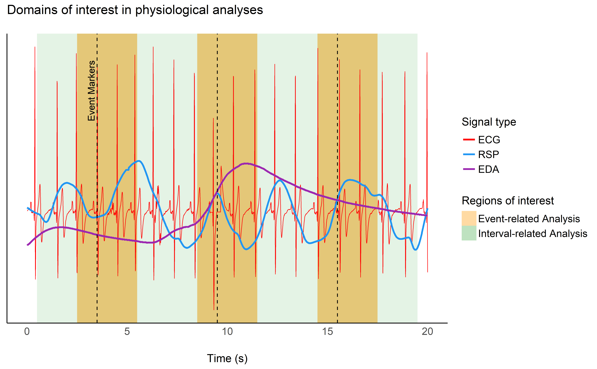

\justify

```{r r_setup, include = FALSE, warning=FALSE, message=FALSE}
library("papaja")
library("kableExtra")
options(knitr.kable.NA = 'None')

library(tidyverse)
library(easystats)

# Setup python - you need to change the path to your python distribution
library(reticulate)
reticulate::use_python("D:/Downloads/WPy64-3810/python-3.8.1.amd64/")
matplotlib <- import("matplotlib")
matplotlib$use("Agg", force = TRUE)
```


<!-- Research gap 1 -->
Neurophysiological measurements increasingly gain popularity in the study of cognition and behavior.
These measurements include electroencephalography (EEG), electrocardiography (ECG), electromyography (EMG) and electrodermal activity (EDA).
Their popularity is driven by theoretical motivations [e.g., the growth of embodied or affective neuroscience; @Kiverstein2015] as well as practical reasons.
The latter include low costs (especially compared with other imaging techniques, such as MRI or MEG), ease of use (e.g., portability, setup speed), and the increasing availability of recording devices [e.g., wearables; @yuehong2016internet].
Moreover, the extraction of meaningful information from neurophysiological signals is facilitated by current advances in signal processing algorithms [@clifton2012machine; @roy2019deep].
Unfortunately, these algorithms are mostly inaccessible to researchers without experience in programming and signal processing.
Moreover, many software tools for neurophysiological analyses are limited to one type of signal (for instance, focused on ECG).
This makes it inconvenient for researchers who might have to learn and concurrently rely on different software to process multimodal data.

<!-- Research gap 2 -->
Another important issue existing in psychology and neuroscience has been coined as the "reproducibility crisis" [@topalidou2015long; @open2015estimating; @milkowski2018replicability; @maizey2019barriers], and has lead to a profound questioning and reassessment from different actors involved (researchers, publishers, fund agencies, ...).
One of the main identified contributing factor is the actual opacity of data processing, where analysis pipelines are not described in enough details to ensure a full and exact reproduction.
One of the suggested response to that issue has been to provide, alongside the study, the analysis script, which in turns opens new challenges.
Indeed, these scripts must be shareable (not always feasible with closed-source and proprietary software or programming languages), accessible (enticing documented and well-organized scripts) and reproducible (which is inherently difficult for many software relying on a graphical user interface - GUI - in which the manual point-and-click sequence is hard to automate).

<!-- Response to gap -->
*NeuroKit2* addresses these challenges by offering a free, user-friendly, and comprehensive solution for neurophysiological data processing, with an initial focus on bodily signals (ECG, EDA, PPG, EMG, etc.).
It is an open-source Python package, developed by a multi-disciplinary team that actively invites new collaborators.
It aims at being accessible, well-documented, well-tested, cutting-edge, flexible and efficient, allowing users to select from a wide range of validated analysis pipelines as well as creating their own.
Historically, *NeuroKit2* is the re-forged successor *NeuroKit1* [@neurokit1], taking on its most successful features and design choices, and re-implementing them in a professional and well-thought way.

<!-- Accessibility and documentation -->
The package is implemented in Python 3 [@python3], which means that *NeuroKit2's* users benefit from an large amount of learning resources and a vibrant community. The package depends on relatively few, well established and robust packages from the Python data analysis ecosystem [@scipy] such as *NumPy*, *pandas*, *SciPy*, *scikit-learn* and *MatplotLib* (with an additional system of optional dependencies), making *NeuroKit2* itself a viable dependency in other software.

*NeuroKit2's* source code is available under the permissive MIT license on GitHub (*https://github.com/neuropsychology/NeuroKit*). Its documentation (*https://neurokit2.readthedocs.io/*) is automatically built and rendered from the code and includes guides for installation and contribution, a description of the package's functions, as well as several "hands-on" examples and tutorials (e.g., how to extract and visualize individual heartbeats, how to analyze event-related data etc.). Importantly, users can add new examples by simply uploading a Python notebook [@kluyver2016jupyter] to the GitHub repository. The notebook will automatically be displayed on the website, ensuring easily accessible and evolving documentation. Moreover, users can try out the example notebooks directly in their browser via a cloud-based *Binder* environment [@Jupyter2018]. Finally, the issue tracker on GitHub offers a convenient and public forum that allows newcomers and potential collaborators to report bugs, get help and gain insight into the development of the package.


<!-- Reliability and Evolution -->
*NeuroKit2* aims at being reliable and trustworthy, including peer-reviewed processing pipelines and functions tested against established software such as *BioSPPy* [@biosppy], *hrv* [*under review*](https://github.com/openjournals/joss-reviews/issues/1867), *PySiology* [@PySiology], *HeartPy* [@HeartPy], *systole* [@Systole] or *nolds* [@nolds]. The repository leverages a comprehensive test suite and continuous integration to ensure stability and prevent errors. Thanks to its collaborative and open development, *NeuroKit2* can remain cutting-edge and continuously evolve, adapt, and integrate new methods as they are emerging.


<!-- Powerful and flexible: API -->
Finally, we believe that the design philosophy of *NeuroKit2* contributes to an efficient (i.e., allowing to achieve a lot with few functions)  yet flexible (i.e., enabling fine control and precision over what is done) user interface (API). We will illustrate these claims with two examples of common use-cases (the analysis of event-related and resting state data), and will conclude by discussing how *NeuroKit2* contributes to neurophysiological research by raising the standards for validity, reproducibility and accessibility.


# Design Philosophy

As stated above, *NeuroKit2* aims at being accessible to beginners and, at the same time, offering a maximal level of control to experienced users. This is achieved by allowing beginning users to implement complex processing and analyses pipelines with very few functions, while still enabling fine-tuned control and precision over arguments and parameters to more experienced users. In concrete terms, this trade-off is allowed by a API structure organized in three three layers of abstraction.


## Low-level: Base Utilities for Signal Processing

The basic building blocks are functions for general signal processing, i.e., filtering, resampling, interpolation, peak detection, etc. These functions are signal-agnostic, and include a lot of parameters (e.g., one can change the filtering method, frequencies, and order, by overwriting the default arguments). Most of these functions are based on established algorithms implemented in *scipy* [@scipy]. Examples of such functions include `signal_filter()`, `signal_interpolate()`, `signal_resample()`, `signal_detrend()`, and `signal_findpeaks()`.


## Mid-level: Neurophysiological Processing Steps

The base utilities are used by mid-level functions specific to the different physiological modalities (i.e., ECG, RSP, EDA, EMG, PPG). These functions carry out modality-specific signal processing steps, such as cleaning, peak detection, phase classification or rate computation. Critically, for each type of signal, the same function names are called (in the form `signaltype_functiongoal()`) to achieve equivalent goals, e.g., `*_clean()`, `*_findpeaks()`, `*_process()`, `*_plot()`, making the implementation intuitive and consistent across different modalities.

For example, the `rsp_clean()` function uses `signal_filter()` and `signal_detrend()`, with different sets of default parameters that can be switched with a "method" argument (corresponding to different published or established pipelines). For instance, setting `method="khodadad2018"` will use the cleaning workflow described in @khodadad2018optimized. However, if a user wants to build their own custom cleaning pipeline, they can use the cleaning function as a template, and tweak the parameters to their desires in the low-level signal processing operations.


## High-level Wrappers for Processing and Analysis

The mid-level functions are assembled in high-level "master" functions, that are convenient entry points for new users. For instance, the `ecg_process()` function internally chains the mid-level functions `ecg_clean()`, `ecg_findpeaks()`, `ecg_rate()`. A specific processing pipeline can be selected with the `method` argument, that is then propagated throughout the internal functions. Easily switching between processing pipelines allows for the comparison of different methods, and streamlines critical but time-consuming steps in reproducible research, such as the validation of data preparation and quality control [@Quintana2016]. Finally, the package includes convenience meta-functions (e.g., `bio_process`) that enable the combined processing of multiple types of signals at once (e.g., `bio_process(ecg=ecg_signal, eda=eda_signal)`).

Performing an entire set of operations with sensible default parameters in one function can be rewarding, especially for beginners, allowing them to perform cutting-edge processing or replication of research steps without requiring much programming expertise. Moreover, it contributes to the demystification of the usage of "pure" programming tools (as opposed to GUI-based software such as *SPSS*, *Kubios*, or *Acqknowledge*), providing a welcoming framework to further explore the complexities of physiological data processing. Importantly, more advanced users can easily build custom analysis pipelines by using the mid-level functions, allowing for a finer control over the processing parameters. We believe that this implementation is a well-calibrated trade-off between flexibility and user-friendliness.


# Examples

In this section, we present two examples that illustrate the most common use-cases. The first example is an event-related paradigm, in which the interest lies in short-term physiological changes related to specific events (see **Figure 1** and **Table 1**). The second example shows how to extract the characteristics of physiological activity during a longer period of time (not necessarily tied to a specific and sudden event). The example datasets are made available with the package and can be downloaded using the `data()` function.


```{r include=TRUE, eval=TRUE, echo = FALSE, out.width="100%", fig.cap="Illustration of the difference between event-related analysis, focusing on activity changes in short windows (the orange rectangles), and interval-related analysis, pertaining to features of large areas, or the whole signal (e.g., the green rectangle)."}

```

```{r table3pdf, eval=TRUE, message=FALSE, warning=FALSE, echo=FALSE, out.width = "\\textwidth", fig.pos = "!ht", results = "asis"}
# 
table <- data.frame("A" = c("ECG Rate Changes (Min, Mean, Max, Time of Min,  Max, Trend)",
                            "RSP Rate Changes (Min, Mean, Max, Time of Min, Max)",
                            "RSP Amplitude Measures (Min, Mean, Max)",
                            "ECG and RSP Phase (Inspiration/Expiration, Systole/Diastole, Completion)",
                            "SCR peak and its characteristics (amplitude, rise time, recovery time)"),
                    
                    "B" = c("ECG Rate Characteristics (Mean, Amplitude)",
                            "Heart Rate Variability (HRV) indices",
                            "Respiratory Rate Variability (RRV) indices",
                            "Respiratory Sinus Arrhythmia (RSA) indices",
                            "Number of SCR Peaks and mean amplitude"))

colnames(table) <- c("Event-related Features", "Interval-related Features")

# For PDFs
knitr::kable(table, format="latex", digits = 2, booktabs = TRUE, caption = "Examples of features computed in different domains.", linesep="") %>%
  kableExtra::kable_styling(latex_options = c("hold_position"), font_size=9) %>% 
  kableExtra::column_spec(1:2, width = "8cm")
```


## Event-related Paradigm

This example dataset contains ECG, RSP and EDA signals of one participant who was presented with four emotional images [from the NAPS database; @marchewka2014nencki], in a typical (albeit highly shortened) experimental psychology paradigm.

Signals are 2.5 minutes long and are recorded at a frequency of 100Hz [note that the sampling rate is low for storage purposes and should be higher in actual recordings, see @Quintana2016]. It has 4 channels including three physiological signals, and one corresponding to the marking of events with a photosensor (which signal decreases when a stimulus appeared on the screen).


```{python eventrelated_data, include=TRUE, results="hide", eval=TRUE, echo = TRUE}
# Load the package
import neurokit2 as nk

# Download the example dataset
data = nk.data("bio_eventrelated_100hz")

# Process the data
df, info = nk.bio_process(ecg=data["ECG"],
                          rsp=data["RSP"],
                          eda=data["EDA"],
                          sampling_rate=100)

# Find events
conditions = ["Negative", "Neutral", "Neutral", "Negative"]
events = nk.events_find(event_channel=data["Photosensor"],
                        threshold_keep='below',
                        event_conditions=conditions)

# Epoch the data
epochs = nk.epochs_create(data=df,
                          events=events,
                          sampling_rate=100,
                          epochs_start=-0.1,
                          epochs_end=4)

# Extract event related features
results = nk.bio_analyze(epochs)

# Show subset of results
results[["Condition", "ECG_Rate_Mean", "RSP_Rate_Mean", "EDA_Peak_Amplitude"]]
```

```{r include=TRUE, eval=FALSE, echo = FALSE, fig.width=10, fig.height=6, fig.cap="Subset of the dataset showing one event (in orange) and the other physiological signals."}
py$data %>%
  standardize() %>%
  mutate(Time = 1:n() / 100) %>%
  slice(900:1900) %>%
  pivot_longer(1:4) %>%
  mutate(name = fct_relevel(name, c("ECG", "RSP", "EDA", "Photosensor"))) %>%
  ggplot(aes(x=Time, y=value, color=name, size=name)) +
  geom_line() +
  theme_modern() +
  scale_color_manual(values=c("ECG"="red", "EDA"="#9C27B0", "RSP"="#2196F3", "Photosensor"="#FF9800")) +
  scale_size_manual(values=c("ECG"=0.66, "EDA"=2, "RSP"=2, "Photosensor"=2)) +
  theme(axis.title.y = element_blank(),
        axis.text.y = element_blank(),
        legend.title = element_blank(),
        legend.position = "top") +
  ylab("Time (s)") +
  guides(size = guide_legend(override.aes = list(size = 2)))
```
```{r table1word, eval=FALSE, message=FALSE, warning=FALSE, echo=FALSE}
# For word
knitr::kable(py$results[c("Condition", "ECG_Rate_Mean", "RSP_Rate_Mean", "EDA_Peak_Amplitude")], format="markdown", digits = 3, caption = "Subset of the ouput related to event-related analysis characterizing the pattern of physiological changes related to specific stimuli.", row.names = FALSE)
```
```{r table1pdf, eval=TRUE, message=FALSE, warning=FALSE, echo=FALSE, out.width = "\\textwidth", fig.pos = "!ht", results = "asis"}
# For PDFs
kable(py$results[c("Condition", "ECG_Rate_Mean", "RSP_Rate_Mean", "EDA_Peak_Amplitude")], format="latex", digits = 2, booktabs = TRUE, caption = "Subset of the ouput related to event-related analysis characterizing the pattern of physiological changes related to specific stimuli.", linesep="") %>%
  kableExtra::kable_styling(latex_options = c("hold_position"))
```


In this example, after loading the package and the example dataset, each physiological signal is processed using `bio_process()`. Stimulus onsets in the photosensor are detected separately with `events_find()`. Once we have the preprocessed signals and the location of events, we can slice the data into segments corresponding to a time window (ranging from -0.1 to 4 seconds) around each stimulus with `epochs_create()`. Finally, relevant features are computed for each epoch (i.e., each stimulus) by passing them to `bio_analyze()`.

The features include for example the changes in rate of ECG and RSP signals (e.g. maximum, minimum and mean rate after stimulus onset, and the time at which they occur), and the peak characteristics of the EDA signal (e.g., occurrence of skin conductance response (SCR), and if SCR is present, its corresponding peak amplitude, time of peak, rise and recovery time). In addition, respiration and cardiac cycle phases are extracted (i.e., the respiration phase - inspiration/expiration - and cardiac phase - systole/diastole - occurring at the onset of event).

This example shows the straightforward process of extracting features of physiological responses. This pipeline can easily scale up to group-level analysis by aggregating the average of features across participants. In addition to streamlining data analyses, *NeuroKit2* aims to provide researchers an extensive suite of signal features, allowing for precise interpretations in terms of relationship between physiological activity and neurocognitive processes. In this example (see **Table 2**), exposure to negative stimuli, as compared to neutral stimuli, is related to stronger cardiac deceleration, higher skin conductance response, and accelerated breathing rate (note that this descriptive interpretation is given solely for illustrative purposes).


## Resting-state Features

The second dataset corresponds to 5 minutes of physiological activity of a human participant at rest (eyes-closed in a seated position), under no specific set of instructions. It contains three channels (ECG, PPG and RSP) sampled at a frequency of 100Hz.

```{python intervalrelated, include=TRUE, results="hide", eval=TRUE, echo = TRUE}
# Load the package
import neurokit2 as nk

# Download the example dataset
data = nk.data("bio_resting_5min_100hz")

# Process the data
df, info = nk.bio_process(ecg=data["ECG"],
                          rsp=data["RSP"],
                          sampling_rate=100)

# Extract features
results = nk.bio_analyze(df)

# Show subset of results
results[["ECG_Rate_Mean", "HRV_RMSSD", "RSP_Rate_Mean", "RSA_P2T_Mean"]]
```

```{r table2word, eval=FALSE, message=FALSE, warning=FALSE, echo=FALSE}
# For word
knitr::kable(py$results[c("ECG_Rate_Mean", "HRV_RMSSD", "RSP_Rate_Mean", "RSA_P2T_Mean")], format="markdown", digits = 3, caption = "Subset of properties characterizing the physiological activity over a period of 5 minutes of resting-state", row.names = FALSE)
```
```{r table2pdf, eval=TRUE, message=FALSE, warning=FALSE, echo=FALSE, out.width = "\\textwidth", fig.pos = "!ht", results = "asis"}
# For PDFs
kable(py$results[c("ECG_Rate_Mean", "HRV_RMSSD", "RSP_Rate_Mean", "RSA_P2T_Mean")], format="latex", digits = 2, booktabs = TRUE, caption = "Subset of properties characterizing the physiological activity over a period of 5 minutes of resting-state.", linesep="") %>%
  kableExtra::kable_styling(latex_options = c("hold_position"))
```


In this example, the steps of the analysis are identical to the previous example, including loading the package, the dataset and processing the data. The difference is that there is no epoching, as we want to compute features related to the whole dataset (see **Table 3**). Thus, we can directly pass the dataframe to `bio_analyze()`, which will detect that these are not epochs, and compute the appropriate features accordingly. These include for instance the average heart and breathing rate, as well as indices of heart rate variability (HRV) and respiratory sinus arrhythmia (RSA).


This example illustrates a second type of physiological analysis, that we refer to as interval-related (as opposed to event-related). Interval-related analyses compute features of signal variability and activation patterns over a longer-term period of time (typically minutes). *NeuroKit2* allows for the fast creation of a standardized and reproducible pipeline to describe this kind of physiological activity, which can be beneficial for a wide variety of applications.


# Discussion


*NeuroKit2* is a neurophysiological signal processing software accessible to people with all levels of programming experience and background. Its development is focused on creating an intuitive user-experience, as well as building a collaborative community. It is also a pragmatic answer to the broader need for transparent and reproducible methods in neurophysiology. Its modular structure and organization not only facilitates the use of existing and validated processing pipelines, but also creates a fertile ground for experimentation and innovation.

We expect the package's future evolution to be driven by the communities' needs and the advances in related fields. For instance, although *NeuroKit2* already implements a lot of useful functions for EEG processing (such as entropy and fractal dimensions quantification), its support could be further improved [for example with high-level functions built on top of utilities provided by the leading EEG Python software, namely *MNE*; @gramfort2013meg]. Possible other future directions include extending the support for other types of bodily signals (e.g., electrogastrography - EGG, electrooculography - EOG) and achieving performance gains for large datasets by using efficient algorithms. Further validation of the available processing pipelines could be made through the (re)analysis of public databases. In line with this objective, the support of standardized data structure formats (e.g. WFDB, BIDS, ...) could be extended.

In conclusion, we believe that *NeuroKit2* provides useful tools for anyone who is interested in analyzing physiological data from research-grade hardware as well as wearable "smart health devices". By increasing the autonomy of researchers and practitioners, and by shortening the delay between data collection and results acquisition, *NeuroKit2* could be useful beyond academic research in neuroscience and psychology, including applications such as biofeedback, personal physiological monitoring and exercise science. Finally, we hope that *NeuroKit2* encourages users to become part of a supportive open-science community with diverse areas of expertise rather than relying on closed-source and proprietary software, thus shaping the future of neurophysiology and its related fields.

# Conflict of Interest

The authors declare that the research was conducted in the absence of commercial or financial relationships that could constitute a conflict of interest.

# Acknowledgements

We would like to thank Prof. C. F. Xavier for inspiration, all the contributors (https://neurokit2.readthedocs.io/en/latest/authors.html), and the users for their support. Additionally, François Lespinasse would like to thank the Courtois Foundation for its support through the Courtois-NeuroMod project (https://cneuromod.ca)


\newpage

# References
```{r create_r-references}
r_refs(file = "bibliography.bib")
```

\begingroup
\setlength{\parindent}{-0.5in}
\setlength{\leftskip}{0.5in}

<div id = "refs"></div>
\endgroup
