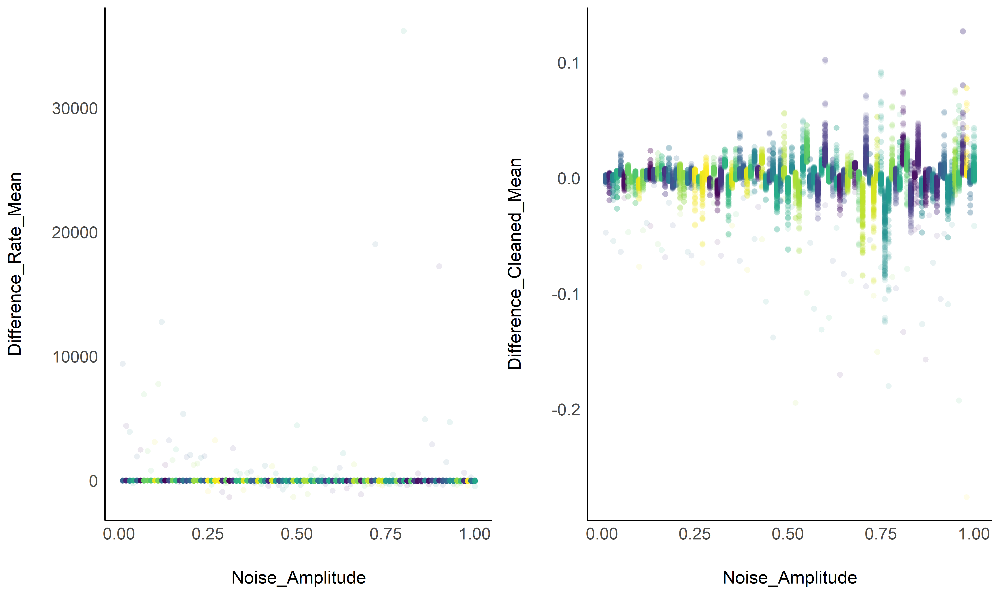
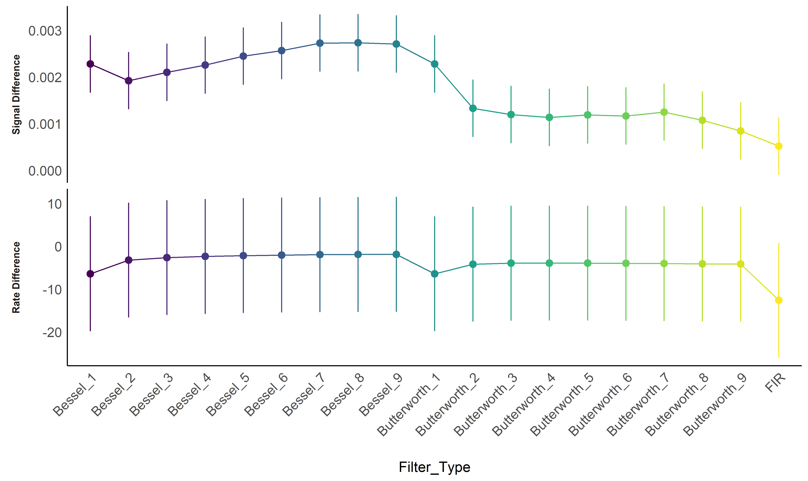
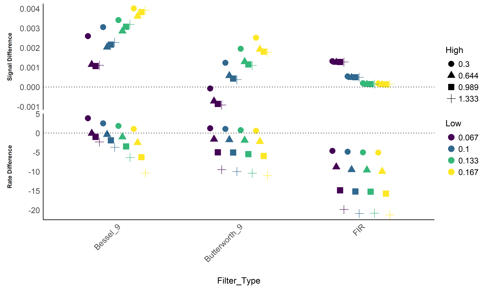

    ## # Attaching packages (red = needs update)
    ## <U+2714> insight     0.7.1.1   <U+2714> bayestestR  0.4.9  
    ## <U+26A0> performance 0.4.0.1   <U+2714> parameters  0.3.0.1
    ## <U+2714> see         0.3.0.1   <U+2714> effectsize  0.1.0  
    ## <U+2714> correlation 0.1.0     <U+2714> estimate    0.1.0  
    ## <U+2714> report      0.1.0     
    ## Restart the R-Session and update packages in red with 'easystats::easystats_update()'.

# How to Preprocess ECG, RSP and EDA Signals: A Simulation Study

The closest to 0, the better.

## Respiration (RSP)

### Convenience Functions

<details>

<summary>See code</summary>

<p>

``` r
plot_effectnoise <- function(df){
  
  geoms <- function(p){
    p + 
      geom_point2(size=2, alpha=0.1) +
      theme_modern() +
      scale_color_viridis_d(guide=FALSE)
  }
  
  # fig1 <- geoms(ggplot(df, aes(x = Noise_Frequency, y = Difference_Rate_Mean, color=Noise_Amplitude)))
  fig2 <- geoms(ggplot(df, aes(x = Noise_Amplitude, y = Difference_Rate_Mean, color=Noise_Frequency)))
  # fig3 <- geoms(ggplot(df, aes(x = Noise_Frequency, y = Difference_Cleaned_Mean, color=Noise_Amplitude)))
  fig4 <- geoms(ggplot(df, aes(x = Noise_Amplitude, y = Difference_Cleaned_Mean, color=Noise_Frequency)))
  
  # cowplot::plot_grid(fig1, fig2, fig3, fig4, nrow=2)
  cowplot::plot_grid(fig2, fig4)
}
```

</p>

</details>

### Filtering

<details>

<summary>See code</summary>

<p>

``` r
df <- read.csv("data_RSP_filtering.csv")

plot_effectnoise(df)
```

<!-- -->

</p>

</details>

#### Filter Type

<details>

<summary>See code</summary>

<p>

``` r
data <- select(df, Difference_Cleaned_Mean, Difference_Rate_Mean, Filter_Type)
m1 <- lm(Difference_Rate_Mean ~ Filter_Type, data=data[complete.cases(data),])
m2 <- lm(Difference_Cleaned_Mean ~ Filter_Type, data=data[complete.cases(data),])

table <- m1 %>% 
  estimate_means() %>% 
  mutate(Index = "Rate Difference") %>% 
  rbind(m2 %>% 
          estimate_means() %>% 
          mutate(Index = "Signal Difference")) %>% 
  mutate(Index = fct_relevel(Index, "Signal Difference", "Rate Difference"))

fig <- table %>% 
  filter(!is.na(Mean), Filter_Type!="None") %>% 
  ggplot(aes(x = Filter_Type, y = Mean, color=Filter_Type)) +
  geom_line(aes(group=1), position = position_dodge(width = 0.2)) +
  geom_pointrange(aes(ymin=CI_low, ymax=CI_high), position = position_dodge(width=0.2)) +
  # geom_hline(yintercept=0, linetype="dotted") +
  theme_modern() +
  ylab("Mean Difference") +
  scale_color_viridis_d(guide = FALSE) +
  theme(axis.text.x = element_text(angle = 45, hjust=1),
        axis.title.y = element_blank(),
        strip.placement = "outside") +
  facet_wrap(~Index, scales = "free_y", nrow = 2, strip.position = "left")
```

</p>

</details>

<!-- -->

    ## # A tibble: 10 x 3
    ## # Groups:   Index [2]
    ##    Index             Filter_Type        Mean
    ##    <fct>             <fct>             <dbl>
    ##  1 Rate Difference   Bessel_9      -1.88    
    ##  2 Rate Difference   Bessel_8      -1.90    
    ##  3 Rate Difference   Bessel_7      -1.93    
    ##  4 Rate Difference   Bessel_6      -2.02    
    ##  5 Rate Difference   Bessel_5      -2.16    
    ##  6 Signal Difference FIR            0.000521
    ##  7 Signal Difference Butterworth_9  0.000846
    ##  8 Signal Difference Butterworth_8  0.00108 
    ##  9 Signal Difference Butterworth_4  0.00114 
    ## 10 Signal Difference Butterworth_6  0.00117

#### Filter Band

<details>

<summary>See code</summary>

<p>

``` r
data <- df %>% 
  select(Difference_Cleaned_Mean, Difference_Rate_Mean, Filter_Type, Filter_Band) %>% 
  filter(Filter_Type %in% c("FIR", "Bessel_9", "Butterworth_9"))
m1 <- lm(Difference_Rate_Mean ~ Filter_Type * Filter_Band, data=data[complete.cases(data),])
m2 <- lm(Difference_Cleaned_Mean ~ Filter_Type * Filter_Band, data=data[complete.cases(data),])

table <- m1 %>% 
  estimate_means() %>% 
  mutate(Index = "Rate Difference") %>% 
  rbind(m2 %>% 
          estimate_means() %>% 
          mutate(Index = "Signal Difference")) %>% 
  mutate(Index = fct_relevel(Index, "Signal Difference", "Rate Difference")) %>%
  separate(Filter_Band, c("Low", "High"), ", ", remove=FALSE) 

fig <- table %>% 
  filter(!is.na(Mean), Filter_Type!="None") %>% 
  ggplot(aes(x = Filter_Type, y = Mean, color=Low, shape=High)) +
  # geom_pointrange(aes(ymin=CI_low, ymax=CI_high), position = position_dodge(width=0.3)) +
  geom_point(position = position_dodge(width=0.5), size=4) +
  # geom_line(aes(group=Filter_Band))  +
  geom_hline(aes(yintercept=0), linetype="dotted") +
  theme_modern() +
  ylab("Mean Difference") +
  scale_color_viridis_d() +
  theme(axis.text.x = element_text(angle = 45, hjust=1),
        axis.title.y = element_blank(),
        strip.placement = "outside") +
  facet_wrap(~Index, scales = "free_y", nrow = 2, strip.position = "left")
```

</p>

</details>

<!-- -->

#### Best Filter Parameters

    ## # A tibble: 12 x 4
    ## # Groups:   Index [2]
    ##    Index             Filter_Type   Filter_Band        Mean
    ##    <fct>             <fct>         <fct>             <dbl>
    ##  1 Signal Difference Butterworth_9 0.067, 0.3   -0.0000776
    ##  2 Signal Difference FIR           0.167, 0.644  0.000119 
    ##  3 Signal Difference FIR           0.133, 0.644  0.000132 
    ##  4 Signal Difference FIR           0.167, 1.333  0.000136 
    ##  5 Signal Difference FIR           0.167, 0.989  0.000137 
    ##  6 Signal Difference FIR           0.133, 1.333  0.000149 
    ##  7 Rate Difference   Bessel_9      0.067, 0.644 -0.0742   
    ##  8 Rate Difference   Bessel_9      0.1, 0.644   -0.359    
    ##  9 Rate Difference   Butterworth_9 0.167, 0.3    0.586    
    ## 10 Rate Difference   Butterworth_9 0.133, 0.3    0.770    
    ## 11 Rate Difference   Bessel_9      0.067, 0.989 -0.992    
    ## 12 Rate Difference   Bessel_9      0.133, 0.644 -1.02
