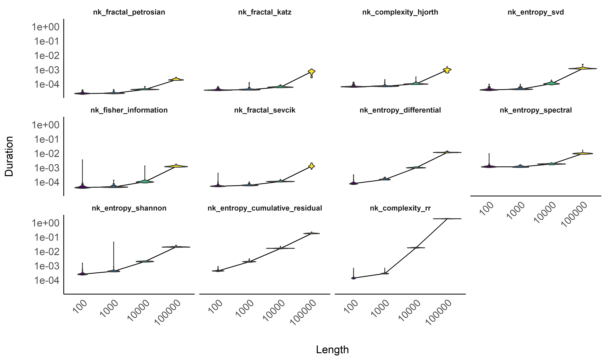
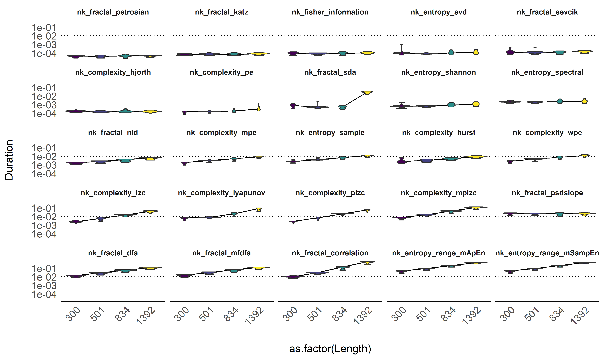

# Benchmarking of Complexity Measures

*This study can be referenced by* [*citing the
package*](https://github.com/neuropsychology/NeuroKit#citation)
(Makowski et al., 2021).

**We’d like to improve this study, but unfortunately we currently don’t
have the time. If you want to help to make it happen, please contact
us!**

## Introduction

The goal for NeuroKit is to provide the most comprehensive, accurate and
fastest base Python implementations of complexity indices (fractal
dimension, entropy, etc.).

## Make data

``` python
# See make_data.py
```

## Benchmark

### Average Duration

``` r
library(tidyverse)
library(easystats)

df <- read.csv("data.csv") 

order <- df |> 
  group_by(Method) |> 
  summarize(Duration = median(Duration)) |> 
  arrange(Duration) |> 
  mutate(Method = factor(Method, levels = Method))

df <- mutate(df, Method = fct_relevel(Method, as.character(order$Method)))

dfsummary <- df |>
  group_by(Method, Length) |>
  summarize(Duration = median(Duration))


ggplot(dfsummary, aes(x = Method, y = Duration)) + 
  geom_hline(yintercept = c(0.001, 0.01, 0.1, 1), linetype = "dotted") +
  geom_line(aes(alpha = Length, group = Length)) +
  geom_point(aes(color = Length)) + 
  theme_modern() +
  scale_y_log10(breaks = c(0.001, 0.01, 0.1, 1)) +
  theme(axis.text.x = element_text(angle = 45, vjust = 1, hjust=1)) +
  guides(alpha = "none") +
  labs(y = "Time to compute", x = NULL, color = "Signal length")
```

<!-- -->

### Sensitivity to signal length

``` r
df |> 
  ggplot(aes(x = as.factor(Length), y = Duration)) +
  geom_hline(yintercept = c(0.01), linetype = "dotted") +
  geom_line(data=dfsummary, aes(group = 1)) +
  geom_violin(aes(fill = Length)) +
  facet_wrap(~Method) +
  scale_y_log10() +
  scale_fill_viridis_c(guide = "none") +
  theme_modern() +
  theme(axis.text.x = element_text(angle = 45, vjust = 1, hjust=1))
```

<!-- -->

## References

<div id="refs" class="references csl-bib-body hanging-indent"
line-spacing="2">

<div id="ref-Makowski2021neurokit" class="csl-entry">

Makowski, D., Pham, T., Lau, Z. J., Brammer, J. C., Lespinasse, F.,
Pham, H., … Chen, S. H. A. (2021). NeuroKit2: A python toolbox for
neurophysiological signal processing. *Behavior Research Methods*,
*53*(4), 1689–1696. <https://doi.org/10.3758/s13428-020-01516-y>

</div>

</div>
