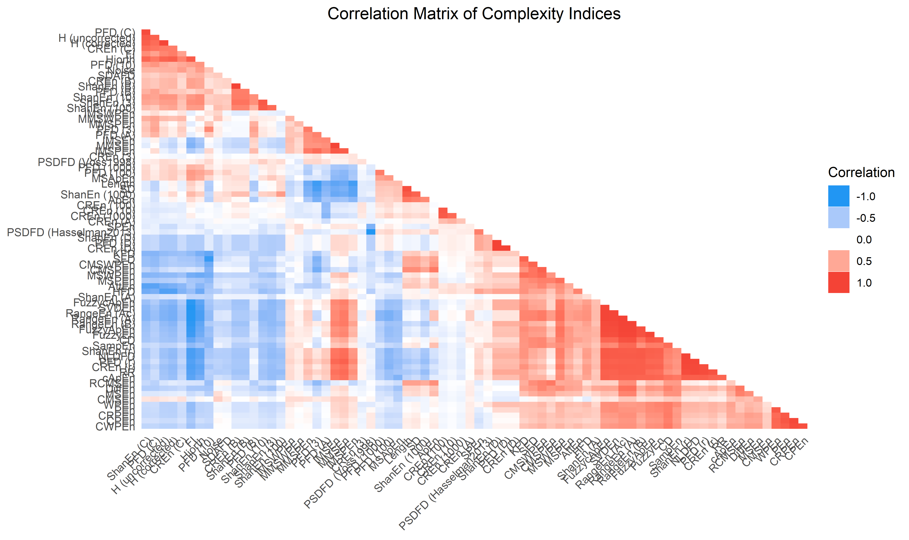
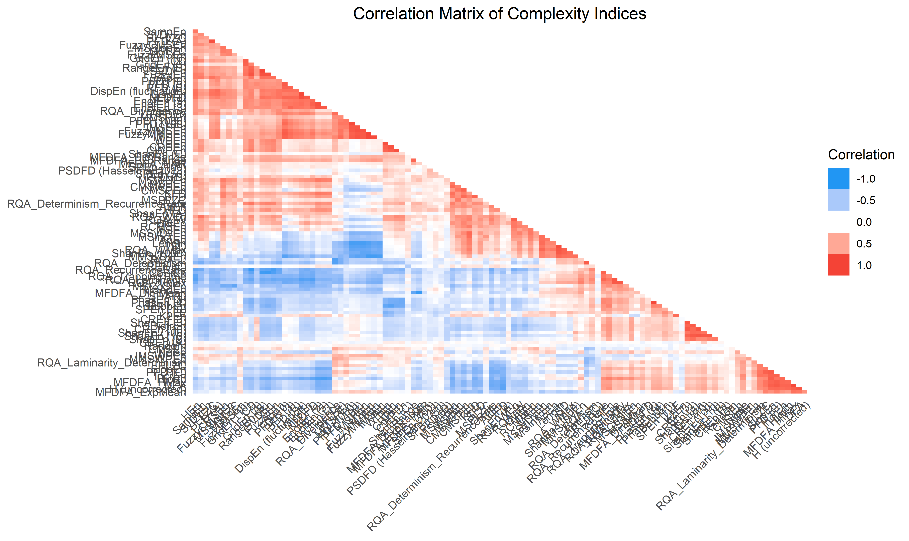
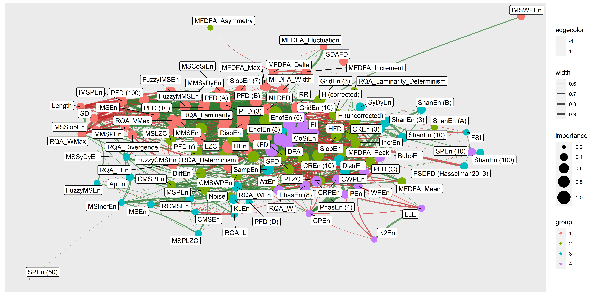
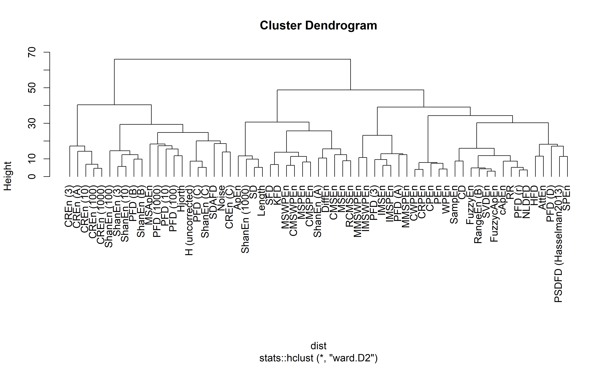
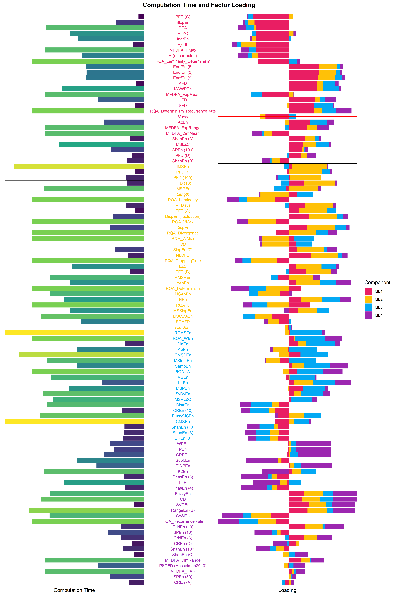

<!-- # Benchmarking and Analysis of Complexity Measures -->
<!-- # Measuring Chaos: Complexity and Fractal Physiology using NeuroKit2 -->

# Measuring Chaos: Empirical Relationship between Complexity Indices

*This study can be referenced by* [*citing the package and the
documentation*](https://neuropsychology.github.io/NeuroKit/cite_us.html).

**We’d like to improve this study, but unfortunately we currently don’t
have the time. If you want to help to make it happen, please contact
us!**

## Introduction

There has been a large and accelerating increase in the number of
complexity indices in the past few decades. They are usually
mathematically well-defined and theoretically promising. However, few
empirical data exist to understand their differences and similarities.

In this study, we will compute a vast amount of complexity indices on
various types of signals, with varying degrees of noise. We will then
empirically compare the various metrics and their relationship.

The goal for NeuroKit is to provide the most comprehensive, accurate and
fastest base Python implementations of complexity indices (fractal
dimension, entropy, etc.).

## Methods

### Data Generation

The script to generate the data can be found at …

Generated 3 types of signals, to which we added different types of
noise.

``` r
library(tidyverse)
library(easystats)
library(patchwork)

df <- read.csv("data_Signals.csv") |> 
  mutate(Method = as.factor(Method),
         Noise = as.factor(Noise),
         Intensity = as.factor(insight::format_value(Noise_Intensity)))

df <- df |> 
  filter(Intensity %in% levels(df$Intensity)[c(1, round(length(levels(df$Intensity)) / 2), length(levels(df$Intensity)))])

make_plot <- function(method = "Random-Walk", title = "Random-Walk", color = "red") {
  df |>
    filter(Method == method) |> 
    ggplot(aes(x = Duration, y = Signal)) + 
    geom_line(color = color) +
    ggside::geom_ysidedensity(aes(x=stat(density))) +
    facet_grid(Intensity ~ Noise, labeller = label_both) +
    labs(y = NULL, title = title) +
    theme_minimal() +
    theme(plot.title = element_text(hjust = 0.5),
          ggside.panel.border = element_blank(),
          ggside.panel.grid =element_blank(),
          ggside.panel.background = element_blank()) 
}

p1 <- make_plot(method = "Random-Walk", title = "Random-Walk", color = "red") 
p2 <- make_plot(method = "lorenz_10_2.5_28", title = "Lorenz (sigma=10, beta=2.5, rho=28)", color = "blue") 
p3 <- make_plot(method = "lorenz_20_2_30", title = "Lorenz (sigma=20, beta=2, rho=30)", color = "green") 
p4 <- make_plot(method = "oscillatory", title = "Oscillatory", color = "orange") 

p1 / p2 / p3 / p4 + patchwork::plot_annotation(title = "Examples of Simulated Signals", theme = theme(plot.title = element_text(face = "bold", hjust = 0.5)))
```

<!-- -->

## Results

``` r
df <- read.csv("data_Complexity.csv") |> 
  mutate(Method = as.factor(Method)) 

# Show and filter out NaNs
df[is.na(df$Result), "Index"]
##  [1] "RangeEn (A)"  "RangeEn (Ac)" "RangeEn (A)"  "RangeEn (Ac)" "RangeEn (A)" 
##  [6] "RangeEn (Ac)" "RangeEn (A)"  "RangeEn (Ac)" "RangeEn (A)"  "RangeEn (Ac)"
## [11] "RangeEn (A)"  "RangeEn (Ac)" "RangeEn (A)"  "RangeEn (Ac)" "RangeEn (A)" 
## [16] "RangeEn (Ac)" "RangeEn (A)"  "RangeEn (Ac)" "RangeEn (A)"  "RangeEn (Ac)"
## [21] "RangeEn (A)"  "RangeEn (Ac)" "RangeEn (A)"  "RangeEn (Ac)" "RangeEn (A)" 
## [26] "RangeEn (Ac)" "RangeEn (A)"  "RangeEn (Ac)" "RangeEn (A)"  "RangeEn (Ac)"
## [31] "RangeEn (A)"  "RangeEn (Ac)"
df <- filter(df, !is.na(Result))

df[is.infinite(df$Result), "Index"]
##   [1] "RangeEn (A)"  "RangeEn (Ac)" "RangeEn (A)"  "RangeEn (Ac)" "RangeEn (A)" 
##   [6] "RangeEn (Ac)" "RangeEn (A)"  "RangeEn (Ac)" "RangeEn (A)"  "RangeEn (Ac)"
##  [11] "RangeEn (A)"  "RangeEn (Ac)" "RangeEn (A)"  "RangeEn (Ac)" "RangeEn (A)" 
##  [16] "RangeEn (Ac)" "RangeEn (A)"  "RangeEn (Ac)" "RangeEn (A)"  "RangeEn (Ac)"
##  [21] "RangeEn (A)"  "RangeEn (Ac)" "RangeEn (A)"  "RangeEn (Ac)" "RangeEn (A)" 
##  [26] "RangeEn (Ac)" "RangeEn (A)"  "RangeEn (Ac)" "RangeEn (A)"  "RangeEn (Ac)"
##  [31] "RangeEn (A)"  "RangeEn (Ac)" "RangeEn (A)"  "RangeEn (Ac)" "RangeEn (A)" 
##  [36] "RangeEn (Ac)" "RangeEn (A)"  "RangeEn (Ac)" "RangeEn (A)"  "RangeEn (Ac)"
##  [41] "RangeEn (A)"  "RangeEn (Ac)" "RangeEn (A)"  "RangeEn (Ac)" "RangeEn (A)" 
##  [46] "RangeEn (Ac)" "RangeEn (A)"  "RangeEn (Ac)" "RangeEn (A)"  "RangeEn (Ac)"
##  [51] "RangeEn (A)"  "RangeEn (Ac)" "RangeEn (A)"  "RangeEn (Ac)" "RangeEn (A)" 
##  [56] "RangeEn (Ac)" "RangeEn (A)"  "RangeEn (Ac)" "RangeEn (A)"  "RangeEn (Ac)"
##  [61] "RangeEn (A)"  "RangeEn (Ac)" "RangeEn (A)"  "RangeEn (Ac)" "RangeEn (A)" 
##  [66] "RangeEn (Ac)" "RangeEn (A)"  "RangeEn (Ac)" "RangeEn (A)"  "RangeEn (Ac)"
##  [71] "RangeEn (A)"  "RangeEn (Ac)" "RangeEn (A)"  "RangeEn (Ac)" "RangeEn (A)" 
##  [76] "RangeEn (Ac)" "RangeEn (A)"  "RangeEn (Ac)" "RangeEn (A)"  "RangeEn (Ac)"
##  [81] "RangeEn (A)"  "RangeEn (Ac)" "RangeEn (A)"  "RangeEn (Ac)" "RangeEn (A)" 
##  [86] "RangeEn (Ac)" "RangeEn (A)"  "RangeEn (Ac)" "RangeEn (A)"  "RangeEn (Ac)"
##  [91] "RangeEn (A)"  "RangeEn (Ac)" "RangeEn (A)"  "RangeEn (Ac)" "RangeEn (A)" 
##  [96] "RangeEn (Ac)" "RangeEn (A)"  "RangeEn (Ac)" "RangeEn (A)"  "RangeEn (Ac)"
## [101] "RangeEn (A)"  "RangeEn (Ac)" "RangeEn (A)"  "RangeEn (Ac)" "RangeEn (A)" 
## [106] "RangeEn (Ac)" "RangeEn (A)"  "RangeEn (Ac)" "RangeEn (A)"  "RangeEn (Ac)"
## [111] "RangeEn (A)"  "RangeEn (Ac)" "RangeEn (A)"  "RangeEn (Ac)" "RangeEn (A)" 
## [116] "RangeEn (Ac)" "RangeEn (A)"  "RangeEn (Ac)" "RangeEn (A)"  "RangeEn (Ac)"
## [121] "RangeEn (A)"  "RangeEn (Ac)" "RangeEn (A)"  "RangeEn (Ac)" "RangeEn (A)" 
## [126] "RangeEn (Ac)" "RangeEn (A)"  "RangeEn (Ac)" "RangeEn (A)"  "RangeEn (Ac)"
## [131] "RangeEn (A)"  "RangeEn (Ac)" "RangeEn (A)"  "RangeEn (Ac)" "RangeEn (A)" 
## [136] "RangeEn (Ac)" "RangeEn (A)"  "RangeEn (Ac)" "RangeEn (A)"  "RangeEn (Ac)"
## [141] "RangeEn (A)"  "RangeEn (Ac)" "RangeEn (A)"  "RangeEn (Ac)" "RangeEn (A)" 
## [146] "RangeEn (Ac)" "RangeEn (A)"  "RangeEn (Ac)" "RangeEn (A)"  "RangeEn (Ac)"
## [151] "RangeEn (A)"  "RangeEn (Ac)" "RangeEn (A)"  "RangeEn (Ac)" "RangeEn (A)" 
## [156] "RangeEn (Ac)" "RangeEn (A)"  "RangeEn (Ac)" "RangeEn (A)"  "RangeEn (Ac)"
## [161] "RangeEn (A)"  "RangeEn (Ac)" "RangeEn (A)"  "RangeEn (Ac)"
df <- filter(df, !is.infinite(Result))

df <- df |> 
  group_by(Index) |> 
  standardize(select="Result") |> 
  ungroup()
```

### Computation Time

``` r
order <- df |> 
  group_by(Index) |> 
  summarize(Duration = median(Duration)) |> 
  arrange(Duration) |> 
  mutate(Index = factor(Index, levels = Index))

df <- mutate(df, Index = fct_relevel(Index, as.character(order$Index)))

df |> 
  filter(!Index %in% c("SD", "Length", "Noise")) |> 
  mutate(Duration = Duration * 10000) |> 
  ggplot(aes(x = Index, y = Duration)) +
  # geom_violin(aes(fill = Index)) +
  geom_hline(yintercept = rep(10, 5)**seq(0, 4), linetype = "dotted") +
  ggdist::stat_slab(side = "bottom", aes(fill = Index), adjust = 3) +
  ggdist::stat_dotsinterval(aes(fill = Index, slab_size = NA)) +
  theme_modern() +
  scale_y_log10(breaks = rep(10, 5)**seq(0, 4), labels = function(x) sprintf("%g", x)) +
  scale_fill_manual(values = colors, guide = "none") +
  theme(axis.text.x = element_text(angle = 45, vjust = 1, hjust=1)) +
  labs(x = NULL, y = "Computation Time")
```

<!-- -->

``` r
dfsummary <- df |>
  filter(!Index %in% c("SD", "Length", "Noise")) |> 
  mutate(Duration = Duration * 10000) |> 
  group_by(Index, Length) |>
  summarize(CI_low = median(Duration) - sd(Duration),
            CI_high = median(Duration) + sd(Duration),
            Duration = median(Duration))
dfsummary$CI_low[dfsummary$CI_low < 0] <- 0


dfsummary |>
  ggplot(aes(x = Index, y = Duration)) + 
  # geom_hline(yintercept = c(0.001, 0.01, 0.1, 1), linetype = "dotted") +
  geom_line(aes(alpha = Length, group = Length)) +
  geom_point(aes(color = Length)) + 
  theme_modern() +
  scale_y_log10(breaks = rep(10, 5)**seq(0, 4), labels = function(x) sprintf("%g", x)) +
  theme(axis.text.x = element_text(angle = 45, vjust = 1, hjust=1)) +
  guides(alpha = "none") +
  labs(y = "Time to compute", x = NULL, color = "Signal length")
```

<!-- -->

``` r
df |> 
  filter(!Index %in% c("Diff", "SD")) |> 
  mutate(Duration = Duration * 10000) |> 
  ggplot(aes(x = as.factor(Length), y = Duration)) +
  # geom_hline(yintercept = c(0.001, 0.01, 0.1, 1), linetype = "dotted") +
  geom_line(data=dfsummary, aes(group = 1)) +
  geom_violin(aes(fill = Length)) +
  facet_wrap(~Index) +
  scale_y_log10(breaks = rep(10, 5)**seq(0, 4), labels = function(x) sprintf("%g", x)) +
  scale_fill_viridis_c(guide = "none") +
  theme_modern() +
  theme(axis.text.x = element_text(angle = 45, vjust = 1, hjust=1))
```

<!-- -->

### Sensitivity to Signal Length

``` r
model <- lm(Result ~ Index / poly(Length, 2), data = filter(df, Index != "SD"))

parameters::parameters(model, keep = "poly.*1") |> 
  arrange(desc(abs(Coefficient))) |> 
  filter(p < .05)
## Parameter                                        | Coefficient |   SE |            95% CI | t(13790) |      p
## -------------------------------------------------------------------------------------------------------------
## Index [Length] * poly(Length, 2)1                |      118.16 | 7.92 | [ 102.64, 133.68] |    14.93 | < .001
## Index [PFD (3)] * poly(Length, 2)1               |     -110.16 | 7.92 | [-125.67, -94.64] |   -13.91 | < .001
## Index [IMSPEn] * poly(Length, 2)1                |     -107.97 | 7.92 | [-123.49, -92.45] |   -13.64 | < .001
## Index [IMSEn] * poly(Length, 2)1                 |      -93.81 | 7.92 | [-109.33, -78.30] |   -11.85 | < .001
## Index [ShanEn (1000)] * poly(Length, 2)1         |       90.94 | 7.92 | [  75.42, 106.46] |    11.49 | < .001
## Index [MMSEn] * poly(Length, 2)1                 |      -90.09 | 7.92 | [-105.61, -74.58] |   -11.38 | < .001
## Index [ApEn] * poly(Length, 2)1                  |       86.34 | 7.92 | [  70.83, 101.86] |    10.91 | < .001
## Index [MMSPEn] * poly(Length, 2)1                |      -85.91 | 7.92 | [-101.43, -70.40] |   -10.85 | < .001
## Index [PFD (A)] * poly(Length, 2)1               |      -83.30 | 7.92 | [ -98.82, -67.78] |   -10.52 | < .001
## Index [PFD (r)] * poly(Length, 2)1               |      -58.67 | 7.92 | [ -74.19, -43.16] |    -7.41 | < .001
## Index [SFD] * poly(Length, 2)1                   |       57.37 | 7.92 | [  41.85,  72.89] |     7.25 | < .001
## Index [CMSPEn] * poly(Length, 2)1                |       56.50 | 7.92 | [  40.98,  72.02] |     7.14 | < .001
## Index [RCMSEn] * poly(Length, 2)1                |       55.12 | 7.92 | [  39.60,  70.64] |     6.96 | < .001
## Index [PFD (10)] * poly(Length, 2)1              |      -54.19 | 7.92 | [ -69.71, -38.67] |    -6.84 | < .001
## Index [PFD (B)] * poly(Length, 2)1               |      -53.27 | 7.92 | [ -68.79, -37.75] |    -6.73 | < .001
## Index [ShanEn (r)] * poly(Length, 2)1            |      -50.12 | 7.92 | [ -65.64, -34.60] |    -6.33 | < .001
## Index [RR] * poly(Length, 2)1                    |      -49.71 | 7.92 | [ -65.23, -34.19] |    -6.28 | < .001
## Index [NLDFD] * poly(Length, 2)1                 |      -49.09 | 7.92 | [ -64.61, -33.57] |    -6.20 | < .001
## Index [PFD (C)] * poly(Length, 2)1               |      -44.68 | 7.92 | [ -60.20, -29.16] |    -5.64 | < .001
## Index [MSApEn] * poly(Length, 2)1                |       43.89 | 7.92 | [  28.37,  59.41] |     5.54 | < .001
## Index [CREn (r)] * poly(Length, 2)1              |      -42.90 | 7.92 | [ -58.41, -27.38] |    -5.42 | < .001
## Index [cApEn] * poly(Length, 2)1                 |      -42.09 | 7.92 | [ -57.61, -26.57] |    -5.32 | < .001
## Index [RangeEn (B)] * poly(Length, 2)1           |      -39.84 | 7.92 | [ -55.36, -24.32] |    -5.03 | < .001
## Index [CMSWPEn] * poly(Length, 2)1               |       39.68 | 7.92 | [  24.17,  55.20] |     5.01 | < .001
## Index [AttEn] * poly(Length, 2)1                 |       39.31 | 7.92 | [  23.80,  54.83] |     4.97 | < .001
## Index [MMSWPEn] * poly(Length, 2)1               |      -36.77 | 7.92 | [ -52.29, -21.25] |    -4.64 | < .001
## Index [PFD (100)] * poly(Length, 2)1             |       36.61 | 7.92 | [  21.09,  52.13] |     4.62 | < .001
## Index [KFD] * poly(Length, 2)1                   |       36.50 | 7.92 | [  20.98,  52.01] |     4.61 | < .001
## Index [FuzzycApEn] * poly(Length, 2)1            |      -35.44 | 7.92 | [ -50.96, -19.92] |    -4.48 | < .001
## Index [SVDEn] * poly(Length, 2)1                 |      -34.75 | 7.92 | [ -50.27, -19.23] |    -4.39 | < .001
## Index [FI] * poly(Length, 2)1                    |       34.38 | 7.92 | [  18.86,  49.90] |     4.34 | < .001
## Index [IMSWPEn] * poly(Length, 2)1               |      -34.01 | 7.92 | [ -49.53, -18.49] |    -4.30 | < .001
## Index [Hjorth] * poly(Length, 2)1                |       28.92 | 7.92 | [  13.40,  44.43] |     3.65 | < .001
## Index [FuzzyEn] * poly(Length, 2)1               |      -27.31 | 7.92 | [ -42.83, -11.79] |    -3.45 | < .001
## Index [ShanEn (100)] * poly(Length, 2)1          |       25.72 | 7.92 | [  10.20,  41.23] |     3.25 | 0.001 
## Index [PSDFD (Voss1998)] * poly(Length, 2)1      |      -25.50 | 7.92 | [ -41.02,  -9.98] |    -3.22 | 0.001 
## Index [FuzzyApEn] * poly(Length, 2)1             |      -25.47 | 7.92 | [ -40.98,  -9.95] |    -3.22 | 0.001 
## Index [PSDFD (Hasselman2013)] * poly(Length, 2)1 |       24.05 | 7.92 | [   8.53,  39.57] |     3.04 | 0.002 
## Index [ShanEn (B)] * poly(Length, 2)1            |       23.58 | 7.92 | [   8.06,  39.10] |     2.98 | 0.003 
## Index [ShanEn (C)] * poly(Length, 2)1            |      -22.83 | 7.92 | [ -38.35,  -7.31] |    -2.88 | 0.004 
## Index [CREn (B)] * poly(Length, 2)1              |       22.27 | 7.92 | [   6.75,  37.78] |     2.81 | 0.005 
## Index [PFD (D)] * poly(Length, 2)1               |      -21.18 | 7.92 | [ -36.70,  -5.67] |    -2.68 | 0.007 
## Index [MSEn] * poly(Length, 2)1                  |       20.81 | 7.92 | [   5.29,  36.33] |     2.63 | 0.009 
## Index [CREn (1000)] * poly(Length, 2)1           |       20.30 | 7.92 | [   4.78,  35.81] |     2.56 | 0.010 
## Index [MSPEn] * poly(Length, 2)1                 |       20.19 | 7.92 | [   4.67,  35.70] |     2.55 | 0.011 
## Index [CREn (D)] * poly(Length, 2)1              |      -19.58 | 7.92 | [ -35.09,  -4.06] |    -2.47 | 0.013 
## Index [ShanEn (D)] * poly(Length, 2)1            |      -18.90 | 7.92 | [ -34.42,  -3.38] |    -2.39 | 0.017 
## Index [SPEn] * poly(Length, 2)1                  |      -18.85 | 7.92 | [ -34.37,  -3.33] |    -2.38 | 0.017 
## Index [DiffEn] * poly(Length, 2)1                |       18.26 | 7.92 | [   2.74,  33.77] |     2.31 | 0.021 
## Index [SDAFD] * poly(Length, 2)1                 |       17.87 | 7.92 | [   2.35,  33.39] |     2.26 | 0.024 
## Index [CREn (10)] * poly(Length, 2)1             |       16.03 | 7.92 | [   0.51,  31.55] |     2.02 | 0.043 
## Index [CREn (100)] * poly(Length, 2)1            |       15.64 | 7.92 | [   0.12,  31.16] |     1.98 | 0.048

estimate_relation(model) |> 
  ggplot(aes(x = Length, y = Predicted)) +
  geom_ribbon(aes(ymin = CI_low, ymax = CI_high, fill = Index), alpha = 0.1) +
  geom_line(aes(color = Index)) +
  geom_point2(data = filter(df, Index != "SD"), 
              aes(y = Result, color = Index), 
              alpha=0.1, size=2) +
  scale_fill_manual(values = colors) +
  scale_color_manual(values = colors) +
  theme(legend.position = "none") +
  facet_wrap(~Index, scales = "free")
```

<!-- -->

### Sensitivity to Noise

``` r
model <- lm(Result ~ Index / poly(Noise_Intensity, 2), data = filter(df, Index != "SD"))

parameters::parameters(model, keep = "poly.*1") |> 
  arrange(abs(p)) |> 
  filter(p < .05)
## Parameter                                                 | Coefficient |    SE |           95% CI | t(13790) |      p
## ----------------------------------------------------------------------------------------------------------------------
## Index [Noise] * poly(Noise Intensity, 2)1                 |      118.00 |  8.10 | [102.13, 133.88] |    14.57 | < .001
## Index [ShanEn (C)] * poly(Noise Intensity, 2)1            |       70.57 |  8.10 | [ 54.69,  86.44] |     8.71 | < .001
## Index [CREn (C)] * poly(Noise Intensity, 2)1              |       58.64 |  8.10 | [ 42.77,  74.52] |     7.24 | < .001
## Index [RR] * poly(Noise Intensity, 2)1                    |      -55.90 |  8.10 | [-71.77, -40.02] |    -6.90 | < .001
## Index [KFD] * poly(Noise Intensity, 2)1                   |      -54.31 |  8.10 | [-70.18, -38.43] |    -6.71 | < .001
## Index [H (uncorrected)] * poly(Noise Intensity, 2)1       |       53.08 |  8.10 | [ 37.20,  68.95] |     6.55 | < .001
## Index [H (corrected)] * poly(Noise Intensity, 2)1         |       52.69 |  8.10 | [ 36.82,  68.57] |     6.51 | < .001
## Index [NLDFD] * poly(Noise Intensity, 2)1                 |      -51.95 |  8.10 | [-67.83, -36.08] |    -6.42 | < .001
## Index [PFD (C)] * poly(Noise Intensity, 2)1               |       50.81 |  8.10 | [ 34.94,  66.69] |     6.27 | < .001
## Index [HFD] * poly(Noise Intensity, 2)1                   |      -48.87 |  8.10 | [-64.74, -32.99] |    -6.03 | < .001
## Index [PFD (r)] * poly(Noise Intensity, 2)1               |      -48.69 |  8.10 | [-64.57, -32.82] |    -6.01 | < .001
## Index [ShanEn (100)] * poly(Noise Intensity, 2)1          |       46.59 |  8.10 | [ 30.72,  62.47] |     5.75 | < .001
## Index [FI] * poly(Noise Intensity, 2)1                    |       45.84 |  8.10 | [ 29.96,  61.71] |     5.66 | < .001
## Index [RangeEn (B)] * poly(Noise Intensity, 2)1           |      -45.67 |  8.10 | [-61.54, -29.80] |    -5.64 | < .001
## Index [SFD] * poly(Noise Intensity, 2)1                   |      -43.67 |  8.10 | [-59.55, -27.80] |    -5.39 | < .001
## Index [PFD (10)] * poly(Noise Intensity, 2)1              |       43.39 |  8.10 | [ 27.52,  59.27] |     5.36 | < .001
## Index [FuzzycApEn] * poly(Noise Intensity, 2)1            |      -42.33 |  8.10 | [-58.21, -26.46] |    -5.23 | < .001
## Index [CREn (r)] * poly(Noise Intensity, 2)1              |      -42.25 |  8.10 | [-58.13, -26.38] |    -5.22 | < .001
## Index [ShanEn (D)] * poly(Noise Intensity, 2)1            |      -41.89 |  8.10 | [-57.76, -26.01] |    -5.17 | < .001
## Index [ShanEn (r)] * poly(Noise Intensity, 2)1            |      -41.24 |  8.10 | [-57.12, -25.37] |    -5.09 | < .001
## Index [ShanEn (3)] * poly(Noise Intensity, 2)1            |       41.22 |  8.10 | [ 25.34,  57.09] |     5.09 | < .001
## Index [ShanEn (10)] * poly(Noise Intensity, 2)1           |       40.81 |  8.10 | [ 24.94,  56.69] |     5.04 | < .001
## Index [CREn (D)] * poly(Noise Intensity, 2)1              |      -40.40 |  8.10 | [-56.27, -24.52] |    -4.99 | < .001
## Index [MSWPEn] * poly(Noise Intensity, 2)1                |      -39.29 |  8.10 | [-55.17, -23.42] |    -4.85 | < .001
## Index [SVDEn] * poly(Noise Intensity, 2)1                 |      -39.22 |  8.10 | [-55.10, -23.35] |    -4.84 | < .001
## Index [PFD (D)] * poly(Noise Intensity, 2)1               |      -39.19 |  8.10 | [-55.07, -23.32] |    -4.84 | < .001
## Index [CMSEn] * poly(Noise Intensity, 2)1                 |       38.09 |  8.10 | [ 22.22,  53.97] |     4.70 | < .001
## Index [cApEn] * poly(Noise Intensity, 2)1                 |      -37.77 |  8.10 | [-53.65, -21.90] |    -4.66 | < .001
## Index [FuzzyApEn] * poly(Noise Intensity, 2)1             |      -35.92 |  8.10 | [-51.80, -20.05] |    -4.44 | < .001
## Index [FuzzyEn] * poly(Noise Intensity, 2)1               |      -35.32 |  8.10 | [-51.19, -19.44] |    -4.36 | < .001
## Index [SDAFD] * poly(Noise Intensity, 2)1                 |       32.60 |  8.10 | [ 16.73,  48.48] |     4.03 | < .001
## Index [Hjorth] * poly(Noise Intensity, 2)1                |       31.74 |  8.10 | [ 15.87,  47.62] |     3.92 | < .001
## Index [MMSWPEn] * poly(Noise Intensity, 2)1               |       31.14 |  8.10 | [ 15.27,  47.02] |     3.85 | < .001
## Index [ShanEn (B)] * poly(Noise Intensity, 2)1            |       29.88 |  8.10 | [ 14.01,  45.76] |     3.69 | < .001
## Index [IMSWPEn] * poly(Noise Intensity, 2)1               |       28.71 |  8.10 | [ 12.83,  44.58] |     3.54 | < .001
## Index [MSEn] * poly(Noise Intensity, 2)1                  |       28.43 |  8.10 | [ 12.55,  44.30] |     3.51 | < .001
## Index [CREn (B)] * poly(Noise Intensity, 2)1              |       27.87 |  8.10 | [ 12.00,  43.74] |     3.44 | < .001
## Index [AttEn] * poly(Noise Intensity, 2)1                 |      -26.75 |  8.10 | [-42.63, -10.88] |    -3.30 | < .001
## Index [MSPEn] * poly(Noise Intensity, 2)1                 |      -26.53 |  8.10 | [-42.41, -10.66] |    -3.28 | 0.001 
## Index [ShanEn (1000)] * poly(Noise Intensity, 2)1         |       24.78 |  8.10 | [  8.91,  40.66] |     3.06 | 0.002 
## Index [PFD (B)] * poly(Noise Intensity, 2)1               |       24.30 |  8.10 | [  8.42,  40.17] |     3.00 | 0.003 
## Index [CPEn] * poly(Noise Intensity, 2)1                  |       23.70 |  8.10 | [  7.83,  39.58] |     2.93 | 0.003 
## Index [PFD (1000)] * poly(Noise Intensity, 2)1            |      -21.99 |  8.10 | [-37.86,  -6.11] |    -2.71 | 0.007 
## Index [ApEn] * poly(Noise Intensity, 2)1                  |       21.86 |  8.10 | [  5.99,  37.74] |     2.70 | 0.007 
## Index [PSDFD (Hasselman2013)] * poly(Noise Intensity, 2)1 |      -20.19 |  8.10 | [-36.06,  -4.31] |    -2.49 | 0.013 
## Index [CD] * poly(Noise Intensity, 2)1                    |      -18.36 |  8.10 | [-34.24,  -2.49] |    -2.27 | 0.023 
## Index [RangeEn (Ac)] * poly(Noise Intensity, 2)1          |      -27.30 | 12.76 | [-52.31,  -2.28] |    -2.14 | 0.032 
## Index [RangeEn (A)] * poly(Noise Intensity, 2)1           |      -27.03 | 12.76 | [-52.04,  -2.01] |    -2.12 | 0.034

estimate_relation(model) |> 
  ggplot(aes(x = Noise_Intensity, y = Predicted)) +
  geom_ribbon(aes(ymin = CI_low, ymax = CI_high, fill = Index), alpha = 0.1) +
  geom_line(aes(color = Index)) +
  geom_point2(data = filter(df, Index != "SD"), 
              aes(y = Result, color = Index), 
              alpha=0.1, size=2) +
  scale_fill_manual(values = colors) +
  scale_color_manual(values = colors) +
  theme(legend.position = "none") +
  facet_wrap(~Index, scales = "free_y")
```

<!-- -->

### Correlation

``` r
data <- df |> 
  mutate(i = paste(Signal, Length, Noise_Type, Noise_Intensity, sep = "__")) |> 
  select(i, Index, Result) |> 
  pivot_wider(names_from = "Index", values_from = "Result") |> 
  select(-i) 


get_cor <- function(data) {
  cor <- correlation::correlation(data, method = "spearman", redundant = TRUE) |> 
    correlation::cor_sort(hclust_method = "ward.D2")
  p <- cor |> 
    cor_lower() |> 
    mutate(Text = insight::format_value(rho, zap_small=TRUE, digits = 3),
           Text = str_replace(str_remove(Text, "^0+"), "^-0+", "-"),
           Parameter2 = fct_rev(Parameter2)) |> 
    ggplot(aes(x = Parameter2, y=Parameter1)) +
    geom_tile(aes(fill = rho)) +
    # geom_text(aes(label = Text), size = 2) +
    scale_fill_gradient2(low = '#2196F3', mid = 'white', high = '#F44336', midpoint = 0, limit = c(-1, 1), space = 'Lab', name = 'Correlation', guide = 'legend') +
    scale_x_discrete(expand = c(0, 0)) +
    scale_y_discrete(expand = c(0, 0)) +
    labs(title = "Correlation Matrix of Complexity Indices", x = NULL, y = NULL) +
    theme_minimal() +
    theme(axis.text.x = element_text(angle=45, hjust = 1),
          plot.title = element_text(hjust = 0.5),
          panel.grid.major = element_blank(), 
          panel.grid.minor = element_blank()) 
  plot(p)
  cor
}


cor <- get_cor(data)
```

<!-- -->

### Duplicates

-   **CREn (B)**, and **ShanEn (B)**
    -   Remove *CREn (B)* because it’s slower.
-   **CREn (D)**, **PFD (D)** and **ShanEn (D)**
    -   Remove *CREn (D)* and *ShanEn (D)* because it’s slower.
-   **CREn (r)**, **PFD (r)** and **ShanEn (r)**
    -   Remove *CREn (r)* and *ShanEn (r)* because it’s slower.
-   **PSDFD (Hasselman2013)** and **PSDFD (Voss1998)**
    -   Remove **PSDFD (Voss1998)** because it’s positively correlated
        with the rest.
-   **RangeEn (A)**, **RangeEn (Ac)** and **RangeEn (B)**
    -   Remove **RangeEn (A)**, **RangeEn (Ac)** because they yield
        undefined entropies.
-   **SVDEn**, and **FI**
    -   Remove **FI** because it’s negatively correlated with the rest.
-   **MMSEn**, and **IMSEn**
    -   Remove **MMSEn** because it’s slower.
-   **H (corrected)**, and **H (uncorrected)**
    -   Remove **H (corrected)** because it’s slower.
-   **FuzzyEn**, and **FuzzyApEn**
    -   Remove **FuzzyApEn** because it’s slower.

``` r
cor |> 
  cor_lower() |> 
  filter(Parameter1 %in% names(data), Parameter2 %in% names(data)) |> 
  arrange(desc(abs(rho)), Parameter1) |> 
  filter(Parameter1 != Parameter2) |> 
  filter(abs(rho) > .98)
## # Correlation Matrix (spearman-method)
## 
## Parameter1            |       Parameter2 |   rho |         95% CI |        S |         p
## ----------------------------------------------------------------------------------------
## CREn (D)              |          PFD (D) |  1.00 | [ 1.00,  1.00] |     0.00 | < .001***
## CREn (D)              |       ShanEn (D) |  1.00 | [ 1.00,  1.00] |     0.00 | < .001***
## PFD (D)               |       ShanEn (D) |  1.00 | [ 1.00,  1.00] |     0.00 | < .001***
## PSDFD (Hasselman2013) | PSDFD (Voss1998) | -1.00 | [-1.00, -1.00] | 2.36e+06 | < .001***
## ShanEn (B)            |         CREn (B) |  1.00 | [ 1.00,  1.00] |     0.00 | < .001***
## RangeEn (A)           |     RangeEn (Ac) |  1.00 | [ 1.00,  1.00] |    62.00 | < .001***
## SVDEn                 |               FI | -1.00 | [-1.00, -1.00] | 2.36e+06 | < .001***
## RangeEn (B)           |      RangeEn (A) |  0.99 | [ 0.99,  1.00] |   766.00 | < .001***
## RangeEn (B)           |     RangeEn (Ac) |  0.99 | [ 0.99,  1.00] |   768.00 | < .001***
## RangeEn (A)           |       FuzzycApEn |  0.99 | [ 0.99,  1.00] |   906.00 | < .001***
## RangeEn (Ac)          |       FuzzycApEn |  0.99 | [ 0.99,  1.00] |   934.00 | < .001***
## FuzzyApEn             |      RangeEn (A) |  0.99 | [ 0.99,  1.00] |   974.00 | < .001***
## NLDFD                 |       ShanEn (r) |  0.99 | [ 0.99,  0.99] |  8532.37 | < .001***
## FuzzyApEn             |     RangeEn (Ac) |  0.99 | [ 0.99,  0.99] |  1058.00 | < .001***
## RangeEn (A)           |               FI | -0.99 | [-0.99, -0.99] | 2.76e+05 | < .001***
## MMSEn                 |            IMSEn |  0.99 | [ 0.99,  0.99] |  9496.00 | < .001***
## RangeEn (Ac)          |               FI | -0.99 | [-0.99, -0.99] | 2.76e+05 | < .001***
## FuzzyEn               |      RangeEn (A) |  0.99 | [ 0.98,  0.99] |  1378.00 | < .001***
## RangeEn (A)           |            SVDEn |  0.99 | [ 0.98,  0.99] |  1380.00 | < .001***
## FuzzyEn               |     RangeEn (Ac) |  0.99 | [ 0.98,  0.99] |  1446.00 | < .001***
## RangeEn (Ac)          |            SVDEn |  0.99 | [ 0.98,  0.99] |  1524.00 | < .001***
## H (corrected)         |  H (uncorrected) |  0.99 | [ 0.98,  0.99] | 13684.00 | < .001***
## PFD (r)               |       ShanEn (r) |  0.99 | [ 0.98,  0.99] | 14487.28 | < .001***
## FuzzyEn               |        FuzzyApEn |  0.99 | [ 0.98,  0.99] | 15918.00 | < .001***
## PFD (r)               |            NLDFD |  0.98 | [ 0.98,  0.99] | 18560.82 | < .001***
## SVDEn                 |       FuzzycApEn |  0.98 | [ 0.98,  0.99] | 18684.00 | < .001***
## FuzzycApEn            |               FI | -0.98 | [-0.99, -0.98] | 2.34e+06 | < .001***
## CREn (r)              |       ShanEn (r) |  0.98 | [ 0.98,  0.99] | 21171.87 | < .001***
## 
## p-value adjustment method: Holm (1979)
## Observations: 94-192


# Duplicates 
# ===========
averagetime <- arrange(summarize(group_by(df, Index), Duration = mean(Duration)), Duration)

filter(averagetime, Index %in% c("CREn (D)", "PFD (D)", "ShanEn (D)"))
## # A tibble: 3 x 2
##   Index      Duration
##   <fct>         <dbl>
## 1 PFD (D)    0.000134
## 2 ShanEn (D) 0.000200
## 3 CREn (D)   0.000539
filter(averagetime, Index %in% c("ShanEn (B)", "CREn (B)"))
## # A tibble: 2 x 2
##   Index      Duration
##   <fct>         <dbl>
## 1 ShanEn (B) 0.000232
## 2 CREn (B)   0.000586
filter(averagetime, Index %in% c("ShanEn (r)", "PFD (r)", "CREn (r)"))
## # A tibble: 3 x 2
##   Index       Duration
##   <fct>          <dbl>
## 1 PFD (r)    0.0000884
## 2 ShanEn (r) 0.000149 
## 3 CREn (r)   0.000479
filter(averagetime, Index %in% c("SVDEn", "FI"))
## # A tibble: 2 x 2
##   Index Duration
##   <fct>    <dbl>
## 1 SVDEn 0.000107
## 2 FI    0.000108
filter(averagetime, Index %in% c("PSDFD (Hasselman2013)", "PSDFD (Voss1998)"))
## # A tibble: 2 x 2
##   Index                 Duration
##   <fct>                    <dbl>
## 1 PSDFD (Hasselman2013)  0.00261
## 2 PSDFD (Voss1998)       0.00280
filter(averagetime, Index %in% c("MMSEn", "IMSEn"))
## # A tibble: 2 x 2
##   Index Duration
##   <fct>    <dbl>
## 1 IMSEn    0.930
## 2 MMSEn    1.03
filter(averagetime, Index %in% c("H (corrected)", "H (uncorrected)"))
## # A tibble: 2 x 2
##   Index           Duration
##   <fct>              <dbl>
## 1 H (uncorrected)  0.00697
## 2 H (corrected)    0.00864
filter(averagetime, Index %in% c("FuzzyEn", "FuzzyApEn"))
## # A tibble: 2 x 2
##   Index     Duration
##   <fct>        <dbl>
## 1 FuzzyEn     0.0716
## 2 FuzzyApEn   0.0724


# NLFD | RR
# NLFD | RR
# - Drop RR because it's slower
# H (uncorrected) | H (corrected)
# - ??
# SVDEn | FuzzyEn
# - Drop FuzzyEn because it's slower

# Hasselman positively correlated with most of the others
# - RR: much slower


data <- data |> 
  select(
    - `CREn (B)`,
    -`CREn (D)`, -`ShanEn (D)`,
    - `CREn (r)`, -`ShanEn (r)`,
    -`PSDFD (Voss1998)`,
    -`RangeEn (A)`, -`RangeEn (Ac)`,
    -FI,
    -MMSEn,
    - `H (corrected)`,
    - FuzzyApEn
  )

cor <- get_cor(data)
```

<!-- -->

### Hierarchical CLustering

``` r
n <- parameters::n_clusters(as.data.frame(t(data)), standardize = FALSE)
plot(n)
```

<!-- -->

``` r
rez <- parameters::cluster_analysis(as.data.frame(t(data)), 
                                    standardize = FALSE, 
                                    n=4, 
                                    method="hclust", 
                                    hclust_method="ward.D2")
# plot(rez)

attributes(rez)$model |> 
  plot(hang = -1)
```

<!-- -->

### Factor Analysis

``` r
plot(parameters::n_factors(data))
```

<!-- -->

``` r
rez <- parameters::factor_analysis(data, cor = as.matrix(cor), n = 8, rotation = "varimax", sort = TRUE)
rez
## # Rotated loadings from Factor Analysis (varimax-rotation)
## 
## Variable              |   MR1    |    MR2    |   MR7    |    MR5    |  MR8  |    MR4    |    MR3    |   MR6    | Complexity | Uniqueness
## ----------------------------------------------------------------------------------------------------------------------------------------
## NLDFD                 |   0.82   |   -0.38   |   0.16   |   0.32    | -0.11 |   -0.05   |   -0.01   |   0.13   |    1.97    |    0.01   
## PFD (r)               |   0.79   |   -0.47   |   0.15   |   0.29    | -0.07 |   -0.06   |   0.02    |   0.09   |    2.11    |    0.03   
## MSWPEn                |   0.79   |   0.19    |   0.16   |   0.20    | -0.30 |   -0.06   |   0.14    |   0.15   |    1.86    |    0.14   
## PFD (10)              |  -0.77   |   -0.50   |  -0.17   |   0.02    | 0.15  | -4.60e-03 |   -0.03   |  -0.08   |    1.96    |    0.10   
## SFD                   |   0.76   |   0.55    |   0.14   | -7.60e-03 | -0.18 | 9.20e-03  |   0.11    |   0.13   |    2.17    |    0.04   
## KFD                   |   0.76   |   0.33    |   0.09   |   0.14    | -0.29 |   0.04    |   0.03    |   0.13   |    1.91    |    0.19   
## RR                    |   0.75   |   -0.44   |   0.13   |   0.35    | -0.10 |   -0.02   |   -0.05   |   0.17   |    2.39    |    0.05   
## FuzzyEn               |   0.75   |   -0.18   |   0.50   |   0.25    | -0.12 |   -0.07   |   0.10    |   0.06   |    2.30    |    0.06   
## FuzzycApEn            |   0.74   |   -0.27   |   0.42   |   0.35    | -0.17 | -8.40e-03 |   0.06    |   0.06   |    2.60    |    0.05   
## SVDEn                 |   0.74   |   -0.24   |   0.44   |   0.32    | -0.27 |   0.01    |   0.02    |   0.05   |    2.69    |    0.03   
## Hjorth                |  -0.73   |   0.13    |  -0.15   |   -0.32   | 0.54  |   -0.08   | 1.84e-03  |  -0.08   |    2.51    |    0.02   
## PFD (100)             |  -0.71   |   0.33    |  -0.07   |   0.17    | 0.03  |   0.13    |   -0.27   |   0.23   |    2.26    |    0.21   
## RangeEn (B)           |   0.70   |   -0.33   |   0.38   |   0.36    | -0.20 | 1.38e-03  |   0.02    |   0.07   |    2.86    |    0.08   
## cApEn                 |   0.69   |   -0.35   |   0.31   |   0.31    | -0.10 |   -0.04   |   0.25    |   0.14   |    2.95    |    0.12   
## CD                    |   0.66   |   0.02    |   0.59   |   0.14    | -0.12 |   0.01    |   0.31    |   0.07   |    2.63    |    0.08   
## MSPEn                 |   0.60   |   0.30    |   0.14   |   0.13    | -0.17 |   -0.12   |   0.18    |   0.15   |    2.43    |    0.41   
## CMSWPEn               |   0.58   |   0.52    |   0.19   |   0.11    | -0.22 | -6.04e-03 |   0.34    |   0.28   |    3.84    |    0.10   
## SampEn                |   0.57   |   0.16    |   0.44   |   0.35    | 0.09  |   -0.06   |   0.32    |   0.25   |    4.07    |    0.15   
## MSApEn                |  -0.49   |   0.38    |  -0.12   |   -0.03   | 0.09  |   0.01    |   -0.46   |   0.12   |    3.24    |    0.36   
## Noise                 |  -0.44   | 3.12e-03  |   0.08   |   -0.20   | 0.33  |   -0.05   |   0.43    |   0.06   |    3.44    |    0.46   
## ShanEn (A)            |   0.44   |   0.09    |   0.15   |   0.02    | -0.07 | 6.30e-03  |   0.15    |  -0.08   |    1.75    |    0.75   
## PFD (1000)            |  -0.43   |   0.36    |  -0.03   |   0.08    | 0.10  |   0.07    |   -0.33   |   0.16   |    3.45    |    0.52   
## SDAFD                 |  -0.40   |   0.13    |   0.06   |   -0.19   | 0.14  | 7.96e-03  |   0.18    |  -0.02   |    2.49    |    0.73   
## Length                |  -0.08   |   0.98    |   0.04   |   -0.02   | -0.10 |   0.09    | 8.73e-03  |  -0.02   |    1.05    |  9.83e-03 
## PFD (3)               |  -0.20   |   -0.95   |  -0.09   |   0.02    | 0.13  |   -0.06   |   -0.03   |  -0.01   |    1.16    |    0.03   
## SD                    |  -0.02   |   0.94    |   0.07   |   -0.02   | -0.07 |   0.06    |   0.01    |  -0.02   |    1.03    |    0.10   
## IMSPEn                |   0.28   |   -0.90   |   0.09   |   0.04    | 0.02  |   -0.09   |   0.07    |   0.05   |    1.25    |    0.08   
## ShanEn (1000)         |  -0.12   |   0.88    |  -0.01   |   -0.32   | -0.05 |   0.09    |   0.08    |  -0.06   |    1.36    |    0.09   
## ApEn                  |  -0.03   |   0.81    |   0.02   |   0.08    | 0.04  |   -0.06   |   0.31    |   0.24   |    1.53    |    0.18   
## IMSEn                 |   0.49   |   -0.80   |   0.09   |   0.14    | 0.03  |   -0.12   |   0.16    |   0.06   |    1.93    |    0.04   
## MMSPEn                |   0.10   |   -0.75   |   0.03   |   -0.06   | 0.25  |   -0.08   |   0.10    |  -0.05   |    1.35    |    0.34   
## PFD (A)               |   0.06   |   -0.70   | 3.30e-03 |   -0.10   | 0.15  |   -0.61   |   0.02    |   0.02   |    2.14    |    0.11   
## CMSPEn                |   0.41   |   0.68    |   0.13   |   0.05    | -0.10 |   -0.03   |   0.37    |   0.19   |    2.63    |    0.16   
## IMSWPEn               | 4.52e-04 |   -0.35   |   0.10   |   0.15    | 0.22  |   -0.08   |   0.18    |   0.17   |    3.73    |    0.73   
## CREn (3)              | 7.09e-03 |   -0.21   |  -0.14   | -8.87e-03 | -0.08 |   0.15    |   -0.04   |  -0.15   |    4.12    |    0.88   
## CPEn                  |   0.17   |   0.07    |   0.93   |   0.05    | -0.06 | 7.33e-04  |   0.19    |  -0.14   |    1.23    |    0.04   
## PEn                   |   0.26   | -3.19e-03 |   0.91   |   0.12    | -0.08 |   0.02    |   0.02    |  -0.05   |    1.23    |    0.07   
## WPEn                  |   0.26   |   0.02    |   0.89   |   0.15    | -0.05 | 6.13e-03  | -1.25e-03 |   0.21   |    1.36    |    0.07   
## CRPEn                 |   0.22   |   0.03    |   0.89   |   0.06    | -0.15 |   -0.02   |   0.24    |  -0.12   |    1.39    |    0.06   
## CWPEn                 |   0.24   |   0.06    |   0.88   |   0.05    | -0.16 |   -0.02   |   0.24    |  -0.11   |    1.43    |    0.06   
## ShanEn (3)            |  -0.35   |   0.02    |  -0.13   |   -0.84   | 0.20  |   -0.02   |   -0.14   |  -0.06   |    1.60    |    0.09   
## ShanEn (10)           |  -0.27   |   -0.02   |  -0.12   |   -0.84   | 0.27  |   -0.05   |   -0.10   |  -0.18   |    1.62    |    0.10   
## ShanEn (B)            |  -0.25   |   0.11    |  -0.10   |   -0.81   | 0.08  |   0.07    | -6.88e-03 |   0.01   |    1.30    |    0.25   
## ShanEn (100)          |  -0.22   |   0.23    |  -0.10   |   -0.80   | 0.16  | -5.04e-03 |   0.04    |  -0.16   |    1.56    |    0.19   
## PFD (B)               |  -0.11   |   -0.52   |  -0.07   |   -0.70   | 0.16  | -8.51e-03 |   -0.03   | 7.36e-03 |    2.06    |    0.19   
## ShanEn (C)            |  -0.43   |   -0.14   |  -0.14   |   -0.23   | 0.82  |   -0.11   |   -0.02   |  -0.04   |    1.90    |    0.04   
## PFD (C)               |  -0.37   |   -0.34   |  -0.14   |   -0.22   | 0.79  |   -0.13   |   0.01    |  -0.02   |    2.16    |    0.03   
## H (uncorrected)       |  -0.41   | -9.29e-03 |  -0.23   |   -0.27   | 0.76  |   -0.13   |   0.03    |  -0.20   |    2.32    |    0.08   
## AttEn                 |   0.31   |   0.29    |   0.18   |   0.17    | -0.69 |   0.10    |   0.22    |   0.24   |    2.77    |    0.17   
## CREn (C)              |  -0.39   |   -0.11   |  -0.15   |   -0.12   | 0.68  |   -0.12   |   0.12    |  -0.03   |    2.04    |    0.31   
## HFD                   |   0.41   |   0.02    |   0.17   |   0.23    | -0.63 |   0.15    |   -0.06   |   0.42   |    3.28    |    0.16   
## MMSWPEn               |   0.09   |   -0.18   |   0.06   |   -0.03   | 0.62  |   -0.13   |   0.14    |   0.30   |    1.99    |    0.45   
## CREn (100)            |  -0.06   |   0.07    |  -0.05   |   -0.06   | -0.10 |   0.96    |   -0.10   | 9.35e-03 |    1.08    |    0.04   
## CREn (10)             |  -0.02   |   0.06    |  -0.03   | -8.44e-03 | -0.12 |   0.93    |   -0.03   |   0.02   |    1.05    |    0.12   
## CREn (1000)           |  -0.08   |   0.15    |  -0.06   |   -0.02   | -0.07 |   0.89    |   -0.09   |   0.01   |    1.12    |    0.16   
## CREn (A)              | 9.59e-03 |   0.03    |   0.09   |   0.04    | -0.07 |   0.42    |   0.13    |   0.11   |    1.55    |    0.78   
## MSEn                  |   0.29   |   0.21    |   0.33   |   0.10    | 0.02  |   -0.01   |   0.65    |  -0.04   |    2.26    |    0.32   
## RCMSEn                |   0.30   |   0.55    |   0.23   |   0.12    | -0.09 |   -0.01   |   0.62    |  -0.12   |    3.01    |    0.13   
## CMSEn                 |   0.08   |   -0.13   |   0.21   | 2.08e-03  | 0.23  | 3.67e-03  |   0.59    |  -0.03   |    1.75    |    0.53   
## DiffEn                |   0.46   |   0.24    |   0.28   |   0.21    | -0.17 | 2.14e-03  |   0.57    |  -0.08   |    3.47    |    0.24   
## SPEn                  |   0.11   |   -0.12   |  -0.20   |   0.09    | -0.14 |   0.10    |   -0.04   |   0.87   |    1.29    |    0.15   
## PSDFD (Hasselman2013) |   0.10   |   0.21    |  -0.05   |   0.12    | 0.02  |   0.08    |   -0.06   |   0.80   |    1.25    |    0.29   
## PFD (D)               |   0.22   |   -0.08   |   0.12   |   0.40    | -0.20 |   0.08    |   -0.33   |   0.44   |    4.26    |    0.42   
## 
## The 8 latent factors (varimax rotation) accounted for 79.42% of the total variance of the original data (MR1 = 20.44%, MR2 = 17.32%, MR7 = 10.20%, MR5 = 8.27%, MR8 = 8.20%, MR4 = 5.40%, MR3 = 5.28%, MR6 = 4.31%).

closest <- colnames(select(rez, starts_with("MR")))[apply(select(rez, starts_with("MR")), 1, \(x) which.max(abs(x)))]

loadings <- attributes(rez)$loadings_long |> 
  mutate(Loading = abs(Loading),
         Component = fct_rev(Component),
         Variable = fct_rev(fct_relevel(Variable, rez$Variable))) 


p1 <- loadings |> 
  # filter(Variable == "CD") |> 
  ggplot(aes(x = Variable, y = Loading)) +
  geom_bar(aes(fill=Component), stat = "identity") +
  geom_vline(xintercept = c("SD", "Length", "Noise"), color = "red") +
  scale_y_continuous(expand = c(0, 0)) +
  scale_fill_material_d("rainbow") +
  coord_flip()+
  theme_minimal() +
  guides(fill = guide_legend(reverse = TRUE)) +
  labs(x = NULL) +
  theme(axis.text.y = element_text(
    color = rev(see::palette_material("rainbow")(length(unique(closest))))[rev(as.factor(closest))],
    face = rev(ifelse(rez$Variable %in% c("SD", "Length", "Noise"), "italic", "plain")),
    hjust=0.5),
    axis.text.x = element_blank(),
    plot.title = element_text(hjust = 0.5),
    panel.grid.major = element_blank(), 
    panel.grid.minor = element_blank()) 

p2 <- order |>
  mutate(Duration = 1 + Duration * 10000) |>
  filter(Index %in% loadings$Variable) |>
  mutate(Index = fct_relevel(Index, levels(loadings$Variable))) |>
  ggplot(aes(x = log10(Duration), y = Index)) +
  geom_bar(aes(fill = log10(Duration)), stat = "identity") +
  scale_x_reverse(expand=c(0, 0)) +
  # scale_x_log10(breaks = rep(10, 5)**seq(0, 4), labels = function(x) sprintf("%g", x), expand=c(0, 0)) +
  scale_y_discrete(position="right") +
  scale_fill_viridis_c(guide="none") +
  labs(x = "Computation Time", y = NULL) +
  theme_minimal() +
  theme(axis.text.y = element_blank(),
        axis.text.x = element_blank(),
        plot.title = element_text(hjust = 0.5),
        panel.grid.major = element_blank(), 
        panel.grid.minor = element_blank())

(p2 | p1) + patchwork::plot_annotation(title = "Computation Time and Factor Loading", theme = theme(plot.title = element_text(hjust = 0.5, face = "bold")))
```

<!-- -->

## References
