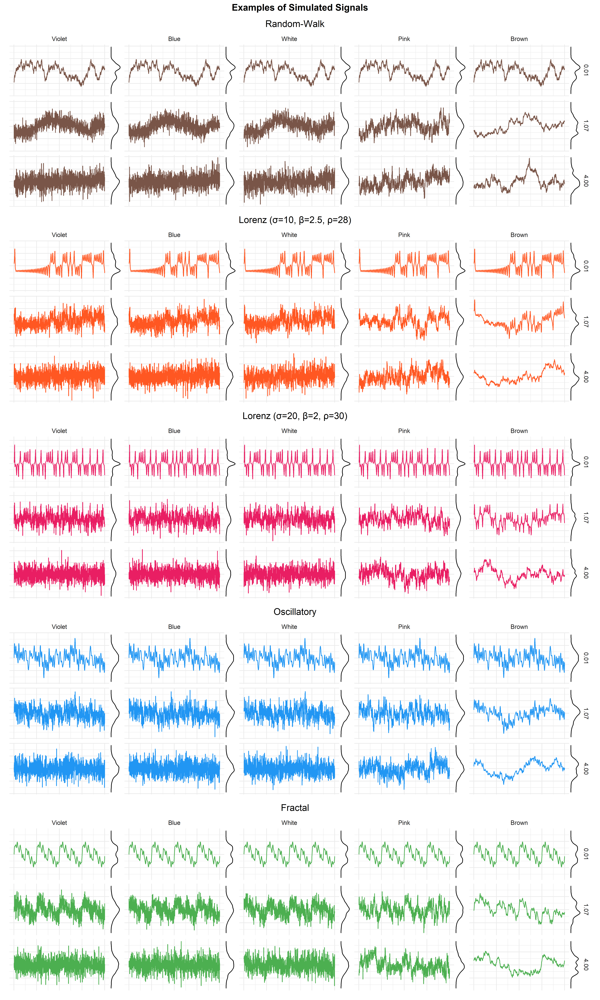
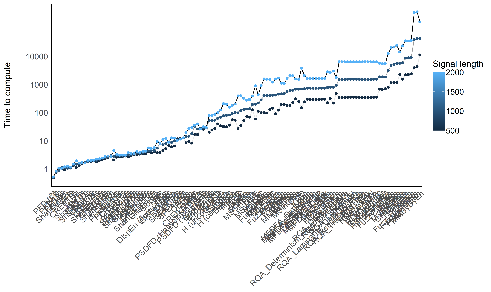
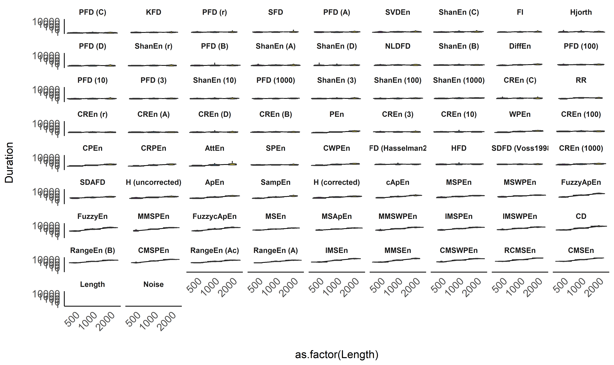
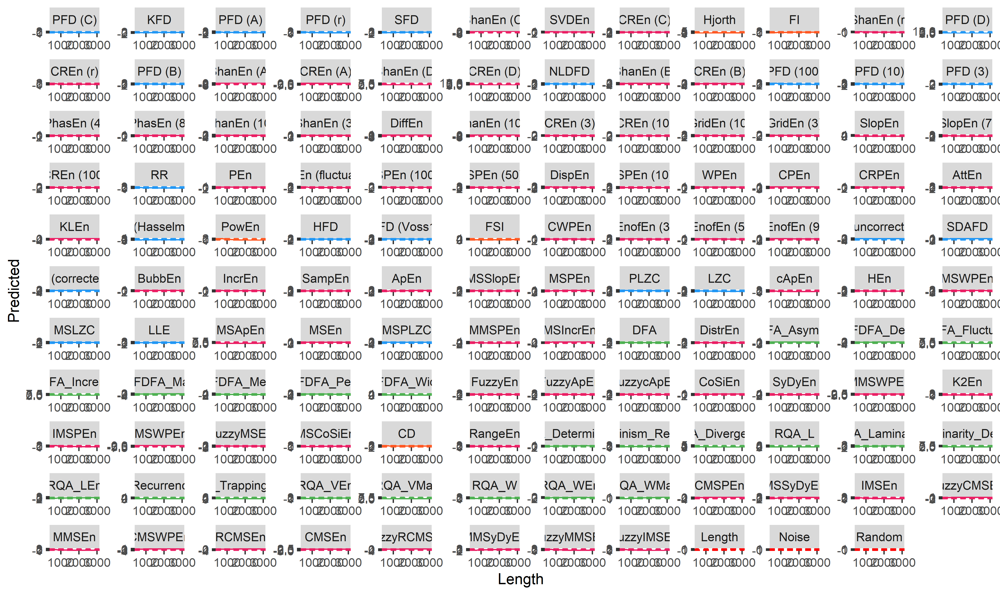
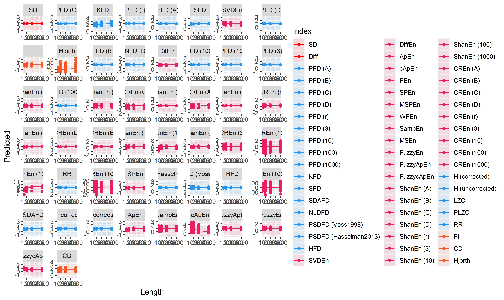
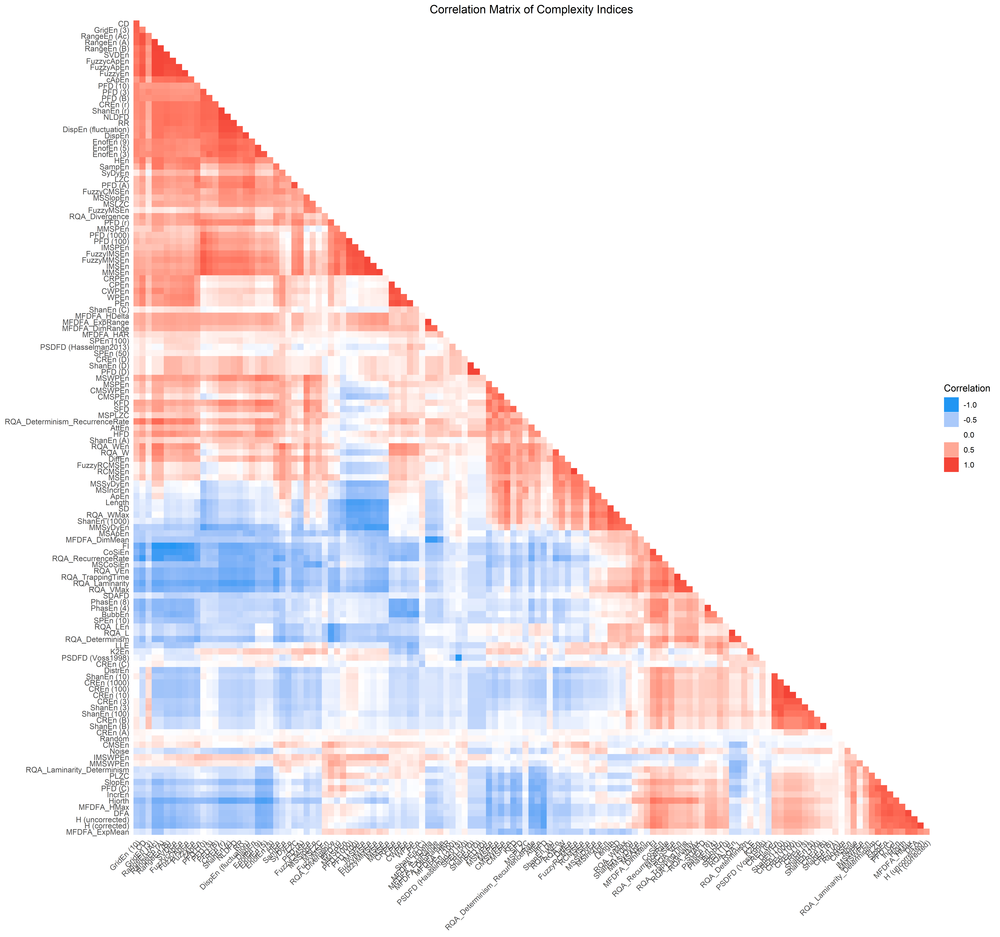

<!-- # Benchmarking and Analysis of Complexity Measures -->

# Measuring Chaos: Complexity and Fractal Physiology using NeuroKit2

*This study can be referenced by* [*citing the package and the
documentation*](https://neuropsychology.github.io/NeuroKit/cite_us.html).

**We’d like to improve this study, but unfortunately we currently don’t
have the time. If you want to help to make it happen, please contact
us!**

## Introduction

The goal for NeuroKit is to provide the most comprehensive, accurate and
fastest base Python implementations of complexity indices (fractal
dimension, entropy, etc.).

## Methods

### Data Generation

The script to generate the data can be found at …

``` r
library(tidyverse)
library(easystats)
library(patchwork)

df <- read.csv("data_Signals.csv") |> 
  mutate(Method = as.factor(Method),
         Noise = as.factor(Noise),
         Intensity = as.factor(insight::format_value(Noise_Intensity)))

df <- df |> 
  filter(Intensity %in% levels(df$Intensity)[c(1, round(length(levels(df$Intensity)) / 2), length(levels(df$Intensity)))])

p1 <- df |>
  filter(Method == "Random-Walk") |> 
  ggplot(aes(x = Duration, y = Signal)) + 
  geom_line(color = "red") +
  facet_grid(Intensity ~ Noise, labeller = label_both) +
  labs(y = NULL, title = "Random-Walk") +
  theme_minimal() +
  theme(plot.title = element_text(hjust = 0.5)) 

p2 <- df |>
  filter(Method == "lorenz_10_2.5_28") |> 
  ggplot(aes(x = Duration, y = Signal)) + 
  geom_line(color = "blue") +
  facet_grid(Intensity ~ Noise, labeller = label_both) +
  labs(y = NULL, title = "Lorenz (sigma=10, beta=2.5, rho=28)") +
  theme_minimal() +
  theme(plot.title = element_text(hjust = 0.5)) 

p1 / p2 + patchwork::plot_annotation(title = "Examples of Simulated Signals", theme = theme(plot.title = element_text(face = "bold", hjust = 0.5)))
```

<!-- -->

## Results

### Average Computation Time

``` r
df <- read.csv("data_Complexity.csv") |> 
  mutate(Method = as.factor(Method))

colors = c("PFD (A)" = "#2196F3", 
           "PFD (B)" = "#2196F3", 
           "PFD (C)" = "#2196F3", 
           "PFD (D)" = "#2196F3")
```

``` r
order <- df |> 
  group_by(Index) |> 
  summarize(Duration = median(Duration)) |> 
  arrange(Duration) |> 
  mutate(Index = factor(Index, levels = Index))

df <- mutate(df, Index = fct_relevel(Index, as.character(order$Index)))

df |> 
  ggplot(aes(x = Index, y = Duration)) +
  # geom_violin(aes(fill = Index)) +
  ggdist::stat_slab(side = "bottom", aes(fill = Index), adjust = 3) +
  ggdist::stat_dotsinterval(aes(fill = Index, slab_size = NA)) +
  theme_modern() +
  scale_y_log10() +
  scale_fill_manual(values = colors, guide = "none") +
  theme(axis.text.x = element_text(angle = 45, vjust = 1, hjust=1)) +
  labs(x = NULL, y = "Computation Time")
```

<!-- -->

### Sensitivity to Signal Length

#### Visualization

``` r
dfsummary <- df |>
  group_by(Index, Length) |>
  summarize(CI_low = median(Duration) - sd(Duration),
            CI_high = median(Duration) + sd(Duration),
            Duration = median(Duration))
dfsummary$CI_low[dfsummary$CI_low < 0] <- 0


ggplot(dfsummary, aes(x = Index, y = Duration)) + 
  # geom_hline(yintercept = c(0.001, 0.01, 0.1, 1), linetype = "dotted") +
  geom_line(aes(alpha = Length, group = Length)) +
  geom_point(aes(color = Length)) + 
  theme_modern() +
  scale_y_log10(breaks = c(0.001, 0.01, 0.1, 1)) +
  theme(axis.text.x = element_text(angle = 45, vjust = 1, hjust=1)) +
  guides(alpha = "none") +
  labs(y = "Time to compute", x = NULL, color = "Signal length")
```

<!-- -->

#### Average

``` r
df |> 
  ggplot(aes(x = as.factor(Length), y = Duration)) +
  # geom_hline(yintercept = c(0.001, 0.01, 0.1, 1), linetype = "dotted") +
  geom_line(data=dfsummary, aes(group = 1)) +
  geom_violin(aes(fill = Length)) +
  facet_wrap(~Index) +
  scale_y_log10(breaks = c(0.001, 0.01, 0.1, 1)) +
  scale_fill_viridis_c(guide = "none") +
  theme_modern() +
  theme(axis.text.x = element_text(angle = 45, vjust = 1, hjust=1))
```

<!-- -->

#### Model-based

``` r
model <- lm(Result ~ Index / poly(Length, 2), data = df)

parameters::parameters(model, keep = "poly") |> 
  arrange(desc(abs(Coefficient)))
## Parameter                          | Coefficient |       SE |         95% CI | t(468) |      p
## ----------------------------------------------------------------------------------------------
## Index [PFD (A)] * poly(Length, 2)1 |       -0.06 | 3.66e-03 | [-0.07, -0.06] | -17.40 | < .001
## Index [PFD (B)] * poly(Length, 2)1 |       -0.04 | 3.66e-03 | [-0.05, -0.04] | -11.84 | < .001
## Index [PFD (A)] * poly(Length, 2)2 |        0.03 | 3.66e-03 | [ 0.03,  0.04] |   8.85 | < .001
## Index [PFD (B)] * poly(Length, 2)2 |        0.02 | 3.66e-03 | [ 0.02,  0.03] |   6.09 | < .001
## Index [PFD (C)] * poly(Length, 2)1 |       -0.01 | 3.66e-03 | [-0.02,  0.00] |  -3.22 | 0.001 
## Index [PFD (C)] * poly(Length, 2)2 |    8.30e-03 | 3.66e-03 | [ 0.00,  0.02] |   2.27 | 0.024 
## Index [PFD (D)] * poly(Length, 2)2 |    6.73e-05 | 3.66e-03 | [-0.01,  0.01] |   0.02 | 0.985 
## Index [PFD (D)] * poly(Length, 2)1 |   -6.18e-05 | 3.66e-03 | [-0.01,  0.01] |  -0.02 | 0.987

estimate_relation(model) |> 
  ggplot(aes(x = Length, y = Predicted)) +
  geom_ribbon(aes(ymin = CI_low, ymax = CI_high, fill = Index), alpha = 0.1) +
  geom_line(aes(color = Index)) +
  geom_point(data = df, aes(y = Result, color = Index)) + 
  scale_fill_manual(values = colors) +
  scale_color_manual(values = colors) +
  facet_wrap(~Index, scales = "free")
```

<!-- -->

### Correlation

``` r
data <- df |> 
  mutate(i = paste(Signal, Length, Noise, Noise_Intensity, sep = "__")) |> 
  select(i, Index, Result) |> 
  pivot_wider(names_from = "Index", values_from = "Result") |> 
  select(-i)

cor <- correlation::correlation(data, method = "spearman") |> 
  cor_sort()

cor |> 
  mutate(Text = insight::format_value(rho),
         Parameter2 = fct_rev(Parameter2)) |> 
  ggplot(aes(x = Parameter2, y=Parameter1)) +
  geom_tile(aes(fill = rho)) +
  geom_text(aes(label = Text)) +
  scale_fill_gradient2(low = '#2196F3', mid = 'white', high = '#F44336', midpoint = 0, limit = c(-1, 1), space = 'Lab', name = 'Correlation', guide = 'legend') +
  scale_x_discrete(expand = c(0, 0)) +
  scale_y_discrete(expand = c(0, 0)) +
  labs(title = "Correlation Matrix of Complexity Indices", x = NULL, y = NULL) +
  theme_minimal() +
  theme(axis.text.x = element_text(angle=45, hjust = 1),
        plot.title = element_text(hjust = 0.5),
        panel.grid.major = element_blank(), 
        panel.grid.minor = element_blank()) 
```

<!-- -->

### Hierarchical CLustering

``` r
rez <- parameters::cluster_analysis(as.data.frame(t(data)), n=4, method="hclust", hclust_method="ward.D2")
# plot(rez)

attributes(rez)$model |> 
  plot(hang = -1)
```

<!-- -->

## References
