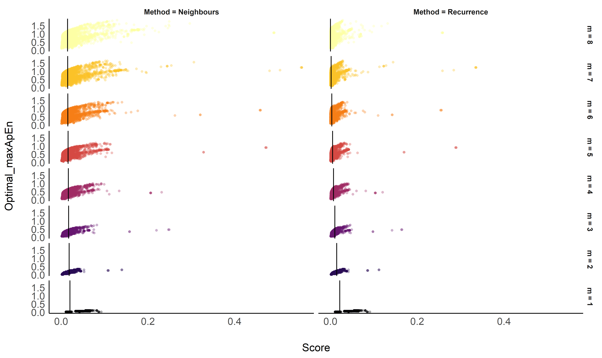
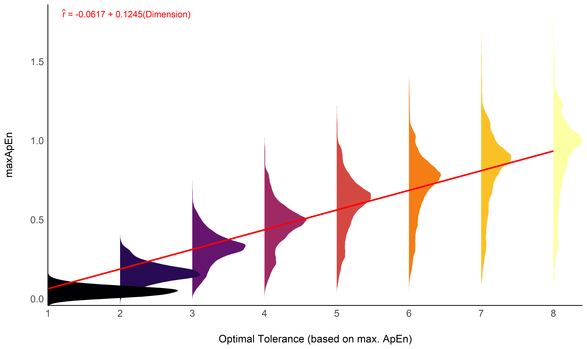

Optimal Selection of Tolerance *r* for Entropy Indices
================


*This study can be referenced by* [*citing the package and the
documentation*](https://neuropsychology.github.io/NeuroKit/cite_us.html).

**We’d like to improve this study, but unfortunately we currently don’t
have the time. If you want to help to make it happen, please contact
us!**

## Introduction

The choice of the parameters required to compute complexity indices
(such as entropy), such as the delay
,
the embedding dimension *m*, and the tolerance *r* are critical to
capture the space in which complexity becomes accurately quantifiable.
Unfortunately, despite the existence of methods to estimate optimal
values for these parameters depending on the signal at hand, their
choice often relies on simple heuristics or cargo-cult conventions.

Such is the case of the tolerance threshold *r*, which is often selected
as a function of the standard deviation (SD) of the signal, with
(in)famous magic values including

or

(Pincus & Viscarello, 1992). One of the reason for the longevity of such
approach is 1) past literature (as many past studies used it, it becomes
easier to justify the choice of the same values) and 2) the fact that
other approaches to estimate the optimal *r* are computationally costly.

The aim is to investigate the relationship between different methods for
tolerance *r* optimization. The ground-truth method used was the
tolerance value corresponding to a maximal value of Approximate Entropy
*ApEn* (Chen et al., 2008; Chon et al., 2009; Lu et al., 2008). As this
method is computationally expensive, the goal was to see whether any
heuristic proxies can be used to approximate this value.

## Methods

For a combination of different signals types, noise types and
intensities and lengths, we computed 3 different scores as a function of
difference tolerance values (expressed in SDs of the signal): *ApEn*,
the recurrence rate *RR*, and the average number of nearest neighbours
*NN*.

``` r
library(tidyverse)
library(easystats)
library(patchwork)

df <- data.frame()
for(i in 1:8) {
  df <- rbind(df, read.csv(paste0("data_Tolerance_part", i, ".csv")))
}

df <- df |>
  mutate(Iter = paste0(Signal, Noise_Intensity, Noise_Type, Length)) |>
  group_by(Method, Dimension, Iter) |>
  mutate(Score_N = normalize(Score)) |>
  ungroup()
```

``` r
df |>
  mutate(group = paste0(Dimension, Method, Iter),
         m = Dimension) |>
  filter(Method %in% c("ApEn", "Recurrence", "Neighbours")) |>
  ggplot(aes(x = Tolerance, y = Score_N, color = Method)) +
  geom_line(aes(group=group), alpha=0.02, size=0.33) +
  facet_wrap(~m, labeller=purrr::partial(label_both, sep = " = ")) +
  scale_x_continuous(expand=c(0, 0)) +
  scale_y_continuous(expand=c(0, 0)) +
  theme_modern() +
  theme(strip.text = element_text(face="italic")) +
  labs(y = "Normalized Value", x = expression("Tolerance "~italic("r"))) +
  guides(colour = guide_legend(override.aes = list(alpha = 1)))
```

<!-- -->

As expected, the value of *ApEn* peaks at certain values of *r*, and the
location of this peak seems strongly related to the embedding dimension
*m*. The goal of the analysis is to 1) establish cut-offs for *RR* and
*NN* that would approximate the location of the *ApEn* peak, 2)
establish a new heuristic (called the *NeuroKit* method) based on SD and
Dimension and 3) compare all of these approximations with the
ground-truth optimal value and other existing heuristics such as *0.2
SD*, *Chon* (Chon et al., 2009) and *nolds*.

## Results

### Cut-offs for RR and NN

``` r
library(ggside)

data <- df |>
  group_by(Dimension, Length, Iter) |>
  filter(Method %in% c("Recurrence", "Neighbours")) |>
  filter(Tolerance == unique(Optimal_maxApEn)) |>
  ungroup()


m_NN <- lm(Score ~ log(Dimension), data=filter(data, Method=="Neighbours"))

# plot(estimate_relation(m_NN)) + coord_cartesian(ylim = c(0, 0.05))
```

``` r
m_RR <- lm(Score ~ log(Dimension), data=filter(data, Method=="Recurrence", Dimension>1))

# plot(estimate_relation(m_RR)) + coord_cartesian(ylim = c(0, 0.05))
```

``` r
m <- lm(Score ~ Method / log(Dimension), data=data)
means <- m |>
  estimate_means(at=list("Method" = unique(data$Method),
                         "Dimension" = unique(data$Dimension))) |>
  mutate(m = as.factor(Dimension))

data |>
  mutate(m = fct_rev(as.factor(Dimension))) |>
  ggplot(aes(y = Optimal_maxApEn, x = Score)) +
  geom_point2(aes(color=m), alpha=0.33) +
  geom_vline(data=means, aes(xintercept=Mean, group=Dimension)) +
  facet_grid(m ~ Method, labeller=purrr::partial(label_both, sep = " = ")) +
  theme_modern() +
  scale_color_viridis_d(option="inferno", direction=-1) +
  guides(color="none")
```

<!-- -->

In general, *NN* and *RR* doesn’t seem to be good indices to approximate
.
Cut-offs of 1% and 2% are a possible option.

)
")

)
")

### Development of NeuroKit Approximation

``` r
library(ggridges)

data <- df |>
  group_by(Dimension, Length, Iter) |>
  summarise(maxApEn = mean(Optimal_maxApEn, na.rm=TRUE))

m1 <- lm(maxApEn ~ Dimension, data=data)
m2 <- lm(maxApEn ~ log(Dimension), data=data)
test_performance(m1, m2)
## Name | Model |      BF
## ----------------------
## m1   |    lm |
## m2   |    lm | < 0.001
## Each model is compared to m1.

m <- m1
pred <- estimate_relation(m, at = list("Dimension"=unique(data$Dimension)))

formula <- equatiomatic::extract_eq(m,
                                    raw_tex=T,
                                    swap_var_names=c("maxApEn" = "r"),
                                    use_coefs = TRUE,
                                    ital_vars=TRUE,
                                    coef_digits=4)

data |>
  mutate(Dimension = as.factor(Dimension),
         Length = as.factor(Length)) |>
  ggplot(aes(x=maxApEn, y=Dimension)) +
  geom_density_ridges(aes(fill=Dimension), color = NA) +
  geom_line(data=pred, aes(x=Predicted), color="red", size=1, show.legend=FALSE) +
  annotate(geom="text", x=1.8, y=1.2, label=latex2exp::TeX(formula), hjust=0, color="red") +
  coord_flip() +
  scale_fill_viridis_d(option="inferno") +
  scale_x_continuous(expand=c(0, 0)) +
  scale_y_discrete(expand=c(0, 0)) +
  theme_modern() +
  guides(fill="none", group="none") +
  labs(y = "Optimal Tolerance (based on max. ApEn)")
```

<!-- -->

We can see that selecting the tolerance based as a function of SD alone
does not make sense, as the dimension is strongly related to it. Based
on a simple regression model, we can derive the following approximation:


")

Interestingly, for a dimension *m* of 2, this equation approximates *0.2
SD* (which was derived initially under this condition).

### Heuristics Test

``` r
data <- df |>
  group_by(Dimension, Length, Iter) |>
  summarise(maxApEn = mean(Optimal_maxApEn, na.rm=TRUE),
            Recurrence = mean(Optimal_Recurrence, na.rm=TRUE),
            Neighbours = mean(Optimal_Neighbours, na.rm=TRUE),
            SD = mean(Optimal_SD, na.rm=TRUE),
            SDadj = mean(Optimal_SDadj, na.rm=TRUE),
            Chon = mean(Optimal_Chon, na.rm=TRUE),
            NeuroKit = mean(Optimal_NeuroKit, na.rm=TRUE))

m1 <- lm(maxApEn ~ SD, data=data)
m2 <- lm(maxApEn ~ SDadj, data=data)
m3 <- lm(maxApEn ~ Recurrence, data=data)
m4 <- lm(maxApEn ~ Neighbours, data=data)
m5 <- lm(maxApEn ~ Chon, data=data)
m6 <- lm(maxApEn ~ NeuroKit, data=data)

compare_performance(m1, m2, m3, m4, m5, m6)
## # Comparison of Model Performance Indices
##
## Name | Model |        AIC | AIC weights |        BIC | BIC weights |    R2 | R2 (adj.) |  RMSE | Sigma
## ------------------------------------------------------------------------------------------------------
## m1   |    lm |  33613.471 |     < 0.001 |  33631.158 |     < 0.001 | 0.000 |     0.000 | 0.336 | 0.336
## m2   |    lm | -24959.346 |     < 0.001 | -24932.816 |     < 0.001 | 0.681 |     0.681 | 0.190 | 0.190
## m3   |    lm | -61079.172 |     < 0.001 | -61052.642 |     < 0.001 | 0.843 |     0.843 | 0.133 | 0.133
## m4   |    lm | -63724.621 |        1.00 | -63698.091 |        1.00 | 0.851 |     0.851 | 0.130 | 0.130
## m5   |    lm |  24952.343 |     < 0.001 |  24978.874 |     < 0.001 | 0.156 |     0.156 | 0.309 | 0.309
## m6   |    lm | -31051.122 |     < 0.001 | -31024.592 |     < 0.001 | 0.717 |     0.717 | 0.179 | 0.179
```

In order to approximate
,
the best two methods were cut-offs points of recurrence rate *RR* and of
the number of nearest neighbours *NN*. However, these two methods are
very computationally expensive (*RR* even surpassing max. ApEn), casting
doubt on their practical usefulness.

From the fast methods that rely only on the signal’s SD and the
embedding dimension *m*, the *NeuroKit* method was the best (R2 = 0.72),
followed by the *nolds* adjustment, and the *0.2 SD* rule of thumb. The
*Chon* method garnered the least evidence in our data.

## Discussion

Number of neighbours and recurrence rate does not seem to be good
proxies of the optimal tolerance *r* as estimated by max. ApEn. We have
developed an approximation based on the signal’s SD, its length and the
embedding dimension, which can be used as an alternative to the *0.2 SD*
rule of thumb. The new method is implemented in the *NeuroKit2* Python
package (Makowski et al., 2021).

## References

<div id="refs" class="references csl-bib-body hanging-indent"
line-spacing="2">

<div id="ref-chen2008parameter" class="csl-entry">

Chen, X., Solomon, I., & Chon, K. (2008). Parameter selection criteria
in approximate entropy and sample entropy with application to neural
respiratory signals. *Am. J. Physiol. Regul. Integr. Comp. Physiol., To
Be Published*.

</div>

<div id="ref-chon2009approximate" class="csl-entry">

Chon, K. H., Scully, C. G., & Lu, S. (2009). Approximate entropy for all
signals. *IEEE Engineering in Medicine and Biology Magazine*, *28*(6),
18–23.

</div>

<div id="ref-lu2008automatic" class="csl-entry">

Lu, S., Chen, X., Kanters, J. K., Solomon, I. C., & Chon, K. H. (2008).
Automatic selection of the threshold value

for approximate entropy. *IEEE Transactions on Biomedical Engineering*,
*55*(8), 1966–1972.

</div>

<div id="ref-makowski2021neurokit2" class="csl-entry">

Makowski, D., Pham, T., Lau, Z. J., Brammer, J. C., Lespinasse, F.,
Pham, H., Schölzel, C., & Chen, S. (2021). NeuroKit2: A python toolbox
for neurophysiological signal processing. *Behavior Research Methods*,
*53*(4), 1689–1696.

</div>

<div id="ref-pincus1992approximate" class="csl-entry">

Pincus, S. M., & Viscarello, R. R. (1992). Approximate entropy: A
regularity measure for fetal heart rate analysis. *Obstetrics and
Gynecology*, *79*(2), 249–255.

</div>

</div>
