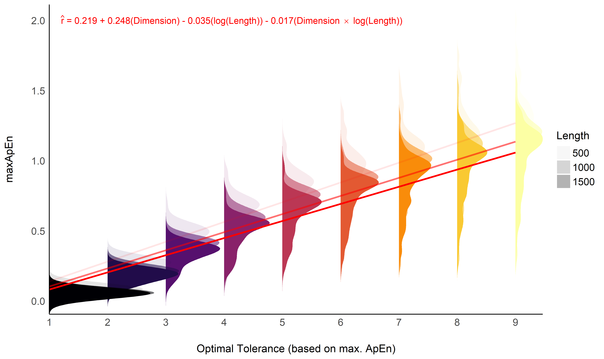
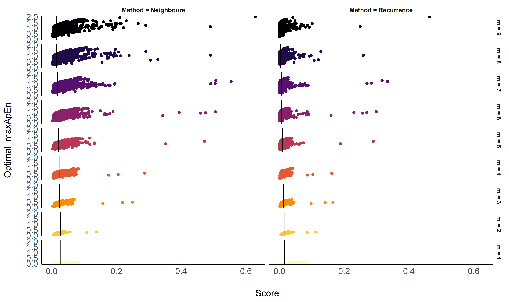

Optimal Selection of Tolerance *r* for Entropy Indices
================

-   [Introduction](#introduction)
-   [Methods](#methods)
-   [Results](#results)
    -   [Relationship between Existing Optimization
        Methods](#relationship-between-existing-optimization-methods)
    -   [Relationship between max. ApEn and
        SD](#relationship-between-max-apen-and-sd)
    -   [Relationship between max. ApEn and the other
        methods](#relationship-between-max-apen-and-the-other-methods)
-   [Discussion](#discussion)
-   [References](#references)

*This study can be referenced by* [*citing the package and the
documentation*](https://neuropsychology.github.io/NeuroKit/cite_us.html).

**We’d like to improve this study, but unfortunately we currently don’t
have the time. If you want to help to make it happen, please contact
us!**

## Introduction

The choice of the parameters required to compute complexity indices
(such as entropy), such as the delay
,
the embedding dimension *m*, and the tolerance *r* are critical to
capture the space in which complexity becomes accurately quantifiable.
Unfortunately, despite the existence of methods to estimate optimal
values for these parameters depending on the signal at hand, their
choice often relies on simple heuristics or cargo-cult conventions.

Such is the case of the tolerance threshold *r*, which is often selected
as a function of the standard deviation (SD) of the signal, with
(in)famous magic values including

or

(Pincus & Viscarello, 1992). One of the reason for the longevity of such
approach is 1) past literature (as many past studies used it, it becomes
easier to justify the choice of the same values) and 2) the fact that
other approaches to estimate the optimal *r* are computationally costly.

The aim is to investigate the relationship between different methods for
tolerance *r* optimization. The ground-truth method is max. ApEn (Chen
et al., 2008) (Lu et al., 2008)

## Methods

``` r
library(tidyverse)
library(easystats)
library(patchwork)

df <- read.csv("data_Tolerance.csv") |> 
  mutate(Iter = paste0(Signal, Noise_Intensity, Noise_Type, Length)) |> 
  group_by(Method, Dimension, Iter) |> 
  mutate(Score_N = normalize(Score)) |> 
  ungroup()
```

## Results

### Relationship between Existing Optimization Methods

We visualize the normalized values of the 3 methods as a function of the
tolerance *r*.

``` r
df |> 
  mutate(group = paste0(Dimension, Method, Iter),
         m = Dimension) |> 
  filter(Method %in% c("ApEn", "Recurrence", "Neighbours")) |> 
  ggplot(aes(x = Tolerance, y = Score_N, color = Method)) +
  geom_line(aes(group=group), alpha=0.05, size=0.5) +
  facet_wrap(~m, labeller=purrr::partial(label_both, sep = " = ")) +
  scale_x_continuous(expand=c(0, 0)) +
  scale_y_continuous(expand=c(0, 0)) +
  theme_modern() + 
  theme(strip.text = element_text(face="italic")) +
  labs(y = "Normalized Value", x = expression("Tolerance "~italic("r"))) +
  guides(colour = guide_legend(override.aes = list(alpha = 1)))
```

<!-- -->

### Relationship between max. ApEn and SD

``` r
library(ggridges)

data <- df |> 
  group_by(Dimension, Length, Iter) |> 
  summarise(maxApEn = mean(Optimal_maxApEn, na.rm=TRUE)) 

# data |> 
#   mutate(Dimension = as.factor(Dimension)) |> 
#   estimate_density(method="kernSmooth", at = "Dimension") |> 
#   group_by(Dimension) |> 
#   mutate(y = normalize(y)) |> 
#   ggplot(aes(x=x, y=y)) +
#   geom_line(aes(color = Dimension, group=Dimension)) +
#   geom_vline(xintercept=0.4, linetype="dotted")


m1 <- lm(maxApEn ~ Dimension * Length, data=data)
m2 <- lm(maxApEn ~ log(Dimension) * Length, data=data)
m3 <- lm(maxApEn ~ Dimension * log(Length), data=data)
m4 <- lm(maxApEn ~ log(Dimension) * log(Length), data=data)
test_performance(m1, m2, m3, m4)
## Name | Model |      BF
## ----------------------
## m1   |    lm |        
## m2   |    lm | < 0.001
## m3   |    lm |  > 1000
## m4   |    lm | < 0.001
## Each model is compared to m1.

m1 <- lm(maxApEn ~ Dimension * log(Length), data=data)
m2 <- lm(maxApEn ~ Dimension + log(Length), data=data)
test_performance(m1, m2)
## Name | Model |      BF | df | df_diff |   Chi2 |      p
## -------------------------------------------------------
## m1   |    lm |         |  5 |         |        |       
## m2   |    lm | < 0.001 |  4 |   -1.00 | 130.59 | < .001
## Models were detected as nested and are compared in sequential order.

m <- m1
pred <- estimate_relation(m, at = list("Dimension"=unique(data$Dimension),
                                        "Length" = unique(data$Length)))

formula <- equatiomatic::extract_eq(m, 
                                    raw_tex=T, 
                                    swap_var_names=c("maxApEn" = "r"),
                                    use_coefs = TRUE, 
                                    ital_vars=TRUE, 
                                    coef_digits=3)
# formula <- paste0(
#   format_value(coef(m1)[1], 2),
#   " + ", 
#   format_value(coef(m1)[2], 2),
#   "m ",
#   format_value(coef(m1)[3], 2),
#   "log(N) ",
#   format_value(coef(m1)[4], 2),
#   "m * log(N)")
  
data |> 
  mutate(Dimension = as.factor(Dimension),
         Length = as.factor(Length)) |> 
  ggplot(aes(x=maxApEn, y=Dimension)) +
  geom_density_ridges(aes(fill=Dimension, alpha=Length), color = NA) + 
  geom_line(data=pred, aes(x=Predicted, group=Length, alpha=as.factor(Length)), color="red", size=1, show.legend=FALSE) +
  annotate(geom="text", x=2, y=1.2, label=latex2exp::TeX(formula), hjust=0, color="red") +
  coord_flip() +
  scale_fill_viridis_d(option="inferno") +
  scale_x_continuous(expand=c(0, 0)) +
  scale_y_discrete(expand=c(0, 0)) +
  theme_modern() +
  guides(fill="none", group="none") +
  labs(y = "Optimal Tolerance (based on max. ApEn)")
```

<!-- -->
We can conclude that selecting the tolerance based as a function of SD
does not make sense if the dimension is not taken into account.

 - 0.035(\log(Length)) - 0.017(Dimension \times \log(Length))
")

### Relationship between max. ApEn and the other methods

``` r
library(ggside)

data <- data.frame()
for(m in unique(df$Dimension)) {
  for (signal in unique(df$Iter)) {
    dat <- df[df$Iter == signal & df$Dimension == m, ]
    dat <- dat[dat$Tolerance == unique(dat$Optimal_maxApEn), ]
    dat <- dat[dat$Method %in% c("Recurrence", "Neighbours"), ]
    data <- rbind(data, dat)
  }
}

m <- MASS::rlm(Score ~ Method / Dimension * Length, data=data) 
parameters(m)
## Parameter                                | Coefficient |       SE |         95% CI | t(21592) |      p
## ------------------------------------------------------------------------------------------------------
## (Intercept)                              |        0.04 | 5.26e-04 | [ 0.04,  0.04] |    77.56 | < .001
## Method [Recurrence]                      |   -6.06e-03 | 7.44e-04 | [-0.01,  0.00] |    -8.14 | < .001
## Length                                   |   -1.54e-05 | 4.87e-07 | [ 0.00,  0.00] |   -31.59 | < .001
## Method [Neighbours] * Dimension          |   -9.77e-04 | 9.35e-05 | [ 0.00,  0.00] |   -10.45 | < .001
## Method [Recurrence] * Dimension          |   -3.92e-03 | 9.35e-05 | [ 0.00,  0.00] |   -41.90 | < .001
## Method [Recurrence] * Length             |    2.97e-06 | 6.89e-07 | [ 0.00,  0.00] |     4.32 | < .001
## Method [Neighbours] * Dimension * Length |    1.47e-07 | 8.66e-08 | [ 0.00,  0.00] |     1.70 | 0.089 
## Method [Recurrence] * Dimension * Length |    1.30e-06 | 8.66e-08 | [ 0.00,  0.00] |    14.98 | < .001
m <- MASS::rlm(Score ~ Method / Dimension, data=data) 
m <- MASS::rlm(Score ~ Method + Dimension, data=data) 

means <- m |> 
  estimate_means(at=list("Method" = unique(data$Method), 
                         "Dimension" = unique(data$Dimension))) |> 
  mutate(m = as.factor(Dimension))

data |> 
  mutate(m = fct_rev(as.factor(Dimension))) |>
  ggplot(aes(y = Optimal_maxApEn, x = Score)) +
  geom_point(aes(color=m)) +
  # geom_density_ridges(aes(group = paste(Method, Optimal_maxApEn), fill=Method)) +
  geom_vline(data=means, aes(xintercept=Mean, group=Dimension)) +
  facet_grid(m ~ Method, labeller=purrr::partial(label_both, sep = " = ")) +
  theme_modern() +
  scale_color_viridis_d(option="inferno") +
  guides(color="none")
```

<!-- -->


")


")

## Discussion

Number of neighbours and recurrence rate does not seem to be good
proxies of the optimal tolerance *r* as estimated by max. ApEn.

## References

<div id="refs" class="references csl-bib-body hanging-indent"
line-spacing="2">

<div id="ref-chen2008parameter" class="csl-entry">

Chen, X., Solomon, I., & Chon, K. (2008). Parameter selection criteria
in approximate entropy and sample entropy with application to neural
respiratory signals. *Am. J. Physiol. Regul. Integr. Comp. Physiol., To
Be Published*.

</div>

<div id="ref-lu2008automatic" class="csl-entry">

Lu, S., Chen, X., Kanters, J. K., Solomon, I. C., & Chon, K. H. (2008).
Automatic selection of the threshold value

for approximate entropy. *IEEE Transactions on Biomedical Engineering*,
*55*(8), 1966–1972.

</div>

<div id="ref-pincus1992approximate" class="csl-entry">

Pincus, S. M., & Viscarello, R. R. (1992). Approximate entropy: A
regularity measure for fetal heart rate analysis. *Obstetrics and
Gynecology*, *79*(2), 249–255.

</div>

</div>
