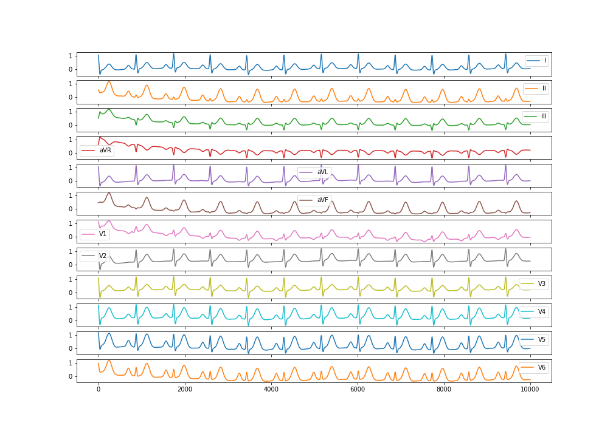
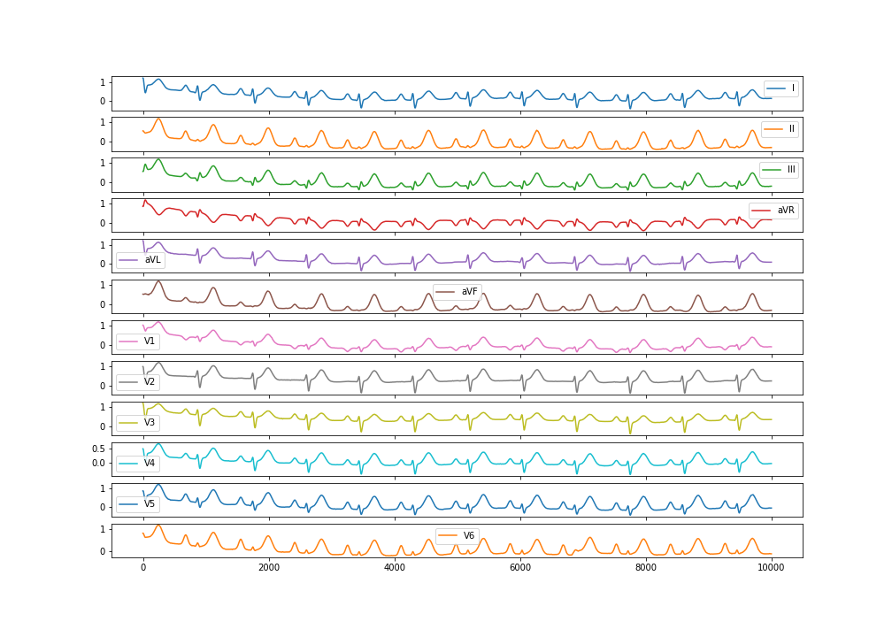

# Generating Normal and Abnormal 12-leads Synthetic ECG Data

## Normal Multi-lead ECG

We can generate a normal multi-lead ECG signal with the following code:

```python
import numpy as np
import neurokit2 as nk

ecg12 = nk.ecg_simulate(duration=10, method="multileads")

# Visualize results
ecg12[0:10000].plot(subplots=True)
```



## Abnormal Multi-lead ECG

Abnormal ECG can be generated by modifying the simulation parameters. We will draw random parameters from a distribution.

```python
# Normal parameters (used by default)
# ===================================
# t, the starting position along the circle of each interval in radius
ti = np.array((-70, -15, 0, 15, 100))
# a, the amplitude of each spike
ai = np.array((1.2, -5, 30, -7.5, 0.75))
# b, the width of each spike
bi = np.array((0.25, 0.1, 0.1, 0.1, 0.4))

# Add noise
# ===============
ti = np.random.normal(ti, np.ones(5) * 3)
ai = np.random.normal(ai, np.abs(ai / 5))
bi = np.random.normal(ai, np.abs(bi / 5))

ecg12 = nk.ecg_simulate(duration=10, method="multileads", ti=ti, ai=ai, bi=bi)

# Visualize results
ecg12[0:10000].plot(subplots=True)
```


## Explanation


For a better understanding of the above parameters, please read the following.


We can see from the above table that each interval in the 3D trajectory can be fixed by 3 parameters:

- `ti`: The starting position $\theta_i/t_i$ along the circle of each interval in radius
- `ai`: The amplitude of each spike a
- `bi`: The width of each wave b. By altering these 3 parameters we can change the shape of the 3D trajectory and thus change the waveform of the resulting ECG.


**Prebuilt Synthetic Data**
Prebuilt synthetic data can be found at the following link
https://drive.google.com/drive/folders/1iqyAlyHAvNWdOvjEGn8Y6C8kItsdZ_GC?usp=sharing


