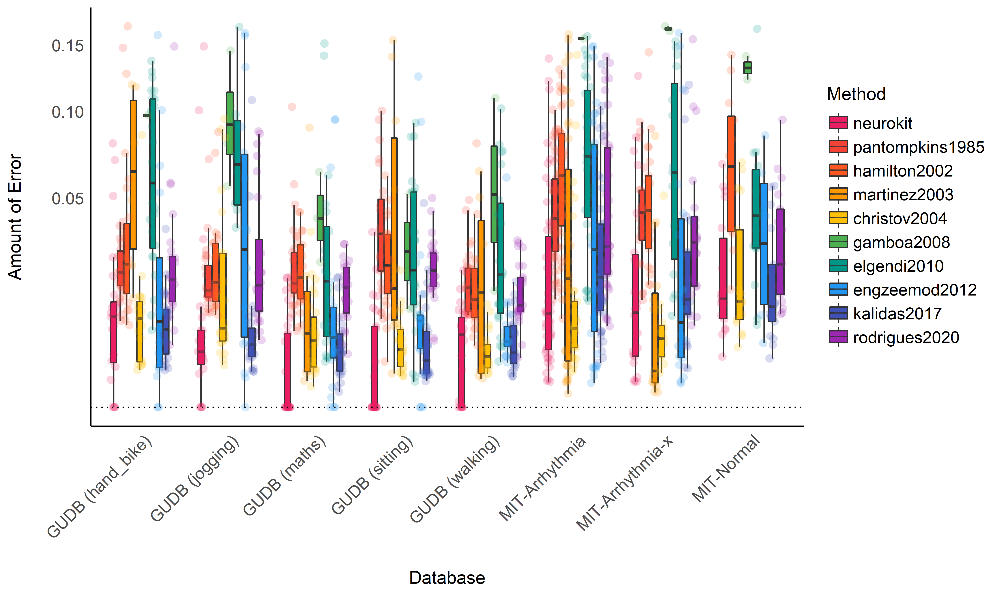
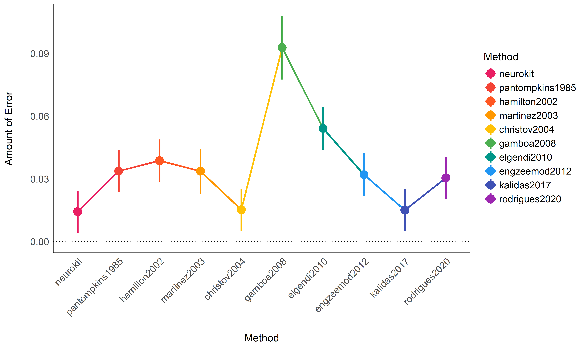
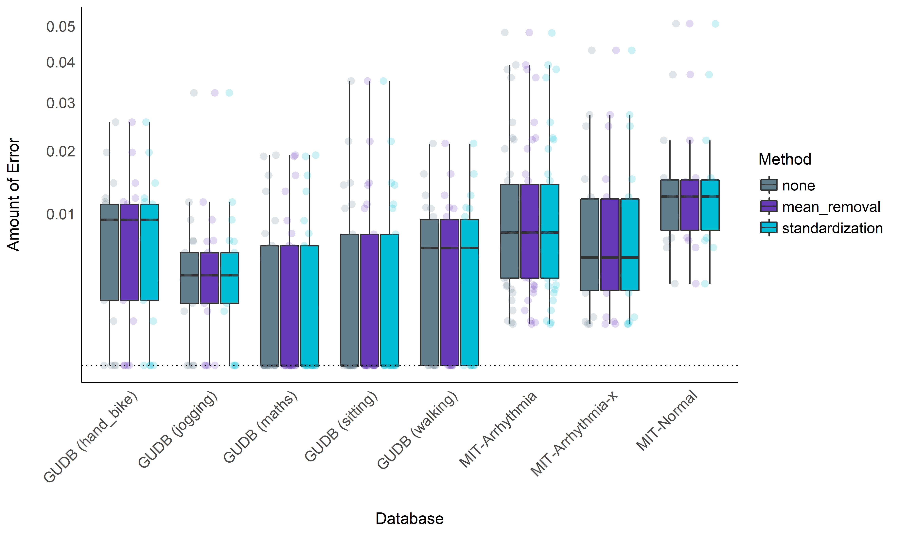
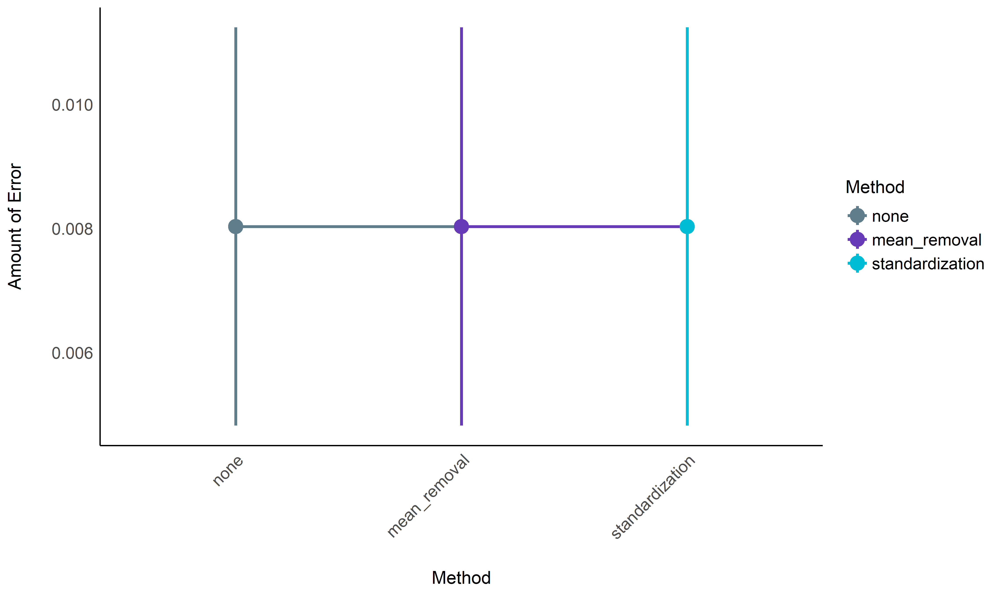

# Benchmarking of ECG Preprocessing Methods

<em>This study can be referenced by <a href="https://github.com/neuropsychology/NeuroKit#citation">citing the package</a></em>.

**We'd like to publish this study, but unfortunately we currently don't have the time. If you want to help to make it happen, please contact us!**

## Introduction

This work is a replication and extension of the work by Porr & Howell
(2019), that compared the performance of different popular R-peak
detectors.

## Databases

### Glasgow University Database

The GUDB Database (Howell & Porr, 2018) contains ECGs from 25 subjects.
Each subject was recorded performing 5 different tasks for two minutes
(sitting, doing a maths test on a tablet, walking on a treadmill,
running on a treadmill, using a hand bike). The sampling rate is 250Hz
for all the conditions.

The script to download and format the database using the
<b><a href="https://github.com/berndporr/ECG-GUDB">ECG-GUDB</a></b> Python package by
Bernd Porr can be found
<b><a href="https://github.com/neuropsychology/NeuroKit/blob/dev/data/gudb/download_gudb.py">here</a></b>.

### MIT-BIH Arrhythmia Database

The MIT-BIH Arrhythmia Database (MIT-Arrhythmia; Moody & Mark, 2001)
contains 48 excerpts of 30-min of two-channel ambulatory ECG recordings
sampled at 360Hz and 25 additional recordings from the same participants
including common but clinically significant arrhythmias (denoted as the
`MIT-Arrhythmia-x` database).

The script to download and format the database using the can be found
<b><a href="https://github.com/neuropsychology/NeuroKit/blob/dev/data/mit_arrhythmia/download_mit_arrhythmia.py">here</a></b>.

<!-- ### MIT-BIH Noise Stress Test Database -->

<!-- The MIT-BIH Noise Stress Test Database [MIT-NST; @moody1984bih] features two 30-minute recordings distorted by adding different types and levels of synthesized noise typical of electrode motion artefacts. -->

### MIT-BIH Normal Sinus Rhythm Database

This database includes 18 clean long-term ECG recordings of subjects.
Due to memory limits, we only kept the second hour of recording of each
participant.

The script to download and format the database using the can be found
<b><a href="https://github.com/neuropsychology/NeuroKit/blob/dev/data/mit_normal/download_mit_normal.py">here</a></b>.

<!-- ### Lobachevsky University Electrocardiography Database -->

<!-- The Lobachevsky University Electrocardiography Database [LUDB; @kalyakulina2018lu] consists of 200 10-second 12-lead ECG signal records representing different morphologies of the ECG signal. The ECGs were collected from healthy volunteers and patients. The patients had various cardiovascular diseases while some of them had pacemakers.  -->

### Concanate them together

``` python
import pandas as pd

# Load ECGs
ecgs_gudb = pd.read_csv("../../data/gudb/ECGs.csv")
ecgs_mit1 = pd.read_csv("../../data/mit_arrhythmia/ECGs.csv")
ecgs_mit2 = pd.read_csv("../../data/mit_normal/ECGs.csv")

# Load True R-peaks location
rpeaks_gudb = pd.read_csv("../../data/gudb/Rpeaks.csv")
rpeaks_mit1 = pd.read_csv("../../data/mit_arrhythmia/Rpeaks.csv")
rpeaks_mit2 = pd.read_csv("../../data/mit_normal/Rpeaks.csv")

# Concatenate
ecgs = pd.concat([ecgs_gudb, ecgs_mit1, ecgs_mit2], ignore_index=True)
rpeaks = pd.concat([rpeaks_gudb, rpeaks_mit1, rpeaks_mit2], ignore_index=True)
```

## Study 1: Comparing Different R-Peaks Detection Algorithms

### Procedure

#### Setup Functions

``` python
import neurokit2 as nk

def neurokit(ecg, sampling_rate):
    signal, info = nk.ecg_peaks(ecg, sampling_rate=sampling_rate, method="neurokit")
    return info["ECG_R_Peaks"]

def pantompkins1985(ecg, sampling_rate):
    signal, info = nk.ecg_peaks(ecg, sampling_rate=sampling_rate, method="pantompkins1985")
    return info["ECG_R_Peaks"]
    
def hamilton2002(ecg, sampling_rate):
    signal, info = nk.ecg_peaks(ecg, sampling_rate=sampling_rate, method="hamilton2002")
    return info["ECG_R_Peaks"]
    
def martinez2003(ecg, sampling_rate):
    signal, info = nk.ecg_peaks(ecg, sampling_rate=sampling_rate, method="martinez2003")
    return info["ECG_R_Peaks"]
    
def christov2004(ecg, sampling_rate):
    signal, info = nk.ecg_peaks(ecg, sampling_rate=sampling_rate, method="christov2004")
    return info["ECG_R_Peaks"]
    
def gamboa2008(ecg, sampling_rate):
    signal, info = nk.ecg_peaks(ecg, sampling_rate=sampling_rate, method="gamboa2008")
    return info["ECG_R_Peaks"]

def elgendi2010(ecg, sampling_rate):
    signal, info = nk.ecg_peaks(ecg, sampling_rate=sampling_rate, method="elgendi2010")
    return info["ECG_R_Peaks"]
    
def engzeemod2012(ecg, sampling_rate):
    signal, info = nk.ecg_peaks(ecg, sampling_rate=sampling_rate, method="engzeemod2012")
    return info["ECG_R_Peaks"]
    
def kalidas2017(ecg, sampling_rate):
    signal, info = nk.ecg_peaks(ecg, sampling_rate=sampling_rate, method="kalidas2017")
    return info["ECG_R_Peaks"]
    
def rodrigues2020(ecg, sampling_rate):
    signal, info = nk.ecg_peaks(ecg, sampling_rate=sampling_rate, method="rodrigues2020")
    return info["ECG_R_Peaks"]
```

#### Run the Benchmarking

*Note: This takes a long time (several hours).*

``` python
results = []
for method in [neurokit, pantompkins1985, hamilton2002, martinez2003, christov2004, 
               gamboa2008, elgendi2010, engzeemod2012, kalidas2017, rodrigues2020]:
    result = nk.benchmark_ecg_preprocessing(method, ecgs, rpeaks)
    result["Method"] = method.__name__
    results.append(result)
results = pd.concat(results).reset_index(drop=True)

results.to_csv("data_detectors.csv", index=False)
```

### Results

``` r
library(tidyverse)
library(easystats)
library(lme4)

data <- read.csv("data_detectors.csv", stringsAsFactors = FALSE) %>% 
  mutate(Database = ifelse(str_detect(Database, "GUDB"), paste0(str_replace(Database, "GUDB_", "GUDB ("), ")"), Database),
         Method = fct_relevel(Method, "neurokit", "pantompkins1985", "hamilton2002", "martinez2003", "christov2004", "gamboa2008", "elgendi2010", "engzeemod2012", "kalidas2017", "rodrigues2020"),
         Participant = paste0(Database, Participant))

colors <- c("neurokit"="#E91E63", "pantompkins1985"="#f44336", "hamilton2002"="#FF5722", "martinez2003"="#FF9800", "christov2004"="#FFC107", "gamboa2008"="#4CAF50", "elgendi2010"="#009688", "engzeemod2012"="#2196F3", "kalidas2017"="#3F51B5", "rodrigues2020"="#9C27B0") 
```

#### Errors and bugs

``` r
data %>% 
  mutate(Error = case_when(
    Error == "index -1 is out of bounds for axis 0 with size 0" ~ "index -1 out of bounds",
    Error == "index 0 is out of bounds for axis 0 with size 0" ~ "index 0 out of bounds",
    TRUE ~ Error)) %>% 
  group_by(Database, Method) %>% 
  mutate(n = n()) %>% 
  group_by(Database, Method, Error) %>% 
  summarise(Percentage = n() / unique(n)) %>% 
  ungroup() %>% 
  mutate(Error = fct_relevel(Error, "None")) %>% 
  ggplot(aes(x=Error, y=Percentage, fill=Method)) +
    geom_bar(stat="identity", position = position_dodge2(preserve = "single")) +
    facet_wrap(~Database, nrow=2) +
    theme_modern() +
    theme(axis.text.x = element_text(angle = 45, hjust = 1)) +
    scale_fill_manual(values=colors)
```

<!-- -->

**Conclusion:** It seems that `gamboa2008` and `martinez2003` are
particularly prone to errors, especially in the case of a noisy ECG
signal. Aside from that, the other algorithms are quite resistant and
bug-free.

``` r
data <- filter(data, Error == "None")
data <- filter(data, !is.na(Score))
```

#### Computation Time

##### Descriptive Statistics

``` r
# Normalize duration
data <- data %>% 
  mutate(Duration = (Duration) / (Recording_Length * Sampling_Rate)) 

data %>% 
  ggplot(aes(x=Method, y=Duration, fill=Method)) +
    geom_jitter2(aes(color=Method, group=Database), size=3, alpha=0.2, position=position_jitterdodge()) +
    geom_boxplot(aes(alpha=Database), outlier.alpha = 0) +
    geom_hline(yintercept=0, linetype="dotted") +
    theme_modern() +
    theme(axis.text.x = element_text(angle = 45, hjust = 1)) +
    scale_alpha_manual(values=seq(0, 1, length.out=8)) +
    scale_color_manual(values=colors) +
    scale_fill_manual(values=colors) +
    scale_y_sqrt() +
    ylab("Duration (seconds per data sample)")
```

<!-- -->

<!-- ```{r, warning=FALSE, message=FALSE} -->

<!-- # Interaction time and recording length -->

<!-- data %>%  -->

<!--   ggplot(aes(x=Recording_Length, y=Duration, color=Method)) + -->

<!--     geom_jitter(aes(shape=Database), size=3, alpha=0.7) + -->

<!--     geom_smooth(method="lm", se = FALSE) + -->

<!--     theme_modern() + -->

<!--     theme(axis.text.x = element_text(angle = 45, hjust = 1)) + -->

<!--     scale_color_manual(values=colors) + -->

<!--     scale_fill_manual(values=colors) + -->

<!--     scale_y_sqrt() -->

<!-- ``` -->

##### Statistical Modelling

``` r
model <- lmer(Duration ~ Method + (1|Database) + (1|Participant), data=data)

means <- modelbased::estimate_means(model)

arrange(means, Mean)
##             Method     Mean       SE    CI_low  CI_high
## 1       gamboa2008 8.47e-06 9.34e-06 -9.98e-06 2.69e-05
## 2         neurokit 2.08e-05 7.20e-06  6.43e-06 3.52e-05
## 3     martinez2003 4.68e-05 8.00e-06  3.09e-05 6.27e-05
## 4      kalidas2017 7.77e-05 7.19e-06  6.33e-05 9.20e-05
## 5    rodrigues2020 1.17e-04 7.20e-06  1.03e-04 1.32e-04
## 6     hamilton2002 1.51e-04 7.19e-06  1.36e-04 1.65e-04
## 7    engzeemod2012 5.33e-04 7.24e-06  5.19e-04 5.47e-04
## 8  pantompkins1985 5.96e-04 7.19e-06  5.82e-04 6.11e-04
## 9      elgendi2010 9.26e-04 7.19e-06  9.12e-04 9.41e-04
## 10    christov2004 1.32e-03 7.19e-06  1.31e-03 1.34e-03

means %>% 
  ggplot(aes(x=Method, y=Mean, color=Method)) +
  geom_line(aes(group=1), size=1) +
  geom_pointrange(aes(ymin=CI_low, ymax=CI_high), size=1) +
  geom_hline(yintercept=0, linetype="dotted") +
  theme_modern() +
  theme(axis.text.x = element_text(angle = 45, hjust = 1)) +
  scale_color_manual(values=colors) +
    ylab("Duration (seconds per data sample)")
```

<!-- -->

**Conclusion:** It seems that `gamboa2008` and `neurokit` are the
fastest methods, followed by `martinez2003`, `kalidas2017`,
`rodrigues2020` and `hamilton2002`. The other methods are then
substantially slower.

#### Accuracy

**Note:** The accuracy is computed as the absolute distance from the
original “true” R-peaks location. As such, the closest to zero, the
better the accuracy.

##### Descriptive Statistics

``` r
data <- data %>% 
  mutate(Outlier = performance::check_outliers(Score, threshold = list(zscore = stats::qnorm(p = 1 - 0.000001)))) %>% 
  filter(Outlier == 0)

data %>% 
  ggplot(aes(x=Database, y=Score)) +
    geom_boxplot(aes(fill=Method), outlier.alpha = 0, alpha=1) +
    geom_jitter2(aes(color=Method, group=Method), size=3, alpha=0.2, position=position_jitterdodge()) +
    geom_hline(yintercept=0, linetype="dotted") +
    theme_modern() +
    theme(axis.text.x = element_text(angle = 45, hjust = 1)) +
    scale_color_manual(values=colors) +
    scale_fill_manual(values=colors) +
    scale_y_sqrt() +
    ylab("Amount of Error") 
```

<!-- -->

##### Statistical Modelling

``` r
model <- lmer(Score ~ Method + (1|Database) + (1|Participant), data=data)

means <- modelbased::estimate_means(model)

arrange(means, abs(Mean))
##             Method   Mean      SE  CI_low CI_high
## 1         neurokit 0.0143 0.00448 0.00424  0.0244
## 2      kalidas2017 0.0151 0.00448 0.00500  0.0251
## 3     christov2004 0.0152 0.00455 0.00507  0.0253
## 4    rodrigues2020 0.0304 0.00449 0.02037  0.0405
## 5    engzeemod2012 0.0320 0.00462 0.02180  0.0422
## 6     martinez2003 0.0337 0.00507 0.02290  0.0445
## 7  pantompkins1985 0.0338 0.00453 0.02364  0.0439
## 8     hamilton2002 0.0387 0.00450 0.02865  0.0488
## 9      elgendi2010 0.0541 0.00459 0.04397  0.0643
## 10      gamboa2008 0.0928 0.00768 0.07750  0.1081

means %>% 
  ggplot(aes(x=Method, y=Mean, color=Method)) +
  geom_line(aes(group=1), size=1) +
  geom_pointrange(aes(ymin=CI_low, ymax=CI_high), size=1) +
  geom_hline(yintercept=0, linetype="dotted") +
  theme_modern() +
  theme(axis.text.x = element_text(angle = 45, hjust = 1)) +
  scale_color_manual(values=colors) +
    ylab("Amount of Error") 
```

<!-- -->

**Conclusion:** It seems that `neurokit`, `kalidas2017` and
`christov2004` the most accurate algorithms to detect R-peaks. This
pattern of results differs a bit from Porr & Howell (2019) that outlines
`engzeemod2012`, `elgendi2010`, `kalidas2017` as the most accurate and
`christov2004`, `hamilton2002` and `pantompkins1985` as the worse.
Discrepancies could be due to the differences in data and analysis, as
here we used more databases and modelled them by respecting their
hierarchical structure using mixed models.

### Conclusion

Based on the accuracy / execution time criterion, it seems like
`neurokit` is the best R-peak detection method, followed by
`kalidas2017`.

## Study 2: Normalization

### Procedure

#### Setup Functions

``` python
import neurokit2 as nk

def none(ecg, sampling_rate):
    signal, info = nk.ecg_peaks(ecg, sampling_rate=sampling_rate, method="neurokit")
    return info["ECG_R_Peaks"]

def mean_detrend(ecg, sampling_rate):
    ecg = nk.signal_detrend(ecg, order=0)
    signal, info = nk.ecg_peaks(ecg, sampling_rate=sampling_rate, method="neurokit")
    return info["ECG_R_Peaks"]
    
def standardize(ecg, sampling_rate):
    ecg = nk.standardize(ecg)
    signal, info = nk.ecg_peaks(ecg, sampling_rate=sampling_rate, method="neurokit")
    return info["ECG_R_Peaks"]
```

#### Run the Benchmarking

*Note: This takes a long time (several hours).*

``` python
results = []
for method in [none, mean_detrend, standardize]:
    result = nk.benchmark_ecg_preprocessing(method, ecgs, rpeaks)
    result["Method"] = method.__name__
    results.append(result)
results = pd.concat(results).reset_index(drop=True)

results.to_csv("data_normalization.csv", index=False)
```

### Results

``` r
library(tidyverse)
library(easystats)
library(lme4)

data <- read.csv("data_normalization.csv", stringsAsFactors = FALSE) %>% 
  mutate(Database = ifelse(str_detect(Database, "GUDB"), paste0(str_replace(Database, "GUDB_", "GUDB ("), ")"), Database),
         Method = fct_relevel(Method, "none", "mean_removal", "standardization"),
         Participant = paste0(Database, Participant)) %>% 
  filter(Error == "None") %>% 
  filter(!is.na(Score))

colors <- c("none"="#607D8B", "mean_removal"="#673AB7", "standardization"="#00BCD4") 
```

#### Accuracy

##### Descriptive Statistics

``` r
data <- data %>% 
  mutate(Outlier = performance::check_outliers(Score, threshold = list(zscore = stats::qnorm(p = 1 - 0.000001)))) %>% 
  filter(Outlier == 0)

data %>% 
  ggplot(aes(x=Database, y=Score)) +
    geom_boxplot(aes(fill=Method), outlier.alpha = 0, alpha=1) +
    geom_jitter2(aes(color=Method, group=Method), size=3, alpha=0.2, position=position_jitterdodge()) +
    geom_hline(yintercept=0, linetype="dotted") +
    theme_modern() +
    theme(axis.text.x = element_text(angle = 45, hjust = 1)) +
    scale_color_manual(values=colors) +
    scale_fill_manual(values=colors) +
    scale_y_sqrt() +
    ylab("Amount of Error") 
```

<!-- -->

##### Statistical Modelling

``` r
model <- lmer(Score ~ Method + (1|Database) + (1|Participant), data=data)

modelbased::estimate_contrasts(model) 
## Level1       |          Level2 | Difference |       SE |                95% CI |    t |     df |     p | Difference (std.)
## --------------------------------------------------------------------------------------------------------------------------
## mean_removal |            none |   1.59e-07 | 5.20e-07 | [-0.00e+00, 0.00e+00] | 0.31 | 370.00 | 0.759 |          1.64e-05
## mean_removal | standardization |   7.75e-07 | 5.20e-07 | [-0.00e+00, 0.00e+00] | 1.49 | 370.00 | 0.410 |          7.99e-05
## none         | standardization |   6.15e-07 | 5.20e-07 | [-0.00e+00, 0.00e+00] | 1.18 | 370.00 | 0.474 |          6.34e-05

means <- modelbased::estimate_means(model)
arrange(means, abs(Mean))
##            Method    Mean      SE  CI_low CI_high
## 1 standardization 0.00803 0.00136 0.00482  0.0112
## 2            none 0.00803 0.00136 0.00482  0.0112
## 3    mean_removal 0.00803 0.00136 0.00482  0.0112

means %>% 
  ggplot(aes(x=Method, y=Mean, color=Method)) +
  geom_line(aes(group=1), size=1) +
  geom_pointrange(aes(ymin=CI_low, ymax=CI_high), size=1) +
  theme_modern() +
  theme(axis.text.x = element_text(angle = 45, hjust = 1)) +
  scale_color_manual(values=colors) +
    ylab("Amount of Error") 
```

<!-- -->

### Conclusion

No significant benefits added by normalization for the `neurokit`
method.

# References

<div id="refs" class="references">
    <div id="ref-howell2018high">
        Howell, L., & Porr, B. (2018). <em>High precision ecg database with
        annotated r peaks, recorded and filmed under realistic conditions</em>.
    </div>
    <div id="ref-moody2001impact">
        Moody, G. B., & Mark, R. G. (2001). The impact of the mit-bih arrhythmia
        database. <em>IEEE Engineering in Medicine and Biology Magazine</em>, <b>20</b>(3),
        45–50.
    </div>
    <div id="ref-porr2019r">
        Porr, B., & Howell, L. (2019). R-peak detector stress test with a new
        noisy ecg database reveals significant performance differences amongst
        popular detectors. <em>bioRxiv</em>, 722397.
    </div>
</div>