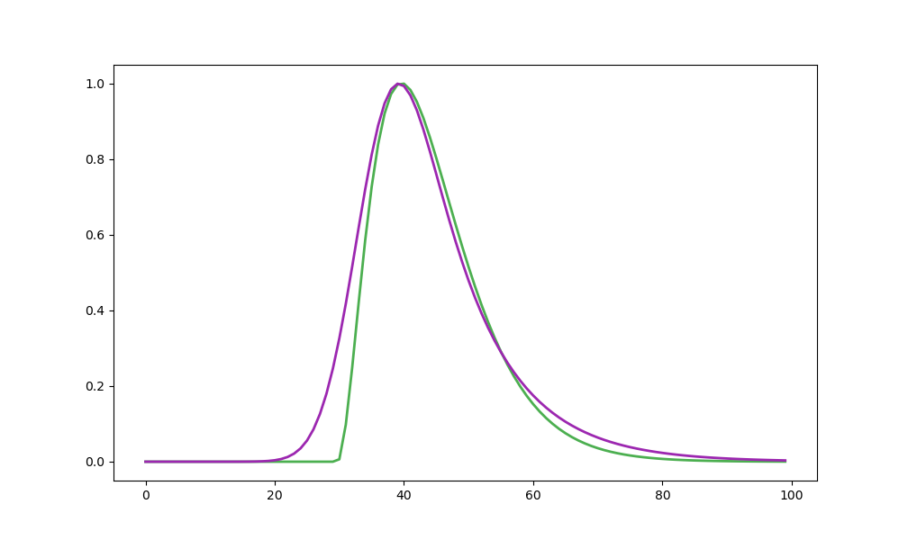
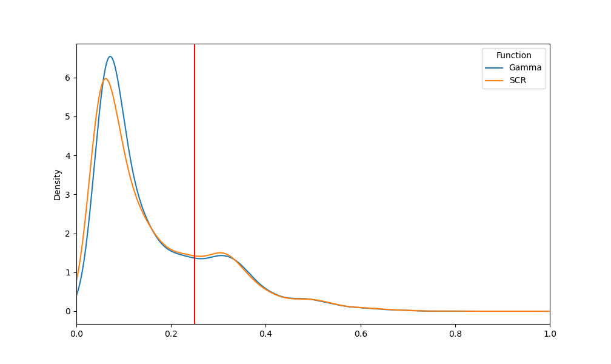
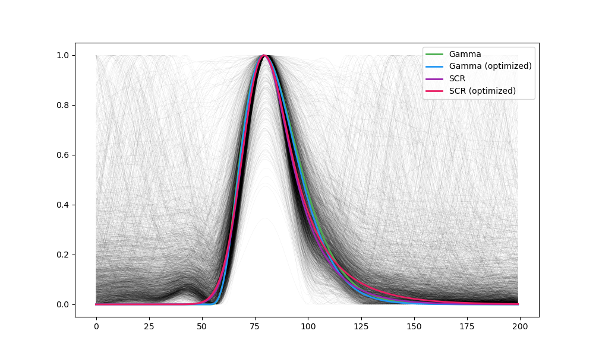
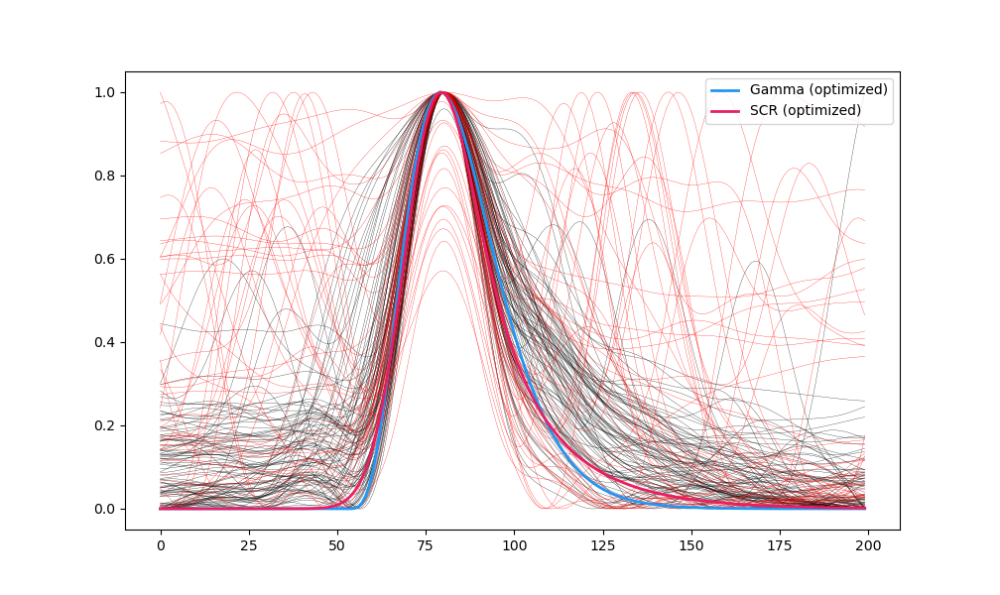

```{r, echo=FALSE, warning=FALSE, message=FALSE}
# options and parameters
options(digits=3)

knitr::opts_chunk$set(
  collapse = TRUE,
  dpi=450,
  fig.path = "../../studies/eog_blinktemplate/figures/"
)

# Setup python - you need to change the path to your python distribution
library(reticulate)
reticulate::use_python("D:/Downloads/WPy64-3810/python-3.8.1.amd64/")
matplotlib <- import("matplotlib", convert = TRUE)
# matplotlib$use("Agg", force = TRUE)
```


# Blink Template Estimation for Electrooculography (EOG)

*This study can be referenced by* [citing the package](https://github.com/neuropsychology/NeuroKit#citation).

**We'd like to publish this study, but unfortunately we currently don't have the time. If you want to help to make it happen, please contact us!**

## Introduction

The goal of this study is to identify a template for blinks in vertical EOG recordings. For this, we will optimize to candidate functions, a *Gamma* distribution and the *SCR* function proposed by @bach2010modelling to model skin conductance responses. 

In the first study, we will obtain the optimized parameters for a large numbers of "events" detected in the vEOG signal (for different subjects under different tasks), assuming that blinks are the prevalent type of detected events.

In the second study, we will see how these two blink templates (obtained from the optimized parameters of study 1 for the two functions) perform by computing their difference (RMSE) with each EOG event. The assumption is that not all of the detected events are blinks, and so we will observe a bi-modal distribution, with events closely matching the template and other events differing from them. 

In the third study, after identifying a reasonable RMSE threshold to identify and keep only the "blink"-like events, we will then re-optimize the functions parameters on this cleaner subset of events. 

## Study 1: Initial Estimation

### Methods

#### Define Functions

```{python, eval=TRUE, include=FALSE}
# This is temporary before the EOG PR is merged
import os
wd = os.getcwd()
os.chdir('../../')
import neurokit2 as nk
os.chdir(wd)
```


```{python results="hide"}
# import neurokit2 as nk
import numpy as np
import pandas as pd
import matplotlib.pyplot as plt
import scipy.signal


def fit_gamma(x, loc, a, scale):
    x = nk.rescale(x, to=[0, 10])
    gamma = scipy.stats.gamma.pdf(x, a=a, loc=loc, scale=scale)
    y = gamma / np.max(gamma)
    return y


def fit_scr(x, time_peak, rise, decay1, decay2):
    x = nk.rescale(x, to=[0, 10])
    gt = np.exp(-((x - time_peak) ** 2) / (2 * rise ** 2))
    ht = np.exp(-x / decay1) + np.exp(-x / decay2)

    ft = np.convolve(gt, ht)
    ft = ft[0 : len(x)]
    y = ft / np.max(ft)
    return y
    
# Starting parameters
plt.plot(fit_gamma(np.arange(100), 3, 3, 0.5), linewidth=2, linestyle='-', color="#4CAF50", label='Gamma')
plt.plot(fit_scr(np.arange(100), 3.5, 0.5, 1, 1), linewidth=2, linestyle='-', color="#9C27B0", label='SCR')
plt.savefig("figures/fig1.png")
plt.clf()
```


#### Optimize Parameters

The `eogdb` dataset is placed in the `NeuroKit/data/eogdb/` folder.

```{python, results="hide"}
params_gamma = pd.DataFrame(columns=["loc", "a", "scale", "Participant", "Task"])
params_scr = pd.DataFrame(columns=["time_peak", "rise", "decay1", "decay2", "Participant", "Task"])

for i in range(4):
    print("Task: " + str(i))

    data = pd.read_csv("../../data/eogdb/eogdb_task" + str(i + 1) + ".csv")

    for j, participant in enumerate(np.unique(data["Participant"])):
        print("  - " + str(j + 1))

        segment = data[data["Participant"] == participant]
        signal = segment["vEOG"]

        cleaned = nk.eog_clean(signal, sampling_rate=200, method='neurokit')
        blinks = nk.signal_findpeaks(cleaned, relative_height_min=1.5)["Peaks"]

        events = nk.epochs_create(cleaned, blinks, sampling_rate=200, epochs_start=-0.4, epochs_end=0.6)
        events = nk.epochs_to_array(events)  # Convert to 2D array

        x = np.linspace(0, 100, num=len(events))

        p_gamma = np.full((events.shape[1], 3), np.nan)
        p_bateman = np.full((events.shape[1], 3), np.nan)
        p_scr = np.full((events.shape[1], 4), np.nan)

        for i in range(events.shape[1]):
            if np.isnan(events[:, i]).any():
                break
            events[:, i] = nk.rescale(events[:, i], to=[0, 1])  # Reshape to 0-1 scale
            try:
                p_gamma[i, :], _ = scipy.optimize.curve_fit(fit_gamma, x, events[:, i], p0=[3, 3, 0.5])
                p_scr[i, :], _ = scipy.optimize.curve_fit(fit_scr, x, events[:, i], p0=[3.5, 0.5, 1, 1])
            except RuntimeError:
                pass

        p_gamma = pd.DataFrame(p_gamma[~np.isnan(p_gamma).any(axis=1)], columns=["loc", "a", "scale"])
        p_gamma["Participant"] = participant
        p_gamma["Task"] = data["Task"][0]
        params_gamma = pd.concat([params_gamma, p_gamma], axis=0)
        p_scr = pd.DataFrame(p_scr[~np.isnan(p_scr).any(axis=1)], columns=["time_peak", "rise", "decay1", "decay2"])
        p_scr["Participant"] = participant
        p_scr["Task"] = data["Task"][0]
        params_scr = pd.concat([params_scr, p_scr], axis=0)
```


### Results

Visualize the optimal templates for one task.

```{python, results="hide"}
data = pd.read_csv("../../data/eogdb/eogdb_task3.csv")
cleaned = nk.eog_clean(data["vEOG"], sampling_rate=200, method='neurokit')
blinks = nk.signal_findpeaks(cleaned, relative_height_min=1.5)["Peaks"][:-1]
events = nk.epochs_create(cleaned, blinks, sampling_rate=200, epochs_start=-0.4, epochs_end=0.6)
events = nk.epochs_to_array(events)

for i in range(events.shape[1]):
    events[:, i] = nk.rescale(events[:, i], to=[0, 1])  # Reshape to 0-1 scale

x = np.linspace(0, 100, num=len(events))
template_gamma = fit_gamma(x, *np.nanmedian(params_gamma.iloc[:, [0, 1, 2]], axis=0))
template_scr = fit_scr(x, *np.nanmedian(params_scr.iloc[:, [0, 1, 2, 3]], axis=0))

plt.plot(events, linewidth=0.02, color="black")
plt.plot(template_gamma, linewidth=2, linestyle='-', color="#4CAF50", label='Gamma')
plt.plot(template_scr, linewidth=2, linestyle='-', color="#9C27B0", label='SCR')
plt.legend(loc="upper right")
plt.savefig("figures/fig2.png")
plt.clf()
```


## Study 2: Difference between Template and EOG Events


### Methods


```{python, results="hide"}
data_rmse = pd.DataFrame(columns=["RMSE", "Index", "Participant", "Task", "Function"])
for i in range(4):
    data = pd.read_csv("../../data/eogdb/eogdb_task" + str(i + 1) + ".csv")

    for j, participant in enumerate(np.unique(data["Participant"])):
        segment = data[data["Participant"] == participant]
        signal = segment["vEOG"]

        cleaned = nk.eog_clean(signal, sampling_rate=200, method='neurokit')
        blinks = nk.signal_findpeaks(cleaned, relative_height_min=1.5)["Peaks"]

        events = nk.epochs_create(cleaned, blinks, sampling_rate=200, epochs_start=-0.4, epochs_end=0.6)
        events = nk.epochs_to_array(events)  # Convert to 2D array

        # Rescale
        for i in range(events.shape[1]):
            events[:, i] = nk.rescale(events[:, i], to=[0, 1])  # Reshape to 0-1 scale

        # RMSE - Gamma
        rmse = pd.DataFrame({"RMSE": [nk.fit_rmse(events[:, i], template_gamma) for i in range(events.shape[1])],
                             "Index": range(events.shape[1]),
                             "Participant": [participant]*events.shape[1],
                             "Task": [data["Task"][0]]*events.shape[1],
                             "Function": ["Gamma"] * events.shape[1]})
        rmse["Index"] = rmse["Participant"] + "_" + rmse["Task"] + "_" + rmse["Index"].astype(str)
        data_rmse = pd.concat([data_rmse, rmse], axis=0)

        # RMSE - SCR
        rmse = pd.DataFrame({"RMSE": [nk.fit_rmse(events[:, i], template_scr) for i in range(events.shape[1])],
                             "Index": range(events.shape[1]),
                             "Participant": [participant]*events.shape[1],
                             "Task": [data["Task"][0]]*events.shape[1],
                             "Function": ["SCR"] * events.shape[1]})
        rmse["Index"] = rmse["Participant"] + "_" + rmse["Task"] + "_" + rmse["Index"].astype(str)
        data_rmse = pd.concat([data_rmse, rmse], axis=0)
```


### Results

```{python, results="hide"}
p = data_rmse.pivot(index='Index', columns='Function', values='RMSE').plot.kde()
p.set_xlim(0, 1)
p.axvline(x=0.25, color="red")
plt.savefig("figures/fig3.png")
plt.clf()
```




## Study 3: Optimize the Parameters

###  Methods

```{python, results="hide"}
optimal_gamma = np.nanmedian(params_gamma.iloc[:, [0, 1, 2]], axis=0)
optimal_scr = np.nanmedian(params_scr.iloc[:, [0, 1, 2, 3]], axis=0)

params_gamma = pd.DataFrame(columns=["loc", "a", "scale", "Participant", "Task"])
params_scr = pd.DataFrame(columns=["time_peak", "rise", "decay1", "decay2", "Participant", "Task"])

for i in range(4):
    print("Task: " + str(i))
    data = pd.read_csv("../../data/eogdb/eogdb_task" + str(i + 1) + ".csv")

    for j, participant in enumerate(np.unique(data["Participant"])):
        print("  - " + str(j + 1))

        segment = data[data["Participant"] == participant]
        signal = segment["vEOG"]

        cleaned = nk.eog_clean(signal, sampling_rate=200, method='neurokit')
        blinks = nk.signal_findpeaks(cleaned, relative_height_min=1.5)["Peaks"]

        events = nk.epochs_create(cleaned, blinks, sampling_rate=200, epochs_start=-0.4, epochs_end=0.6)
        events = nk.epochs_to_array(events)  # Convert to 2D array

        x = np.linspace(0, 100, num=len(events))

        p_gamma = np.full((events.shape[1], 3), np.nan)
        p_scr = np.full((events.shape[1], 4), np.nan)

        for i in range(events.shape[1]):
            if np.isnan(events[:, i]).any():
                break
            events[:, i] = nk.rescale(events[:, i], to=[0, 1])  # Reshape to 0-1 scale

            if nk.fit_rmse(events[:, i], template_gamma) < 0.25:
                try:
                    p_gamma[i, :], _ = scipy.optimize.curve_fit(fit_gamma, x, events[:, i], p0=optimal_gamma)
                except RuntimeError:
                    pass

            if nk.fit_rmse(events[:, i], template_scr) < 0.25:
                try:
                    p_scr[i, :], _ = scipy.optimize.curve_fit(fit_scr, x, events[:, i], p0=optimal_scr)
                except RuntimeError:
                    pass

        p_gamma = pd.DataFrame(p_gamma[~np.isnan(p_gamma).any(axis=1)], columns=["loc", "a", "scale"])
        p_gamma["Participant"] = participant
        p_gamma["Task"] = data["Task"][0]
        params_gamma = pd.concat([params_gamma, p_gamma], axis=0)

        p_scr = pd.DataFrame(p_scr[~np.isnan(p_scr).any(axis=1)], columns=["time_peak", "rise", "decay1", "decay2"])
        p_scr["Participant"] = participant
        p_scr["Task"] = data["Task"][0]
        params_scr = pd.concat([params_scr, p_scr], axis=0)
```


```{python}
data_rmse = pd.DataFrame(columns=["RMSE", "Index", "Participant", "Task", "Function"])
for i in range(4):
    data = pd.read_csv("../../data/eogdb/eogdb_task" + str(i + 1) + ".csv")

    for j, participant in enumerate(np.unique(data["Participant"])):
        segment = data[data["Participant"] == participant]
        signal = segment["vEOG"]

        cleaned = nk.eog_clean(signal, sampling_rate=200, method='neurokit')
        blinks = nk.signal_findpeaks(cleaned, relative_height_min=1.5)["Peaks"]

        events = nk.epochs_create(cleaned, blinks, sampling_rate=200, epochs_start=-0.4, epochs_end=0.6)
        events = nk.epochs_to_array(events)  # Convert to 2D array

        # Rescale
        for i in range(events.shape[1]):
            events[:, i] = nk.rescale(events[:, i], to=[0, 1])  # Reshape to 0-1 scale

        # RMSE - Gamma
        rmse = pd.DataFrame({"RMSE": [nk.fit_rmse(events[:, i], template_gamma) for i in range(events.shape[1])],
                             "Index": range(events.shape[1]),
                             "Participant": [participant]*events.shape[1],
                             "Task": [data["Task"][0]]*events.shape[1],
                             "Function": ["Gamma"] * events.shape[1]})
        rmse["Index"] = rmse["Participant"] + "_" + rmse["Task"] + "_" + rmse["Index"].astype(str)
        data_rmse = pd.concat([data_rmse, rmse], axis=0)

        # RMSE - SCR
        rmse = pd.DataFrame({"RMSE": [nk.fit_rmse(events[:, i], template_scr) for i in range(events.shape[1])],
                             "Index": range(events.shape[1]),
                             "Participant": [participant]*events.shape[1],
                             "Task": [data["Task"][0]]*events.shape[1],
                             "Function": ["SCR"] * events.shape[1]})
        rmse["Index"] = rmse["Participant"] + "_" + rmse["Task"] + "_" + rmse["Index"].astype(str)
        data_rmse = pd.concat([data_rmse, rmse], axis=0)

df = data_rmse.pivot(index='Index', columns='Function', values='RMSE')
print(df.median(axis=0))
```


### Results


```{python, results="hide"}
data = pd.read_csv("../../data/eogdb/eogdb_task3.csv")
cleaned = nk.eog_clean(data["vEOG"], sampling_rate=200, method='neurokit')
blinks = nk.signal_findpeaks(cleaned, relative_height_min=1.5)["Peaks"]
events = nk.epochs_create(cleaned, blinks, sampling_rate=200, epochs_start=-0.4, epochs_end=0.6)
events = nk.epochs_to_array(events)
for i in range(events.shape[1]):
        events[:, i] = nk.rescale(events[:, i], to=[0, 1])  # Reshape to 0-1 scale

x = np.linspace(0, 100, num=len(events))
template_gamma2 = fit_gamma(x, *np.nanmedian(params_gamma.iloc[:, [0, 1, 2]], axis=0))
template_scr2 = fit_scr(x, *np.nanmedian(params_scr.iloc[:, [0, 1, 2, 3]], axis=0))

plt.plot(events, linewidth=0.02, color="black")
plt.plot(template_gamma, linewidth=2, linestyle='-', color="#4CAF50", label='Gamma')
plt.plot(template_gamma2, linewidth=2, linestyle='-', color="#2196F3", label='Gamma (optimized)')
plt.plot(template_scr, linewidth=2, linestyle='-', color="#9C27B0", label='SCR')
plt.plot(template_scr2, linewidth=2, linestyle='-', color="#E91E63", label='SCR (optimized)')
plt.legend(loc="upper right")
plt.savefig("figures/fig4.png")
plt.clf()
```



```{python, results="hide"}
data = pd.read_csv("../../data/eogdb/eogdb_task3.csv")
cleaned = nk.eog_clean(data[(data["Participant"] == "S1") | (data["Participant"] == "S2")]["vEOG"], sampling_rate=200, method='neurokit')
blinks = nk.signal_findpeaks(cleaned, relative_height_min=1.5)["Peaks"]
events = nk.epochs_create(cleaned, blinks, sampling_rate=200, epochs_start=-0.4, epochs_end=0.6)
events = nk.epochs_to_array(events)

for i in range(events.shape[1]):
        events[:, i] = nk.rescale(events[:, i], to=[0, 1])  # Reshape to 0-1 scale
rmse = np.array([nk.fit_rmse(events[:, i], template_gamma2) for i in range(events.shape[1])])

plt.plot(events[:, rmse < 0.25], linewidth=0.2, color="black")
plt.plot(events[:, rmse >= 0.25], linewidth=0.2, color="red")
plt.plot(template_gamma2, linewidth=2, linestyle='-', color="#2196F3", label='Gamma (optimized)')
plt.plot(template_scr2, linewidth=2, linestyle='-', color="#E91E63", label='SCR (optimized)')
plt.legend(loc="upper right")
plt.savefig("figures/fig5.png")
plt.clf()
```




The optimal blink template using a gamma distribution has the following parameters:

```{python}
gamma = np.nanmedian(params_gamma.iloc[:, [0, 1, 2]], axis=0)
print(
  "- location: " + str(np.round(gamma[0], 3)) +
  "\n- alpha: " + str(np.round(gamma[1], 3)) +
  "\n- scale: " + str(np.round(gamma[2], 3)))
```

The optimal blink template using the SCR function by @bach2010modelling has the following parameters:

```{python}
scr = np.nanmedian(params_scr.iloc[:, [0, 1, 2, 3]], axis=0)
print(
  "- time_peak: " + str(np.round(scr[0], 3)) +
  "\n- rise: " + str(np.round(scr[1], 3)) +
  "\n- decay1: " + str(np.round(scr[2], 3)) +
  "\n- decay2: " + str(np.round(scr[3], 3)))
```

## References
