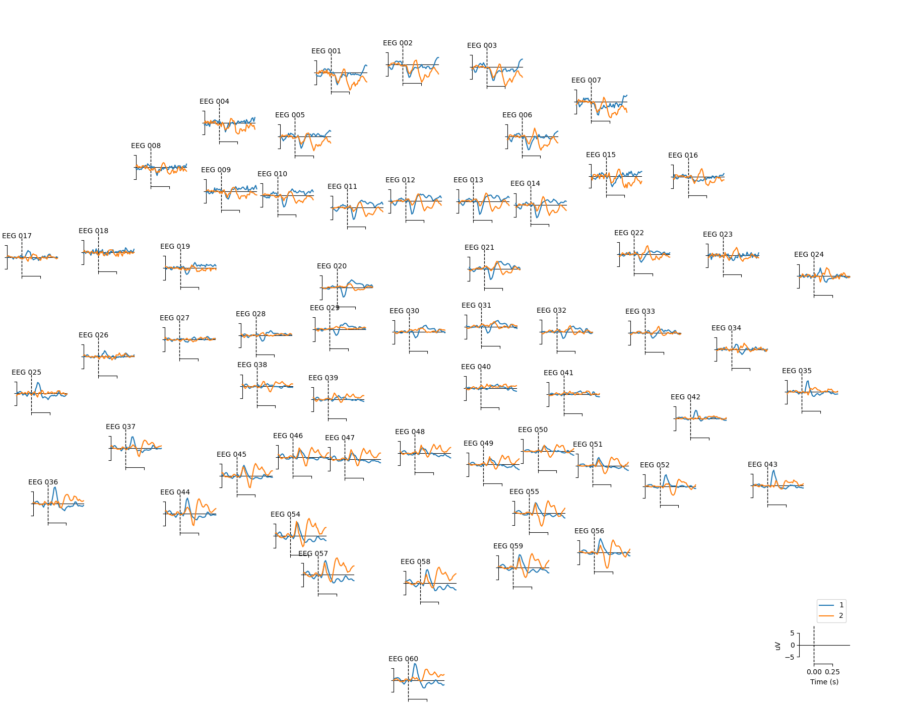
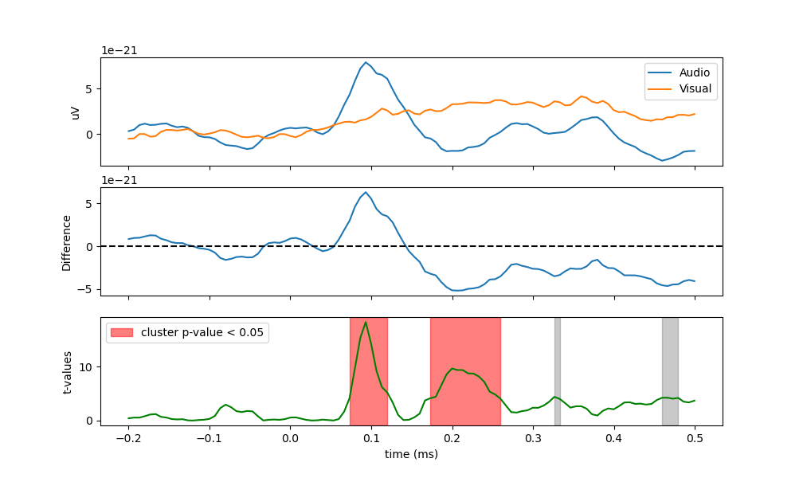
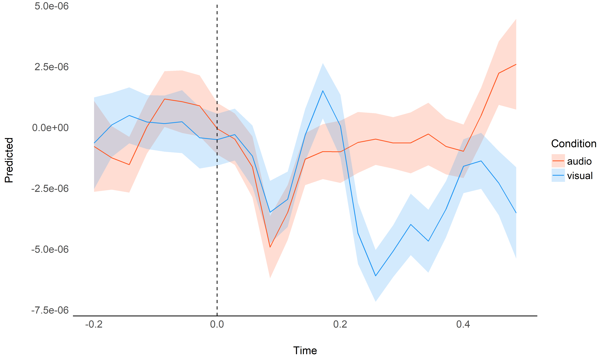
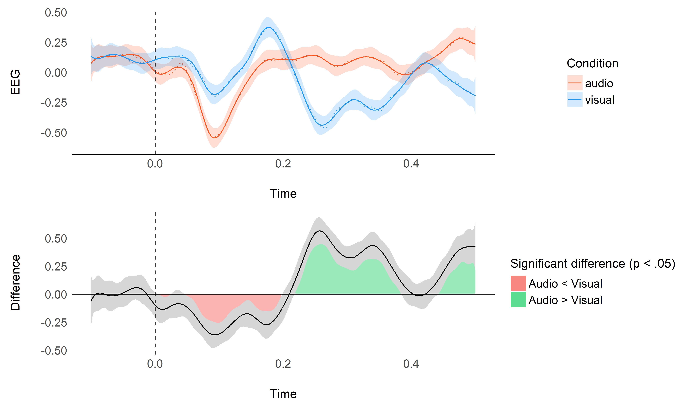
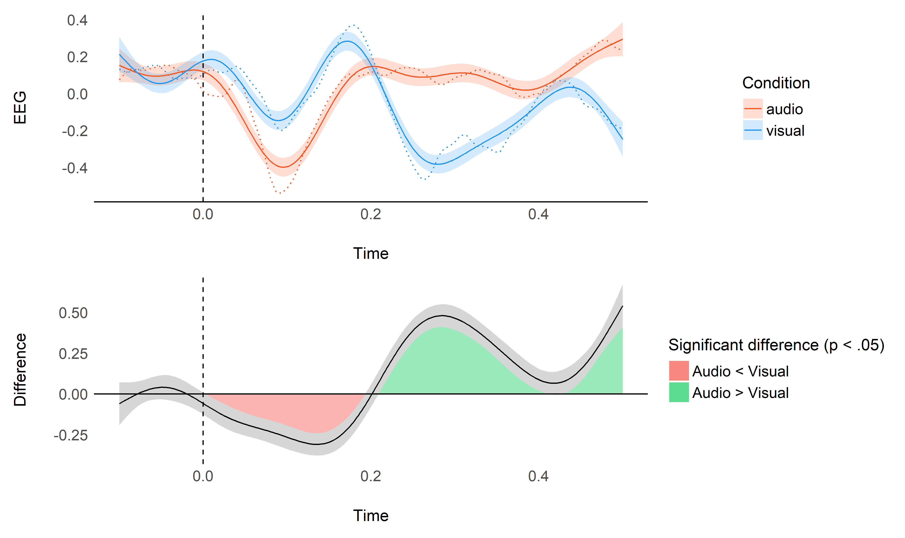
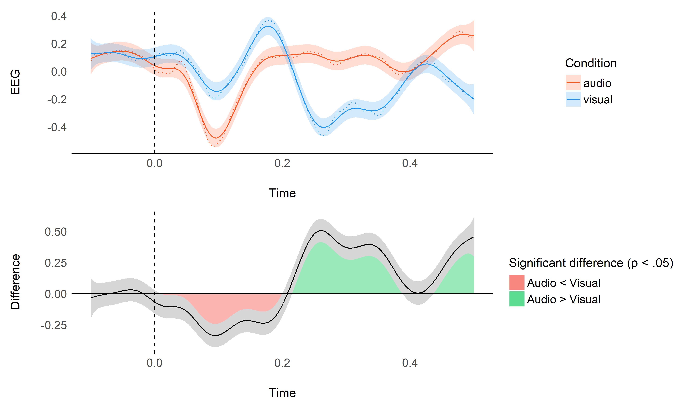

# An GAM-based Approach to EEG/ERP Analysis using Python and R

*This study can be referenced by* [citing the
package](https://github.com/neuropsychology/NeuroKit#citation).

**We’d like to publish this study, but unfortunately we currently don’t
have the time. If you want to help to make it happen, please contact
us\!**

## Introduction

The aim of this study is to explore the feasibility of analyzing
event-related potentials (ERP) under a regression framework, through the
usage of non-linear links (using splines, and General Additive Models -
GAMs). Combined with the usage of mixed models, theoretical benefits
include the incorporation of more information (such as data at the
single-trial, - and even single-channel - level), as well as the
computation of marginal means and contrasts, allowing for a flexible and
powerful way of analysing differences between conditions.

## Procedure

We will start by running a “traditional” ERP analysis for a single
subject using the MNE Python package (Gramfort et al., 2013, 2014) to
obtain “gold standard” baseline patterns of results. Then, we will first
attempt to model the evoked potentials using a simple linear model with
splines, before applying GAMs.

### Data

``` python
import numpy as np
import pandas as pd
import neurokit2 as nk
import matplotlib.pyplot as plt
import mne

# Download example dataset
raw = mne.io.read_raw_fif(mne.datasets.sample.data_path() + '/MEG/sample/sample_audvis_filt-0-40_raw.fif')
events = mne.read_events(mne.datasets.sample.data_path() + '/MEG/sample/sample_audvis_filt-0-40_raw-eve.fif')

# Create epochs including different events
event_id = {'audio/left': 1, 'audio/right': 2,
            'visual/left': 3, 'visual/right': 4}

# Create epochs (100 ms baseline + 500 ms)
epochs = mne.Epochs(raw, 
                    events,
                    event_id,
                    tmin=-0.1,
                    tmax=0.5,
                    picks='eeg',
                    preload=True,
                    detrend=0,
                    baseline=(None, 0))

# Generate list of evoked objects from conditions names
evoked = [epochs[name].average() for name in ('audio', 'visual')]

# Plot topo
mne.viz.plot_compare_evokeds(evoked, picks='eeg', axes='topo')
## [<Figure size 1800x1400 with 60 Axes>]
plt.savefig("figures/fig1.png")
plt.clf()

# Select subset of frontal electrodes
picks = ["EEG 001", "EEG 002", "EEG 003",
         "EEG 005", "EEG 006",
         "EEG 010", "EEG 011", "EEG 012", "EEG 013", "EEG 014"]
epochs = epochs.pick_channels(picks)
                    
# Downsample
epochs = epochs.resample(sfreq=150)

# Convert to data frame and save
nk.mne_to_df(epochs).to_csv("data.csv", index=False)
```



### ERP analysis using MNE-Python

``` python
# Transform each condition to array
condition1 = np.mean(epochs["audio"].get_data(), axis=1)
condition2 = np.mean(epochs["visual"].get_data(), axis=1)

# Permutation test to find significant cluster of differences
t_vals, clusters, p_vals, h0 = mne.stats.permutation_cluster_test([condition1, condition2], out_type='mask', seed=111)

# Visualize
## <string>:1: RuntimeWarning: Ignoring argument "tail", performing 1-tailed F-test
fig, (ax0, ax1, ax2) = plt.subplots(nrows=3, ncols=1, sharex=True)

times = epochs.times
ax0.axvline(x=0, linestyle="--", color="black")
ax0.plot(times, np.mean(condition1, axis=0), label="Audio")
ax0.plot(times, np.mean(condition2, axis=0), label="Visual")
ax0.legend(loc="upper right")
ax0.set_ylabel("uV")

# Difference
ax1.axvline(x=0, linestyle="--", color="black")
ax1.plot(times, condition1.mean(axis=0) - condition2.mean(axis=0))
ax1.axhline(y=0, linestyle="--", color="black")
## <matplotlib.lines.Line2D object at 0x00000000BFB5C490>
ax1.set_ylabel("Difference")

# T-values
## Text(0, 0.5, 'Difference')
ax2.axvline(x=0, linestyle="--", color="black")
h = None
for i, c in enumerate(clusters):
    c = c[0]
    if p_vals[i] <= 0.05:
        h = ax2.axvspan(times[c.start],
                        times[c.stop - 1],
                        color='red',
                        alpha=0.5)
    else:
        ax2.axvspan(times[c.start],
                    times[c.stop - 1],
                    color=(0.3, 0.3, 0.3),
                    alpha=0.3)
hf = ax2.plot(times, t_vals, 'g')
if h is not None:
    plt.legend((h, ), ('cluster p-value < 0.05', ))
## <matplotlib.legend.Legend object at 0x00000000BFB5CF10>
plt.xlabel("time (ms)")
plt.ylabel("t-values")
plt.savefig("figures/fig2.png")
plt.clf()
```



## Results

``` r
library(tidyverse)
library(easystats)
library(patchwork)

data <- read.csv("data.csv", stringsAsFactors = FALSE) %>% 
  mutate(Condition = str_remove(Condition, "/right"),
         Condition = str_remove(Condition, "/left"),
         Condition = as.factor(Condition),
         EEG = rowMeans(across(starts_with("EEG"))))
data[stringr::str_detect(colnames(data), "EEG")] <- standardize(data[stringr::str_detect(colnames(data), "EEG")])
```

### Utility Functions

``` r
theme_eeg <- function(){
  list(
    see::theme_modern() +
    theme(axis.line.y = element_blank()),
    geom_vline(xintercept = 0, linetype="dashed")
  )
}
```

### Visualize Average

``` r
data %>%
  group_by(Time, Condition) %>%
  mutate(Average = mean(EEG)) %>%
  ungroup() %>%
  ggplot(aes(x=Time, y=EEG, color=Condition, group=Label)) +
  geom_line(size=1, alpha=0.05) +
  geom_line(aes(y=Average), size=1.5, alpha=1) +
  scale_color_manual(values=c("audio"="#FF5722", "visual"="#2196F3")) +
  coord_cartesian(ylim=c(-1, 1)) +
  theme_eeg()
```

<!-- -->

### Spline Regression

``` r
model <- lm(EEG ~ Condition * splines::bs(Time, df=0.04 * 600), data=data)
```

``` r
plot_model <- function(model, data){
  
  raw_data <- data %>%
    group_by(Time, Condition) %>%
    mutate(Average = mean(EEG)) %>%
    ungroup() 
  
  p1 <- model %>%
    modelbased::estimate_link(target=c("Condition", "Time"), length=200) %>%
    ggplot(aes(x=Time, y=Predicted)) +
    geom_line(data=raw_data, aes(y=Average, color=Condition), size=0.50, linetype="dotted") + 
    geom_ribbon(aes(ymin=CI_low, ymax=CI_high, fill=Condition), alpha=0.2) +
    geom_line(aes(color=Condition)) +
    scale_color_manual(values=c("audio"="#FF5722", "visual"="#2196F3")) +
    scale_fill_manual(values=c("audio"="#FF5722", "visual"="#2196F3")) +
    ylab("EEG") +
    theme_eeg()

  data_diff <- model %>%
    modelbased::estimate_contrasts(level="Condition", modulate="Time", length=300) %>% 
    mutate(
      Limit = pmin(abs(CI_low), abs(CI_high)), 
      Positive = as.numeric(ifelse(CI_low  > 0,  Limit, NA)), 
      Negative = as.numeric(ifelse(CI_high < 0, -Limit, NA)))

  p2 <- data_diff %>%
    ggplot(aes(x=Time, y=Difference)) +
    geom_ribbon(aes(ymin = 0, ymax = Positive, fill = "Audio > Visual"), alpha=0.4) +  
    geom_ribbon(aes(ymin = Negative, ymax = 0, fill = "Audio < Visual"), alpha=0.4) +
    geom_ribbon(aes(ymin=CI_low, ymax=CI_high), alpha=0.2) + 
    geom_line() +
    geom_hline(yintercept=0) +
    theme_eeg() +
    theme(axis.line.x = element_blank()) +
    scale_fill_manual("Significant difference (p < .05)", 
                      values=c("Audio > Visual"="#00C853", 
                               "Audio < Visual"="#f44336"))
  p1 / p2
}
plot_model(model, data)
```

<!-- -->

This plot shows the original raw averages (dotted lines), the predicted
values by the model and their confidence interval (CI), as well as the
difference between the two conditions.

### General Additive Model (GAM)

``` r
library(mgcv)

model <- mgcv::gam(EEG ~ Condition + s(Time, by = Condition), data=data, method="REML")
```

``` r
plot_model(model, data)
```

<!-- -->

It is possible to increase the number of degrees of freedom.

``` r
gam.check(model)
## 
## Method: REML   Optimizer: outer newton
## full convergence after 7 iterations.
## Gradient range [-0.00982,0.00773]
## (score 36811 & scale 0.968).
## Hessian positive definite, eigenvalue range [3.28,13102].
## Model rank =  20 / 20 
## 
## Basis dimension (k) checking results. Low p-value (k-index<1) may
## indicate that k is too low, especially if edf is close to k'.
## 
##                           k'  edf k-index p-value
## s(Time):Conditionaudio  9.00 8.65    0.99    0.34
## s(Time):Conditionvisual 9.00 8.81    0.99    0.41

model <- mgcv::gam(EEG ~ Condition + s(Time, by = Condition, k = 0.05 * 600), data=data, method="REML")
```

``` r
plot_model(model, data)
```

<!-- -->

### Using data from all the channels

``` r
data_long <- data %>%
  pivot_longer(starts_with("EEG."), names_to="Channel")

# 
# model <- lme4::lmer(value ~ Condition * splines::bs(Time, df=0.02 * 700) + (1|Channel), data=data_long)
# model <- glmmTMB::glmmTMB(value ~ Condition * splines::bs(Time, df=0.02 * 700) + (1|Channel), data=data_long)
```

Unfortunately, this won’t converge, too much data :(

## References

<div id="refs" class="references">

<div id="ref-gramfort2013meg">

Gramfort, A., Luessi, M., Larson, E., Engemann, D. A., Strohmeier, D.,
Brodbeck, C., … others. (2013). MEG and eeg data analysis with
mne-python. *Frontiers in Neuroscience*, *7*, 267.

</div>

<div id="ref-gramfort2014mne">

Gramfort, A., Luessi, M., Larson, E., Engemann, D. A., Strohmeier, D.,
Brodbeck, C., … Hämäläinen, M. S. (2014). MNE software for processing
meg and eeg data. *Neuroimage*, *86*, 446–460.

</div>

</div>
