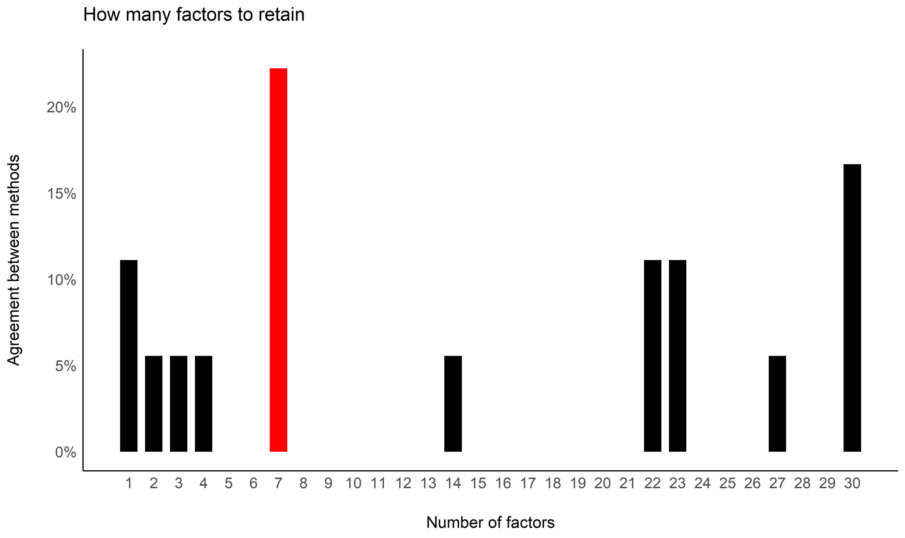
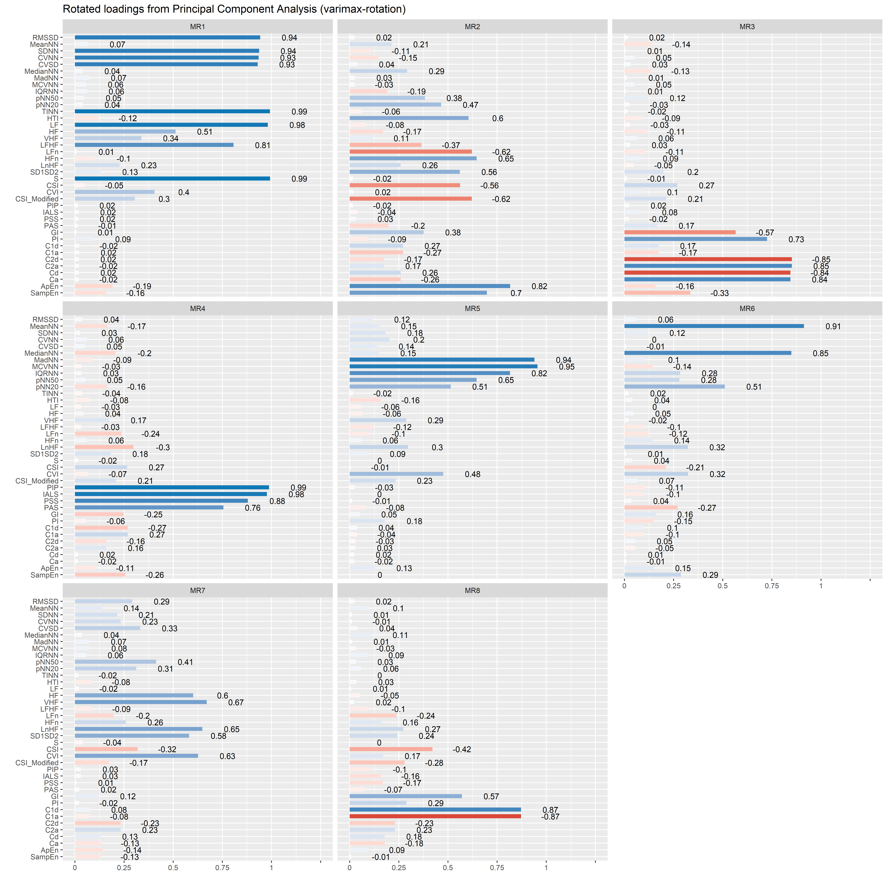
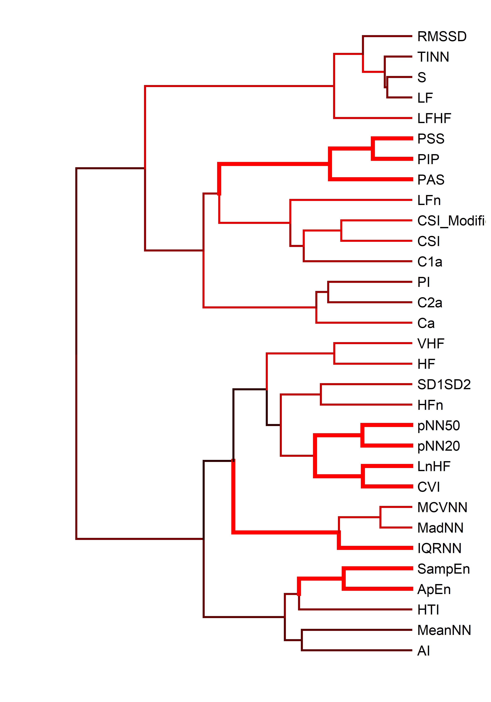

# The Structure of Indices of Heart Rate Variability (HRV)

*This study can be referenced by* [citing the
package](https://github.com/neuropsychology/NeuroKit#citation).

**We’d like to publish this study, but unfortunately we currently don’t
have the time. If you want to help to make it happen, please contact
us\!**

## Introduction

The aim of this study is to explore the factor structure of HRV indices.

## Databases

We used the same databases as in [this
study](https://github.com/neuropsychology/NeuroKit/tree/master/benchmarks/ecg_preprocessing#databases).

## Procedure

``` python
import pandas as pd
import numpy as np
import neurokit2 as nk

# Load True R-peaks location
datafiles = [pd.read_csv("../../data/gudb/Rpeaks.csv"),
             pd.read_csv("../../data/mit_arrhythmia/Rpeaks.csv"),
             pd.read_csv("../../data/mit_normal/Rpeaks.csv"),
             pd.read_csv("../../data/fantasia/Rpeaks.csv")]

# Get results
all_results = pd.DataFrame()

for file in datafiles:
    for database in np.unique(file["Database"]):
        data = file[file["Database"] == database]
        for participant in np.unique(data["Participant"]):
            data_participant = data[data["Participant"] == participant]
            sampling_rate = np.unique(data_participant["Sampling_Rate"])[0]
            rpeaks = data_participant["Rpeaks"].values

            results = nk.hrv(rpeaks, sampling_rate=sampling_rate)
            results["Participant"] = participant
            results["Database"] = database
            results["Recording_Length"] = rpeaks[-1] / sampling_rate / 60

            all_results = pd.concat([all_results, results], axis=0)

all_results.to_csv("data.csv", index=False)
```

## Results

``` r
library(tidyverse)
library(easystats)

data <- read.csv("data.csv", stringsAsFactors = FALSE) %>% 
  select(-HRV_ULF, -HRV_VLF)  # Empty
names(data) <- stringr::str_remove(names(data), "HRV_")
```

### Redundant Indices

#### Remove Equivalent (r higher than .995)

``` r
data %>% 
  correlation::correlation() %>% 
  filter(abs(r) > 0.995) %>% 
  arrange(Parameter1, desc(abs(r)))
## Parameter1 | Parameter2 |     r |         95% CI |         t |  df |      p |  Method | n_Obs
## ---------------------------------------------------------------------------------------------
## C1d        |        C1a | -1.00 | [-1.00, -1.00] | -1.06e+09 | 250 | < .001 | Pearson |   252
## C2d        |        C2a | -1.00 | [-1.00, -1.00] |      -Inf | 250 | < .001 | Pearson |   252
## Cd         |         Ca | -1.00 | [-1.00, -1.00] |      -Inf | 250 | < .001 | Pearson |   252
## RMSSD      |       SDSD |  1.00 | [ 1.00,  1.00] |  49985.56 | 250 | < .001 | Pearson |   252
## RMSSD      |        SD1 |  1.00 | [ 1.00,  1.00] |  49985.56 | 250 | < .001 | Pearson |   252
## RMSSD      |       SD1d |  1.00 | [ 1.00,  1.00] |    536.98 | 250 | < .001 | Pearson |   252
## RMSSD      |       SD1a |  1.00 | [ 1.00,  1.00] |    466.36 | 250 | < .001 | Pearson |   252
## SD1        |       SD1d |  1.00 | [ 1.00,  1.00] |    537.53 | 250 | < .001 | Pearson |   252
## SD1        |       SD1a |  1.00 | [ 1.00,  1.00] |    465.97 | 250 | < .001 | Pearson |   252
## SD1d       |       SD1a |  1.00 | [ 1.00,  1.00] |    249.46 | 250 | < .001 | Pearson |   252
## SD2        |       SD2a |  1.00 | [ 1.00,  1.00] |    289.38 | 250 | < .001 | Pearson |   252
## SD2        |       SD2d |  1.00 | [ 1.00,  1.00] |    201.76 | 250 | < .001 | Pearson |   252
## SDNN       |      SDNNa |  1.00 | [ 1.00,  1.00] |    727.31 | 250 | < .001 | Pearson |   252
## SDNN       |      SDNNd |  1.00 | [ 1.00,  1.00] |    578.75 | 250 | < .001 | Pearson |   252
## SDNNd      |      SDNNa |  1.00 | [ 1.00,  1.00] |    324.46 | 250 | < .001 | Pearson |   252
## SDSD       |        SD1 |  1.00 | [ 1.00,  1.00] |       Inf | 250 | < .001 | Pearson |   252
## SDSD       |       SD1d |  1.00 | [ 1.00,  1.00] |    537.53 | 250 | < .001 | Pearson |   252
## SDSD       |       SD1a |  1.00 | [ 1.00,  1.00] |    465.97 | 250 | < .001 | Pearson |   252

data <- data %>% 
  select(-SDSD, -SD1, -SD1d, -SD1a, -CVSD) %>%  # Same as RMSSD 
  select(-SDNNd, -SDNNa) %>%  # Same as SDNN
  select(-SD2d, -SD2a) %>%   # Same as SD2
  select(-Cd) %>%   # Same as Ca
  select(-C1d, -C2d) # Same as C1a and C2a
```

#### Remove Strongly Correlated (r higher than .98)

``` r
data %>% 
  correlation::correlation() %>% 
  filter(abs(r) > 0.95) %>%
  arrange(Parameter1, desc(abs(r)))
## Parameter1 | Parameter2 |    r |       95% CI |      t |  df |      p |  Method | n_Obs
## ---------------------------------------------------------------------------------------
## CVNN       |        SD2 | 0.97 | [0.96, 0.98] |  64.63 | 250 | < .001 | Pearson |   252
## GI         |         AI | 0.99 | [0.99, 0.99] | 138.11 | 250 | < .001 | Pearson |   252
## GI         |         SI | 0.99 | [0.99, 0.99] | 115.38 | 250 | < .001 | Pearson |   252
## LF         |          S | 0.97 | [0.96, 0.98] |  62.94 | 250 | < .001 | Pearson |   252
## MeanNN     |   MedianNN | 0.99 | [0.98, 0.99] |  99.44 | 250 | < .001 | Pearson |   252
## PIP        |       IALS | 0.98 | [0.98, 0.99] |  86.82 | 250 | < .001 | Pearson |   252
## RMSSD      |       SDNN | 0.98 | [0.98, 0.99] |  79.71 | 250 | < .001 | Pearson |   252
## RMSSD      |       CVNN | 0.97 | [0.96, 0.98] |  62.71 | 250 | < .001 | Pearson |   252
## SDNN       |        SD2 | 0.99 | [0.99, 0.99] | 119.74 | 250 | < .001 | Pearson |   252
## SDNN       |       CVNN | 0.98 | [0.98, 0.99] |  88.51 | 250 | < .001 | Pearson |   252
## SI         |         AI | 0.97 | [0.96, 0.98] |  62.76 | 250 | < .001 | Pearson |   252
## TINN       |         LF | 0.96 | [0.95, 0.97] |  54.65 | 250 | < .001 | Pearson |   252
## TINN       |          S | 0.95 | [0.94, 0.96] |  50.54 | 250 | < .001 | Pearson |   252

data <- data %>% 
  select(-GI, -SI) %>%  # Same as AI 
  select(-SD2) %>%  # Same as SDNN
  select(-MedianNN) %>%  # Same as MeanNN
  select(-IALS) %>%  # Same as PIP
  select(-SDNN, -CVNN) # Same as RMSSD
```

### Recording Length

#### Investigate effect

``` r
correlation(data) %>% 
  filter(Parameter2 == "Recording_Length") %>% 
  arrange(desc(abs(r)))
```

#### Adjust the data for recording length

``` r
data <- effectsize::adjust(data, effect="Recording_Length") %>% 
  select(-Recording_Length)
```

### Gaussian Graphical Model

``` r
library(ggraph)

data %>% 
  correlation::correlation(partial=FALSE) %>% 
  correlation::cor_to_pcor() %>% 
  filter(abs(r) > 0.2) %>%
  tidygraph::as_tbl_graph(directed=FALSE) %>% 
  dplyr::mutate(closeness = tidygraph::centrality_closeness(normalized = TRUE),
                degree = tidygraph::centrality_degree(normalized = TRUE),
                betweeness = tidygraph::centrality_betweenness(normalized = TRUE)) %>%
  tidygraph::activate(nodes) %>%
  dplyr::mutate(group1 = as.factor(tidygraph::group_edge_betweenness()),
                # group2 = as.factor(tidygraph::group_optimal()),
                # group3 = as.factor(tidygraph::group_walktrap()),
                # group4 = as.factor(tidygraph::group_spinglass()),
                group5 = as.factor(tidygraph::group_louvain())) %>% 
  ggraph::ggraph(layout = "fr") +
    ggraph::geom_edge_arc(aes(colour = r, edge_width = abs(r)), strength = 0.1, show.legend = FALSE) +
    ggraph::geom_node_point(aes(size = degree, color = group5), show.legend = FALSE) +
    ggraph::geom_node_text(aes(label = name), colour = "white") +
    ggraph::scale_edge_color_gradient2(low = "#a20025", high = "#008a00", name = "r") +
    ggraph::theme_graph() +
    guides(edge_width = FALSE) +
    scale_x_continuous(expand = expansion(c(.10, .10))) +
    scale_y_continuous(expand = expansion(c(.10, .10))) +
    scale_size_continuous(range = c(20, 30)) +
    scale_edge_width_continuous(range = c(0.5, 2)) +
    see::scale_color_material_d(palette="rainbow", reverse=TRUE)
```

<!-- -->

Groups were identified using the
[tidygraph::group\_optimal](https://rdrr.io/cran/tidygraph/man/group_graph.html)
algorithm.

### Factor Analysis

#### How many factors

``` r
cor <- correlation::correlation(data[sapply(data, is.numeric)]) %>% 
  as.matrix()

n <- parameters::n_factors(data, cor=cor)

n
## # Method Agreement Procedure:
## 
## The choice of 7 dimensions is supported by 4 (22.22%) methods out of 18 (Optimal coordinates, Parallel analysis, Kaiser criterion, R2).

plot(n) +
  see::theme_modern()
```

<!-- -->

#### Exploratory Factor Analysis (EFA)

``` r
efa <- parameters::factor_analysis(data, cor=cor, n=7, rotation="varimax", fm="ml")

print(efa, threshold="max", sort=TRUE)
## # Rotated loadings from Factor Analysis (varimax-rotation)
## 
## Variable     |   ML4 |  ML3 |  ML1 |  ML2 |  ML6 |  ML7 |   ML5 | Complexity | Uniqueness
## -----------------------------------------------------------------------------------------
## CSI          | -0.86 |      |      |      |      |      |       |       1.45 |       0.10
## CSI_Modified | -0.76 |      |      |      |      |      |       |       2.04 |       0.15
## SD1SD2       |  0.76 |      |      |      |      |      |       |       1.85 |       0.20
## AI           |  0.68 |      |      |      |      |      |       |       2.07 |       0.28
## HFn          |  0.62 |      |      |      |      |      |       |       1.27 |       0.56
## LnHF         |  0.61 |      |      |      |      |      |       |       4.04 |       0.07
## C1a          | -0.61 |      |      |      |      |      |       |       1.84 |       0.47
## LFn          | -0.61 |      |      |      |      |      |       |       1.58 |       0.53
## HTI          |  0.40 |      |      |      |      |      |       |       1.61 |       0.79
## S            |       | 0.99 |      |      |      |      |       |       1.01 |       0.02
## LF           |       | 0.98 |      |      |      |      |       |       1.01 |       0.03
## TINN         |       | 0.98 |      |      |      |      |       |       1.02 |       0.04
## RMSSD        |       | 0.92 |      |      |      |      |       |       1.27 |       0.04
## LFHF         |       | 0.81 |      |      |      |      |       |       1.38 |       0.23
## HF           |       | 0.51 |      |      |      |      |       |       2.60 |       0.45
## MCVNN        |       |      | 0.98 |      |      |      |       |       1.05 |       0.00
## MadNN        |       |      | 0.96 |      |      |      |       |       1.05 |       0.06
## IQRNN        |       |      | 0.79 |      |      |      |       |       1.17 |       0.32
## pNN50        |       |      | 0.66 |      |      |      |       |       2.81 |       0.12
## CVI          |       |      | 0.57 |      |      |      |       |       4.46 |       0.00
## VHF          |       |      | 0.38 |      |      |      |       |       4.93 |       0.47
## PIP          |       |      |      | 0.99 |      |      |       |       1.02 |       0.00
## PSS          |       |      |      | 0.94 |      |      |       |       1.03 |       0.11
## PAS          |       |      |      | 0.79 |      |      |       |       1.48 |       0.23
## C2a          |       |      |      |      | 0.88 |      |       |       1.30 |       0.11
## PI           |       |      |      |      | 0.73 |      |       |       1.24 |       0.40
## Ca           |       |      |      |      | 0.69 |      |       |       1.43 |       0.41
## MeanNN       |       |      |      |      |      | 0.66 |       |       1.73 |       0.42
## pNN20        |       |      |      |      |      | 0.63 |       |       3.00 |       0.04
## SampEn       |       |      |      |      |      |      | -0.62 |       3.64 |       0.10
## ApEn         |       |      |      |      |      |      | -0.56 |       2.86 |       0.26
## 
## The 7 latent factors (varimax rotation) accounted for 77.28% of the total variance of the original data (ML4 = 18.09%, ML3 = 16.66%, ML1 = 13.44%, ML2 = 9.89%, ML6 = 8.20%, ML7 = 5.80%, ML5 = 5.20%).

plot(efa) +
  see::theme_modern()
```

<!-- -->

<!-- #### Confirmatory Factor Analysis (CFA) -->

<!-- ```{r, message=FALSE, warning=FALSE, fig.width=15, fig.height=15} -->

<!-- library(lavaan) -->

<!-- model <- parameters::efa_to_cfa(efa, threshold = "max") -->

<!-- cfa <- lavaan::cfa(model, data=data) %>%  -->

<!--   parameters::parameters(standardize=TRUE) -->

<!-- cfa -->

<!-- plot(cfa) -->

<!-- ``` -->

### Cluster Analysis

<!-- #### How many clusters -->

<!-- ```{r, message=FALSE, warning=FALSE} -->

<!-- dat <- effectsize::standardize(data[sapply(data, is.numeric)]) -->

<!-- n <- parameters::n_clusters(t(dat), package = c("mclust", "cluster")) -->

<!-- n -->

<!-- plot(n) + -->

<!--   theme_modern() -->

<!-- ``` -->

``` r
library(dendextend)

dat <- effectsize::standardize(data[sapply(data, is.numeric)])

result <- pvclust::pvclust(dat, method.dist="euclidean", method.hclust="ward.D2", nboot=10, quiet=TRUE)

result %>% 
  as.dendrogram() %>% 
  sort() %>% 
  dendextend::pvclust_show_signif_gradient(result, signif_col_fun = grDevices::colorRampPalette(c("black", "red"))) %>% 
  dendextend::pvclust_show_signif(result, signif_value = c(2, 1)) %>%
  dendextend::as.ggdend() %>% 
  ggplot2::ggplot(horiz=TRUE, offset_labels = -1)
```

<!-- -->

## References
